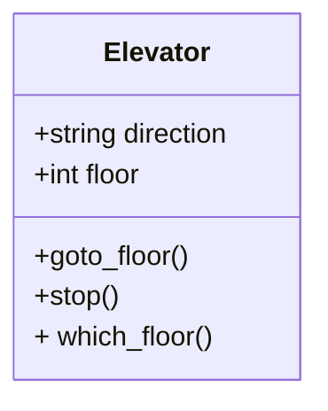

---
tags:
  - SDLC
  - tools
---

# Software Development Lifecycle (SDLC) tools

???+ questions

    - What are the key concepts and steps in the SDLC
    - What are the tools for a project?
    
!!! info "Content"

    - Introduction to some SDLC key features
    - Theory of project tools and thinking

!!! info "Learning outcomes of 'SDLC tools'"

    Learners can

    - compare and contrast various software development tools.
    - justify their relevance to specific development tasks.
    - can give a reason for the benefits of the different tools for the SDLC

???- note "Instructor notes"

    Prerequisites are:

    - Understanding the Software development Life Cycle

    Lesson Plan (**FIX**):

    - **Total** 30 min
    - Theory 20
    - Discussions 10 min

---

???- admonition "Changes"

    - clearer guide
    - practical examples than just explain the concept.
    - exercises
        - practical things within exercise (not needing to scroll back and forth)
        - clearer instructions
        - solutions
        - (advanced exercises)

## Some SLDC models

???+ info "Waterfall model"

    1. Requirements
    2. Analysis and design
    3. Development
    4. Test
    5. Deployment and maintenance

    ``` mermaid
    flowchart
        Requirements --> A["Analysis and design"] --> Development --> Test --> D["Deployment and maintenance"] -.-> Requirements
    ```

    - Good approach for **small and simple systems** where the team knows the system and **requirements very well**.
    
    !!! warning
    
        - Error is spreading
        - Small mistakes in the beginning will have large impact on the end result.
        - e.g. bugs, architecture limiting extensions
        - Large costs economically and timely

???+ info "Other Models"

    - Modern principles:
        - automated tests, continuous integration (CI)
    - Deliver as fast as possible:
        - small iterations are easier to manage
    - Extreme Programming
        - Pair programming
        - Test-driven development

!!! info "Conclusion"

    - Each team has unique requirements
    - Don’t be afraid of trial and error
    - More info in [Software Development Lifecycle tomorrow](sdlc.md)

## The tools/concepts for Developing in scientific computing

Wilson et al. 2017: **[Good enough practices](https://journals.plos.org/ploscompbiol/article?id=10.1371/journal.pcbi.1005510)** in Scientific computing

- Good tools and practices for refactoring and development steps
- Focus on scientific computing

???- info "Project organization"
    
    - folders
    
???- info "Software development practices

    - explanations
    - naming
    - eliminate duplication --> libraries
    - dependencies
    - DOI
    
???- info "Tracking changes"

    - For instance Git/Github
    
???- info "Collaborate"
    - documentation
    - to-do lists
    - strategies
    - license
    - citable

!!! warning "These steps just cover the following Phases"

   - Development
   - Test
   - Deployment

- We want to add the planning phases with"

    - requirements
    - analysis
    - design

!!! info "The Phases/practices to be covered!

- Project organisation
- Planning
    - Requirements
    - Analysis
    - Design 
- Software development practices
- Tracking changes
- Collaborate

## Tools to use

### Project planning

- requirements
- analysis
- design

!!! note "WHY?"

    - "If I had nine hours to chop down a tree, I'd spend the first six sharpening my axe."
    - Modelling sharpens your axe since it helps you think about what you're going to build, how to seek feedback, and where to make improvements.
    - It prepares you to build the real thing to reduce any potential risk of failure. "

!!! note

    - Planning step is to ...
        - get an overview of the project/program.
        - help planning writing the code
        - identify parts needed
        - risk analysis
    - Can be divided into analysis and design
        - **Analysis** part is to **state the problem** and **define inputs and outputs**
            - graphical tools like UML
            - text
            - if object-oriented programming: **objects**
        - **Design** phase to find out the **specific algorithms** needed
            - UML and/or pseudocode
            - if object-oriented programming: **classes**
            - if functional programming: **functions/modules**

    - More in afternoon!

!!!


### Project organization

- It's about folder structure and setting up practices
- We cover this in [project organization](organization_docs).

!!! info "Tools"

    - Local computer
    - GitHub

### Software development practices

- explanations --> in-code documentation
- naming --> good variable naming
- eliminate duplication --> libraries
- dependencies --> 
- DOI --> also publish your code!
- testing --> do lots of testing

- To add: way of programming
    - Functional vs Object-orientred

_we'll cover these in many of the 

!!! info "Tools"

   - Documentation
   - Ways of programming
   - Testing


???- "Connected to documentation"

    Software
    
    - explanation comment at the start of the program (also "help function" as for './program -h')
    - functions
        - names for variables and functions
    - eliminate duplication
        - libraries
        - test if you rely
    - dependencies and requirements explicitly
    - program behavior by if/else (possibly arguments from outside)
    - run-all script and/or main program (also related to project organization)
    - example/test data set
    - DOI like zenodo


## tracking changes

## collaborate


## How to program?

- Two tracks in the programming: **Object-oriented programming** or **functional programming**
- Two tracks in organizing code: **Long files** or **modules**

### Object-oriented programming

- Object-oriented (OO) programming is
    - a mindset of mimicking the real-world as:
    - **entities (`objects`)** that are different
    - or **share attributes**with each-other (within a `**class**`)
    - info-hiding mindset...

**Objects**


**Class**



???- info "Object orientation (OO) in some programming languages"

    - OO (built-in classes)
        - C++
        - Java
        - Python
        - Julia
    - OO features
        - Fortran 2003-
        - MATLAB
        - Perl
        - PHP
        - R
    - OO object-based (but not class-based)
        - Javascript

### Functional programming

- Close to mathematics
- Programmer defines information and relations
  and the program concludes answers from that
- Data is immutable, which removes some types of programming errors

???- question "How does that look like?"

    Here we define some functions:

    ```text
    grandparent(X) := parent(parent(X)).
    parent(X) := mother(X).
    parent(X) := father(X).
    ```

    Here we add information:

    ```text
    mother(charles) := elizabeth.
    father(charles) := phillip.
    mother(harry) := diana.
    father(harry) := charles.
    ```

    Now we can ask who is a grandparent to whom:

    ```text
    ?- grandparent(X,Y).
    ````

    Results are:

    ```text
    X = harry, Y = elizabeth.
    X = harry, Y = phillip.
    ```

    The defining feature here is that the program itself concluded
    how to arrive at a conclusion from the given information,
    where in produral languages you'll need to define that search
    strategy yourself

!!! info "To sum up"

    - At its simplest, functional programming uses immutable data to tell the program exactly what to do.
    - Object-oriented programming tells the program how to achieve results through objects altering the program's state.
    - Both paradigms can be used to create elegant code.

### Modular coding

- Modular coding breaks up the code in blocks that could be separate files.
- Modularity could be within a program
- ... but also for a workflow.
    - script describing order of runs with different programs
    - Ex. bash script for preparing input data, running Fortran programs and analysing output with python program.

!!! info "See also **FIX correct days**"

    - More on Thursday: Object-orientation **FIXLINK**
    - More on Thursday: Algorithms
    - More on Thursday: Modular programming

???- Tracking changes

    WHY?

    Git

???- Collaborate

WHY?

    - documentation
    - to-do lists
    - strategies
    - license
    - citable

Also links to other sessions

???- note

    - overview: README etc
    - to-do list/issues
    - communication strategies
    - license explicit
        - recommendations and why
    - citable


!!! admonition "Parts to be covered this week"

    - &#9745; Planning
        - Pseudocode
        - Unified Modelling Language (UML)
    - &#9745; Testing
        - Different levels
    - &#9745; Source/version control
        - Git etc
    - &#9745; Collaboration
        - GitHub
    - &#9745; Reproducibility (for you and others)
        - Deployment
        - Dependencies
        - (Workflows)
    - &#9745; Sharing
        - open science
        - citation
        - licensing
    - &#9745; Documentation
        - Tutorials
        - How-to guides
        - Explanation
        - Reference


## Exercises

Think about

???- "Why do we want to work with the mentioned tools?"

???- "What is Unified modelling language **MOVE**"

???- "What is source control and what are the benefits?"

???- "When to write documentation?"

???- "What does reproducibility mean?"

???- "Why sharing?"

## Summary of SDLC tools

- Now after the overview you are ready to dig deeper in the topics and try it out yourself!

## Summary

!!! info "Definitions"

    - Want [explanations and definitions](../misc/definitions.md) of the technical terms in the course?

## References

- Wilson et al. 2017: **[Good enough practices](https://journals.plos.org/ploscompbiol/article?id=10.1371/journal.pcbi.1005510)** in Scientific computing
