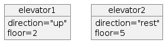
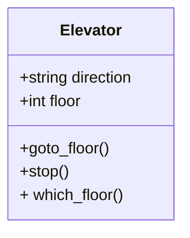

---
tags:
  - SDLC
  - tools
---

# Software Development Lifecycle (SDLC) tools

???+ questions

    - What are the key concepts and steps in the SDLC
    - What are the tools for a project?

!!! info "Content"

    - Introduction to some SDLC key features
    - Theory of project tools and thinking

!!! info "Learning outcomes of 'SDLC tools'"

    Learners can

    - compare and contrast various software development tools.
    - justify their relevance to specific development tasks.
    - can give a reason for the benefits of the different tools for the SDLC

???- note "Instructor notes"

    Prerequisites are:

    - Understanding the Software development Life Cycle

    Lesson Plan:

    - **Total** 30 min
    - Theory 20
    - Discussions 10 min

---

## Some SDLC models

### If you want some overview today already

[More In Software Development Life Cycle lesson](sdlc.md)

???- info "Waterfall model"

    1. Requirements
    2. Analysis and design
    3. Development
    4. Test
    5. Deployment and maintenance

    ``` mermaid
    flowchart
        Requirements --> A["Analysis and design"] --> Development --> Test --> D["Deployment and maintenance"] -.-> Requirements
    ```

    - Good approach for **small and simple systems** where the team knows the system and **requirements very well**.

    !!! warning

        - Error is spreading
        - Small mistakes in the beginning will have large impact on the end result.
        - e.g. bugs, architecture limiting extensions
        - Large costs economically and timely

???- info "Other Models"

    - Modern principles:
        - automated tests, continuous integration (CI)
    - Deliver as fast as possible:
        - small iterations are easier to manage
    - Extreme Programming
        - Pair programming
        - Test-driven development

!!! info "Conclusion"

    - Each team has unique requirements
    - Don’t be afraid of trial and error
    - More info in [Software Development Lifecycle tomorrow](sdlc.md)

## The tools/concepts for Developing in scientific computing

Wilson et al. 2017: **[Good enough practices](https://journals.plos.org/ploscompbiol/article?id=10.1371/journal.pcbi.1005510)** in Scientific computing

- Good tools and practices for refactoring and development steps
- Focus on scientific computing

??? info "Project organization"

    - folder structure

??? info "Software development practices"

    - explanations
    - naming
    - eliminate duplication --> libraries
    - dependencies
    - DOI

??? info "Tracking changes"

    - For instance Git/Github

??? info "Collaborate"

    - GitHub
    - documentation
    - to-do lists
    - strategies
    - license
    - citable

!!! warning "These steps just cover the following Phases"

    - Development
    - Test
    - Deployment

- We want to add the planning phases with

    - Requirements
    - Analysis
    - Design

!!! info "The Phases/practices to be covered!"

    - Project organisation
    - Planning
        - Requirements
        - Analysis
        - Design
    - Software development practices
    - Tracking changes
    - Collaborate

## Tools to use

### Project planning

- Planning step is to ...

    - get an overview of the project/program.
    - help planning writing the code
    - identify parts needed
    - risk analysis

- Can be divided into analysis and design
    - **Analysis** part is to **state the problem** and **define inputs and outputs**
        - **Requirements** and **Risk analysis**
            - Graphical tools like **[UML](../misc/uml_with_mermaid.md)** (Unified Modeling Language)
            - text
            - if object-oriented programming: **objects**
        - **Design** phase to find out the **specific algorithms** needed
            - UML and/or **[pseudocode](https://uppmax.github.io/programming_formalisms/extra_bc/pseudocode/)**
            - if object-oriented programming: **classes**
            - if functional programming: **functions/modules**

!!! note "WHY?"

    - "If I had nine hours to chop down a tree, I'd spend the first six sharpening my axe."
    - Modelling sharpens your axe since it helps you think about what you're going to build, how to seek feedback, and where to make improvements.
    - It prepares you to build the real thing to reduce any potential risk of failure. "

#### Ways to plan OR program your project

!!! info "Top-down"

    1. Clearly state whole problem
    2. Define inputs and outputs
    3. Design the algorithm with `pseudocode`
    4. Turn the algorithm into specific language statements
    5. Test the resulting program

!!! info "Bottom-Up"

    Start with **parts first** and develop a bigger organization with time.

???- discussion "How do you plan?"

    - Top-down or Bottom-up?

???- discussion "How do you program?"

    - Top-down or Bottom-up?

- [Flowcharts or Unified Modeling Language (UML)](https://uppmax.github.io/programming_formalisms/misc/uml_with_mermaid/)

- More this afternoon

??? note "Example of Algorithm flow chart"

    ```mermaid
    flowchart TD
      condition{Is something true?}
      condition --> |yes| is_true[Do action 1]
      condition --> |no| is_false[Do action 2]
    ```

    Mermaid code

    ```text
    flowchart TD
      condition{Is something true?}
      condition --> |yes| is_true[Do action 1]
      condition --> |no| is_false[Do action 2]
    ```

???- info "shape of boxes etc in flowchart and state diagrams "

    - initial state (small circle)
        - ``[*]``
    - end state (small solid-filled circle)
        - ``[*]``
    - state (rectangle)
        - ``A["text"]``
    - activity (rounded recatngle)
        - ``A("text")``
    - choice (diamond)
        - ``A{"text"}``
    - arrow
        - ``-->``

### Software development practices

- explanations --> **in-code documentation**
- naming --> good variable naming
- eliminate duplication --> libraries
- dependencies -->
- DOI --> also publish your code!
- testing --> do lots of testing

- To add: way of programming
    - Functional vs Object-oriented

#### Object-oriented programming

- Object-oriented (OO) programming is
    - a mindset of mimicking the real-world as:
    - **entities (`objects`)** that are different
    - or **share attributes**with each-other (within a `**class**`)
    - info-hiding mindset...

**Objects**



**Class**



???- info "Object orientation (OO) in some programming languages"

    - OO (built-in classes)
        - C++
        - Java
        - Python
        - Julia
    - OO features
        - Fortran 2003-
        - MATLAB
        - Perl
        - PHP
        - R
    - OO object-based (but not class-based)
        - Javascript

[Object Oriented development](../design_develop/OO_development.md)

#### Functional programming

- Close to mathematics
- Programmer defines information and relations
  and the program concludes answers from that
- Data is immutable, which removes some types of programming errors

???- question "How does that look like?"

    Here we define some functions:

    ```text
    grandparent(X) := parent(parent(X)).
    parent(X) := mother(X).
    parent(X) := father(X).
    ```

    Here we add information:

    ```text
    mother(charles) := elizabeth.
    father(charles) := phillip.
    mother(harry) := diana.
    father(harry) := charles.
    ```

    Now we can ask who is a grandparent to whom:

    ```text
    ?- grandparent(X,Y).
    ````

    Results are:

    ```text
    X = harry, Y = elizabeth.
    X = harry, Y = phillip.
    ```

    The defining feature here is that the program itself concluded
    how to arrive at a conclusion from the given information,
    where in produral languages you'll need to define that search
    strategy yourself

!!! info "To sum up"

    - At its simplest, functional programming uses immutable data to tell the program exactly what to do.
    - Object-oriented programming tells the program how to achieve results through objects altering the program's state.
    - Both paradigms can be used to create elegant code.

- [Function design lesson](../function_design/README.md)

#### Modular coding

- Modular coding breaks up the code in blocks that could be separate files.
- Modularity could be within a program
- ... but also for a workflow.
    - script describing order of runs with different programs
    - Ex. bash script for preparing input data, running Fortran programs and analysing output with python program.

!!! info "Tools"

    - Object-orientation
    - Algorithms
    - Modular programming

- [Modular programming and refactoring](../modularity/modular.md)

### Testing

1. Unit testing
2. Integration tests (test modules together as a whole)

???- note "Typical testing process"

    ```mermaid
    flowchart TD
      unit_tests[Unit test]
      unit_tests --> |As many times as necessary| unit_tests
      unit_tests --> |worst bugs fixed| alpha
      alpha[Alpha release]
      alpha --> |As many times as necessary| unit_tests
      alpha --> |worst bugs fixed| beta
      beta[Beta release]
      beta --> |As many times as necessary| alpha
      beta --> |minor bugs fixed| done
      done[Finished program]
    ```

??? note "Coming lessons"

    - [assert](../assert/README.md)
    - [Test-driven development(TDD)](../tdd/README.md)
    - [Using a formal testing framework](../testing/testing_framework.md)

### Tracking changes

Summarized from [Code refinery](https://coderefinery.github.io/git-intro/motivation/)

- System which records **snapshots** of a project
- Implements **branching**:
    - You can work on several **feature** branches and switch between them
    - **Different people** can work on the same code/project without interfering
    - You can **experiment** with an idea and discard it if it turns out to be a bad idea
- Implements **merging**:
    - Person A and B’s simultaneous work can be **easily combined**
???- info "Why Git?"

    We will use [Git](https://git-scm.com) to record snapshots of our work:

    - **Easy to set up**: no server needed.
    - **Very popular**: chances are high you will need to contribute to somebody else's code which is tracked with Git.
    - **Distributed**: good backup, no single point of failure, you can track and clean-up changes offline, simplifies collaboration model for open-source projects.
    - Important **platforms** such as [GitHub](https://github.com), [GitLab](https://gitlab.com), and [Bitbucket](https://bitbucket.org) build on top of Git.

    However, any version control is better than no version control and it is OK to prefer a different tool than Git.

    - Other tools:

        - [Subversion](https://subversion.apache.org)
        - [Mercurial](https://www.mercurial-scm.org)
        - [Pijul](https://pijul.org/)

### Collaboration (with GitHub)

- Someone has given you access to a repository online and **you want to contribute** to it.
- Quite easy to make a **copy and send a change back**.

??? info "Why GitHub?"

    - GitHub is introduced as an excellent tool for
        - remote repositories,
        - offering code hosting services for both open source projects and private teams.
    - It serves as a version control system and provides a platform for developers to
        - build, share, and document their projects, fostering a strong community of collaboration.

??? note "Coming lesson"

    - [Collaboration](../git/contribute.md)

!!! info "To cover in the course"

    - to-do list/issues
    - communication strategies
    - license explicit
        - recommendations and why
    - citable
    - downloadable for all (sharing)

### Reproducibility and sharing

???- info "Reproducible research"

    - Have you ever spent days trying to repeat the results that took you hours to do the first time last week?
    - Or you have to do paper revisions, but you just can’t get the results to match up?

    - [Extra material](https://uppmax.github.io/programming_formalisms_intro/reproducible_deeper.html)

???- info "Sharing"

    - The Open Science movement encourages researchers to share research output beyond the contents of a published academic article (and possibly supplementary information).
    - [Sharing and social coding](../social_coding/social_coding.md)

### Documentation

Documentation is a wide field, connecting many of the earlier topics

??? example"What is documentation?"

??? info "Documentation comes in different forms"

    - **Tutorials**: learning-oriented, allows the newcomer to get started
    - **How-to guides**: goal-oriented, shows how to solve a specific problem
    - **Explanation**: understanding-oriented, explains a concept
    - **Reference**: information-oriented, describes the machinery
    - **In-code documentation — docstrings**
    **Not to forget**
    - Project documentation:
        - requirements: what is the goal of the software, risks, platforms
        - the analysis: pseudocode and UML
        - risk analysis

    **There is no one size fits all**: often for small projects a `README.md` or `README.rst` can be enough (more about these formats later).

!!! objectives

    - [Documentation part 2](../deployment/documentation.md) aims to:
        - get tips for README files
    - get tips for full documentation and tutorials

!!! info "In-code documentation"

    - Comments, function docstrings, ...
    - Explain why, not what.
    - Advantages
        - Good for programmers
        - Version controlled alongside code
        - Can be used to auto-generate documentation for functions/classes
    - Disadvantage
        - Probably not enough for users

### Project organisation

- It's about folder structure and setting up practices

!!! info "Tools"

    - Local computer
    - GitHub

???- admonition "Directory structure"

    - **Different projects should have separate folders**

    - README file
    - Data  (version controlled)(.gitignore)
    - Processed data intermediate
    - (Manuscript)
    - Results  data, tables, figures (version controlled, git tags for manuscript version)
    - Src  version controlled code goes here
        - License (here or in the 1st level)
        - Requirements.txt
    - Doc
    - index
    - .gitignore file (files to be ignored by git)

## Summary of SDLC tools

!!! admonition "Parts to be covered this week"

    - &#9745; Planning
        - Pseudocode
        - Unified Modelling Language (UML)
    - &#9745; Testing
        - Different levels
    - &#9745; Source/version control
        - Git etc
    - &#9745; Collaboration
        - GitHub
    - &#9745; Reproducibility (for you and others)
        - Deployment
        - Dependencies
        - (Workflows)
    - &#9745; Sharing
        - open science
        - citation
        - licensing
    - &#9745; Documentation
        - Tutorials
        - How-to guides
        - Explanation
        - Reference

???- info "Definitions"

    - Want [explanations and definitions](../misc/definitions.md) of the technical terms in the course?

## Exercises

Individually

???- "Why do we want to work with the mentioned tools/path?"

???- "(Optional) Learn more about UML"

    - [Flowcharts or Unified Modeling Language (UML)](https://uppmax.github.io/programming_formalisms/misc/uml_with_mermaid/)

## Summary of SDLC tools

- Now after the overview you are ready to dig deeper in the topics and try it out yourself!

## References

- Wilson et al. 2017: **[Good enough practices](https://journals.plos.org/ploscompbiol/article?id=10.1371/journal.pcbi.1005510)** in Scientific computing
