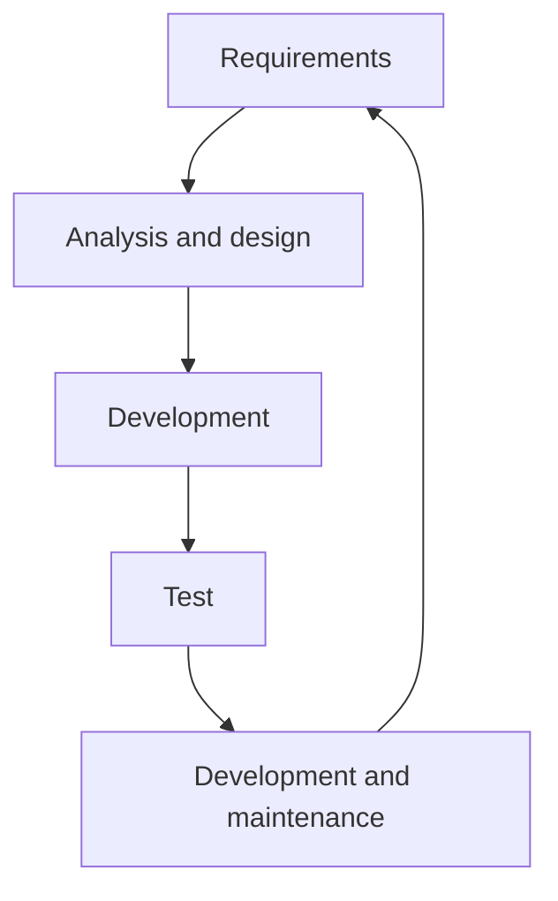
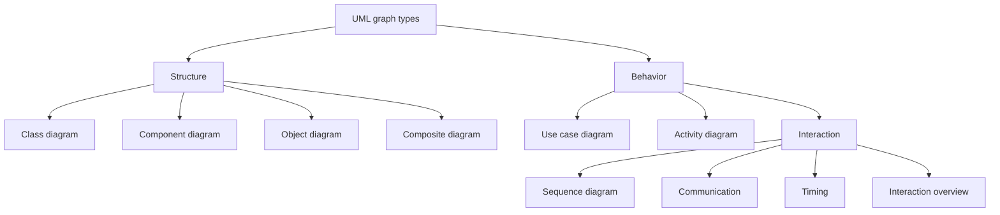
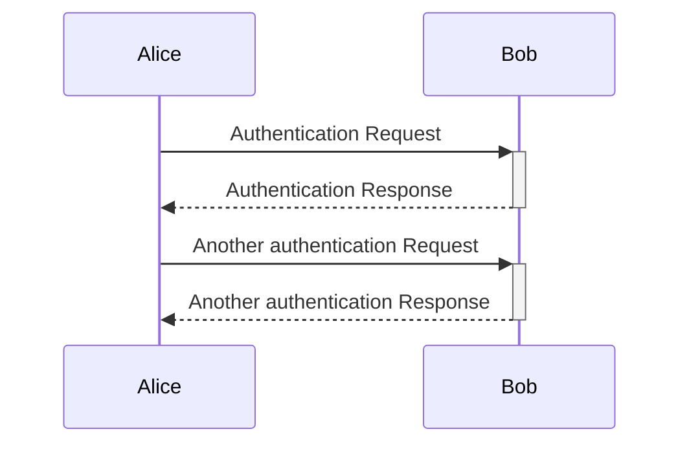
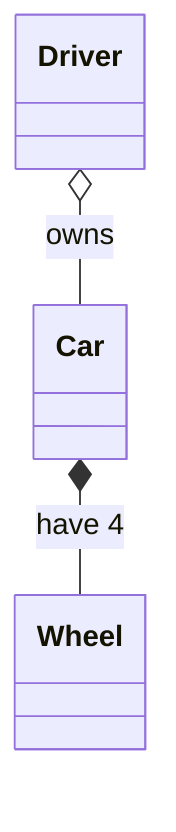
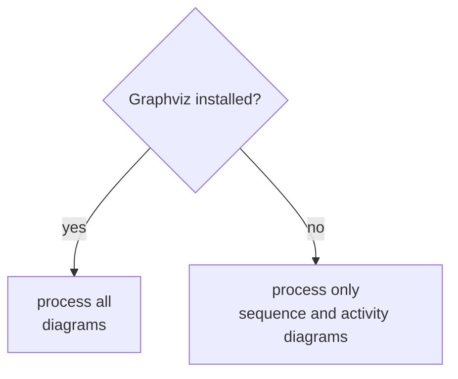
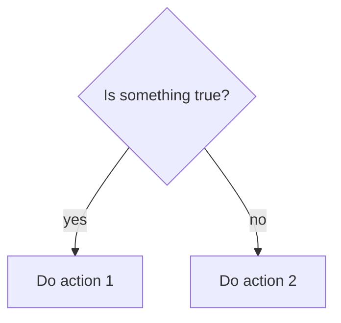
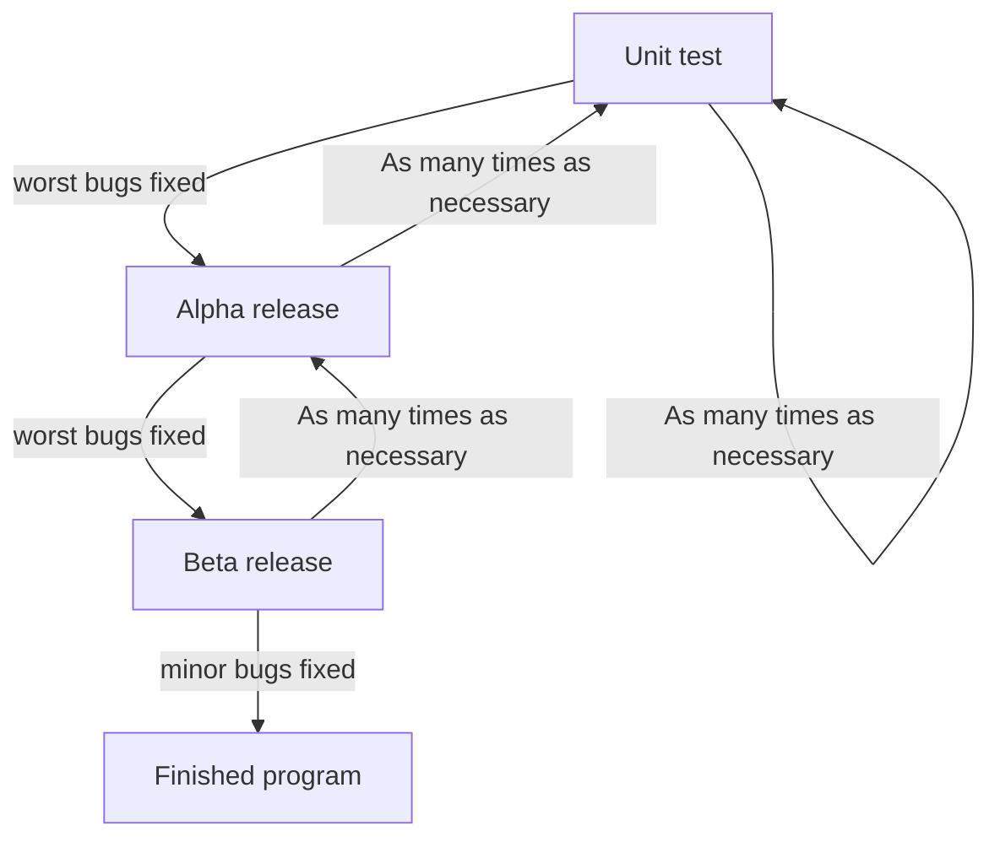

# Software Development Lifecycle (SDLC) tools

???+ questions

    - What are the key concepts and steps in the SDLC
    - What are the tools for a project?


!!! info "Content"

    - We will have an introduction to some SDLC key features
    - We will get some theory of project tools and thinking.


!!! info "Learning objectives of 'SDLC tools'"

    - Compare and contrast various software development tools and justify their relevance to specific development tasks.

!!! note "Instructor notes"

    Prerequisites are:

    - Understanding the Software development Life Cycle

    Teaching goals are:

    - Learners can compare and contrast various software development tools and justify their relevance to specific development tasks.

    Lesson Plan: **FIX**
    
    - **Total** 30 min
    - Theory 20
    - Discussions 10 min

!!! info "TOC"

    - Review SDLC steps
        - waterfall and iteration
    - Planning: Analysis and design
        - top-down vs bottom-up
        - UML (mermaid)
        - pseudocode
    - Testing
    - Source/version control
    - Collaboration
    - Reproducibility and sharing
    - Documentation
---    

## The waterfall model

1.	Requirements
2.	Analysis and design
3.	Development
4.	Test
5.	Development and maintenance




- Good approach for **small and simple systems** where the team knows the system and **requirements very well**.

!!! warning
    - Error is spreading 
    - small mistakes in the beginning will have large impact on the end result. 
        - e.g. bugs, architecture limiting extensions
    - large costs economically and timely

## Other Models

- Modern principles: 
    - automated tests, continuous integration (CI)
- Deliver as fast as possible:
    - small iterations are easier to manage
- Extreme Programming
    - Pair programming
    - Test-driven development
   
!!! info "Conclusion"
    - Each team has unique requirements
    - Don’t be afraid of trial and error
    - More info in [Software Development Lifecycle today](sldc.md) 


## The tools/concepts for Developing a programming project

!!! admonition "Parts to be covered"

    - &#9745; Planning
        - Pseudocode
        - Unified Modelling Language (UML)
    - &#9745; Testing
        - Different levels
    - &#9745; Source/version control
        - Git etc
    - &#9745; Collaboration
        - GitHub
    - &#9745; Reproducibility (for you and others)
        - Deployment
        - Dependencies
        - (Workflows)
    - &#9745; Sharing
        - open science
        - citation
        - licensing  
    - &#9745; Documentation
        - Tutorials
        - How-to guides
        - Explanation
        - Reference 

## Planning: Analysis and design

!!! note

    - "If I had nine hours to chop down a tree, I'd spend the first six sharpening my axe."
    - Modelling sharpens your axe since it helps you think about what you're going to build, how to seek feedback, and where to make improvements. 
    - It prepares you to build the real thing to reduce any potential risk of failure. "


!!! note
    - Planning step is to ...
        - get an overview of the project/program.
        - help planning writing the code
        - identify parts needed
        - (risk analysis)
    - Can be divided into analysis and design
        - **Analysis** part is to state the problem and define inputs and outputs
            - graphical tools like UML
            - text
            - if object-oriented programming: **objects**
        - **Design** phase to find out the specific algorithms needed
            - pseudocode+UML
            - if object-oriented programming: **classes**
            - if functional programming: **functions/modules**

    - More in afternoon!    


### Top-down
1. Clearly state whole problem
2. Define inputs and outputs
3. Design the algorithm with `pseudocode`
4. Turn the algorithm into specific language statements
5. Test the resulting program


### Bottom-Up
Start with parts first and develop a bigger organization with time.

!!! discussion "Answer in HackMD: How do you program?" 

    - Top-down
    - Bottom-up

### Flowcharts or Unified Modeling Language (UML)

#### Tools
- PlantUML
    - Open-source
    -	Can be integrated with IDE:s, Java documentation, Word
    -	Scripts rather than drawing tools
    -	requires plug-in to render in browser
    -	<http://www.plantuml.com/plantuml>
- Graphviz
    - open source graph visualization software. 
    - It has important applications in networking, bioinformatics, software engineering, database and web design, machine learning, and in visual interfaces for other technical domains.
    - <https://graphviz.org/>
- **Mermaid** used in this course
    - Open-source
    - Not as many diagrams
    - renders in browser without plug-ins
    - <https://mermaid.js.org/>
    - [Live editor](https://mermaid.live/)

**Types**



!!! admonition "We will in the course use"
    - Sequence
    - Activity/algorithm flowchart
    - Class diagrams

#### Sequence



Mermaid code

```
sequenceDiagram
    Alice ->>+Bob: Authentication Request
    Bob-->>-Alice: Authentication Response
    Alice->>+Bob: Another authentication Request
    Bob-->>-Alice: Another authentication Response
```

#### Class

 A diagram that shows the system classes and relationships between them.



Mermaid code

```
classDiagram
    Driver o-- Car : owns
    Car *-- Wheel : have 4
```


#### Activity

A flowchart that shows the process and its correlating decisions, 
including an **algorithm**  or a business process.



Mermaid code

```
flowchart TD
  is_installed{Graphviz installed?}
  is_installed --> |yes| process_all[process all\ndiagrams]
  is_installed --> |no| process_sub[process only\nsequence and activity diagrams]
```

#### Algorithm flowchart



Mermaid code

```
flowchart TD
  condition{Is something true?}
  condition --> |yes| is_true[Do action 1]
  condition --> |no| is_false[Do action 2]
```

!!! info "shape of boxes"

    - initial state (small circle)
        - ``[*]``
        ```mermaid
             [*]
        ```
    - end state (small solid-filled circle)
        - ``[*]``
        ```mermaid
             [*]
        ```
    
    - state (rectangle)
        - ``[A]``
        ```mermaid
             [A]
        ```
        
    - activity (rounded recatngle)
    - choice (diamond)
    - arrow
    
    - Other syntax: <https://mermaid.js.org/ecosystem/tutorials.html>


!!! example "Exercise: Make a Algorithm (flow chart) diagram"

    - Start with the [Live editor with a sample diagram](https://mermaid.live/edit#pako:eNpVjk2Lg0AMhv9KyGkX6h_wUGh1txehhfbmeAgaO0M7H4yRUtT_vuN62c0p5Hne8E7Y-o4xx_7pX62mKHArlYM0h7rQ0QxiaWggy_bziQWsd_ye4fhx8jBoH4Jx98_NP64SFFO1agyijXssGyp-82fHM5R1RUF8aP6S28vP8FWbi07v_xMdOaW-657ynrKWIhQUG9yh5WjJdKn6tAYUimbLCvO0dtzT-BSFyi1JpVH89e1azCWOvMMxdCRcGrpHsttx-QG-cVWh) and modify it to instead reflect:

    1. We have a problem
    1. Let's program
    1. Choose format among object-orientation (which gives the choices Python or C++) and functional (choices Python or Fortran)
    
    - Syntax cheat sheet [here](https://mermaid.js.org/syntax/flowchart.html)
    

### Pseudocode
- Pseudocode does not have syntax rules of any particular language
    - no systematic standard form. 
- Some borrow style and syntax from some conventional programming language
    - like Fortran, Pascal, BASIC, C, C++, Java, Lisp, and ALGOL. 
- Variable declarations are typically omitted. 
- Function calls and blocks of code, such as code contained within a loop, are often replaced by a one-line natural language sentence.

**Example**

```code
  algorithm ford-fulkerson is
    input: Graph G with flow capacity c, 
           source node s, 
           sink node t
    output: Flow f such that f is maximal from s to t

    (Note that f(u,v) is the flow from node u to node v, and c(u,v) is the flow capacity from node u to node v)

    for each edge (u, v) in GE do
        f(u, v) ← 0
        f(v, u) ← 0

    while there exists a path p from s to t in the residual network Gf do
        let cf be the flow capacity of the residual network Gf
        cf(p) ← min{cf(u, v) | (u, v) in p}
        for each edge (u, v) in p do
            f(u, v) ←  f(u, v) + cf(p)
            f(v, u) ← −f(u, v)

    return f
```
- Depending on the writer, pseudocode may therefore vary widely in style, 
    - from a near-exact imitation of a real programming language at one extreme
    - to a description approaching formatted prose at the other. 

#### Mathematical style pseudocode
- Used in numerical computation

```math
\sum_{k\in S} x_k
```

```console
\sum_{k\in S} x_k
```

!!! objectives
    - [Planning phase section](https://uppmax.github.io/programming_formalisms_intro/flowcharts.html) aims to 
       - Introduce flowcharts and UML expressions
       - Get into UML coding with PlantUML
       - Test Pseudo coding

!!! note "See also"

    - Diagrams will be cover on
        - Tuesday during several part of the [Software development processes](https://github.com/UPPMAX/programming_formalisms/blob/main/development_design/README.md#software-development-processes)
        - Friday during [Modular programming](https://github.com/UPPMAX/programming_formalisms/blob/main/development_design/Modular_Programming.pdf)


## Testing

Does it work for all legal input data sets??

1. Unit testing 
2. Integration tests (test modules together as a whole)

**Typical testing process**



!!! note "See also"

    - More about testing day 3.
    - [Test-driven development(TDD)](https://github.com/UPPMAX/programming_formalisms/blob/main/tdd/tdd_lecture.pdf)
    - [Testing lecture](https://github.com/UPPMAX/programming_formalisms/blob/main/testing/testing_lecture.pdf)


## Source/version control and collaboration

###  The essence of version control
Summarized from [Code refinery](https://coderefinery.github.io/git-intro/motivation/)

- System which records **snapshots** of a project
- Implements **branching**:
    - You can work on several **feature** branches and switch between them
    - **Different people** can work on the same code/project without interfering
    - You can **experiment** with an idea and discard it if it turns out to be a bad idea
- Implements **merging**:
    - Person A and B’s simultaneous work can be **easily combined**

### What we typically like to snapshot

- **Software** (this is how it started but Git/GitHub can track a lot more)
    - Scripts
- **Documents** (plain text files much better suitable than Word documents)
- **Manuscripts** (Git is great for collaborating/sharing LaTeX or Quarto manuscripts)
    - Configuration files
- **Website sources**

###  Why version control

- **Roll-back functionality**
    - Mistakes happen - **go back to a working version**.
- **Branching**
   - Often you need to work on **several issues/features in one code** - without branching this can be messy and confusing.
- **Collaboration**
   - With version control, none of these are needed anymore (or have much simpler answers):
       - *"I will just finish my work and then you can start with your changes."*
       - *"Can you please send me the latest version?"*
       - *"You never got the code I send by email? Maybe the spam filter marked it as malicious?"*
       - *"Where is the latest version?"*
       - *"Which version are you using?"*
       - *"Which version have the authors used in the paper I am trying to reproduce?"*
- **Reproducibility**
    - How do you indicate which **version** of your code you have used in your paper?
    - When you find a bug, how do you know **when precisely** this bug was introduced
- Compare with **Dropbox or Google Drive**
    -  |:+1:| Document/code is in **one place**, no need to email snapshots.
    - |:-1:| How can you use an **old version**? Possible to get old versions but in a much less useful way .
    - |:-1:| What if you want to work on **multiple versions** at the same time? Do you make a copy? How do you merge copies?
    - |:-1:| What if you **don't have internet**?

!!! discussion "Why Git?"

    We will use [Git](https://git-scm.com) to record snapshots of our work:
    
    - **Easy to set up**: no server needed.
    - **Very popular**: chances are high you will need to contribute to somebody else's code which is tracked with Git.
    - **Distributed**: good backup, no single point of failure, you can track and clean-up changes offline, simplifies collaboration model for open-source projects.
    - Important **platforms** such as [GitHub](https://github.com), [GitLab](https://gitlab.com), and [Bitbucket](https://bitbucket.org) build on top of Git.

    However, any version control is better than no version control and it is OK to prefer a different tool than Git.

    Other tools:
    - [Subversion](https://subversion.apache.org)
    - [Mercurial](https://www.mercurial-scm.org)
    - [Pijul](https://pijul.org/)

### Sharing Online

- What if the hard disk fails?
- What if somebody steals my laptop?
- How can we collaborate with others across the web?

#### Remotes

- To store your git data on another server, you use remotes. 
- A remote is a repository on its own, with its own branches We can push changes to the remote and pull from the remote.

You may use remotes to:
   - Back up your own work.
   - To collaborate with other people.

There are different types of remotes:

- If you have an **own server** you can ssh to, you can use that as a remote.
- [GitHub](https://github.com) is a popular, closed-source commercial site.
- [GitLab](https://about.gitlab.com) is a popular, open-core commercial site. Many universities have their own private GitLab servers  set up.
- [Bitbucket](https://bitbucket.org) is yet another popular commercial site.
- Another option is [NotABug](https://notabug.org)

!!! objectives
   
    - [Get started with a project](project_start/startup.md) aims to
        - Introduce git and GitHub
        - Get into working with git
        - Get into using GitHub as a remote repository


## Collaboration

### Example
- Someone has given you access to a repository online and **you want to contribute** to it.
- Quite easy to make a **copy and send a change back**.
  1. get repository, make a change locally, and send the change directly back.
  2. make a "pull request" that allows a review.
- Once we know how code review works:
  -  we will be able to propose changes to repositories of others
  -  review changes submitted by external contributors.

!!! objectives
   - [Collaboration](https://uppmax.github.io/programming_formalisms_intro/collab.html) aims to 
     - Get into working more with GitHub for collaboration
     - **Centralized** workflow (good within a group)
     - **Forking** (better for contribution to other's project)
     - Contributing to other's projects


!!! note "See also"
    - Git and GitHub will be used in the other days as well


## Reproducibility and sharing

### Reproducible research

- Have you ever spent days trying to repeat the results that took you hours to do the first time last week?  
- Or you have to do paper revisions, but you just can’t get the results to match up? 
- Nothing is a worse feeling - either for you or for science itself.

- We will integrate this topic in the hands-on.
- We will discuss different methods and tools for better reproducibility in research software and data.
    - Virtual environments with ``pip install`` (venv/virtualenv) will be covered in the hands-on.
    - Conda environment is referred to in the extra material. 
- We will demonstrate how version control, workflows, containers, and package managers can be used to record reproducible environments and computational steps.
- [Extra material](https://uppmax.github.io/programming_formalisms_intro/reproducible_deeper.html)

!!! objectives
    - [More about reproducibility](https://uppmax.github.io/programming_formalisms_intro/reproducible_deeper.html) aims to 
       - Get a short overview of recording dependencies
       - Get short intro to tools:
           - Pip and PyPI
           - Conda
           - Environments
           - Tools for other languages than Python
   - We will develop our code in a virtual environment with the python tool ``venv ``   
  

  
### Sharing and licensing and citations
 
!!! Discussion "One-time usage towards distributed package"

    **Menti**
    - Have others used your code?
    - Did you plan it from beginning?
    - Did you take actions somehow?

#### Open science
- The **Open Science movement** encourages researchers to share research output beyond the contents of a published academic article (and possibly supplementary information).
- **Open-source license** is a type of license for computer software and other products that allows the source code, blueprint or design to be used, modified and/or shared under defined terms and conditions.

!!! admonition "FAIR"

    **The current buzzword for data management**
    - You may be asked about it in, for example, making data management plans for grants:

    - **F**indable
        - Will anyone else know that your data exists?
        - Solutions: put it in a standard repository, or at least a description of the data. Get a digital object identifier (DOI).
    - **A**ccessible
         - Once someone knows that the data exists, can they get it?
         - Usually solved by being in a repository, but for non-open data, may require more procedures.
    - **I**nter-operable
         - Is your data in a format that can be used by others, like csv instead of PDF?
         - Or better than csv. Example: 5-star open data
    - **R**eusable
         - Is there a license allowing others to re-use?


### Licensing

#### Copyright
- Protects creative expression
- Automatically created
- **Derivative works** usually inherit copyright of the thing derived
- Time frame: essentially forever (lifetime + X years)

**When can you use?**
- When there is a **license** saying you can
- Limited other cases (private use, fair use: context dependent)
- In practice: people do many things, but then can't share their output if license does not allow it or is not clarified

**Examples**
-  Custom/closed/proprietary
    - Derivative work typically not possible
    - Unusual in academics 
-  Permissive (**MIT**, BSD, Apache)
    - Derivative work does not have to be shared    
-  Weak copyleft share-alike (LGPL, MPL)
    - Derivative work is free software but is limited to the component    
-  Strong copyleft share-alike (**GPL**, AGPL)
  - Derivative work is free software and derivative work extends to the combined project    

[Read more](https://uppmax.github.io/programming_formalisms_intro/sharing_deeper.html#licensing#)

### Software Citation

- Think the same as for a scientific paper
- [Software citation](https://uppmax.github.io/programming_formalisms_intro/sharing_deeper.html#software-citation)

!!! note "See also"
    - Parts of [sharing](https://github.com/UPPMAX/programming_formalisms/blob/main/common_practices/slides/notes_social_coding.pdf) will be covered on Tuesday afternoon.


!!! keypoints

    - Share your code! Eventually others will probably use it anyway.
    - Licence your software and do it early. **Default is “no one can make copies or derivative works”**.
    - Get DOI or at least state how to cite your software


!!! objectives

    - [More about sharing](https://uppmax.github.io/programming_formalisms_intro/sharing_deeper.html) aims to:
        - introduce reproducibility and sharing, licensing and citation
        - get into thinking about dependencies and solutions
        - get into choosing license, citation and DOI


## Documentation

!!! admonition "Documentation comes in different forms"

    - What *is* documentation?
        - **Tutorials**: learning-oriented, allows the newcomer to get started
        - **How-to guides**: goal-oriented, shows how to solve a specific problem
        - **Explanation**: understanding-oriented, explains a concept
        - **Reference**: information-oriented, describes the machinery
        - **In-code documentaion — docstrings** 
        **Not to forget**
        - Project documentation:
            - requirements: what is the goal of the software, risks, platforms
            - the analysis: pseudocode and UML
            - risk analysis

**There is no one size fits all**: often for small projects a `README.md` or
`README.rst` can be enough (more about these formats later).


!!! objectives
     - [Documentation part 1](project_start/startup.md#introduction-to-documentation) aims to:
         - introduce motivation for documentation
         - get tips for in-code documentation
         - get tips for README files
     - [Documentation part 2](deployment/documentation.md) aims to:
         - get tips for README files
         - get tips for full documentation and tutorials


## Summary of SDLC tools
- Now after the overview you are ready to dig deeper in the topics and try it out yourself!

!!! Keypoints

    - Software development is both series of steps: 
        1.	Requirements
        2.	Analysis and design
        3.	Development
        4.	Test
        5.	Development and maintenance
    - ... and iteration of these
    - Planning for reproducibility, modularity and documentation should be started in the beginning
    - Tools for the developer
        - Planning: UML and pseudocode
        - Development iteration: git
        - Testing: test functions (Covered later)
        - Collaboration: GitHub
        - Sharing: GitHub, licenses, citation
        - Documentation: In-code, READMEs, html


