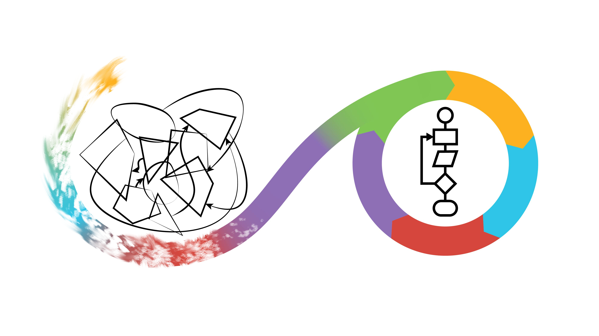

---
tags:
  - learning outcomes
---

# Learning outcomes

{ width="500" }

In the course, learners ...

- have experienced a software development lifecycle
- have developed software collaboratively
- have practiced to grow code in a methodological way
- can conclude when code is Good Enough
- have released a Python package
