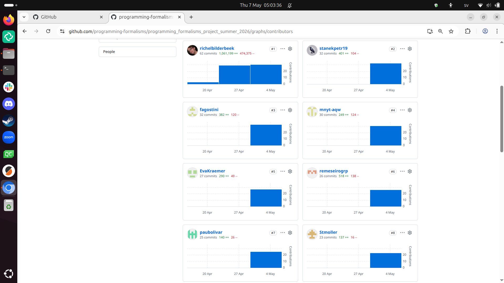

# Lesson plan Day 4

- Author: Richel
- Date: 2026-05-07

## 5:01

Today there is a big time pressure. Let's get started!

I am happy to see the big amount of commits:

I should start with branches, as I want the faster learners to get their
code on the main branch. I've updated the schedule.

Next, can I do CI after? I can if one can copy code with functions
and local asserts to the `weather` folder. Let's test!

Yes, that works fine. CI is next!

