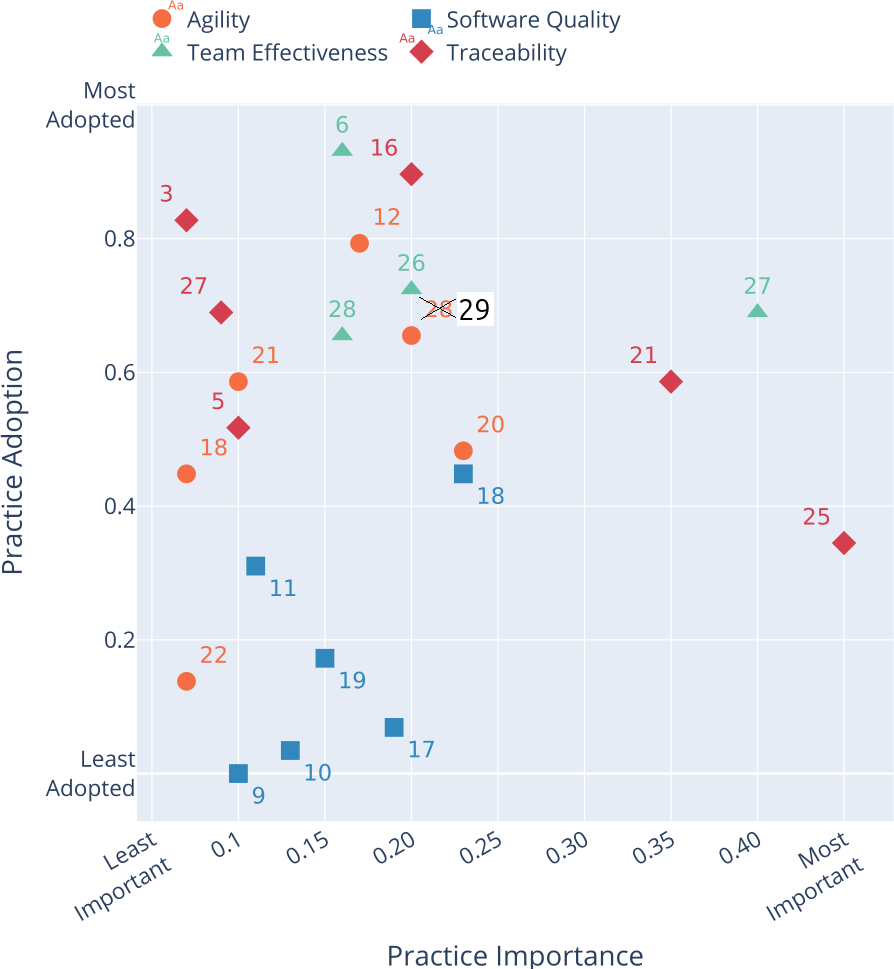
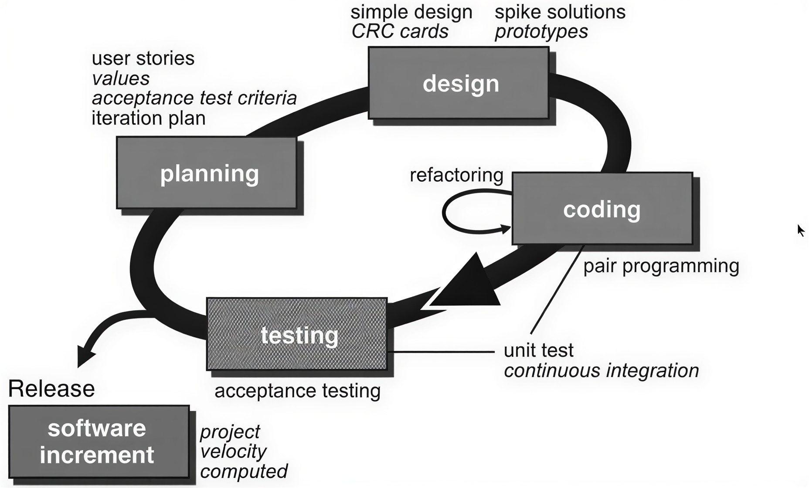

---
tags:
  - papers
  - literature
  - books
  - reading
  - articles
---

# Literature

These are books and academic papers that have influenced the course.

<!-- markdownlint-disable MD013 --><!-- Tables cannot be split up over lines, hence will break 80 characters per line -->

Reference                     |PDF                                |One-line summary `[1]`
------------------------------|-----------------------------------|------------------------------------
`[Bergström and Moberg, 2002]`|.                                  |Describes the weather data set
`[Chacon and Straub, 2014]`   |[PDF](chacon_and_straub_2014.pdf)  |The book about `git`
`[Jiménez et al., 2017]`      |[PDF](jimenez_et_al_2017.pdf)      |Best practices in research software
`[Kroll et al., 2013]`        |[PDF](kroll_et_al_2013.pdf)        |Best practices in software development
`[Pastrana et al., 2025]`     |[PDF](pastrana_et_al_2025.pdf)     |Literature review of best practices in Scrum and DevOps
`[Perez-Riverol et al., 2016]`|[PDF](perez_riverol_et_al_2016.pdf)|Recommendations on `git` and GitHub
`[Ram, 2013]`                 |[PDF](ram_2013.pdf)                |Effect of `git` on reproducibility
`[Serban et al., 2020]`       |[PDF](serban_et_al_2020.pdf)       |Recommends some software engineering best practices, in the field of machine learning
`[Stieler and Bauer, 2023]`   |[PDF](stieler_and_bauer_2023.pdf)  |Applies `[Serban et al., 2020]` to rate if a project follows the recommended practices
`[Stodden and Miguez, 2014]`  |[PDF](stodden_and_miguez_2014.pdf) |Best practices for a project
`[Visser et al., 2016]`       |None                               |Ten best practices for effective software development
`[Wilson et al., 2014]`       |[PDF](wilson_et_al_2014.pdf)       |Best practices for a project
`[Wilson et al., 2017]`       |[PDF](wilson_et_al_2017.pdf)       |Good enough practices for a project

<!-- markdownlint-enable MD013 -->

- `[1]` You can find more extensive summaries below

## Summaries

These are summaries of some of the papers mentioned.

## Summary of `[Allen and Mehler, 2019]`

This paper addresses challenges and misconceptions on adopting
open science principles in a scientific career.

Below it shows figure 1 of this paper.
It is shows that traditional literature,
compared to registered reports, reports on null findings 4x less likely.

## Summary of `[Aniley et al., 2024]`

This paper seems useful at first glance:
the authors trained an algorithm
to detect the best software development lifecycle
for projects.

They recommend to use Agile software development models,
but it is unclear where they base this on exactly.

## Summary of `[Beelders and du Plessis, 2015]`

This study asked students to read code, with or without syntax
highlighting. They found no significant difference in understanding.

## Summary of `[Bergström and Moberg, 2002]`

This paper describes how the weather data, used in the learners
project, has been obtained.

## Summary of `[Chambers, 2019]`

This comment (i.e. an article that introduces multiple papers)
described the current and future challenges of registered reports.

It has a cartoon that illustrates the difference between
traditional science and registered reports.

## Summary of `[Forsgren et al., 2018]`

This book is written by some computer scientists,
where they measure software development metrics
to find out what really works.

Their conclusions are summed up in Appendix A,
which has the following headers:

- Continuous Delivery
    - Use version control for all production artifacts
    - Automate your deployment process
    - Implement Continuous Integration
    - Use trunk-based development methods
    - Implement test automation
    - Support test data management
    - Shift Left on Security (i.e. make security part of the software delivery)
    - Implement Continuous Delivery (CD)
- Architecture
    - Use a Loosely Coupled Architecture
    - Architect for Empowered Teams
- Product and Process
    - Gather and Implement Customer Feedback
    - Make the Flow of Work Visible through the Value Stream
    - Work in Small Batches
    - Foster and Enable Team Experimentation
- Lean Management and Monitoring
    - Have a Lightweight Change Approval Processes
    - Monitor across Application and Infrastructure to Inform Business Decisions
    - Check System Health Proactively
    - Improve Processes and Manage Work with Work-In-Process (WIP) Limits
    - Visualize Work to Monitor Quality and Communicate throughout the Team
- Cultural
    - Support a Generative Culture
    - Encourage and Support Learning
    - Support and Facilitate Collaboration among Teams
    - Provide Resources and Tools that Make Work Meaningful
    - Support or Embody Transformational Leadership

## Summary of `[Jiménez et al., 2017]`

These are the 4 recommendations:

- Make source code publicly accessible from day one
- Make software easy to discover by providing software metadata
  via a popular community registry
- Adopt a licence and comply with the licence of third-party dependencies
- Define clear and transparent contribution, governance and
  communication processes

## Summary of `[Khan, 2009]`

This PhD thesis investigates both programmer mood and IDE.
In the final chapter, the IDE is used to improve a programmer's
mood when a negative emotion is detected.
To improve the mood of a programmer,
a video is shown to urge the developer to do ... exercises...?

## Summary of `[Kline and Seffah, 2005]`

This study states that IDEs are 'too often functionality-oriented
and difficult to use, learn, and master'. The more experienced
uses score the usability of an IDE higher.

<!-- The image is enhanced with https://herhor.net/minecraft/imager -->

The large standard deviations in the experts is explain by the low
amount of experts: there were 7 experts (compared to a 100 beginners).

## Summary of `[Kroll et al., 2013]`

This paper is a literature review, tailored to best practices in
Follow-the-sun software development. Below is a table that shows
how many papers (`n`) recommend a specific practice.

`n`|Best practice
---|-----------------------------------------------------------------------
6  |Agile methods
6  |Use of technology for knowledge sharing
3  |Process documentation
3  |Use of an FTP Server (or data repository) to exchange code and documents
3  |Time window

## Summary of `[Leau et al., 2012]`

This paper compares Agile versus traditional software development,
with Table 1 (see below) sums up the findings:

<!-- markdownlint-disable MD013 --><!-- Tables cannot be split up over lines, hence will break 80 characters per line -->

Parameter                            |Agile                                          |Traditional
-------------------------------------|-----------------------------------------------|-----------------------------------------------------------------------
User requirement                     |Iterative acquisition                          |Detailed user requirements are well-defined before coding/implementation
Rework cost                          |Low                                            |High
Development direction                |Readily changeable                             |Fixed
Testing                              |On every iteration                             |After coding phase completed
Customer involvement                 |High                                           |Low
Extra quality required for developers|Interpersonal skills & basic business knowledge|Nothing in particular
Suitable Project scale               |Low to medium-scaled                           |Large-scaled

<!-- markdownlint-enable MD013 -->

## Summary of `[Li and Ahmed, 2023]`

This paper is about the impact and evolution of commit message quality.

They define a good commit message as such:

> it should have both the summary of the
> code change (What) and the motivation/reason behind it (Why).

## Summary of `[Morales et al., 2019]`

This study asks students to evaluate how friendly different IDEs
are to use.

Note that it misquotes `[Beelders and du Plessis, 2015]`,
where this paper insinuates that syntax highlighting (as
typically provided by IDEs) is a good thing. The misquoted
paper, however, found that there is no difference between black-and-white
code versus colored syntax highlighted code.

## Summary of `[Munafò et al., 2017]`

This paper describes practices that hinder reproducibility
of scientific findings, as well as measures to increase reproducibility
of scientific findings, such as using registered reports.

## Summary of `[Pastrana et al., 2025]`

This is a literature review paper on Scrum and DevOps.

Box 11 shows the benefits of Scrum and DevOps practices.
Here is an adapted version of box 11:

<!-- markdownlint-disable MD013 --><!-- Tables cannot be split up over lines, hence will break 80 characters per line -->

Benefits              | Improvement Observed
----------------------|---------------------------------------------------------
Scrum adoption        | Actively involved stakeholders
.                     | Transparent communication channels
.                     | Increased team collaboration
.                     | Improved predictability
.                     | Creation of a collaborative culture
.                     | Continuous improvement
.                     | Constant quality measurement or concurrent testing
DevOps adoption       | Early and continuous feedback
.                     | Productivity increased by 20%
.                     | Deployment time decreased by 30%
Faster release cycles | Time to market decreased by 25%
.                     | Incident resolution time decreased by 40%
.                     | Quality deliverable
.                     | Early and continuous feedback
Continuous integration| Quality deliverable
.                     | Time to market decreased by 25%
.                     | Incident resolution time decreased by 40%
.                     | Transparent communication channels
Automated testing     | Test execution speed increased by 35%
.                     | Defect detection increased by 18%
Security automation   | Security vulnerabilities decreased by 30%
.                     | response time decreased by 50%
Agile transformation  | The development cycle decreased by 25%
.                     | Project success rates increased by 18%

<!-- markdownlint-enable MD013 -->

I removed the conclusion to `[Sravani et al., 2023]` (`[117]` in the paper)
as that paper does not supply these numbers at all.

I used
[the Doc2Lang image to table converter](https://doc2lang.com/image-to-table)
to convert the image to a table.

## Summary of `[Perez-Riverol et al., 2016]`

This paper shared 10 simple rules to take advantage of `git` and GitHub:

- Rule 1: Use GitHub to Track Your Projects
- Rule 2: GitHub for Single Users, Teams, and Organizations
- Rule 3: Developing and Collaborating on New Features:
  Branching and Forking
- Rule 4: Naming Branches and Commits: Tags and Semantic Versions
- Rule 5: Let GitHub Do Some Tasks for You: Integrate
- Rule 6: Let GitHub Do More Tasks for You: Automate
- Rule 7: Use GitHub to Openly and Collaboratively Discuss,
  Address, and Close Issues
- Rule 8: Make Your Code Easily Citable, and Cite Source Code!
- Rule 9: Promote and Discuss Your Projects: Web Page and More
- Rule 10: Use GitHub to Be Social: Follow and Watch

## Summary of `[Ram, 2013]`

This paper supplies these 8 use cases for Git in science:

- Lab notebook
- Facilitating collaboration
- Backup and failsafe against data loss
- Freedom to explore new ideas and methods
- Mechanism to solicit feedback and reviews
- Increase transparency and verifiability
- Managing large data
- Lowering barriers to reuse

## Summary of `[Serban et al., 2020]`

This article shows the importance of a practice
and how much it is adopted, in the context of a machine learning project:

Note that there are 2x a 28, where 29 is absent. I assume that the
28 to the right, with and orange circle and an importance of 0.2
had to be 29. I assume so, as the 28 with a green triangle
should indeed be a green triangle. This has been clearly annotated :-)

These are the top 10 most important practices, after which I show
the full table:

`n`|Title
---|----------------------------------------------------------------------
25 |Log Production Predictions with the Model's Version and Input Data
27 |Work Against a Shared Backlog
21 |Continuously Monitor the Behaviour of Deployed Models
18 |Use Continuous Integration
20 |Automate Model Deployment
16 |Use Versioning for Data, Model, Configurations and Training Scripts
26 |Use A Collaborative Development Platform
29 |Enforce Fairness and Privacy
17 |Run Automated Regression Tests
12 |Enable Parallel Training Experiments

Here is the full table:

`n`|Title
---|----------------------------------------------------------------------
1  |Use Sanity Checks for All External Data Sources
2  |Check that Input Data is Complete, Balanced and Well Distributed
3  |Write Reusable Scripts for Data Cleaning and Merging
4  |Ensure Data Labelling is Performed in a Strictly Controlled Process
5  |Make Data Sets Available on Shared Infrastructure (private or public)
6  |Share a Clearly Defined Training Objective within the Team
7  |Capture the Training Objective in a Metric that is Easy to Measure and Understand
8  |Test all Feature Extraction Code
9  |Assign an Owner to Each Feature and Document its Rationale
10 |Actively Remove or Archive Features That are Not Used
11 |Peer Review Training Scripts
12 |Enable Parallel Training Experiments
13 |Automate Hyper-Parameter Optimisation and Model Selection
14 |Continuously Measure Model Quality and Performance
15 |Share Status and Outcomes of Experiments Within the Team
16 |Use versioning for Data, Model, Configurations and Training Scripts
17 |Run Automated Regression Tests
18 |Use Continuous Integration
19 |Use Static Analysis to Check Code Quality
20 |Automate Model Deployment
21 |Continuously Monitor the Behaviour of Deployed Models
22 |Enable Shadow Deployment
23 |Perform Checks to Detect Skews between Models
24 |Enable Automatic Roll Backs for Production Models
25 |Log Production Predictions with the Model's Version and Input Data
26 |Use A Collaborative Development Platform
27 |Work Against a Shared Backlog
28 |Communicate, Align, and Collaborate With Multidisciplinary Team Members
29 |Enforce Fairness and Privacy

I used
[the Doc2Lang image to table converter](https://doc2lang.com/image-to-table)
to convert the image to a table

## Summary of `[Soderberg et al., 2021]`

This paper shows that registered reports result in better
science, compared to 'regular' papers.

Here is figure 3 of that paper:

In this experiment, researches selected 'regular' papers
and registered reports. The researchers then asked reviewers
to score papers on the feature shown in the figure,
where these reviewers were unaware of this experimental variable.

For all features (including 'Creativity'), registered reports
scored higher.

## Summary of `[Stieler and Bauer, 2023]`

Applies `[Serban et al., 2020]` for a data-centric AI project called GW4AL.
It is irrelevant for us.

## Summary of `[Stodden and Miguez, 2014]`

This paper suggests these best practices about how to setup
your infrastructure to achieve reproducible research:

- Open licensing should be used for data and code
- Workflow tracking should be carried out during the research process.
- Data must be available and accessible
- Code and methods must be available and accessible
- All 3rd party data and software should be cited

## Summary of `[Thomas and Hunt, 2019]`

This book is a classic, with 100 tips.
Here is an overview of the (sometimes cryptically phrased) tips,
as well as the page of the book where you can find it explained.

Tip|Page|Tip
---|----|-----------------------
1  |xxi |Care About Your Craft
2  |xxi |Think! About Your Work
3  |2   |You Have Agency
4  |4   |Provide Options, Don't Make Lame Excuses
5  |7   |Don't Live with Broken Windows
6  |9   |Be a Catalyst for Change
7  |10  |Remember the Big Picture
8  |12  |Make Quality a Requirements Issue
9  |15  |Invest Regularly in Your Knowledge Portfolio
10 |17  |Critically Analyze What You Read and Hear
11 |20  |English is Just Another Programming Language
12 |22  |It's Both What You Say and the Way You Say It
13 |23  |Build Documentation In, Don't Bolt It On
14 |28  |Good Design Is Easier to Change Than Bad Design
15 |31  |DRY - Don't Repeat Yourself
16 |38  |Make It Easy to Reuse
17 |40  |Eliminate Effects Between Unrelated Things
18 |48  |There Are No Final Decisions
19 |49  |Forgo Following Fads
20 |51  |Use Tracer Bullets to Find the Target
21 |57  |Prototype to Learn
22 |60  |Program Close to the Problem Domain
23 |66  |Estimate to Avoid Surprises
24 |70  |Iterate the Schedule with the Code
25 |75  |Keep Knowledge in Plain Text
26 |79  |Use the Power of Command Shells
27 |81  |Achieve Editor Fluency
28 |85  |Always Use Version Control
29 |89  |Fix the Problem, Not the Blame
30 |89  |Don't Panic
31 |91  |Failing Test Before Fixing Code
32 |92  |Read the Damn Error Message
33 |95  |`select` Isn't Broken
34 |96  |Don't Assume It - Prove It
35 |98  |Learn a Text Manipulation Language
36 |102 |You Can't Write Perfect Software
37 |107 |Design with Contracts
38 |113 |Crash Early
39 |115 |Use Assertions to Prevent the Impossible
40 |118 |Finish What You Start
41 |121 |Act Locally
42 |126 |Take Small Steps - Always
43 |127 |Avoid Fortune-Telling
44 |131 |Decoupled Code Is Easier to Change
45 |132 |Tell, Don't Ask
46 |134 |Don't Chain Method Calls
47 |136 |Avoid Global Data
48 |136 |If It's Important Enough To Be Global, Wrap It in an API
49 |149 |Programming Is About Code, But Programs Are About Data
50 |153 |Don't Hoard State; Pass It Around
51 |161 |Don't Pay Inheritance Tax
52 |162 |Prefer Interfaces to Express Polymorphism
53 |163 |Delegate to Services, Has-A Trumps Is-A
54 |165 |Use Mixins to Share Functionality
55 |166 |Parameterize Your App Using External Configuration
56 |171 |Analyze Workflow to Improve Concurrency
57 |174 |Shared State Is Incorrect State
58 |180 |Random Failures Are Often Concurrency Issues
59 |182 |Use Actors For Concurrency Without Shared State
60 |189 |Use Blackboards to Coordinate Workflow
61 |194 |Listen to Your Inner Lizard
62 |200 |Don't Program by Coincidence
63 |207 |Estimate the Order of Your Algorithms
64 |208 |Test Your Estimates
65 |212 |Refactor Early, Refactor Often
66 |214 |Testing Is Not About Finding Bugs
67 |216 |A Test Is the First User of Your Code
68 |218 |Build End-To-End, Not Top-Down or Bottom Up
69 |221 |Design to Test
70 |223 |Test Your Software, or Your Users Will
71 |224 |Use Property-Based Tests to Validate Your Assumptions
72 |234 |Keep It Simple and Minimize Attack Surfaces
73 |235 |Apply Security Patches Quickly
74 |242 |Name Well; Rename When Needed
75 |244 |No One Knows Exactly What They Want
76 |245 |Programmers Help People Understand What They Want
77 |246 |Requirements Are Learned in a Feedback Loop
78 |247 |Work with a User to Think Like a User
79 |248 |Policy Is Metadata
80 |251 |Use a Project Glossary
81 |254 |Don't Think Outside the Box - Find the Box
82 |259 |Don't Go into the Code Alone
83 |259 |Agile Is Not a Noun; Agile Is How You Do Things
84 |264 |Maintain Small Stable Teams
85 |266 |Schedule It to Make It Happen
86 |268 |Organize Fully Functional Teams
87 |271 |Do What Works, Not What's Fashionable
88 |273 |Deliver When Users Need It
89 |274 |Use Version Control to Drive Builds, Tests, and Releases
90 |275 |Test Early, Test Often, Test Automatically
91 |275 |Coding Ain't Done 'Til All the Tests Run
92 |277 |Use Saboteurs to Test Your Testing
93 |278 |Test State Coverage, Not Code Coverage
94 |278 |Find Bugs Once
95 |279 |Don't Use Manual Procedures
96 |281 |Delight Users, Don't Just Deliver Code
97 |282 |Sign Your Work
98 |286 |First, Do No Harm
99 |287 |Don't Enable Scumbags
100|287 |It's Your Life. Share it. Celebrate it. Build it. AND HAVE FUN!

## Summary of `[Tian et al, 2022]`

This paper describes what makes a good commit message,
classifying good commit messages in 'What' and 'Why'
categories.

It does describe reasonably clear what is a bad commit message,
however, it not give any clear guidance on what is a good commit message.

## Summary of `[Visser et al., 2016]`

This closed-access paper has the following table of content:

- Derive Metrics from Your Measurement Goals
- Make Definition of Done Explicit
- Control Code Versions and Development Branches
- Control Development, Test, Acceptance, and Production Environments
- Automate Tests
- Use Continuous Integration
- Automate Deployment
- Standardize the Development Environment
- Manage Usage of Third-Party Code
- Document Just Enough

## Summary of `[Wilson et al., 2014]`

This paper summarizes best practices.
Here is (a slightly adapted) box 1 from that paper:

<!-- markdownlint-disable MD013 --><!-- Tables cannot be split up over lines, hence will break 80 characters per line -->

`n`|Theme                                           |Recommendatation
---|------------------------------------------------|---------------------------------------------
1  |Write programs for people, not computers        |A program should not require its readers to hold more than a handful of facts in memory at once.
.  |.                                               |Make names consistent, distinctive, and meaningful.
.  |.                                               |Make code style and formatting consistent.
2  |Let the computer do the work                    |Make the computer repeat tasks.
.  |.                                               |Save recent commands in a file for re-use.
.  |.                                               |Use a build tool to automate workflows.
3  |Make incremental changes                        |Work in small steps with frequent feedback and course correction.
.  |.                                               |Use a version control system.
.  |.                                               |Put everything that has been created manually in version control.
4  |Don't repeat yourself (or others)               |Every piece of data must have a single authoritative representation in the system.
.  |.                                               |Modularize code rather than copying and pasting.
.  |.                                               |Re-use code instead of rewriting it.
5  |Plan for mistakes                               |Add assertions to programs to check their operation.
.  |.                                               |Use an off-the-shelf unit testing library.
.  |.                                               |Turn bugs into test cases.
.  |.                                               |Use a symbolic debugger.
6  |Optimize software only after it works correctly |Use a profiler to identify bottlenecks.
.  |.                                               |Write code in the highest-level language possible.
7  |Document design and purpose, not mechanics      |Document interfaces and reasons, not implementations.
.  |.                                               |Refactor code in preference to explaining how it works.
.  |.                                               |Embed the documentation for a piece of software in that software.
8  |Collaborate                                     |Use pre-merge code reviews.
.  |.                                               |Use pair programming when bringing someone new up to speed and when tackling particularly tricky problems.
.  |.                                               |Use an issue tracking tool.

<!-- markdownlint-enable MD013 -->

## Summary of `[Wilson et al., 2017]`

This paper summarizes best practices that are good enough.
Here is (a slightly adapted) box 1 from that paper:

<!-- markdownlint-disable MD013 --><!-- Tables cannot be split up over lines, hence will break 80 characters per line -->

`n`|Theme                   |Recommendatation
---|------------------------|---------------------------------------------
1  |Data management         |Save the raw data.
.  |.                       |Ensure that raw data are backed up in more than one location.
.  |.                       |Create the data you wish to see in the world.
.  |.                       |Create analysis-friendly data.
.  |.                       |Record all the steps used to process data.
.  |.                       |Anticipate the need to use multiple tables, and use a unique identifier for every record.
.  |.                       |Submit data to a reputable DOI-issuing repository so that others can access and cite it.
2  |Software                |Place a brief explanatory comment at the start of every program.
.  |.                       |Decompose programs into functions.
.  |.                       |Be ruthless about eliminating duplication.
.  |.                       |Always search for well-maintained software libraries that do what you need.
.  |.                       |Test libraries before relying on them.
.  |.                       |Give functions and variables meaningful names.
.  |.                       |Make dependencies and requirements explicit.
.  |.                       |Do not comment and uncomment sections of code to control a program's behavior.
.  |.                       |Provide a simple example or test data set.
.  |.                       |Submit code to a reputable DOI-issuing repository.
3  |Collaboration           |Create an overview of your project.
.  |.                       |Create a shared "to-do" list for the project.
.  |.                       |Decide on communication strategies.
.  |.                       |Make the license explicit.
.  |.                       |Make the project citable.
4  |Project organization    |Put each project in its own directory, which is named after the project.
.  |.                       |Put text documents associated with the project in the doc directory.
.  |.                       |Put raw data and metadata in a data directory and files generated during cleanup and analysis in a results directory.
.  |.                       |Put project source code in the src directory.
.  |.                       |Put external scripts or compiled programs in the bin directory.
.  |.                       |Name all files to reflect their content or function.
5  |Keeping track of changes|Back up (almost) everything created by a human being as soon as it is created.
.  |.                       |Keep changes small.
.  |.                       |Share changes frequently.
.  |.                       |Create, maintain, and use a checklist for saving and sharing changes to the project.
.  |.                       |Store each project in a folder that is mirrored off the researcher's working machine.
.  |.                       |Add a file called CHANGELOG.txt to the project's docs subfolder.
.  |.                       |Copy the entire project whenever a significant change has been made.
.  |.                       |Use a version control system.
6  |Manuscripts             |Write manuscripts using online tools with rich formatting, change tracking, and reference management.
.  |.                       |Write the manuscript in a plain text format that permits version control.

<!-- markdownlint-enable MD013 -->

## Summary of `[Yas, 2023]`

This paper tries to collect and categorize
all software development life cycles.
The primary grouping is between traditional and agile models.

Figure 3 depicts the waterfall model:

Figure 8 depicts the eXtreme programming model:

## References

- `[Allen and Mehler, 2019]` Allen, Christopher, and David MA Mehler.
  "Open science challenges, benefits and tips in early career and beyond."
  PLoS biology 17.5 (2019): e3000246.
  [Paper homepage](https://doi.org/10.1371/journal.pbio.3000246)

- `[Aniley et al., 2024]` Aniley, D. Bitew, E. Alemneh Jalew,
  and G. Abeba Agegnehu. "Selection of software development life cycle
  models using machine learning approach." Int J Comput Appl 186 (2024): 36-43.

- `[Barker, M., Chue Hong, N.P., Katz, D.S. et al. ]`
  Barker, M., Chue Hong, N.P., Katz, D.S. et al.
  Introducing the FAIR Principles for research software.
  Sci Data 9, 622 (2022). [Fair4RS](https://rdcu.be/eNhd1)

- `[Beelders and du Plessis, 2015]` Beelders, Tanya R.,
  and Jean-Pierre L. du Plessis.
  "Syntax highlighting as an influencing factor when reading and
  comprehending source code." Journal of Eye Movement Research 9.1 (2015): 1.
  [Paper homepage](https://doi.org/10.16910/jemr.9.1.1)

- `[Bergström and Moberg, 2002]` Bergström, Hans, and Anders Moberg.
  "Daily air temperature and pressure series for Uppsala (1722–1998)."
  Climatic change 53.1 (2002): 213-252.
  [Paper homepage](https://doi.org/10.1023/A:1014983229213)

- `[Bertram, 2009]` Bertram, Dane.
  "The social nature of issue tracking in software engineering."
  University of Calgary (2009).

- `[Booch 2007]` Grady Booch et al.,
  Object-oriented analysis and design with applications - 3rd ed,
  Addison-wesley 2007.

- `[Chacon and Straub, 2014]` Chacon, Scott, and Ben Straub.
  Pro git. Springer Nature, 2014.
  [Book homepage](https://git-scm.com/book/en/v2).

- `[Chambers, 2019]` Chambers, Chris. "What’s next for registered reports?."
  Nature 573.7773 (2019): 187-189.
  [Comment (i.e. it is not a paper) homepage](https://doi.org/10.1038/d41586-019-02674-6)

- `[Church, 1941]` The  Calculi of lambda-conversion, Princeton,
  Princeton University Press,
  Londos: Humphrey Milford Oxford University Press, 1941

- `[Coad et al., 1999]` Coad, Peter and Luca, Jeff de and Lefebvre,
  Eric Java Modeling Color with Uml: Enterprise Components
  and Process with CD-ROM, Prentice Hall PTR, 1999

- `[Dijkstra, 1970]` Notes On Structured Programming,
  T.H. - Report 70-WSK-03,Second edition April 1970

- `[Forsgren et al., 2018]` Forsgren, Nicole, Jez Humble, and Gene Kim.
  Accelerate: The science of lean software and devops:
  Building and scaling high performing technology organizations.
  IT Revolution, 2018.

- `[Gamma et al., 1995]` Gamma, Erich, et al.
  "Elements of reusable object-oriented software." Design Patterns (1995).

- `[Gunderloy, 2007]` Gunderloy, Mike, ed.
  Painless project management with FogBugz. Berkeley, CA: Apress, 2007.

- `[ISO 12207:2017]`
  [ISO/IEC/IEEE 12207:2017 Systems and software engineering — Software life cycle processes](https://www.iso.org/standard/63712.html)

- `[Jacobson, 1992]`
  Jacobson, Ivar, et al.
  Object-Oriented Software Engineering,
  a usecase driven approach, Addison-wesley 1992

- `[Jiménez et al., 2017]` Jiménez, Rafael C., et al.
  "Four simple recommendations to encourage best practices
  in research software." F1000Research 6 (2017): ELIXIR-876.
  [Paper homepage](https://pubmed.ncbi.nlm.nih.gov/28751965/)

- `[Jones et al., 2001]`
  [Jones JW, Keating BA, Porter CH. Approaches to modular model development. Agricultural Systems. 2001 Nov 1;70(2):421–43](https://www.sciencedirect.com/science/article/pii/S0308521X01000543)

- `[Khan, 2009]` Khan, Iftikhar Ahmed.
  Towards a mood sensitive integrated development environment
  to enhance the performance of programmers.
  Diss. Brunel University, School of Information Systems,
  Computing and Mathematics, 2009.

- `[Kline and Seffah, 2005]` Kline, Rex Bryan, and Ahmed Seffah.
  "Evaluation of integrated software development environments:
  Challenges and results from three empirical studies."
  International journal of human-computer studies 63.6 (2005): 607-627.

- `[Kroll et al., 2013]` Kroll, Josiane, et al.
  "A systematic literature review of best practices and challenges in
  follow-the-sun software development."
  2013 IEEE 8th International Conference on Global Software Engineering
  Workshops. IEEE, 2013.
  [Paper homepage](https://doi-org.ezproxy.its.uu.se/10.1109/ICGSEW.2013.10)

- `[Leau et al., 2012]` Leau, Yu Beng, et al.
  "Software development life cycle AGILE vs traditional approaches."
  International Conference on Information and Network Technology.
  Vol. 37. No. 1. 2012.

- `[Li and Ahmed, 2023]` Li, Jiawei, and Iftekhar Ahmed.
  "Commit message matters: Investigating impact and evolution of
  commit message quality."
  2023 IEEE/ACM 45th International Conference on Software Engineering (ICSE).
  IEEE, 2023.
  [Paper homepage](https://doi.org/10.1109/ICSE48619.2023.00076)

- `[Morales et al., 2019]` Morales, Jenny, et al.
  "How “friendly” integrated development environments are?."
  International Conference on Human-Computer Interaction.
  Cham: Springer International Publishing, 2019.
  [Paper homepage](https://doi.org/10.1007/978-3-030-21902-4_7)

- `[Munafò et al., 2017]` Munafò, Marcus R., et al.
  "A manifesto for reproducible science."
  Nature human behaviour 1.1 (2017): 0021.
  [Paper homepage](https://doi.org/10.1038/s41562-016-0021)

- `[Ordoñez-Pacheco et al., 2021]`
  Ordoñez-Pacheco, Rodrigo, Karen Cortes-Verdin, and Jorge Octavio
  Ocharán-Hernández.
  "Best practices for software development: A systematic literature review."
  International Conference on Software Process Improvement.
  Springer, Cham, 2021.
  Note: this paper does not exist. It is not part of the book
  'Advances in Intelligent Informatics', volume 320,
  ISBN 978-3-319-11217-6.

- `[Pastrana et al., 2025]` Pastrana, Manuel, et al.
  "Best Practices Evidenced for Software Development Based on DevOps
  and Scrum: A Literature Review."
  Applied Sciences 15.10 (2025): 5421.
  [Paper homepage](https://doi.org/10.3390/app15105421)

- `[Perez-Riverol et al., 2016]`
  Perez-Riverol, Yasset, et al. "Ten simple rules for taking advantage
  of Git and GitHub." PLoS computational biology 12.7 (2016): e1004947.
  [Paper homepage](https://doi.org/10.1371/journal.pcbi.1004947)

- `[Ram, 2013]` Ram, Karthik.
  "Git can facilitate greater reproducibility and increased transparency
  in science." Source code for biology and medicine 8.1 (2013): 7.
  [Paper homepage](https://link.springer.com/article/10.1186/1751-0473-8-7)

- `[Rumbaugh, 1991]` Rumbaugh et. al,
  Object-oriented modeling and design, Prentice-Hall, Inc. 1991

- `[Serban et al., 2020]` Serban, Alex, et al.
  "Adoption and effects of software engineering best practices
  in machine learning." Proceedings of the 14th ACM/IEEE
  International Symposium on Empirical Software Engineering and
  Measurement (ESEM). 2020.
  [Paper homepage](https://doi.org/10.1145/3382494.3410681)

- `[Soderberg et al., 2021]` Soderberg, Courtney K., et al.
  "Initial evidence of research quality of registered reports
  compared with the standard publishing model."
  Nature Human Behaviour 5.8 (2021): 990-997.
  [Paper homepage](https://doi.org/10.1038/s41562-021-01142-4)

- `[Sravani et al., 2023]` Sravani, Diyyala, et al.
  "Python security in devOps: Best practices for secure coding,
  configuration management, and continuous testing and monitoring."
  2023 4th International Conference on Electronics and Sustainable
  Communication Systems (ICESC). IEEE, 2023.

- `[Stieler and Bauer, 2023]` Stieler, Fabian, and Bernhard Bauer.
  "Git workflow for active learning-a development methodology proposal
  for data-centric AI projects." (2023).
  [Paper homepage](https://doi.org/10.5220/0011988400003464)

- `[Stodden and Miguez, 2014]` Stodden, Victoria, and Sheila Miguez.
  "Best practices for computational science:
  Software infrastructure and environments for reproducible and
  extensible research." (2014).
  [Paper homepage](https://openresearchsoftware.metajnl.com/articles/jors.ay)

- `[Stroustrup, 1998]` Stroustrup B. What is “Object-oriented Programming”?
  Software, IEEE. 1988 Jun 1;5:10–20.

- `[Thomas and Hunt, 2019]`
  Thomas, David, and Andrew Hunt.
  The Pragmatic Programmer: your journey to mastery.
  Addison-Wesley Professional, 2019.

- `[Tian et al, 2022]` Tian, Yingchen, et al.
  "What makes a good commit message?."
  Proceedings of the 44th International Conference on Software Engineering.
  2022.
  [Paper homepage](https://doi.org/10.1145/3510003.3510205)

- `[Visser et al., 2016]` Visser, Joost, et al.
  Building software teams: Ten best practices for
  effective software development. " O'Reilly Media, Inc.", 2016.

- `[Wilson et al., 2014]` Wilson, Greg, et al.
  "Best practices for scientific computing."
  PLoS biology 12.1 (2014): e1001745.
  [Paper homepage](https://doi.org/10.1371/journal.pbio.1001745)

- `[Wilson et al., 2017]` Wilson, Greg, et al.
  "Good enough practices in scientific computing."
  PLoS computational biology 13.6 (2017): e1005510.
  [Paper homepage](https://doi.org/10.1371/journal.pcbi.1005510)

- `[Yas et al., 2023]` Yas, Qahtan M., Abdulbasit Alazzawi, and
  Bahbibi Rahmatullah. "A comprehensive review of software development
  life cycle methodologies: Pros, cons, and future directions."
  Iraqi Journal for Computer Science and Mathematics 4.4 (2023): 14.

