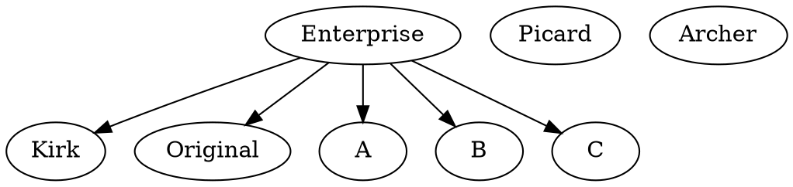

---
tags:
  - meeting
  - notes
---

# Meeting notes for autumn course 2022

## Current Teachers/TA

- [name=Lars Eklund], <lars.eklund@uppmax.uu.se>(Software development and modular programming)
- [name= Björn Claremar], <bjorn.claremar@uppmax.uu.se>(Introduction and Git)
- [name=Marcus Lundberg],<marcus.lundberg@uppmax.uu.se>(Algorithms and Datastructures)
- [name= Matias Piqueras],<matias.piqueras@uppmax.uu.se>(TDD examples and github actions)
- [name=Richèl Biderbeek], <richel.bilderbeek@uppmax.uu.se> (TDD)
- [name=Jon Ander Novella],<jon.novella@nbis.se> (Social coding)

## Participation List

- Lars Eklund, <lars.eklund@uppmax.uu.se>
- Björn Claremar, <bjorn.claremar@uppmax.uu.se>
- Jonas Söderberg, <jonas.soderberg@scilifelab.se>(as student)
- Diana Iusan, <diana.iusan@uppmax.uu.se>
- Pavlin Mitev, <pavlin.mitev@uppmax.uu.se> (as student)
- Jon Ander Novella, <jon.novella@scilifelab.se>
- Douglas Scofield
- Marcus Lundberg
- Martin
- Per

## Helper schedule

We need someone each day to administer and answer questions on HackMd. Please fill in your name for the days where you can help

| Day  | Topic | Helpers morning |Helpers afternoon |
|-------------- | -------------- | -------------- |--|
| Monday   | Intro | Lars|Lars|
| Tuesday   | Algorithms and data structures |Matias, Lars|Lars, Björn  |
| Wednesday    | Paradigms | Lars, Björn |Lars |
| Thursday    | Testing | Lars, Matias, Björn |Lars |
| Friday    | Optimization | Lars, Björn | Lars|


## Prerequisites

`https://github.com/UPPMAX/programming_formalism/blob/main/setup.md`


## Participaton List meeting 5 (13 Oct)

- Björn
- Lars
- Matias
-

### Links

- General
    - <https://github.com/UPPMAX/programming_formalism>
- Intro
    - <https://uppmax.github.io/programming_formalisms/>
- Test driven design
    - `Broken link to a TDD repo of https://github.com/MatPiq`
- Link to the previous instance of the course
    - <https://uppsala.instructure.com/courses/69215>


### Björn's questions for Intro day

- UML seems to require that I talk about Object orientation as well
    - How much?
    - I will cover it in detail during the Paradigm as it is very important to understand the concepts of object orientation inorder to grasp modern modularisation in my oppinion.
    - What do you cover in your lesson, Lars?
  [x] class+sequence+ aktivitetsdiagram
  [x] plantUML
  [ ] Flow (aktivitetsdiagram men lite annorlunda pilar och hörn etc...)

```flow
st=>start: HAS AN
OWNER AND
IS OPEN!
e=>end: RESOLVE
op=>operation: ASSIGN
AGAIN
op3=>operation: SET
"NOBODY",
MAKE
MARCUS
AWARE
op4=>operation: WAIT
op5=>operation: STALL
AND
COMMENT
op6=>operation: RESOLVE
BUT
COMMENT
op7=>end: DONE
op8=>operation: NEW TICKET OR JIRA

cond=>condition: CAN
I
RESOLVE?
cond2=>condition: AWAITING
USER
INPUT?
cond3=>condition: AWAITING
EXTERNAL
INPUT?
cond4=>condition: REQUEST
SOLVED?
cond5=>condition: WORK
NEEDED
INTERNALLY?

st->cond->cond2
op3->op
op4->cond
op6->cond5
cond(yes)->cond2
cond(no)->op3
cond2(yes)->cond4
cond2(no)->cond3
cond3(yes)->op5
cond3(no)->e
cond4(yes)->op6
cond4(no)->op4
cond5(yes)->op8
cond5(no)->op7
```




```plantuml
start
if( HAS AN
OWNER AND IS OPEN) then(yes)
 if (CAN I RESOLVE) then
 if (waiting user input) then
 elseif (condition D) then (yes)
  :Text 4;
else ()
  :Text else;
endif
stop
```

##

```plantuml
Actor -->(test)
```

```plantuml
User -> Authenticator : request
Authenticator -> User : respond <token>
```

## Participation List meeting 4

- Lars Eklund
- Matias (TDD)
- Björn (intro)
- Per Johansson (TDD)
- Jon Ander Novella ()

### Schedule

- Day1 Intro
    - SDLC
        - waterfall
        - cont I and D:s
    - version control
    - reproducibility
        - personal use to general use
        - dependencies
        - platforms
    - planning: UML
    - documentation
    -

- Day2 Algorithms+data structures
    - intro
    - storing
    - searching for things
    - sorting
    - BLAST
    - exercises
- Day3-4 Paradigms: design patterns, modular code
    - How?
    - Programming paradigms
        - SDLC and the models for the development process
        - overview
    - Modular programming
        - design patterns introduction to element of reusable software modules
        - what is module
        - common interface design
- Day4 TDD, testing
    - first look
    - types of tests
    - TDD in practice (afternoon 13:00-16:00)
        - Testing in Python with pytest
        - Automating testing with Github Actions
        - Putting it all together
        - "Advanced" topics
- Day5 Optimization: halvdag...?


## Participaton List meeting 3

- Lars Eklund
- Matias
- Björn
- Marcus


### Status Intro by Björn

- Different types of Scientific software:

    - Your analysis of data
        - statistics
        - figures
        - visualization
    - tools for process data
        - many bioinformatics tools
    - workflows
    - modelling (3D or mimic of nature)
    - Web-service e.g. "decision assistant"
    - Distributed package vs. one-time usage

- I'm learning about SDLC
    - I'll arrange for 15 min summary
    - Partly applicable on data (standards, versioning, technical)

    - intro like history, take aways from:
        - **OK korta ned...**
        - **waterfall**
        - **spiral model**
        - RUP (Lars har erfarenhet)
        - DSDM (dynamic system development method)
        - FDD (feature-driven development)
        - Crystal method
        - Scrum
        - Lean
        - Kanban
        - Extreme Programming
            - pair programming
            - TDD
        - Spotify
        - DevOps
            - continous Integration, development and deployment
        - CMMI (Capability maturity model integration)
        - Six Sigma
        -
- Input from CR course
    - dokumentation
        - in-code (less needed if good functions names)
        - readme
        - kort om sphinx
    - git/github (exercise)
    - recording dependencies/packages
        - NOT computational steps
        - Reproducibility: We can control our code but how can we control dependencies?
        - 10-year challenge: Try to build/run your own code that you have created 10 (or less) years ago. Will your code from today work in 5 years if you don’t change it?
        - Dependency hell
    - briefly about social coding
        - NOT licensing?
    - testing
        - intro (how much?)
            - defensive programming?
            - unit tests?
            - integration
            - regression
            - TDD
            - continuous integration
        - github actions
    - modular code
        - intro
    - UML
    - pseudokod
    - Concepts are included in each subsession
        - but can be summarised in a summary session first day


## Participaton List meeting 2

## Teachers

- Lars Eklund
- Marcus Lundberg
- Björn
- Diana

## Advertising text for the SNIC training newsletter

Programming Formalism Course - October 24-28 (online)

This full 5-day course aims to give life scientists, bioinformaticians, and other scientists with some experience in programming and scripting an understanding of the underlying principles of software development, design, and programming. The course aims to strengthen the understanding of more advanced programming concepts, ability to produce more reusable scripts through modular programming and to enable a better understanding of how to evaluate a script or programs performance.

We will cover an introduction to Algorithms and Data structures, Programming Paradigms especially structured and object oriented programming, and to give an overview of other paradigms like functional programming. Modular development and (code) reusability, testing and optimisation.

We will cover theory with bridging practical examples and applications to enhance the theoretical understanding of the principles.

For more information and registration, please visit: `[broken link to Programming Formalisms course at UPPMAX website]`


## Contributors

/*any one interested in helping out. Please add name and email*/

- Tomas Reed (<tomas.reed@liu.se>)
- Jon Ander Novella (<jon.novella@scilifelab.se>)

## Format and length

- Full days, online 9-16
- Lectures/seminars and "homework" exercises
- Morning recap+semin
- Afternoon exercise
- pair teaching
- single for more theoretical parts
- Toy project that is built-upon thought the course, possibly as examination too
- Breakout rooms
- assignments and quizzes
- Menti for interaction

## When? (month at least!)

- late October, week 43 oct 24-28


## Goal

"Turning scripters into computer scientists"
Add theory to bolster already present practical skills

## Expectations

- Code efficiency, speed
- Code accuracy, correctness of results
- Availability and sharability
- understanding of development concepts

## Prerequisites

- Decent scripting skills
- What is a skilled scripter.. coder

## Material

- <https://uppsala.instructure.com/courses/69215>

## Topics

- other languages and ways of understanding which is usefull
- Documentation
    - part of all modules?
- "Project" in pseudocode over all week
    - updated with new parts every day under source control
- Formalism of breaking down the problem
- Use Practical problems as introducing the complexities

### Which modules

- Setup meeting before course start
    - reminders of deadlines
- Introduction (including source control) [name=Björn] 1d
    - focus on the **concepts**
        - parts already in other courses, so just recap of this
        - like: <https://nbis-reproducible-research.readthedocs.io/en/course_1911/>
    - SDLC intro software development lifecycle 15 min
    - waterfall, spiral
    - source control
        - git as example
        - collaborative sharing (github)
        - (peer programming:  non-real-time co-operation)
    - reproducible research? (canvas course)
        - recording dependencies etc...
        - "social coding"
    - development cycle?
        - ex. maintenance
        - code management plan!
        - for project applications?
    - Exercises for this part?
        - sketching the project flow.
        - adding source control?
    - Introduction to UML:
        - introduction to flowcharts
    - Educational outcome course
    - sorting out the concepts
        - Peer programming is QC/QA collab sharing
        - Pair programming is real-time development teqch to increase  algorithm implementation, pass off, introduction
        - Agile development, the Agile manifest (Not a full process)
        - OOSE-like Rational Unifed Proces
        - TDD
- First day exercises:
    **(a short paragraph or two)**
    - What do you mean with:
        - scripts?
        - programming?
        - software development?
        - algorithm?

- Algorithms and datastructures ([name=Marcus]) 1d
    - aspect of complexity of algorithms
    - common algorithms
    - Big(O)
- Development  paradigms([name=Lars]) 1d
- 2h, Menti topics
      - - SDLC,RAD,RUP, Spiral model,(Funnel visualisation) [name=Lars]
            - Extreme Programming and Prototype driven development
       short historical overview.
     -MENTI FOR INTRaction
     development strategies and design strategies
- -UML Digagrams -20 min
- -UML exersise 10 min
    - functional programming(short intro to concepts)
    - Iterative/Declarative programming
    - object-oriented `[as intro to modular]` (Lars)
    - concept of classifiaction and classes as a means of compartimalisation
        - Concept of inheretance as a mean of propagating comonallity
-----LUNCH----
- Common development practices[name=Jon]
    - Choosing a software development methodology[name=Lars]
    - Social coding (<https://coderefinery.github.io/social-coding/social-coding/>)
    - Code reviews
        - Pair programming -two devlopers *driver and navigator*
        - Exercise: pair develop two of your algorithms from yesterday coding. Switching roles.
        - Present NBIS code development guidelines (<https://github.com/NBISweden/development-guidelines>)
        - Exercise: How to do code reviews?
- Modular programming and Design Patterns([name=Lars])2h Day 4
    - Comon interface
        - Objects as means to information hiding
        - Collections and Modules
    - collabortative development
        - Why are modules so important when working collaborativly
        - *One asset one file* , How to create an environment that promotes easy sharing of work.

- 1h
- Design Patterns([name=Lars]) 1h DAY 4
    - What is  a design pattern
    - Common design patterns and there applications       -
- Testing and TDD (Test Driven Design)([name=Per],[name=Matias] Practicals) 1d?
    - (sys Dev)
    - Peer programming (code review)
    - Checking others code, checking the module.
    - 13:00-16:00 Afternoon session TDD in practice: `[Broken link to matpiq's PF-TDD GitHub repo]`

| Time  | Topic   |
|-------------- | -------------- |
| 13:00-13:30    | Introduction to testing in Python |
| 13:30-14:00    | Automated testing using Github actions |
| 14:00-14:15    | Break |
| 14:15-15:00    | Putting it all together - code along |
| 15:00-15:30    | Exercises |
| 15:30-16:00    | Advanced Topics |

- Optimisation([name=Marcus])
    - right tool for the job
    - how formal should I be?
    - code optimisation
    - Benchmarking Profiler, timing

## Complementary course suggestions

// Courses that are useful in conjuction with this course

- Hackmd
- UML
- reproducable research

## Covered by other courses


## Next meeting

- Weekly teachers meetings of Programming formalisms for life scientists and bioinformaticians course is on Thursdays 11-12  on zoom,<https://uu-se.zoom.us/j/67602711000>
- Passcode: 880630

## Questions for the admissions form

Registration form: <https://docs.google.com/forms/d/1VpzwuZXEawPTtEjEUhY33a_afpBs4ioZulX9UqhdzSo/edit?usp=sharing>


- Name*?
    - short answer
- Email*?
    - short answer
- Affiliation?
    - short answer
- Briefly describe your background and experience in programming:
    - long answer

- Do you plan to follow the whole course
    - Yes/No
- What do you expect to learn in this course?
    - short answer / free form
- How did you learn about this course?
    - SNIC training newsletter
    - NBIS ...
    - UPPMAX website
    - colleague
    - other (free form)

## Participation emails

LE Paradigms, Introduction to formalised development

## References

[Bell, 2020] Bell, Mike. The fundamentals of teaching: A five-step model to put the research evidence into practice. Routledge, 2020.
[Hattie, 2008] Hattie, John. Visible learning: A synthesis of over 800 meta-analyses relating to achievement. routledge, 2008.
