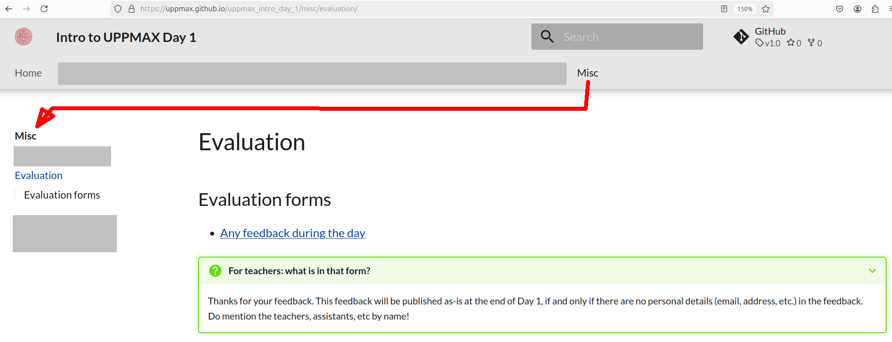
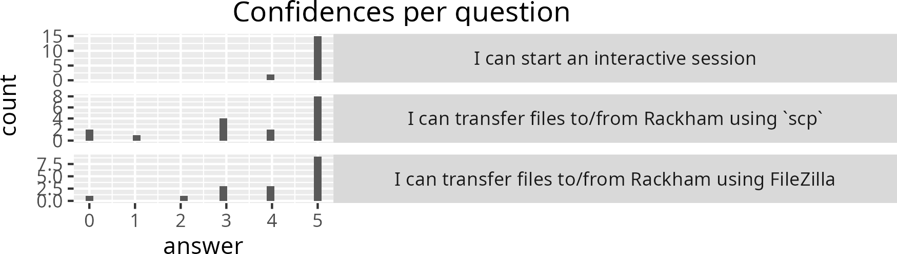
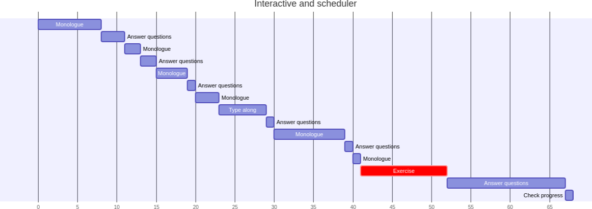
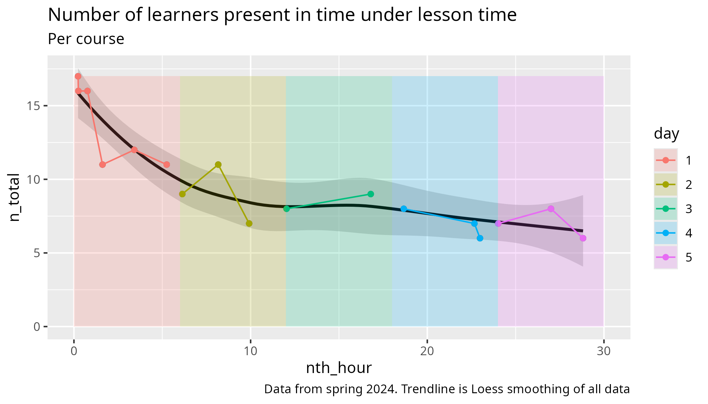
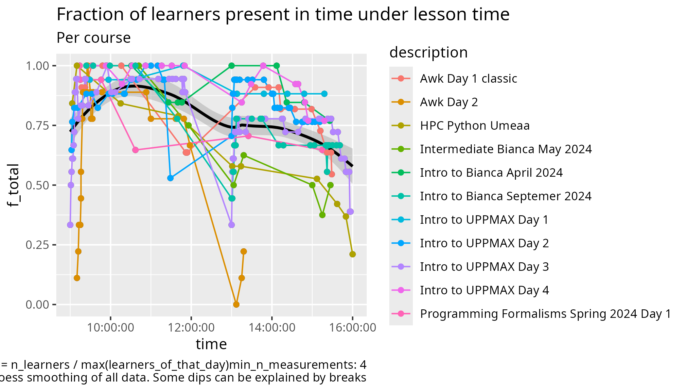

---
tags:
  - meeting
  - notes
---

# Meeting notes 2024-10-10

- [#51](https://github.com/UPPMAX/programming_formalisms/issues/51)
  Discuss the NBIS survey per point, at
  <../misc/evaluation.md>
  (note the final version will be a regular Google Form).
  What do we think about this?
    - R: I think its goal 'to find out how participants have used the skills and
    knowledge they gained through participating in the NBIS course' is
    irrelevant and the survey asks way more than just achieving that goal.
    Due to its vague, irrelevant goal and its many nice-to-have questions,
    I think it is way too extensive and we should not bother our learners with
    it.
    The only question I'd keep is 'Any other comments?', but I'd agree on using
    '7. Would you recommend the course?' and
    '8. What is your overall rating for the course?' too.
    - B: If NBIS wants it, can we say no?
        - But sure, most questions can be included in a web form after course.
        - I think all questions should be covered at least somewhere.

- Evaluation procedure: Do and how do we enjoy evaluation and feedback?
    - Use a daily retrospect yes/no
        - [VOTED] Y: LB
        - N: R
    - Use the original/unmodified NBIS survey at the end yes/no
        - Y:
        - [VOTED] N: BLR
    - Use a modified NBIS survey at the end yes/no
        - Y:
        - Neutral: B
        - [VOTED] N: LR --> R will discuss
    - Use a place for anonymous feedback yes/no, only read at the
    end of the day (see below for screenshot)
        - [VOTED] Y: BLR [#75](https://github.com/UPPMAX/programming_formalisms/issues/75)
        - N:
    - Use a daily confidence report (see below for screenshot) yes/no
        - [VOTED] Y: BLR
        - N:

- [ ] [VOTED] Lars gets to do an evaluation/retrospect/confidence at the end of the days

> An example place for anonymous feedback, from
> [Intro to UPPMAX Day 1](https://uppmax.github.io/uppmax_intro_day_1/misc/evaluation/).

> An example partial confidence report

- R: go through the Issues
    - Done!
- B: should I mention modularity and functional programming in the intro?
    - Yes:
    - No: LR
- B: should examples be related to the project?
    - LR: preferably yes, or minimal
    - R volunteers if input is needed
- [OBSOLETE] R: we have no Retrospects scheduled. I feel no need to, because I am
  not Jon. Do we remove Retrospects (and maybe replace these)?
  If yes, who does them?
    - Remove retrospects: R
    - Keep retrospects:

- R: I miss having a video of lectures I teach for own private usage,
  such as making activity diagrams (see below)
  I can do a screen recording from my own computer and keep it someplace
  private. How to do this responsibly?

> Activity diagram of 'Intro to Bianca' on file transfer

> Activity diagram of 'Intro to Bianca' on interactive and job scheduler

> Activity diagram of 'Intro to Bianca' on legal aspects of sensitive data

- R: in all iterations of the course, we lost a substantial amount of learners.
  Below is a plot of last course's iteration.
  In the evaluations it was noted 'The course was top-heavy' (quote
  below, from [source](https://github.com/UPPMAX/programming_formalisms/blob/main/shared_documents/2023_autumn/day_5.md#what-can-we-improve-1)).
  Also, the amount of learners dropping out on day 1, especially at around 10:40,
  stands out (we had around 65% of the learners present, compare to around 90%
  on average).
  Will we change our approach for these first hours?
    - [VOTED] Björn will help us get more info in the first hour
    - B+L: Yes, we are changing the course already
    - B: maybe learners already knew about git
    - Hence, we don't know. Let's see next iteration
    - B: maybe it is learners finding out what the course is all about
    - B: would be great to know why people people
        - R: we have the anonymous postbox

> The coures was 'top-heavy'.
> The beginning (in my opinion) should be more interactive and with more
> utilities, like git, being taught.
> After the first day, then you can bring in more and more theory.

- Prepare evaluation thoughts of previous course
    - We are done with this: BLR
    - We need more time:

Next meeting will be at Oct 18th 9:00:

- Discuss schedule
- Discuss Issues
- (R prepares) Discuss NBIS Long Term evaluation
- Lars will think about the responsible recording question by Richel

