---
tags:
  - FAQ
  - Frequently asked questions
---

# FAQ

The frequently asked questions, about:

- [credits](#credits): can I get university credits for this course?
- [eligibility](#eligibility), i.e. when to join the course
- [preparation](#preparation)
- [course teaching](#course-teaching),
  i.e. how the course is conducted and ideas behind it

If your question is not answered here,
[contact us](../contact_us.md) :+1:

## Credits

## Can I get University Credits for this course?

No.

We don't give formal credits for the course.
That is up to your supervisor.
You can ask for a certificate after the course that helps with the decisions.

## Eligibility

## I have never programmed before. Am I eligible?

Not yet (for your own good)!

This is not an introductory course on programming.
Learners are expected to know basic programming
concepts, such as variables and functions.

In this course, you will work together a lot.
It will be likely to be noticed that
you do not have programming experience yet,
and you may feel bad about that.
Take an introductory programming course first
and then we hope to see you here again!

## I am a non-Python programmer. Am I eligible?

Yes.

In the course, we will use Python as the workhorse language,
as most of our learners have experience with Python.

You will write code in Python in exercises.
To make that possible for non-Python programmers:

- code will be simple and/or copy-pasted
- learners are usually paired up,
  so that usually one of the learners knows Python.
- you may use a web search and/or AI to write (non-test) Python code:
  this course shows how to make sure that that code is correct

## Preparation

## How do I prepare?

See [prerequisites](../prereqs.md) for how to prepare.

## Prerequisites

## How do I install VS Code?

[Download VS Code from its homepage](https://code.visualstudio.com/download).

## How do I know I have VS Code installed?

You know if you have VS Code installed,
if you can start the program.

???- question "How does that look like?"

    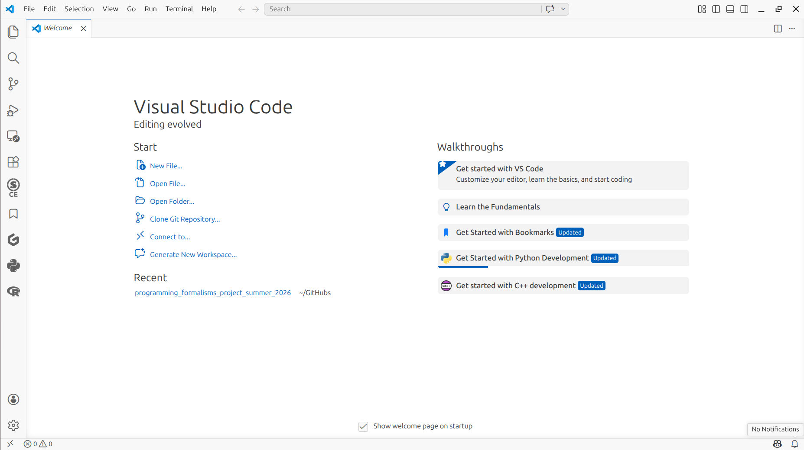

## How do I install Git on my computer?

You have Git installed when you have VS Code installed.

## How do I know I installed Git on my computer?

Start VS Code.

???- question "How does that look like?"

    

If you see the 'Source control' panel at the left,
you can assume Git is installed.

???- question "Where is that panel?"

    It is at the left side of the screen

    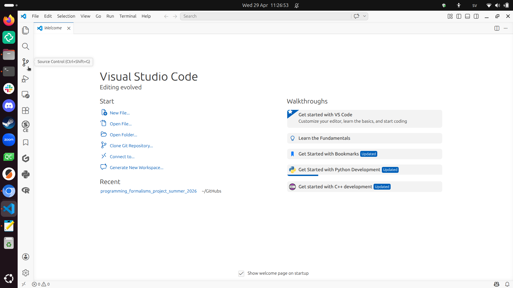

If you want to be really sure, then, follow the rest of the procedure.

In VS Code, create a new terminal.

???- question "How does that look like?"

    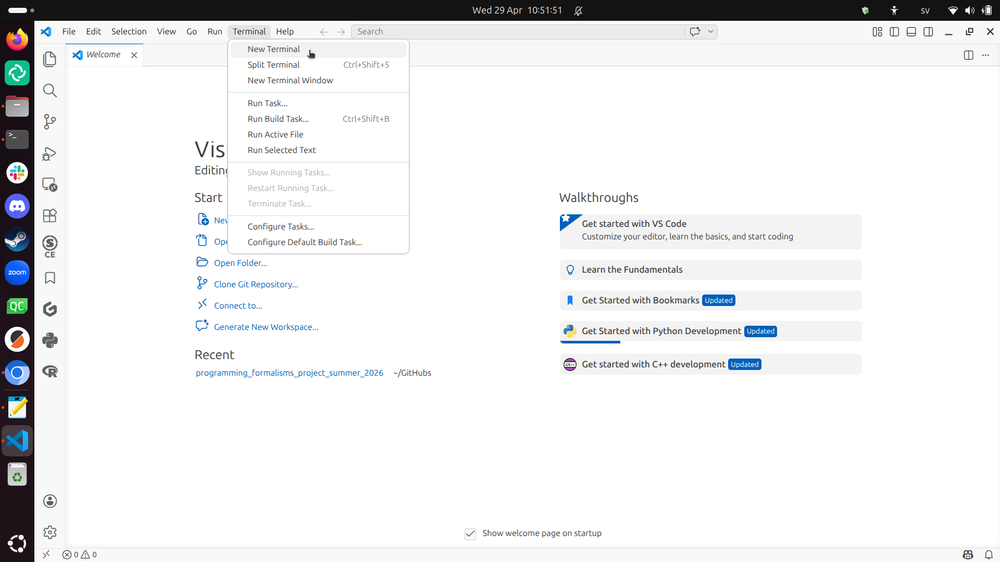

In the VS Code terminal, type:

```bash
git --version
```

You should see your Git version.

???- question "How does that look like?"

    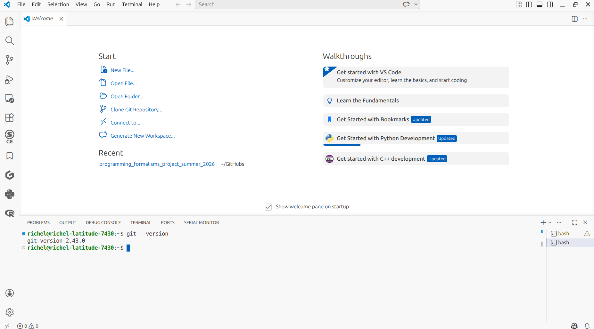


## How do I configure Git on my computer?

Git is already configured on your computer.

You can consider to configure Git to ask you for a password every 10 hours.
If you enjoy this, these two lines needed to be copy-pasted
into a terminal:

```bash
git config --global credential.helper cache
git config --global credential.helper 'cache --timeout=36000'
```

Besides that, Git does indicate clearly when it needs you to make a
choice: read what it states and then pick your favorite choice.

Regardless, below are some choices Git wants you to make.

Upon a commit, Git needs to know who you are.
Below is an example of the two lines needed to be copy-pasted
into a terminal:

```bash
git config --global user.name "Mona Lisa"
git config --global user.email "mona_lisa@gmail.com"
```

Upon a merge, Git needs to know how you want to do so.
Below is an example of the recommended choice
to what needed to be copy-pasted into a terminal:

```bash
git config --global merge.default merge
```

Upon editing a file, Git will use a text editor.
By default, Git uses the `vim` editor.
Below is the command to use VS Code instead.

```console
git config --global core.editor "code --wait"
```

## How do I know I have Git configured on my computer?

You already have.

## How do I get a GitHub account?

Go to [the GitHub homepage](https://github.com/).
and click on 'Sign up' at the top right.

The free account is good enough for this course.

## How do I know I have a GitHub account?

Go to [the GitHub homepage](https://github.com/)
and click on 'Log in' at the top right.

If you pass the login screen (you will be asked your username
and password), you know you have a GitHub account.

## How do I configure my GitHub account?

Your GitHub is already configured.

<!--

You can consider to connect Git and GitHub in a nice way,
see [Git–GitHub connection through ssh keys](faq.md#gitgithub-connection-through-ssh-keys)

-->

## How do I install Python?

There are many ways.

[The 'Python' VS Code documentation](https://code.visualstudio.com/docs/languages/python)
documents this well.

## How do I know if I have Python installed?

By checking its version.

In VS Code, create a new terminal

???- question "How does that look like?"

    

In the VS Code terminal, type:

```bash
python --version
```

If you see your Python version (i.e. not an error message),
Python is installed.

???- question "How does that look like?"

    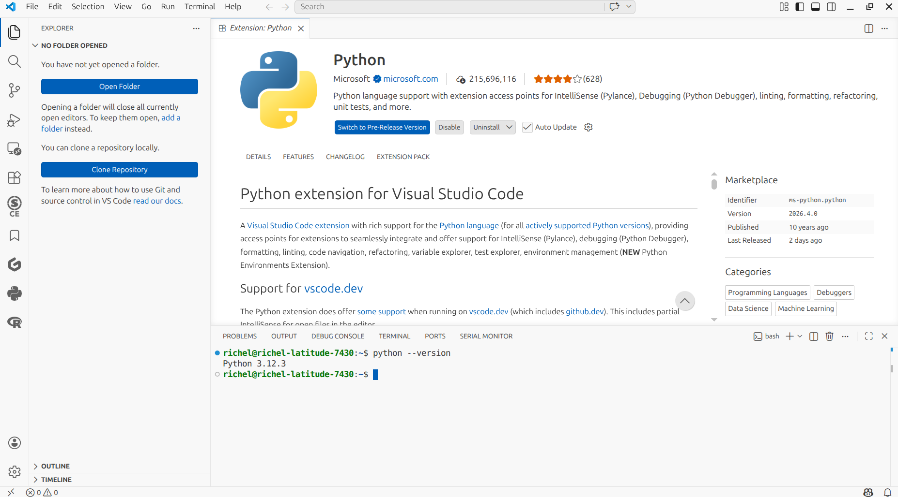

## How do I run Python from VS Code?

You need to install the Python extension in VS Code.
Here is a step-by-step guide.

In VS Code, click on the 'Extensions' panel.

???- question "Where is that panel?"

    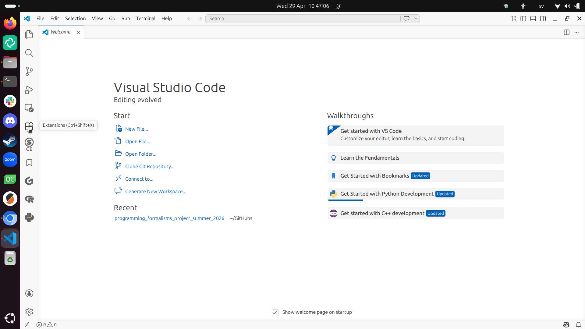

???- question "How does that look like?"

    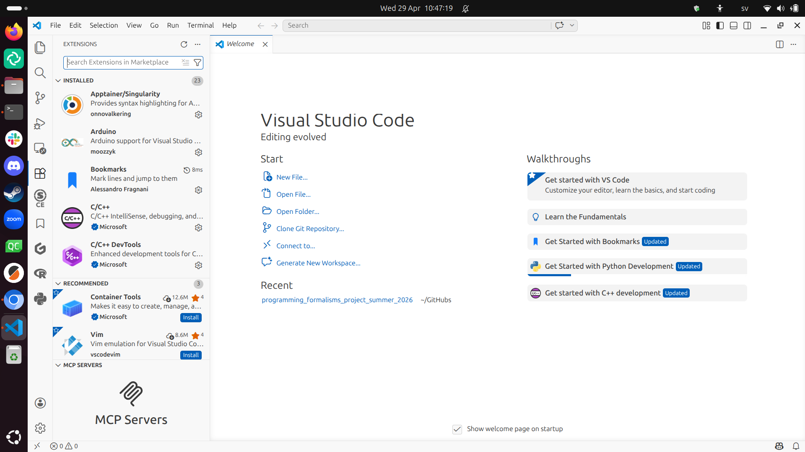

In the 'Extensions' panel, type 'Python' in the search box.

???- question "How does that look like?"

    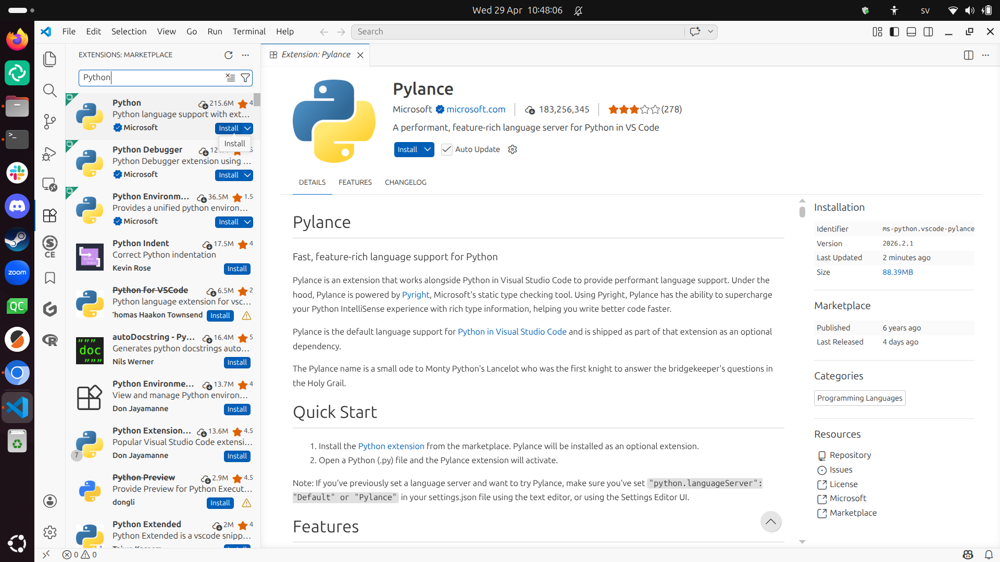

In the search results, click on 'Install' of the first result.

???- question "How does that look like?"

    

You should now see that the Python extension is installed.

???- question "How does that look like?"

    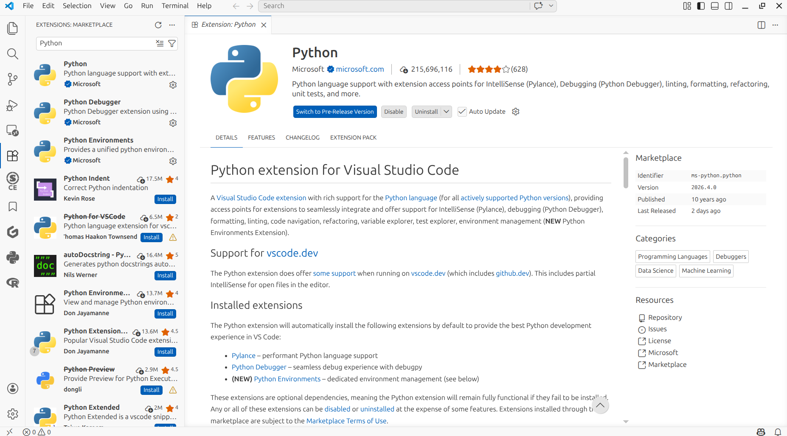

## How can I check that I can run Python from VS Code?

By running a minimal Python script from VS Code.
Below is the procedure to do so.

In VS Code, click on 'File | New file'

???- question "How does that look like?"

    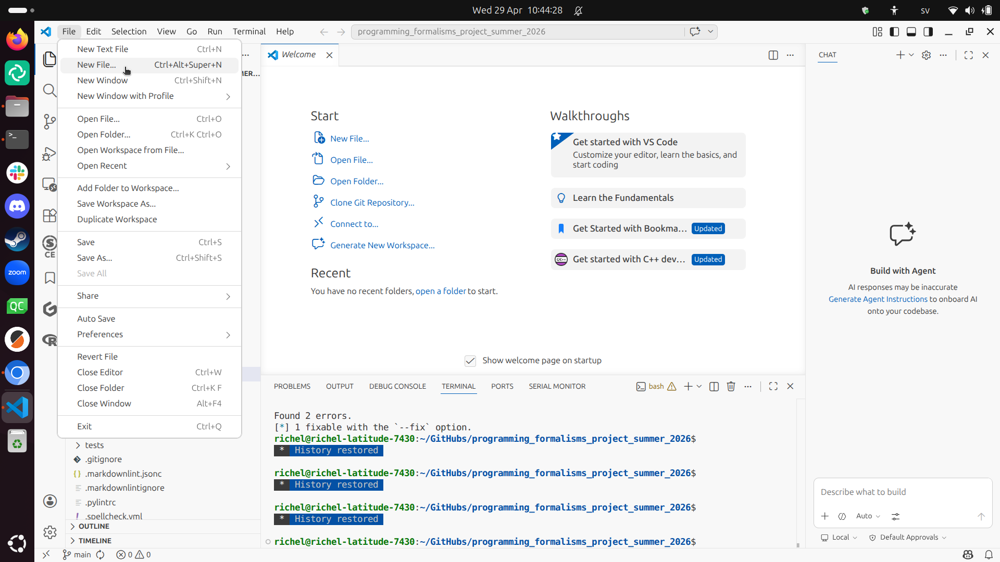

Type the file name `hello_world.py`.

???- question "How does that look like?"

    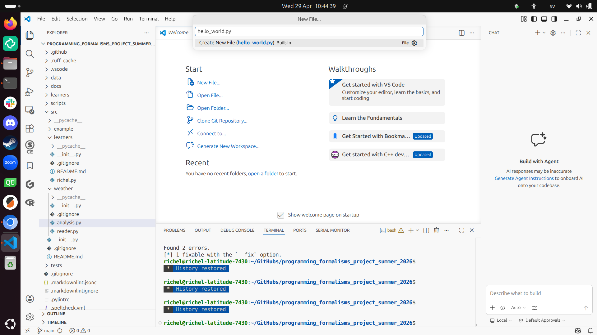

Save the to-be-created file somewhere.

???- question "How does that look like?"

    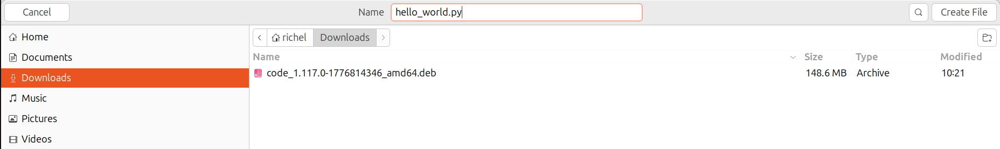

When the file is created, then VS Code offers to install a Python
extension if you have not done so yet. Do install that extension
when asked :-)

???- question "How does that look like?"

    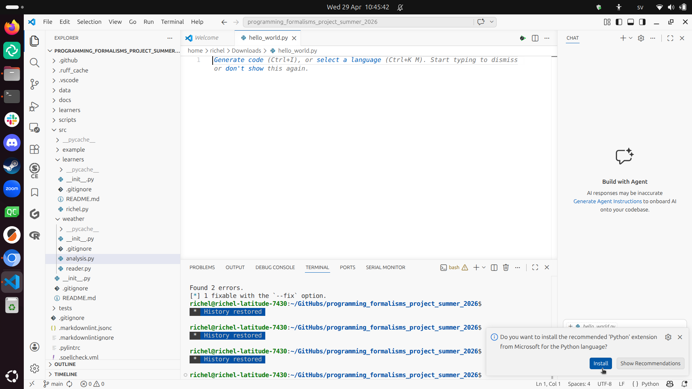

Copy-paste the following code into your Python script:

```python
print("Hello world")
```

???- question "How does that look like?"

    'Run' is at the top-left of your screen.

    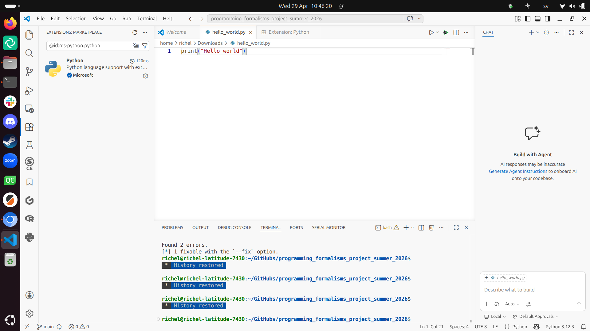

Click on 'Run'.

???- question "How does that look like?"

    'Run' is at the top-left of your screen.

    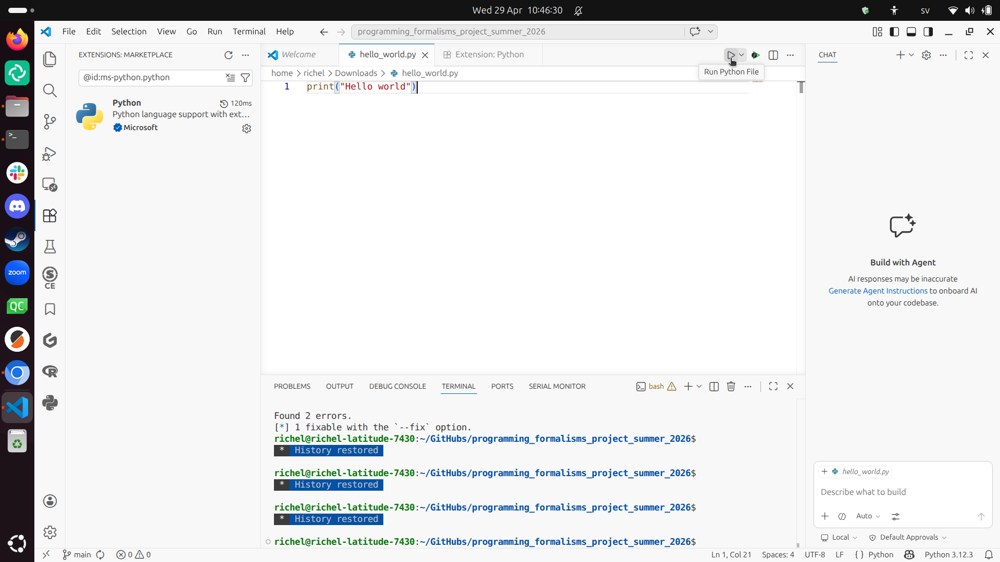

If the program shows 'Hello world', you can run Python from VS Code.

???- question "How does that look like?"

    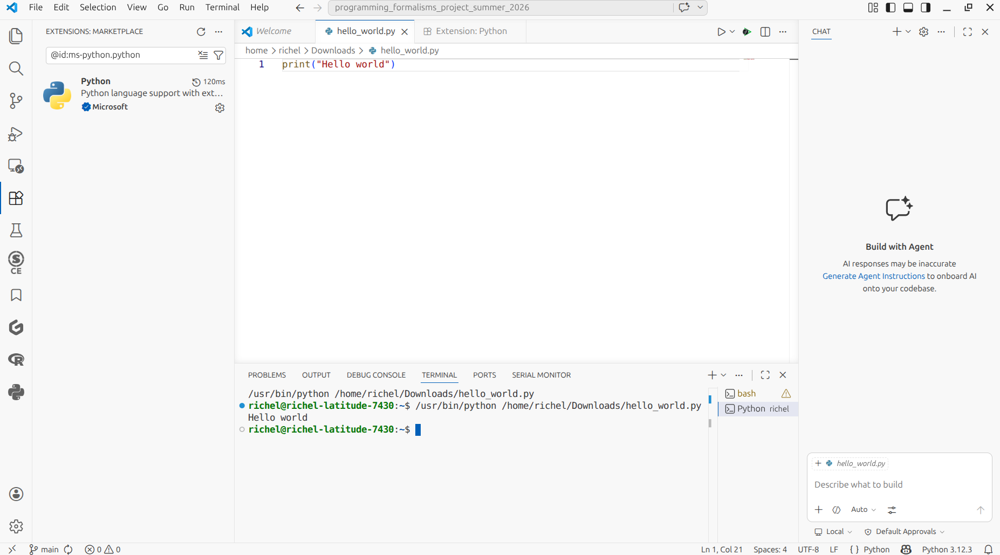

## How do I know that I know the basics of Python?

You know enough basic Python, if:

- You can describe what a variable is
- You can change the value of a variable
- You can show the value of a variable on screen

If you do not know enough Python,
[chapters 1 and 2 of 'How to Think Like a Computer Scientist'](https://openbookproject.net/thinkcs/python/english3e/index.html)
is all you need.

## Why do you use VS Code?

Because it ...

- is free (as in beer)
- works on all operating systems
- has plugins that are easy to install to develop Python code as part of a Python package
- has version control built-in
- has a built-in terminal

## Can I use PyCharm? Or IDLE? Or any other IDE?

Yes.

However, we may not be able to help you with your IDE problems.

Within your IDE, you will need:

- To develop Python code as part of a Python package
- To use Git for version control

## How do I know I have a good Zoom setup?

You have a Zoom good setup, if:

- you can talk freely. If not, find a room/place where you can.
- others in the Zoom room can clearly hear what you say.
  If not, use a microphone.
- you can clearly hear what others in the Zoom room say.
  If not, use a headset.


## Do I really need a good Zoom setup?

Yes.

You will be working together with other learners a lot.
Not being able to talk and/or share your screen and/or
your camera is likely to make you feel excluded.

<!--

RJCB: this is already described, more concise and with more screenshots 

## Some installation and configuring procedures

#### Git Bash

- Version >= 2.28 would do

=== "Windows"

    There are several different ways to run the course material on a Windows computer. Neither is perhaps optimal, and the material itself has not been adapted specifically for Windows. Nevertheless, in principle everything *should* be possible to run. A few ways you could setup:

    **Git-windows with a command line and Git integrated**

    - Install Git Windows: [https://gitforwindows.org/](https://gitforwindows.org/?to=/placeholder.com) (**easiest if you want to start fast and plan to work in windows environment**)

        - Follow the setup insctructions from the Windows part at [https://coderefinery.github.io/installation/git-in-terminal/](https://coderefinery.github.io/installation/git-in-terminal/) by CodeRefinery.
        - Included will be the **Git Bash**

=== "MacOS"

    - We use [the VSCode built-in terminal](https://github.com/UPPMAX/programming_formalisms/issues/83) to some extent
    - Choose one of your choice, the built-in or another!
    - Chances are big that you already have **git installed on your computer**.
    - You can check by running e.g. `git --version`.
        - and if it reports 2.28 or higher, then you are good.
    - If you have a very old version of git or you don't have it,
      install it following
      [the git MacOS download instructions](https://git-scm.com/download/mac)
        - You may have to do `xcode select --install` from the Mac terminal.

=== "Linux"

    - `git` comes installed with all Linux distributions
    - To install `git`, do `sudo apt-get install git`

-->

<!--

RJCB: Thiis is put in the git configuration section

#### Using VS Code as a git editor

- When Git is installed you may need to restart a shell in VS code before it works.
- This will set VS Code as the editor that Git starts.
- It will start a new tab, and Git will wait until you save and close that tab.
- Git for Windows on Windows may automatically set this if you select it as an editor.
- Otherwise:

```console
git config --global core.editor "code --wait"
```

-->

<!-- 

RJCB: Put a simpler alternative in the git configuration section

#### Git–GitHub connection through ssh keys

(This may take a while to get working, but is worth it)
[https://coderefinery.github.io/installation/ssh/](https://coderefinery.github.io/installation/ssh/)

- Test: `ssh -T git@github.com`
    - Output should be something like this: ``Hi bclaremar! You've successfully authenticated, but GitHub does not provide shell access.``
- If not working, these are the approximate steps to be done in your terminal. It can vary between systems, so link above is more certain.

```console
ssh-keygen -t ed25519 -C "<email address for your GitHub account>"
eval "$(ssh-agent -s)"
ssh-add ~/.ssh/id_ed25519
```

- For WINDOWS

```console
# Copy the SSH public key to your clipboard.
clip < ~/.ssh/id_ed25519.pub
```

- On Mac, use ``pbcopy`` instead, like:

```console
# Copy the SSH public key to your clipboard:
pbcopy < ~/.ssh/id_ed25519.pub
```


- Then go to your GitHub account on the web.

    1. In the upper-right corner of any page, click your profile photo, then click Settings.
    2. In the "Access" section of the sidebar, click SSH and GPG keys.
    3. Click New SSH key or Add SSH key.
    4. In the "Title" field, add a descriptive label for the new key. For example, if you're using a personal laptop, you might call this key "Personal laptop".
    5. Select the type of key **authentication**.
    6. In the "Key" field, paste your public key.
    7. Click Add SSH key.
    8. If prompted, confirm access to your account on GitHub.

- Now test again in your terminal: `ssh -T git@github.com`
    - Output should be something like this: ``Hi bclaremar! You've successfully authenticated, but GitHub does not provide shell access.``

- If there was a problem, confer the full article [Adding a new SSH key to your GitHub account](https://docs.github.com/en/authentication/connecting-to-github-with-ssh/adding-a-new-ssh-key-to-your-github-account).

-->

<!--

RJCB: what is actually needed is described at 'How to install Python'

#### Python

- Use what you already have
- If you don't have Python there are different ways to go. We won't use Conda during the lessons, for instance.
    - Bare python (recommended for the **"bare metal" user**)
        - You may need to install other packages (pip)
        - [install python](https://www.python.org/downloads/)
        - **note macOS**: the system install of Python on macOS is not supported, instead:
            - ``brew install python3``
    - Anaconda (recommended for **python/R developers liking GUI:s**)
        - **Count with 15-20 minutes**
        - includes
            - many many packages
            - conda packager
            - pip installer
            - GUI launchers, like example
            - jupyter notebook/lab
            - Spyder
            - RStudio
            - etc...
        - [install Anaconda](https://www.anaconda.com/download)
    - miniconda (recommended for **terminal user**)
        - **Faster to install**
        - Includes:
            - less packages than Anaconda, and no GUI launcher but:
            - conda packager
            - pip installer
            - etc...
        - [install Miniconda](https://docs.anaconda.com/miniconda/install/)

- In Linux and Bash, Python should work from the command line by typing ``python``/``python3`` or running a script with ``python <script>``/``python3 <script>``

-->

<!--

RJCB: described in the 'How to install the Python extension in VS Code

#### Python in VS Code

- Step 1. Install a supported version of Python on your system, see above.
- Step 2. Install the Python extension for Visual Studio Code from the left menu bar.
- Step 3. Open or create a Python file and start coding.
    - Example: make a hello.py script and run it with the "play" button.
    - Choose which Python interpreter to use.
- Step 4. To run Python from a VS Code terminal (Bash or other) you may have to restart the shell

-->

## Courses

[The 'Courses' section of the SCoRe user documentation](https://docs.score.nbis.se/courses/)
shows an overview of many courses.

Here we highlight some more courses:

- Git:
    - [NBIS](https://nbis-reproducible-research.readthedocs.io/en/course_2104/git/)
    - [Git by CodeRefinery](https://coderefinery.github.io/git-intro/)
    - [GitHub by CodeRefinery](https://coderefinery.github.io/git-collaborative/)
    - [NAISS](https://www.hpc2n.umu.se/events/courses/2024/fall/git)
- Python
    - The 'Python' part of the [NAISS 'Intro to HPC Python' Day 1](https://uppmax.github.io/naiss_intro_python/)
    - [Python programming with applications to bioinformatics](https://uppsala.instructure.com/courses/85913).

<!--

RJCB: We use the terminal from VS Code

## Other solutions

There are some other solutions for installations but they are probably not supported by the teachers of the course.

## Terminals

=== "Windows"

    There are several different ways to run the course material on a Windows computer. Neither is perhaps optimal, and the material itself has not been adapted specifically for Windows. Nevertheless, in principle everything *should* be possible to run. A few ways you could setup:

    **Git-windows with a command line and Git integrated**

    - Install Git Windows: [https://gitforwindows.org/](https://gitforwindows.org/?to=/placeholder.com) (**easiest if you want to start fast and plan to work in windows environment**)

        - Follow the setup insctructions from the Windows part at [https://coderefinery.github.io/installation/git-in-terminal/](https://coderefinery.github.io/installation/git-in-terminal/) by CodeRefinery.
        - Included will be the **Git Bash**

    **Other possibilities**

    - Use the **Windows 10 PowerShell**
        - [install git](https://git-scm.com/book/en/v2/Appendix-A:-Git-in-Other-Environments-Git-in-PowerShell)
    - Use the Linux Bash Shell (**WSL**) on Windows 10/11 (**perhaps best practice if you plan to run Linux as well**)
        - This will give you access to a full command-line bash shell based on Linux on your Windows 10/11 PC.
        - instructions below
        - For the difference between the Linux Bash Shell and the PowerShell on Windows 10, see *e.g.* [this article](https://searchitoperations.techtarget.com/tip/On-Windows-PowerShell-vs-Bash-comparison-gets-interesting).
    - Run as Linux through a **virtual machine** (and see the Linux setup above)
        - not shown

    **Install Bash on Windows 10/11 (WSL)**, following the instructions at *e.g.* **1** of these resources:

    - [Installing the Windows Subsystem and the Linux Bash](https://docs.microsoft.com/en-us/windows/wsl/install-win10)
    - [Installing and using Linux Bash on Windows](https://www.howtogeek.com/249966/how-to-install-and-use-the-linux-bash-shell-on-windows-10/)
    - [Installing Linux Bash on Windows](https://itsfoss.com/install-bash-on-windows/)

## Python from In Git-bash (Windows)

- Get it working from **Git Bash**
    - if the command ``type python`` gives you a path, then proceed
        - otherwise you may have to do a new installation
        - or find the path
        - if anaconda installation you may add something like this:
        - ``echo 'export PATH="<path/to/Anaconda/root>:<path/to/anaconda/root>/Scripts:$PATH:' >> .bashrc``
            - example:  ``/c/Users/bjcar425/AppData/Local/anaconda3:/c/Users/bjcar425/AppData/Local/anaconda3/Scripts``
    - ``$ alias python='winpty python.exe'``
    - ``$ python -V``
        - does it give you the python version 3-something?
- Make it permanent
 -``$ echo "alias python='winpty python.exe'" >> ~/.bashrc``

Parts taken from [https://nbis-reproducible-research.readthedocs.io/en/course_2104/setup/](https://nbis-reproducible-research.readthedocs.io/en/course_2104/setup/)

-->

## Course teaching

## What is the goal of the shared project?

See [Projects](../sessions/project/README.md) for the goal of the shared project.

## How is the course prepared?

- meetings
- lesson plans in the course material
- general lesson plans, which can be found at
  ['Misc } lesson_plans'](../lesson_plans/README.md)
  of this GitHub repository

## What happens to the retrospectives?

Retrospectives are:

- published online in unedited form at
  [the 'Misc | evaluations' section](../evaluations/README.md)
  of this GitHub repository
- discussed by the teachers after the lessons
- reflected upon, where the reflections can be found in
  [at 'Misc | Reflections'](../reflections/README.md)

## Why do you publish your retrospectives?

Because we like to be transparent.

## What happens to the evaluations?

Evaluations are:

- published online in unedited form at
  ['Misc | Evaluations'](../evaluations/README.md)
  of this GitHub repository.
- discussed by the teachers after the course
- reflected upon, where the reflections can be found in
  ['Misc | Reflections'](../reflections/README.md)

## Why do you publish your evaluations?

Because we like to be transparent.

## Why do you publish your reflections?

Because we like to be transparent.
