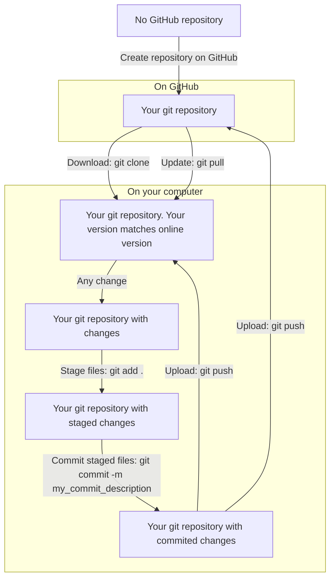
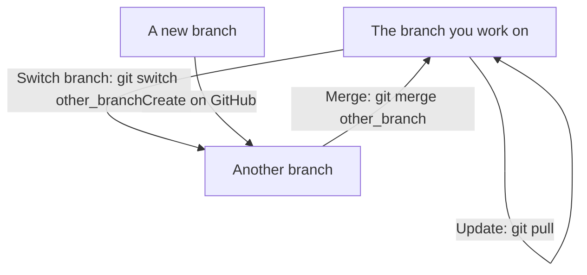

---
tags:
  - git
  - basic workflow
  - workflow with branches
---

# git

## git clone

???- question "Prefer a video?"

    [YouTube video 'Doing a (git) clone in VSCode](https://youtu.be/bcYFlBh9WUk)

## git basic workflow

???- question "Prefer a video?"

    - [YouTube video 'Doing a basic git workflow in VSCode](https://youtu.be/tiEbc6MDFo8)
    - [YouTube video 'Doing a basic git workflow in VSCode](https://youtu.be/gL8RvfhvJ2Q)
      (including a `git clone`)

## git workflow with branches

???- question "Prefer a video?"

    [YouTube video 'Doing git banching in VSCode'](https://youtu.be/rFo2b0GILIc)

