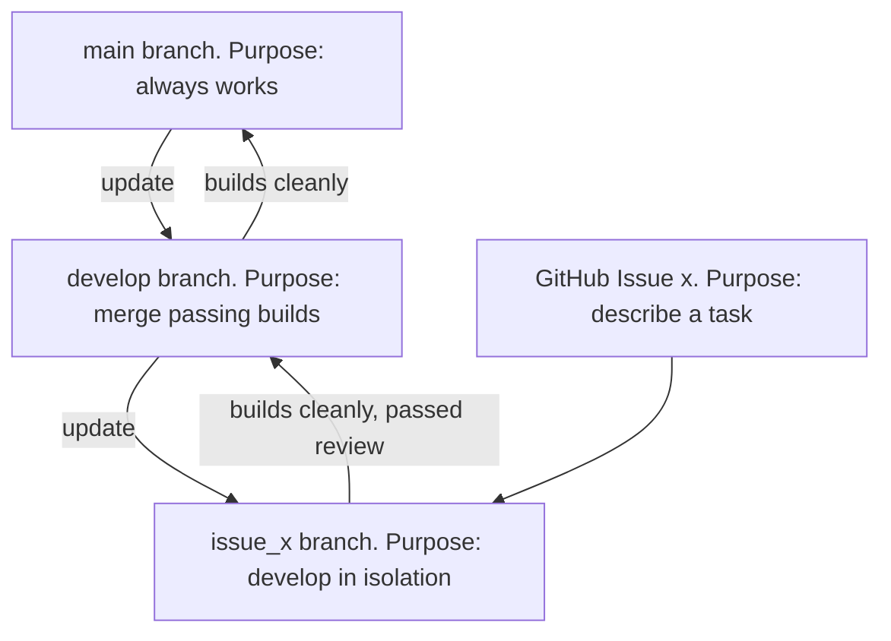

---
tags:
  - project
  - project workflow
  - code review
---

# Project workflow

There are many project workflows. Here are some:

<!-- markdownlint-disable MD013 --><!-- Tables cannot be split up over lines, hence will break 80 characters per line -->

`git` model                      |Code review|Features
---------------------------------|-----------|--------------------------------------------------------------------
`main`                           |No         |if `main` can be broken, also called 'trunk based development'
`main`, `develop`                |No         |if `main` needs not to be broken
`main`, `develop`, topic branches|No         |if `main` needs not to be broken and there are multiple contributors
`main`, `develop`, topic branches|Yes        |if `main` needs not to be broken and there are multiple team members

<!-- markdownlint-enable MD013 -->

In this course, we will scale up from the first to the last project workflow.

- [Overview of the git branches](https://youtu.be/trLafZpD1Tg?si=ZliLdIQ8KXDW7xjq)
- [Working with this git branching model](https://youtu.be/pM520_JLR6w?si=1pvh5uUjXFJPPqGZ)
- [Merge topic branch to develop with a code review](https://youtu.be/VexyXysb-BM?si=uCOuqCVuZ_ylsUtI)

## More basic GitHub workflows

1. [Modify README on main branch using GitHub web interface](https://youtu.be/xBH2xZoKof4?si=ohdG6-y8lzarSqIa)
1. [Modify README on topic branch using GitHub web interface](https://youtu.be/vPyHWsnbXw8?si=XjD6a3WDY44I97Se)
1. [Modify README on main branch using git](https://youtu.be/A85wZTiCMTc?si=oUyrg_53gVlqEanb)
1. [Modify README on topic branch using git](https://youtu.be/ZkfjAfu9Wo4?si=myBTkJ179n9fXHrS)
1. [Merge topic branch to develop yourself](https://youtu.be/1fKdU1m3Uug?si=qox0K-EdZ-tDpcRY)

## Project workflows

- [From design to feature](https://youtu.be/f-rzfZtsPKU)
- [Splitting up an Issues to smaller Issues](https://youtu.be/mhIBXfxVxIU)

### Phases

1. Create all classes
1. Create all has-a relations
1. Create all is-a-type-of relations

## Social

- [Pair programming](https://youtu.be/_DDRWjOfPu4?si=I84veWw9c7Mnq83p)
