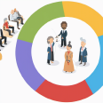
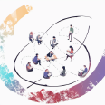

# Projects

In this course, we work together on a project.

The goal of having a project is to provide a situation in which the theory is 
experienced. For example, at the start, merging code together will give
some troubles. Later in the course, we learn how to avoid these troubles.
Making the learners experience which problems are solved by 
using professional workflows is the reason of having one project.

Team logo                                                                   |Link
----------------------------------------------------------------------------|---------------------------------------------------------------------------------------------------
|[Summer 2024](https://github.com/programming-formalisms/programming_formalisms_project_summer_2024)
            |[Example project](https://github.com/programming-formalisms/programming_formalisms_example_project)

## Former projects

Team logo                                                                   |Link
----------------------------------------------------------------------------|---------------------------------------------------------------------------------------------------
|[Autumn 2023](https://github.com/programming-formalisms/programming_formalisms_project_autumn_2023)
|[Summer 2023](https://github.com/programming-formalisms/programming_formalisms_project_summer_2023)
