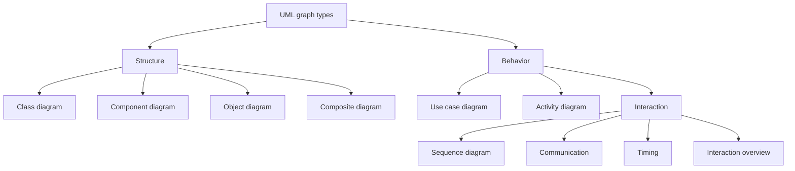
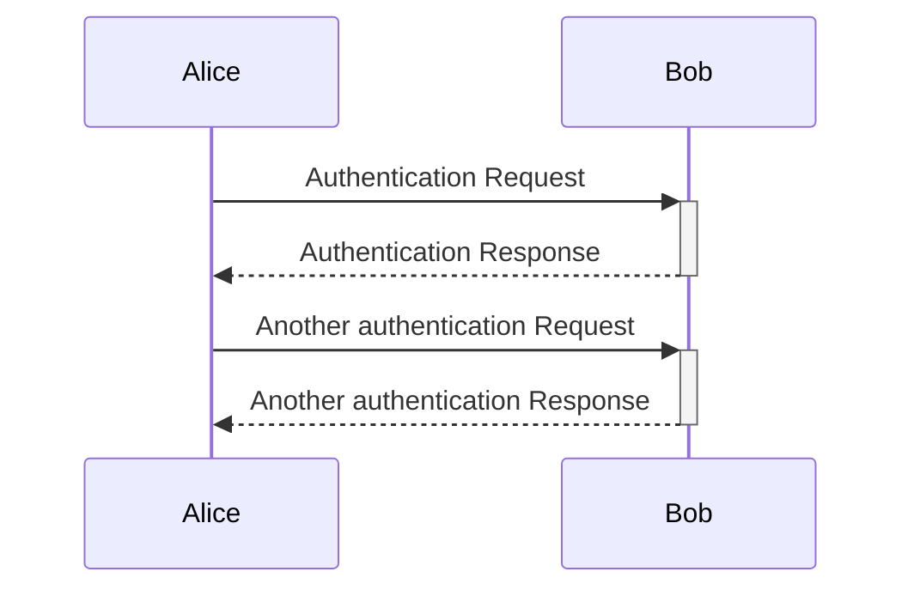
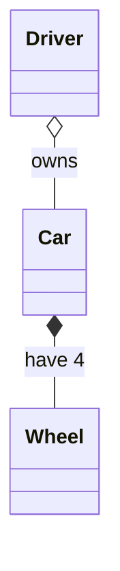
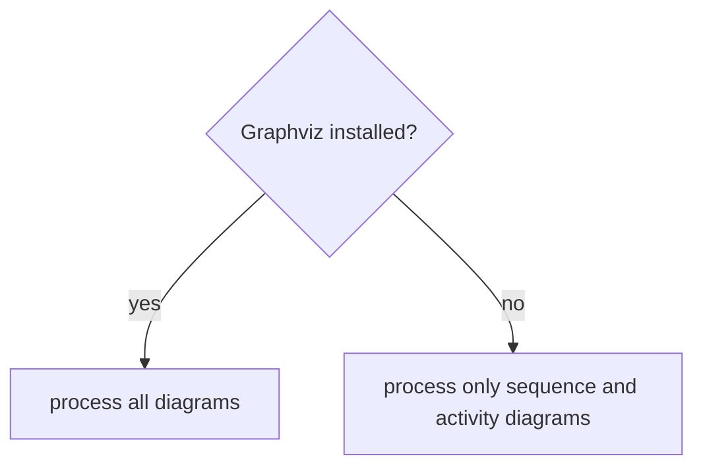
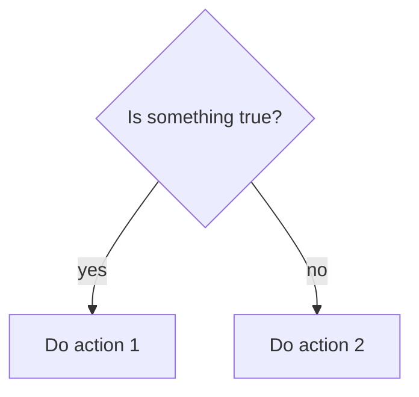

### Flowcharts or Unified Modeling Language (UML)

#### Tools

- PlantUML
    - Open-source
    - Can be integrated with IDE:s, Java documentation, Word
    - Scripts rather than drawing tools
    - requires plug-in to render in browser
    - <http://www.plantuml.com/plantuml>
- Graphviz
    - open source graph visualization software.
    - It has important applications in networking, bioinformatics, software engineering, database and web design, machine learning, and in visual interfaces for other technical domains.
    - <https://graphviz.org/>
- **Mermaid** used in this course
    - Open-source
    - Not as many diagrams
    - renders in browser without plug-ins
    - <https://mermaid.js.org/>
    - [Live editor](https://mermaid.live/)

**Types**



!!! admonition "We will in the course use"

    - Sequence
    - Activity/algorithm flowchart
    - Class diagrams

#### Sequence



Mermaid code

```text
sequenceDiagram
    Alice ->>+Bob: Authentication Request
    Bob-->>-Alice: Authentication Response
    Alice->>+Bob: Another authentication Request
    Bob-->>-Alice: Another authentication Response
```

#### Class

 A diagram that shows the system classes and relationships between them.



Mermaid code

```text
classDiagram
    Driver o-- Car : owns
    Car *-- Wheel : have 4
```


#### Activity

A flowchart that shows the process and its correlating decisions,
including an **algorithm**  or a business process.



Mermaid code

```text
flowchart TD
  is_installed{Graphviz installed?}
  is_installed --> |yes| process_all[process all diagrams]
  is_installed --> |no| process_sub[process only sequence and activity diagrams]
```

#### Algorithm flowchart



Mermaid code

```text
flowchart TD
  condition{Is something true?}
  condition --> |yes| is_true[Do action 1]
  condition --> |no| is_false[Do action 2]
```

!!! info "shape of boxes etc in flowchart and state diagrams "

    - initial state (small circle)
        - ``[*]``
    - end state (small solid-filled circle)
        - ``[*]``
    - state (rectangle)
        - ``A["text"]``
    - activity (rounded recatngle)
        - ``A("text")``
    - choice (diamond)
        - ``A{"text"}``
    - arrow
        - ``-->``

    - Other syntax: <https://mermaid.js.org/ecosystem/tutorials.html>
