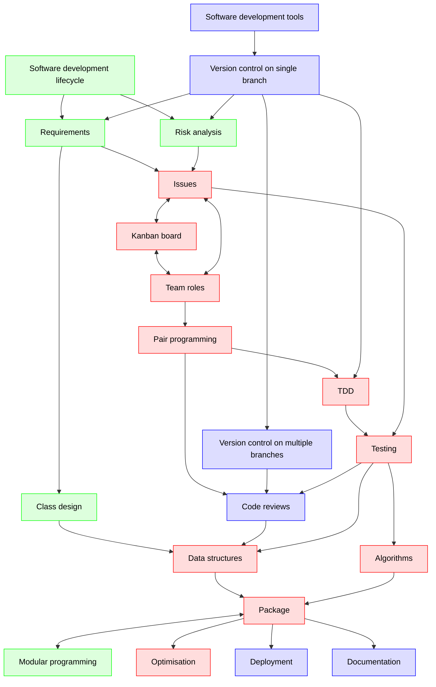

---
tags:
  - wrap-up
  - wrap up
  - conclusion
  - summary
---

# Wrap-up

!!!- info "Learning objectives"

    - Remember what the course was about

## Why?

!!! note "Course mottos"

    - Turning scripters into computer scientists
    - Add theory to bolster already present practical skills

To determine if the course mottos have held.

## Course overview

> Overview of the course.
> Red: Richel.
> Green: Lars.
> Blue: Björn.
