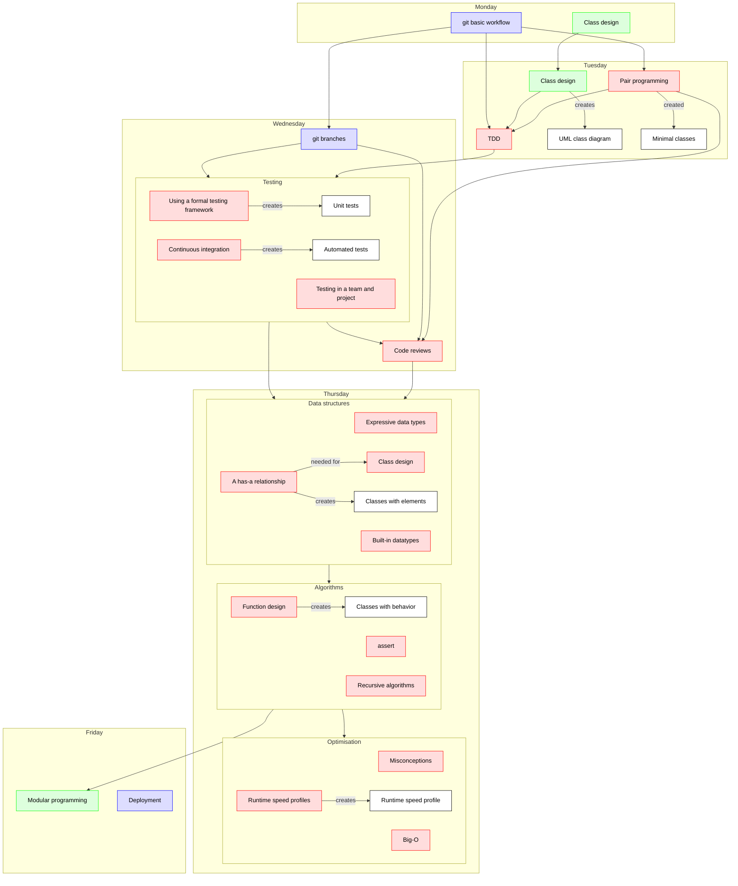
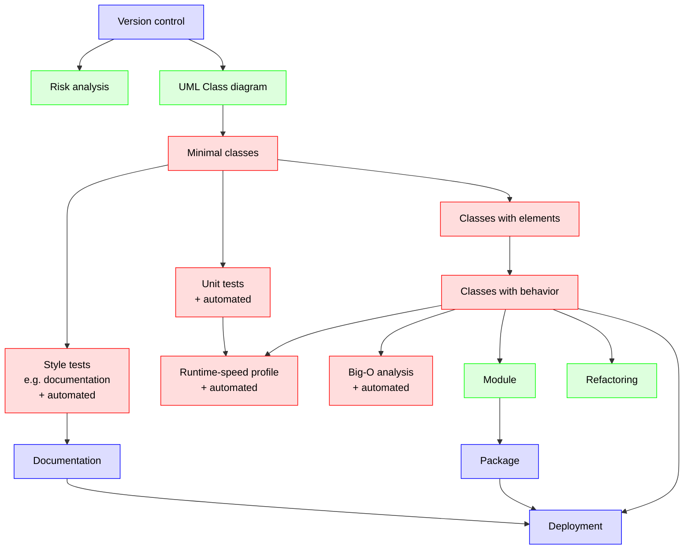

---
tags:
  - wrap-up
  - wrap up
  - conclusion
  - summary
---

# Wrap-up

!!!- info "Learning objectives"

    - Remember what the course was about

## Why?

!!! note "Course mottos"

    - Turning scripters into computer scientists
    - Add theory to bolster already present practical skills

To determine if the course mottos have held.

## Course overview

```mermaid
flowchart TD

  classDef bjorn_node fill:#ddf,color:#000,stroke:#00f
  classDef lars_node fill:#dfd,color:#000,stroke:#0f0
  classDef richel_node fill:#fdd,color:#000,stroke:#f00

  #subgraph day_1[Monday]
    git_basic[git basic workflow]:::bjorn_node
    class_design[Class design]:::lars_node
  end
  subgraph day_2[Tuesday]
    class_diagram[Create project's class diagram]:::lars_node
    pair_programming[Pair programming]:::richel_node
    tdd[TDD]:::richel_node
  end
  subgraph day_3[Wednesday]
    testing[Testing]:::richel_node
    code_reviews[Code reviews]:::richel_node
    git_branches[git branches]:::bjorn_node
  end
  subgraph day_4[Thursday]
    data_structures[Data structures]:::richel_node
    algorithms[Algorithms]:::richel_node
    optimisation[Optimisation]:::richel_node
  end
  subgraph day_5[Friday]
    modular_programming[Modular programming]:::lars_node
    deployment[Deployment]:::bjorn_node
  end


  git_basic --> pair_programming
  pair_programming --> tdd
  git_basic --> git_branches
  pair_programming --> code_reviews
  git_branches --> code_reviews
  class_design --> class_diagram
  class_diagram --> tdd
  git_basic --> tdd
  tdd --> testing
  git_branches --> testing
  code_reviews --> data_structures
  testing --> data_structures
  testing --> code_reviews
  data_structures --> algorithms
  algorithms --> modular_programming
  algorithms --> optimisation
```

## Detailed overview



> Overview of the course content.
> Red: Richel.
> Green: Lars.
> Blue: Björn.
> Grey: Project.
> Project nodes are not connected to obtain a clearer graph

## Project overview



> Overview of the course project.
> Red: Richel.
> Green: Lars.
> Blue: Björn.
