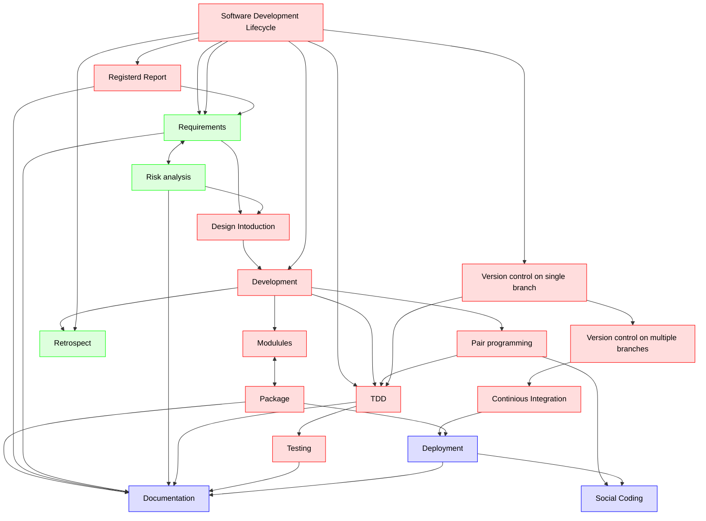

---
tags:
  - wrap-up
  - wrap up
  - conclusion
  - summary
---

# Wrap-up

!!!- info "Learning outcomes"

    - Remember what the course was about

!!! hint "Remember to revisit the course material"

    - The course material is under constant update from your reviews
      and therefore will add information over time.
    - The course material is updated to reflect new trends
    - Remind your self what the techniques where
    - Continuous learning

## Why?

!!! note "Course mottos"

    - Turning scripters into computer scientists
    - Add theory to bolster already present practical skills

## Course overview

Some of the [definitions](https://uppmax.github.io/programming_formalisms/misc/definitions/) used in the course.

And a mermaid diagram showing the overview of the course lessons.

```mermaid
flowchart TD

  classDef bjorn_node fill:#ddf,color:#000,stroke:#00f
  classDef lars_node fill:#dfd,color:#000,stroke:#0f0
  classDef richel_node fill:#fdd,color:#000,stroke:#f00

    requirements[Requirements]:::lars_node
    risk_analysis[Risk analysis]:::lars_node
    reg_rep[Registerd Report]:::richel_node
    SDLC[Software Development Lifecycle]:::richel_node
    version_control_1[Version control on single branch]:::richel_node
    version_control_many[Version control on multiple branches]:::richel_node
    pair_programming[Pair programming]:::richel_node
    tdd[TDD]:::richel_node
    retrospect[Retrospect]:::lars_node
    design[Design Intoduction]:::richel_node
    testing[Testing]:::richel_node
    social_coding[Social Coding]:::bjorn_node
    development[Development]:::richel_node
    modules[Modulules]:::richel_node
    package[Package]:::richel_node
    deployment[Deployment]:::bjorn_node
    documentation[Documentation]:::bjorn_node
    contious_itegration[Continious Integration]:::richel_node
    development --> retrospect
    SDLC --> reg_rep
    SDLC --> requirements
    requirements --> design
    design --> development
    SDLC --> retrospect
    SDLC --> development
    SDLC --> requirements
    SDLC --> tdd
    SDLC --> version_control_1
    version_control_1 --> version_control_many
    reg_rep --> requirements
    requirements <--> risk_analysis
    development --> modules
    development --> tdd
    pair_programming --> tdd
    pair_programming --> social_coding
    version_control_many --> contious_itegration
    contious_itegration --> deployment
    version_control_1 --> tdd
    tdd --> testing
    modules <-->  package 
    package --> deployment
    package --> documentation
    reg_rep --> documentation
    requirements --> documentation
    risk_analysis --> documentation
    risk_analysis --> design
    tdd--> documentation
    testing --> documentation
    deployment --> documentation
    deployment --> social_coding
    development --> pair_programming
```

> Overview of the course.
> Red: Richel.
> Green: Lars.
> Blue: Björn.

## Commits

Some fun statistic about commits to the project.

[Commit statistics](https://uppmax.github.io/programming_formalisms/reflections/2025_autumn/20251030_total_course/#commits-of-learners) you can see a page with some analysis of the commits that Richèl Bilderbeek has done

## Miscellaneous good links

- [Further learning](../further_learning.md)
