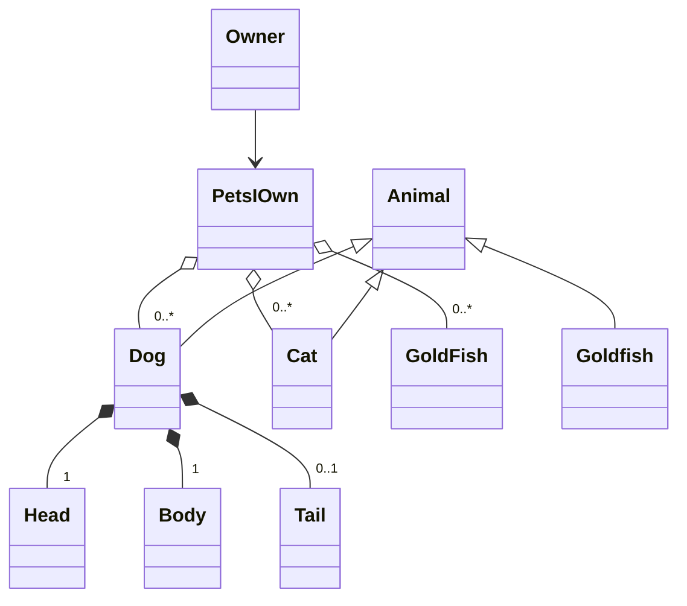

# Modular programming
## "Learning goals"

!!! info "Today we will"
    - Check Prior knowledge 10 min
    - Revisit Class Diagrams and interactions between classes 10 min
    - Introduce Refactoring 10 min
    - Exercise  Refactor design of project Class diagram 30 min
    - Introduce Design Patterns 10 min + 10 min discussion
    - Implement Factory Design pattern and Mediator Design pattern 40 min
    - Introduce Modularity 10 min 
    - Exercise 50 min produce logical modules that separates the behavior and structure in modules. 

???- "Learning objectives of Refactoring"
    -

???- "Learning objectives of Design Patterns"

    -The learners know of the "zero line" code and how it relates to software design "Zero line" Design
    - The Learners should be able to implement into their design the 
    "Factory pattern"
    -The learners can describe the general parts of a design pattern and why we use them.

???- info "Learning objectives of Modular programming"

    -The learners has a introductory understanding to the modular programming paradigm and the concept of iterative refactoring of code. 
    -The concepts of common interface and protocols are introduced to the learners
    -The learners are introduced the concept of coupling and how to find tight coupling
    -learners learn the importance of modularization when collaborating on larger projects by example of the reduced number of conflicts of commits.
    -The learners partitions their design and message passing by refactoring design and implementation according to the modular paradigms for the student project

##Prior Knowledge:
???- "What is Modular Programming"

    Modular programming as a term introduced by Larry Constantine et.al at the Symposium on Modular Programming, organized at the Information and Systems Institute in July 1968.
    
    Modular programming is a software design technique that emphasizes separating the functionality of a program into independent, interchangeable modules, such that each contains everything necessary to execute only one aspect of the desired functionality. 
???- "Why is Modular Programming something to strive for"

    -Reusability 
    -Working with others (encapsulation of work and function)
    
???- "What is a Design Pattern"

???- "Why do we use Design Patterns"

???- "What is Refactoring"

## Theory
Revisiting class design

The 4 most important relationship classes can have
are association, composition and aggregation

Further reading:
[Aggregation vs composition and Generalization vs Specialization](https://www.visual-paradigm.com/guide/uml-unified-modeling-language/uml-aggregation-vs-composition/)

???- Read https://refactoring.guru/refactoring and discuss how this can be implemented also in the design phase.(10 min)

    - Consider is your class diagram reflecting your code.

## Exercise
 Refactor your design document 
