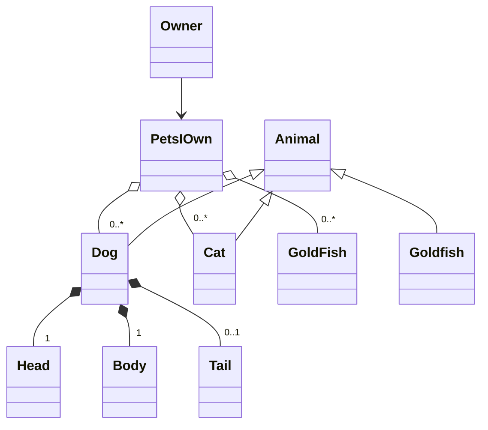
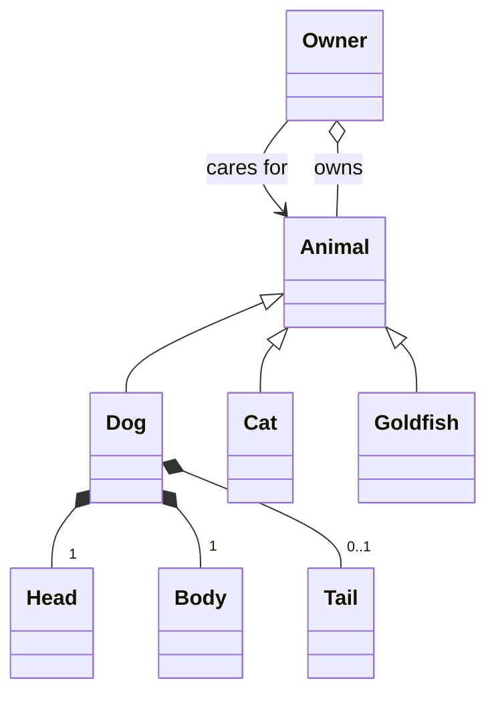

# Modular programming and Refactoring

???- info "Learning objectives"

    - Understand the concept of code smells and design smells.

    - Grasp the idea of the "zero line" in software design and its relevance.

    - Gain an introductory understanding of modular programming and iterative refactoring.

    - Learn about common interfaces, protocols, and their role in modular programming.

    - Recognize and address tight coupling in code to improve modularity.

    - Appreciate the importance of modularization in collaborative projects, especially for reducing conflicts in version control.

    ```mermaid
        gantt
        title Lesson plan Refactoring, and modularization
        dateFormat X
        axisFormat %s
        Revisit class Diagrams: theory_1, 0, 10
        Refactoring: refactoring, 10, 10s
        Exercise: Exercise_1, 20, 20s
        Modularity:Modularity_1,40, 10s
        Exercise: Modules, 50,10s
    ```

???- info "Learning objectives of Refactoring"

    - Learners learns about code smells and design smells


???- info "Learning objectives of Modular programming"

    - The learners has a introductory understanding to the modular programming paradigm and the concept of iterative refactoring of code.

    - The concepts of common interface and protocols are introduced to the learners

    - The learners are introduced the concept of coupling and how to find tight coupling

    - The learners learn the importance of modularization when collaborating on larger projects by example of the reduced number of conflicts of commits.

    - The learners partitions their design and message passing by refactoring design and implementation according to the modular paradigms for the student project

## Modular Programming

???- "What is Modular Programming"

    Modular programming as a term introduced by Larry Constantine et.al at the Symposium on Modular Programming, organized at the Information and Systems Institute in July 1968.

    Modular programming is a software design technique that emphasizes separating the functionality of a program into independent, interchangeable modules, such that each contains everything necessary to execute only one aspect of the desired functionality.

!!! info "Lets listen to a good lesson on modular programming."
    A good [lesson](https://www.youtube.com/watch?v=MYDAAhB1QIo) on Modularity by Huw Collingbourne

??? question "Lets Discuss"

From this these for principles are generally considered a requirement for modularity

- no communication in with no communication out
- no communication in with some communication out
- some communication in with some communication out
- some communication in with no communication out

!!! info "What does it mean in practice"

- That what you must clearly define for any function or object is a Common Interface that is static
- That there are no side effect from your implementation
- That you do not do message passing by reference.
- That you program blackbox methods and classes.


As discussed in the lesson

???- "Why is Modular Programming something to strive for"

    - Reusability
    - Working with others (encapsulation of work and function)

## Refactoring

???- "What is Refactoring"

    Refactoring is a systematic process of improving code without creating new functionality that can transform a mess into clean code and simple design.
    [refactoring.guru](https://refactoring.guru/refactoring)


### Revisiting class design

The 4 most important relationship classes can have
are association, composition and aggregation

**Bad structure**
    - Pets i Own is a relation DB table not an object as it has
    no function, which pets an owner has is not a object that exist in the real world - big semantic gap.



Refactored design, the Refactoring is done already in design space as a iteration of your design



## Exercises

???+ "Read and discuss"

    - Read [https://refactoring.guru/refactoring](https://refactoring.guru/refactoring)
       and discuss how this can be implemented also in the design phase (10 min)

    - Consider is your class diagram reflecting your code

???- "Refactor your design document"

    Try to consider what in your code are or will require classes to know about each other (Association).
    Try to consider which have a has-a relationship (composition if destroying an instance of the first class destroys the composing part) or if the part exist independently of the aggregate(aggregation)

???- "Refactor your code"
    Chose an Issue that you are responsible for go through the code and refactor the code.
