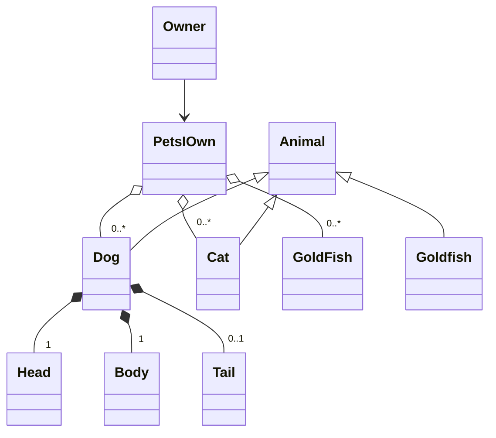

# Modular programming

## Learning goals

!!! info "Today we will"

    - Check Prior knowledge 10 min
    - Revisit Class Diagrams and interactions between classes 10 min
    - Introduce Refactoring 10 min
    - Exercise  Refactor design of project Class diagram 30 min
    - break 15 min
    - Introduce Modularity 10 min 
    - Exercise 25 min produce logical modules that separates the behavior and structure in modules. 
    - Introduce Design Patterns 10 min + 10 min discussion
    - break 15 min
    - Implement Factory Design pattern 40 min
    - lunch
    
    ```mermaid
        gantt
        title Lesson plan Refactoring, Design Patterns and Modularization
        dateFormat X
        axisFormat %s
        Godmorning and Prior knowledge : intro, 0, 10
        Revist class Diagrams: theory_1, 10, 10s
        Refactoring: refactoring, 20, 10s
        Excersie Refactoring: Excersie_1, 30,30s
        Break:break_1,60,15s
        Modularity:Modularity_1,75, 10s
        Excersie: Modules, 85,25s
        Design Patterns:Design_Patterns, 110, 20s
        Break:break_1,130,15s
        Excersie: Excersie_2, 145,40s
    ```

???- info "Learning objectives of Refactoring"

     - Learners learns about code smells and design smells

???- info "Learning objectives of Design Patterns"

     - The learners know of the "zero line" code and how it relates to software design "Zero line" Design
     - The Learners should be able to implement into their design the 
       "Factory pattern"
     - The learners can describe the general parts of a design pattern and why we use them.

???- info "Learning objectives of Modular programming"

     - The learners has a introductory understanding to the modular programming paradigm and the concept of iterative refactoring of code. 
     - The concepts of common interface and protocols are introduced to the learners
     - The learners are introduced the concept of coupling and how to find tight coupling
     - The learners learn the importance of modularization when collaborating on larger projects by example of the reduced number of conflicts of commits.
     - The learners partitions their design and message passing by refactoring design and implementation according to the modular paradigms for the student project

## Prior Knowledge

???- "What is Modular Programming"

    Modular programming as a term introduced by Larry Constantine et.al at the Symposium on Modular Programming, organized at the Information and Systems Institute in July 1968.
    
    Modular programming is a software design technique that emphasizes separating the functionality of a program into independent, interchangeable modules, such that each contains everything necessary to execute only one aspect of the desired functionality. 


???- "Why is Modular Programming something to strive for"

     - Reusability 
     - Working with others (encapsulation of work and function)
    
???- "What is a Design Pattern"

    Design patterns are typical solutions to common problems
    in software design. Each pattern is like a blueprint
    that you can customize to solve a particular
    design problem in your code.
    from [refactoring.guru](https://refactoring.guru/design-patterns) 

???- "Why do we use Design Patterns"

    The truth is that you might manage to work as a programmer for many years without knowing about a single pattern. A lot of people do just that. Even in that case, though, you might be implementing some patterns without even knowing it. So why would you spend time learning them?

    Design patterns are a toolkit of tried and tested solutions to common problems in software design. Even if you never encounter these problems, knowing patterns is still useful because it teaches you how to solve all sorts of problems using principles of object-oriented design.

    Design patterns define a common language that you and your teammates can use to communicate more efficiently. You can say, “Oh, just use a Singleton for that,” and everyone will understand the idea behind your suggestion. No need to explain what a singleton is if you know the pattern and its name.
    from [refactoring.guru](https://refactoring.guru/design-patterns)

???- "What is Refactoring"

    Refactoring is a systematic process of improving code without creating new functionality that can transform a mess into clean code and simple design.
    [refactoring.guru](https://refactoring.guru/refactoring) 


## Theory

Revisiting class design

The 4 most important relationship classes can have
are association, composition and aggregation



Further reading:
[Aggregation vs composition and Generalization vs Specialization](https://www.visual-paradigm.com/guide/uml-unified-modeling-language/uml-aggregation-vs-composition/)


???+ "Read and discuss"

     - Read [https://refactoring.guru/refactoring](https://refactoring.guru/refactoring)
       and discuss how this can be implemented also in the design phase (10 min)

     - Consider is your class diagram reflecting your code

## Exercises

???- "Refactor your design document"

    Try to consider what in your code are or will require classes to know about each other (Association).
    Try to consider which have a has-a relationship (composition if destroying an instance of the first class destroys the composing part) or if the part exist independently of the aggregate(aggregation)

???- "Modularization"

    Order your code in logical consistent modules that separates behavior that belongs together via interfaces.

???- "Design Patterns"

    Implement a Factory method for the creation of bacteria and one for nutrients

???- "Extra assignment"

    Using refactoring.guru find an implement another pattern that is useful for your project.
