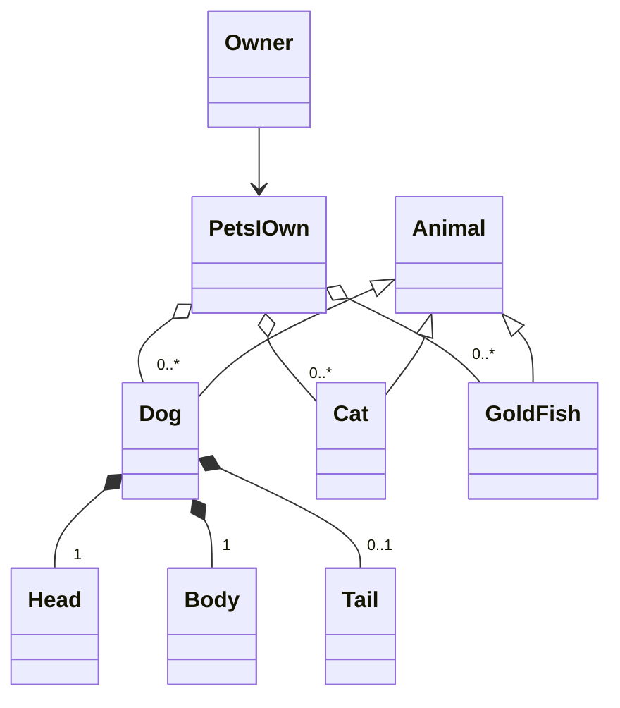
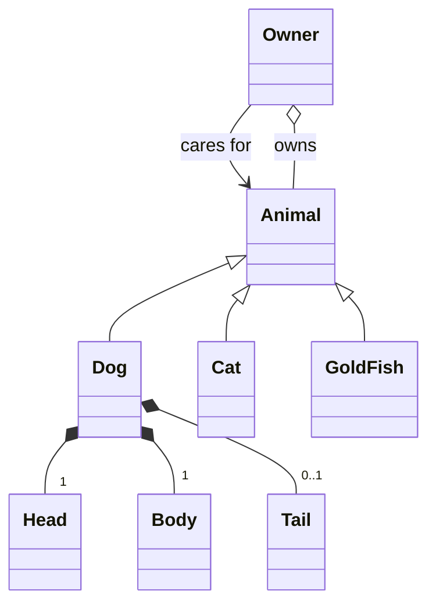

---
tags:
  - modular programming
  - refactoring
---

# Refactoring and Modular programming

???- info "Learning outcomes"

    - Understand the concept of code smells and design smells.

    - Grasp the idea of the "zero line" in software design and its relevance.

    - Gain an introductory understanding of modular programming and iterative refactoring.

    - Learn about common interfaces, protocols, and their role in modular programming.

    - Recognize and address tight coupling in code to improve modularity.

    - Appreciate the importance of modularization in collaborative projects, especially for reducing conflicts in version control.

    ```mermaid
    gantt
        title "Lesson plan Refactoring, and modularization"
        dateFormat mm
        axisFormat %M
        Refactoring: refactoring,00, 10m
        Refactoring Exercise: Exercise_1, 10, 20m
        Modularity:Modularity_1,30, 15m
    ```

???- info "Learning outcomes of Refactoring"

    - Learners learns about code smells and design smells


???- info "Learning outcomes of Modular programming"

    - The learners has a introductory understanding to the modular programming paradigm and the concept of iterative refactoring of code.

    - The concepts of common interface and protocols are introduced to the learners

    - The learners are introduced the concept of coupling and how to find tight coupling

    - The learners learn the importance of modularization when collaborating on larger projects by example of the reduced number of conflicts of commits.

    - The learners partitions their design and message passing by refactoring design and implementation according to the modular paradigms for the student project


???- question "For teachers"

    Prior:

    - What is a Refactoring?
    - What is a Design/code Smell?
    - What is a Module?
    - Why make modular design/code, what is the benefit?

## Refactoring

???- "What is Refactoring"

    Refactoring is a systematic process of improving code without creating new functionality that can transform a mess into clean code and simple design.
    [refactoring.guru](https://refactoring.guru/refactoring)


### Revisiting class design

The most important relationship classes can have
are association, composition and inheritance.

#### Bad structure

- `PetsIOwn` is a relation DB table not an object as it has
- no function, which pets an owner has is not a object that exist in the real world - big semantic gap.



Refactored design, the Refactoring is done already in design space as a iteration of your design



What was this ann effect of a phenomenon known as Design Smell.

Code smell and design smell are two very good reason to do refactoring

- What? How can code "smell"??
- Well it doesn't have a nose... but it definitely can stink!

From [https://refactoring.guru/](https://refactoring.guru/).

Some examples of code smell

- Bloaters
- Object-Orientation Abusers
- Change Preventers
- Dispensables
- Couplers

## Exercises

???+ "Read and discuss"

    - Read [https://refactoring.guru/refactoring](https://refactoring.guru/refactoring)
       and discuss how this can be implemented also in the design phase (10 min)

    - Consider is your class diagram reflecting your code

???- question "Bad Weather identify the design smells"

    Identify the different design smells of the following diagram use notes to denote the found smells, then put it in a markdown document and commit to your learners space in the project.

    ```mermaid
        classDiagram

            %% =======================
            %% SMELLY DESIGN
            %% =======================
            namespace Smelly {
                class Website {
                    +String url
                    +String repoPath
                    +String filters
                    +void loadEverythingAtOnce()
                    +void reloadPageOnFilterChange()
                    +void renderAllPlotsAndStatsTogether()
                    +void handleDownloadRequest(fileType, filter, plot, stat, timeRange, dateRange, region)
                }

                class FilterManager {
                    +String selectedTime
                    +String selectedDate
                    +String selectedRegion
                    +void applyFilters(time, date, region)
                    +void filterEverything()
                }

                class PlotManager {
                    +void drawTimeSeries(data)
                    +void drawHistogramAndBoxPlotTogether(data)
                    +void renderAllStatsOnPlot(data)
                }

                class StatsManager {
                    +float average
                    +float minimum
                    +float maximum
                    +float median
                    +float mode
                    +void computeAllStatsInOneMethod(data)
                }

                class DownloadManager {
                    +void downloadEverything()
                    +void zipEverythingTogether()
                }

                class GitHubBackend {
                    +String dataPath
                    +void connectToGitHub()
                    +void loadDataIntoAnalysisProgram(file)
                    +void sendVerifyMessageToUser()
                }
            }
        %% relationships
        Website --> FilterManager
        Website --> PlotManager
        Website --> StatsManager
        Website --> DownloadManager
        Website --> GitHubBackend
        FilterManager --> PlotManager
        PlotManager --> StatsManager
        DownloadManager --> GitHubBackend

        %% color all smelly classes red
        style Website fill:#ffdddd,stroke:#ff0000,stroke-width:2px
        style FilterManager fill:#ffdddd,stroke:#ff0000,stroke-width:2px
        style PlotManager fill:#ffdddd,stroke:#ff0000,stroke-width:2px
        style StatsManager fill:#ffdddd,stroke:#ff0000,stroke-width:2px
        style DownloadManager fill:#ffdddd,stroke:#ff0000,stroke-width:2px
        style GitHubBackend fill:#ffdddd,stroke:#ff0000,stroke-width:2px

    ```

???- "Answer design smells"

    Here is one answer, there can be more design smells that given here!

    ```mermaid

        classDiagram

        %% =======================
        %% SMELLY DESIGN
        %% =======================
        namespace Smelly {
            class Website {
                +String url
                +String repoPath
                +String filters
                +void loadEverythingAtOnce()
                +void reloadPageOnFilterChange()
                +void renderAllPlotsAndStatsTogether()
                +void handleDownloadRequest(fileType, filter, plot, stat, timeRange, dateRange, region)
            }

            class FilterManager {
                +String selectedTime
                +String selectedDate
                +String selectedRegion
                +void applyFilters(time, date, region)
                +void filterEverything()
            }

            class PlotManager {
                +void drawTimeSeries(data)
                +void drawHistogramAndBoxPlotTogether(data)
                +void renderAllStatsOnPlot(data)
            }

            class StatsManager {
                +float average
                +float minimum
                +float maximum
                +float median
                +float mode
                +void computeAllStatsInOneMethod(data)
            }

            class DownloadManager {
                +void downloadEverything()
                +void zipEverythingTogether()
            }

            class GitHubBackend {
                +String dataPath
                +void connectToGitHub()
                +void loadDataIntoAnalysisProgram(file)
                +void sendVerifyMessageToUser()
            }
        }
            %% relationships
            Website --> FilterManager
            Website --> PlotManager
            Website --> StatsManager
            Website --> DownloadManager
            Website --> GitHubBackend
            FilterManager --> PlotManager
            PlotManager --> StatsManager
            DownloadManager --> GitHubBackend

            %% color all smelly classes red
            style Website fill:#ffdddd,stroke:#ff0000,stroke-width:2px
            style FilterManager fill:#ffdddd,stroke:#ff0000,stroke-width:2px
            style PlotManager fill:#ffdddd,stroke:#ff0000,stroke-width:2px
            style StatsManager fill:#ffdddd,stroke:#ff0000,stroke-width:2px
            style DownloadManager fill:#ffdddd,stroke:#ff0000,stroke-width:2px
            style GitHubBackend fill:#ffdddd,stroke:#ff0000,stroke-width:2px

            note for Website "Smells: God Class, Long Parameter List, Tight Coupling, Bloater"
            note for FilterManager "Smells: Feature Envy (accesses others' data)"
            note for PlotManager "Smells: Duplicated Responsibility with StatsManager"
            note for StatsManager "Smells: Large Method computeAllStatsInOneMethod"
            note for DownloadManager "Smells: Does too much (handles all file types)"
            note for GitHubBackend "Smells: UI and backend mixed"
    ```

???- "Refactor your design document"

    Either:
    Chose an Issue that you are responsible for!

    Try to consider what in your code are or will require classes to know about each other (Association).
    Try to consider which have a has-a relationship (composition if destroying an instance of the first class destroys the composing part)

    or

    Refactor the above design into a good design. Consider things like technology lock in and other issues.


???- info "Answer here is one example of fixed structure"

    Here is an example of how a refactored example from the above design

    ```mermaid
        classDiagram

        namespace WeatherAnalysis {

        class UserInterface {
            +start()
        }

        class webapp {
            +start()
        }
        class CLI {
            +start()
        }

        class DataController {
            +applyTimeFilter()
            +applyDateFilter()
            +applyRegionFilter()
        }

        class PlotService {
            +drawTimeSeries()
            +drawHistogram()
            +drawBoxPlot()
        }

        class StatsService {
            +computeAverage()
            +computeMin()
            +computeMax()
            +computeMedian()
            +computeMode()
        }

        class DownloadService {
            +exportRawData()
            +exportFilteredData()
            +exportPlot()
            +exportStats()
        }

        class GitHubDataSource {
            +loadData()
            +verifyData()
        }
    }
        %% relations
        UserInterface --> DataController
        DataController --> PlotService
        DataController --> StatsService
        UserInterface --> DownloadService
        DownloadService --> GitHubDataSource
        CLI --|> UserInterface
        WebApp --|> UserInterface

        %% color clean classes green
        style UserInterface fill:#ddffdd,stroke:#00aa00,stroke-width:2px
        style DataController fill:#ddffdd,stroke:#00aa00,stroke-width:2px
        style PlotService fill:#ddffdd,stroke:#00aa00,stroke-width:2px
        style StatsService fill:#ddffdd,stroke:#00aa00,stroke-width:2px
        style DownloadService fill:#ddffdd,stroke:#00aa00,stroke-width:2px
        style GitHubDataSource fill:#ddffdd,stroke:#00aa00,stroke-width:2px

        note for UserInterface "Clean: Controller coordinates components"
        note for DataController "Single Responsibility: handles filtering only"
        note for PlotService "Separate concern: visual rendering"
        note for StatsService "Separate concern: statistical computation"
        note for DownloadService "Exports only"
        note for GitHubDataSource "Isolated backend logic"

    ```


???- "Refactor your code"
    Chose an Issue that you are responsible for go through the code and refactor the code.(if you do not have an issue claim one)

## Code Coupling

???- "What is Coupling in code"

Lets talk about Tightly vs loosely coupled code.

???- "What is tightly coupled code?"

     Tightly coupled code is when a group of classes are highly dependent on one another. This isn't necessarily a bad thing, but it can make the code harder to test because of the dependent classes are so intertwined. They can't be used independently or substituted easily.

    In tightly coupled systems, each component or class in the system knows details about many other components or classes. They are interdependent, meaning that if one component changes, it can have a ripple effect on all other components that depend on it. This can make the system as a whole more difficult to maintain, because changes in one place can require changes in many other places.

???- "Why is loose coupling to prefer"

    - Easier Maintenance: Because each component is independent, changes in one component don't require changes in other components. This makes the system as a whole easier to maintain.

    - Improved Testability: Components can be tested independently, without needing to set up and manage other components. This makes it easier to write unit tests, and makes the tests more reliable, because they're less likely to be affected by changes in other parts of the system.

    - Greater Flexibility and Reusability: Because components don't depend on each other, they can be more easily reused in different parts of the system, or even in different systems. They can also be replaced or upgraded without affecting other components.

!!! Hint "Circular dependency"

    A circular dependency occurs when two entities both rely on data from each other, either directly or through secondary coupling. This can be a natural an un avoidable consequence of the domain space or it as it is usually seen in software development an anti pattern that is a pattern that hinders development.

## Modular Programming

???- "What is Modular Programming"

    Modular programming as a term introduced by Larry Constantine et.al at the Symposium on Modular Programming, organized at the Information and Systems Institute in July 1968.

    Modular programming is a software design technique that emphasizes separating the functionality of a program into independent, interchangeable modules, such that each contains everything necessary to execute only one aspect of the desired functionality.

!!! info "lets read about modular programming"(10 min)

    This is a Wikipedia article on [modular programming](https://en.wikipedia.org/wiki/Modular_programming)

??? question "Lets Discuss"

From this these for principles are generally considered a requirement for modularity

- no communication in with no communication out
- no communication in with some communication out
- some communication in with some communication out
- some communication in with no communication out

!!! info "What does it mean in practice"

- That what you must clearly define for any function or object is a Common Interface that is static
- That there are no side effect from your implementation
- That you do not do message passing by reference.
- That you program blackbox methods and classes.

???- "Why is Modular Programming something to strive for"

    - Reusability
    - Working with others (encapsulation of work and function)
