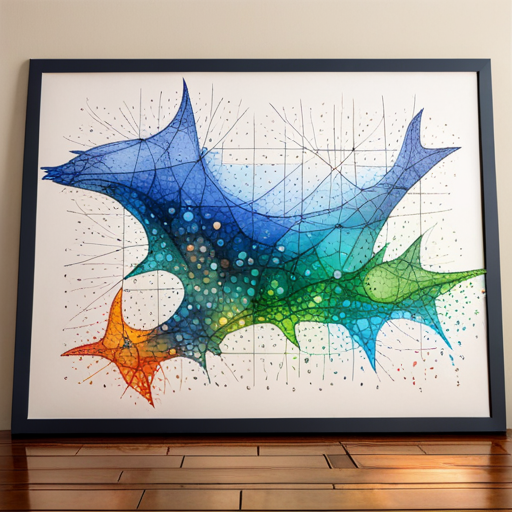

# Big-O

!!!- info "Learning objectives"

    - Understand misconceptions on optimisation
    - Understand Amdahl's law
    - Practice to determine the big-O profile of a function
    - Practice to get a run-time speed profile

## QMD

## Problem

Q: When to optimize for speed?

. . .

A:

-   [C++ Core Guidelines: Per.1: Don't optimize without reason](https://isocpp.github.io/CppCoreGuidelines/CppCoreGuidelines#Rper-reason)
-   [C++ Core Guidelines: Per.2: Don't optimize prematurely](https://isocpp.github.io/CppCoreGuidelines/CppCoreGuidelines#per2-dont-optimize-prematurely)
-   [C++ Core Guidelines: Per.3: Don't optimize something that's not performance critical](https://isocpp.github.io/CppCoreGuidelines/CppCoreGuidelines#per3-dont-optimize-something-thats-not-performance-critical)

## Problem

Q: How to improve the run-time speed of an algorithm?

. . .

> Make it work, make it right, make it fast.
>
> Kent Beck

A (simplified):

1.  Measure (hard to do @bartz2020benchmarking)
2.  Think
3.  Change code
4.  Measure again

## Problem

Q: How to improve the run-time speed of an algorithm?

A (simplified):

1.  Measure big-O
2.  Measure speed profile
3.  Think
4.  Change code
5.  Measure again

## Measurement 1: big-O

How your (combination of) algorithms scales with more complex input.

-   Counting the words in a book: O(n)
-   Looking up a word in a dictionary: O(log2(n))

:warning: Do measure big-O in release mode!

## Your algorithm



## Example

```{r}
create_big_o_example <- function(n = seq(0, 100)) {
  t_wide <- tibble::tibble(n = n)
  t_wide$a <- 10 + log10(t_wide$n + 0.1)
  t_wide$b <- t_wide$n
  t_wide$c <- 0.001 * (t_wide$n ^ 2)
  t_wide$total <- t_wide$a + t_wide$b + t_wide$c
  t <- tidyr::pivot_longer(t_wide, cols = c("a", "b", "c", "total"))
  colnames(t) <- c("n", "sub", "t")
  t
}
t <- create_big_o_example(n = seq(0, 100))
ggplot2::ggplot(t, ggplot2::aes(x = n, y = t, color = sub)) + 
  ggplot2::geom_line(size = 4) + 
  ggplot2::theme(text = ggplot2::element_text(size = 20))
```

:monocle_face: Work on B?

## Example

```{r}
t <- create_big_o_example(n = seq(0, 500))
ggplot2::ggplot(t, ggplot2::aes(x = n, y = t, color = sub)) + 
  ggplot2::geom_line(size = 4) + 
  ggplot2::theme(text = ggplot2::element_text(size = 20))
```

## Example

```{r}
t <- create_big_o_example(n = seq(0, 2000))
ggplot2::ggplot(t, ggplot2::aes(x = n, y = t, color = sub)) + 
  ggplot2::geom_line(size = 4) + 
  ggplot2::theme(text = ggplot2::element_text(size = 20))
```

:sunglasses: No, work on C instead

## Discussion

Big-O helps to:

-   find algorithm to profile
-   make predictions

Agree yes/no

## Exercise 1 \[SKIP\]

-   Measure big-O complexity of https://www.pythonpool.com/check-if-number-is-prime-in-python/

::: columns
::: {.column width="50%"}
🪱

```{python}
#| echo: true
#| eval: false
def isprime(num):
  for n in range(
    2, int(num**0.5)+1
  ):
    if num%n==0:
      return False
  return True
```
:::

::: {.column width="50%"}
🪱

```{python}
#| echo: true
#| eval: false
def isprime(num):
    if num> 1:  
        for n in range(2,num):  
            if (num % n) == 0:  
                return False
        return True
    else:
        return False
```
:::
:::

## Exercise 1 \[SKIP\]

-   Measure big-O complexity of https://www.pythonpool.com/check-if-number-is-prime-in-python/

::: columns
::: {.column width="50%"}
🪱

```{python}
#| echo: true
#| eval: false
def isprime(num):
  for n in range(
    2, int(num**0.5)+1
  ):
    if num%n==0:
      return False
  return True
```
:::

::: {.column width="50%"}
🪱

```{python}
#| echo: true
#| eval: false
def Prime(no, i = 2):
    if no == i:
        return True
    elif no % i == 0:
        return False
    return Prime(no, i + 1)
```
:::
:::

## Exercise 2 \[SKIP\]

-   Measure big-O complexity of DNA alignment at https://johnlekberg.com/blog/2020-10-25-seq-align.html

```         
ACGTACGTACGTACGTACGTACGT
ACGTACGTACGTCGTACGTACGT
```

```         
ACGTACGTACGTACGTACGTACGT
ACGTACGTACGT-CGTACGTACGT
```
