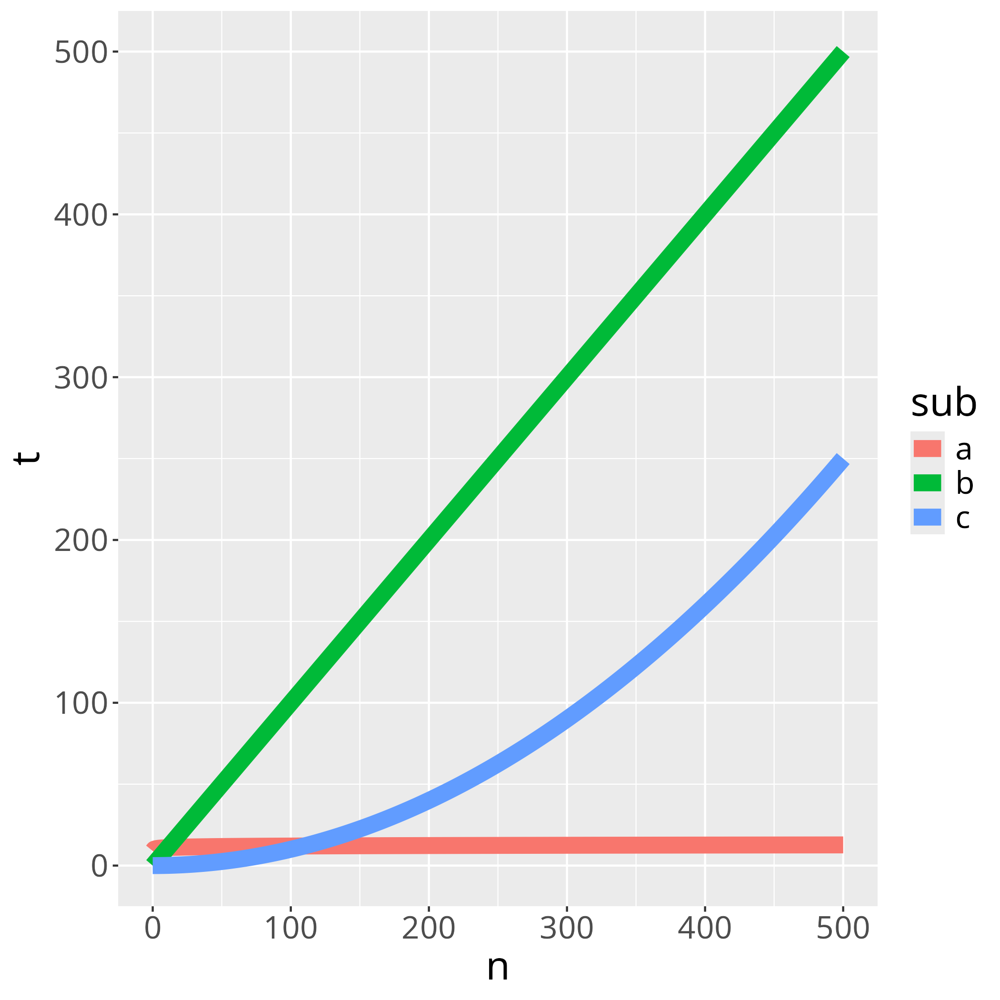
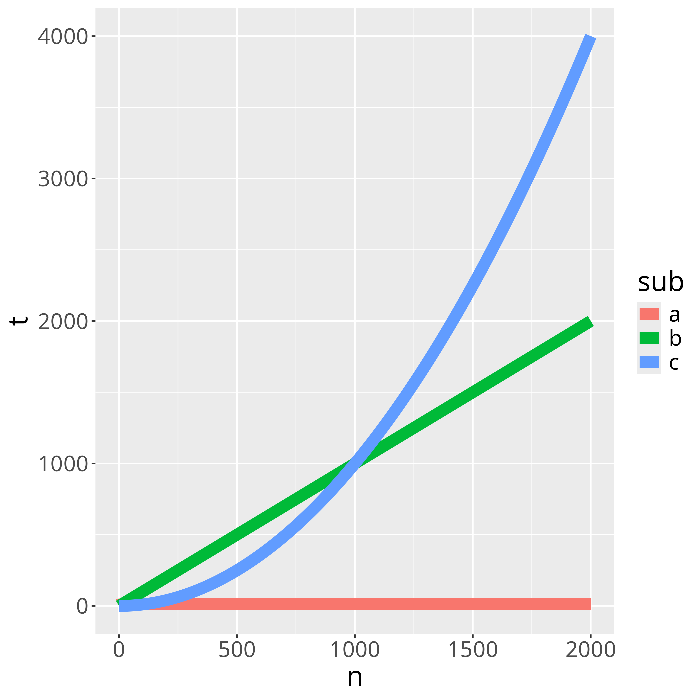

# Big-O

!!!- info "Learning objectives"

    - Understand misconceptions on optimisation
    - Understand Amdahl's law
    - Practice to determine the big-O profile of a function
    - Practice to get a run-time speed profile

## QMD

## Problem

Q: When to optimize for speed?

A:

- Don't optimize without reason `[CppCore Per.1]`
- Don't optimize prematurely `[CppCore Per.2]`
- Don't optimize something
  that's not performance critical `[CppCore Per.3]`

## Problem

Q: How to improve the run-time speed of an algorithm?

. . .

> Make it work, make it right, make it fast.
>
> Kent Beck

A (simplified):

1. Measure (hard to do @bartz2020benchmarking)
2. Think
3. Change code
4. Measure again

## Problem

Q: How to improve the run-time speed of an algorithm?

A (simplified):

1. Measure big-O
2. Measure speed profile
3. Think
4. Change code
5. Measure again

## Measurement 1: big-O

How your (combination of) algorithms scales with more complex input.

- Counting the words in a book: O(n)
- Looking up a word in a dictionary: O(log2(n))

:warning: Do measure big-O in release mode!

## Your algorithm


## Example


:monocle_face: Work on B?

## Example



## Example



:sunglasses: No, work on C instead

## Discussion

Big-O helps to:

- find algorithm to profile
- make predictions

Agree yes/no

## Exercise 1

- Measure big-O complexity of 
  <https://www.pythonpool.com/check-if-number-is-prime-in-python/>

```python
def isprime(num):
  for n in range(
    2, int(num**0.5)+1
  ):
    if num%n==0:
      return False
  return True
```

```python
def isprime(num):
    if num> 1:
        for n in range(2,num):
            if (num % n) == 0:
                return False
        return True
    else:
        return False
```

## Exercise 2

- Measure big-O complexity of DNA alignment algorithm
  at <https://johnlekberg.com/blog/2020-10-25-seq-align.html>

## References

- `[CppCore Per.1]` C++ Core Guidelines: Per.1: Don't optimize without reason
  [here](https://isocpp.github.io/CppCoreGuidelines/CppCoreGuidelines#Rper-reason)
- `[CppCore Per.2]` C++ Core Guidelines: Per.2: Don't optimize prematurely
  [here](https://isocpp.github.io/CppCoreGuidelines/CppCoreGuidelines#per2-dont-optimize-prematurely)
- `[CppCore Per.3]` C++ Core Guidelines: Per.3:
  Don't optimize something that's not performance critical
  [here](https://isocpp.github.io/CppCoreGuidelines/CppCoreGuidelines#per3-dont-optimize-something-thats-not-performance-critical)
