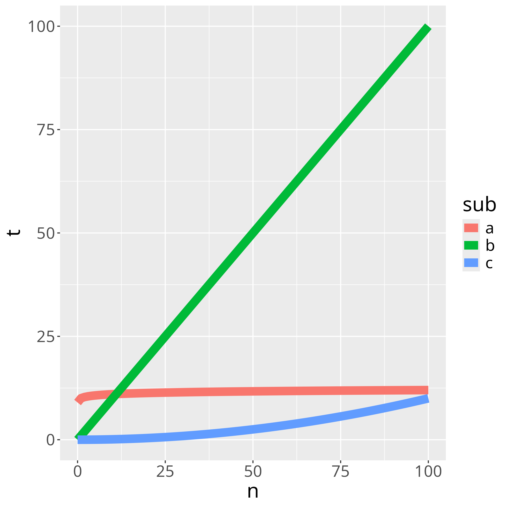

---
tags:
  - Big-O
  - Big O
  - scalability
---

# Big-O

!!!- info "Learning outcomes"

    - Practice to determine the big-O profile of a function

???- question "For teachers"

    Prerequisites are:

    - .

    Teaching goals are:

    - .

    Prior:

    - .

    Lesson plans:

    ```mermaid
    gantt
      title Lesson plan pair programming 1
      dateFormat X
      axisFormat %s
      Introduction : intro, 0, 5s
      Theory 1: theory_1, after intro, 5s
      Exercise 1: crit, exercise_1, after theory_1, 15s
      Feedback 1: feedback_1, after exercise_1, 5s
      Theory 2: theory_2, after feedback_1, 5s
      Exercise 2: crit, exercise_2, after theory_2, 10s
      Exercise 2 after the break: crit, after exercise_2, 5s
    ```

## Why Big O is important.

You've added a continuous integration script to measure which code
is spent most time in. You've made the program 10x as fast:
from 1 second, to 0.1 second.

Likely, you've wasted your time.

Instead, you want to optimize your code in a way that is useful.

## Big O

- Don't optimize without reason `[CppCore Per.1]`
- Don't optimize prematurely `[CppCore Per.2]`
- Don't optimize something
  that's not performance critical `[CppCore Per.3]`
- Know the limits of your functions by measuring their complexity
  `[Henney, 2010, chapter 'Know Your Limits']`.

## How to improve the run-time speed of an algorithm?

> Make it work, make it right, make it fast.
>
> Kent Beck

A simplified workflow is this:

1. Measure (hard to do `[Bartz-Beielstein et al., 2020]`)
2. Think
3. Change code
4. Measure again

???- question "What to measure?"

    There are two things one can measure:

    - Where the code spends its time
    - How speed scales to increasingly complex input


## Big-O

How your (combination of) algorithms scales with more complex input.

- Counting the words in a book: O(n)
- Looking up a word in a dictionary: O(log2(n))

!!! warning "Do measure big-O in release mode"

    Do measure big-O in release mode!

    See the lesson on `assert` how to do so.

???- question "Why?"

    Debug mode -by definition- has more tests:
    in our code, in the code used from other packages,
    in the code produced by our compiler (if any).
    When all tests pass, our program does not need these anymore.

    In debug mode, our speed measurements would take us
    to the functions that test themselves most :-)

## Example 1

Your program runs three functions after each other: A, B and C.
All use the same input.

You've measured how each of these functions take per input:



You want your benchmark to be short:
this full benchmark takes 1 second to run.

???- question "Which function would you improve?"

    B takes most time, so B

## Example 2

Out of curiosity, you've increased the complexities of
the benchmarking inputs. Now the picture looks like this:


The full benchmark now takes 100 second to run.

???- question "Which function would you improve?"

    C takes most time, so C

## Conclusion

Big-O helps to:

- find algorithm to profile
- make predictions

A benchmark done in debug mode is useless:
you care about your code doing actual work.

A short benchmark time is useless:
you care more about complex input than simple input.
Using a continuous integration script to run a (max) two hour
benchmark is a convenient solution.

## Exercises

### Exercise 1

- Measure big-O complexity of <https://www.pythonpool.com/check-if-number-is-prime-in-python/>

```python
def isprime_1(num):
    for n in range(2, int(num**0.5) + 1):
        if num % n == 0:
            return False
    return True
```

```python
def isprime_2(num):
    if num > 1:
        for n in range(2, num):
            if (num % n) == 0:
                return False
        return True
    else:
        return False
```

### Exercise 2

- Measure big-O complexity of DNA alignment algorithm
  at <https://johnlekberg.com/blog/2020-10-25-seq-align.html>

## References

- `[CppCore Per.1]` C++ Core Guidelines: Per.1: Don't optimize without reason
  [here](https://isocpp.github.io/CppCoreGuidelines/CppCoreGuidelines#Rper-reason)
- `[CppCore Per.2]` C++ Core Guidelines: Per.2: Don't optimize prematurely
  [here](https://isocpp.github.io/CppCoreGuidelines/CppCoreGuidelines#per2-dont-optimize-prematurely)
- `[CppCore Per.3]` C++ Core Guidelines: Per.3:
  Don't optimize something that's not performance critical
  [here](https://isocpp.github.io/CppCoreGuidelines/CppCoreGuidelines#per3-dont-optimize-something-thats-not-performance-critical)
- `[Bartz-Beielstein et al., 2020]` Bartz-Beielstein, Thomas, et al. "Benchmarking in optimization: Best practice and open issues." arXiv preprint arXiv:2007.03488 (2020).
- `[Henney, 2010]` Henney, Kevlin.
  97 things every programmer should know: collective wisdom from the experts. "
  O'Reilly Media, Inc.", 2010.
