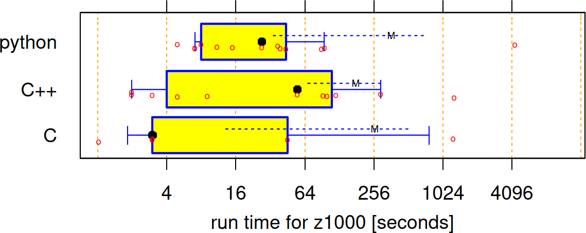

---
tags:
  - optimization
  - optimisation
  - misconceptions
  - myths
  - illusions
  - delusions
---

# Optimisation misconceptions

!!!- info "Learning objectives"

    - Understand misconceptions on optimisation
    - Understand Amdahl's law

???- question "For teachers"

    Prerequisites are:

    - .

    Teaching goals are:

    - .

    Prior:

    - .

    Lesson plans:

    ```mermaid
    gantt
      title Lesson plan pair programming 1
      dateFormat X
      axisFormat %s
      Introduction : intro, 0, 5s
      Theory 1: theory_1, after intro, 5s
      Exercise 1: crit, exercise_1, after theory_1, 15s
      Feedback 1: feedback_1, after exercise_1, 5s
      Theory 2: theory_2, after feedback_1, 5s
      Exercise 2: crit, exercise_2, after theory_2, 10s
      Exercise 2 after the break: crit, after exercise_2, 5s
    ```

## Why?

There are a lot of misconceptions on optimisation.

You may prefer correct advice regarding this.

## Bad advice 1

!!! warning "Bad advice 1"

    Python is slow! Learn C or C++ or Rust to go fast!

???- question "Why does this advice make sense?"

    C, C++ and Rust allows one to write direct machine code.
    You can write the theoretical best machine code in ... well ...
    machine code. Hence, these are indeed the theoretically fastest
    languages.

    Python does not allow one to write machine code.
    Hence, it cannot be as fast as the languages that can.

???- question "Why is this bad advice?"

    This is bad advice, because the variance within programming
    languages is bigger than variance between
    languages (adapted fig 2, from `[Prechelt, 2000]`):

    

    Instead of learning a faster language, learn how to be fast in
    your language.

## Bad advice 2

!!! warning "Bad advice 2"

    - [any micro-optimization]
    - Do not use for-loops!
    - Unroll your for-loops!

    Or in code, this is 'bad':

    ```python
    my_values = get_values()
    assert len(my_values) == 3
    sum = 0
    for i in range(3):
      sum += my_values[i]
    ```

    This is 'better':

    ```python
    my_values = get_values()
    assert len(my_values) == 3
    sum = my_values[0] + my_values[1] + my_values[2]
    ```

???- question "Why does this advice make sense?"

    The 'better' code does not contain a loop anymore,
    hence needs to do less, hence is faster.

    These micro-optimizations may even have a measurable effect
    when tested in isolation.
    
???- question "Why is this bad advice?"

    > We should forget about small efficiencies,
    > say about 97% of the time: premature optimization is the root of all evil.
    > Yet we should not pass up our opportunities in that critical 3%.
    >
    > Donald Knuth

    

    > Source: [Wikipedia](https://upload.wikimedia.org/wikipedia/commons/4/4f/KnuthAtOpenContentAlliance.jpg)

    - Don't optimize without reason `[CppCore Per.1]`
    - Don't optimize prematurely `[CppCore Per.2]`
    - Don't optimize something
      that's not performance critical `[CppCore Per.3]`

    It likely has no measurable effect in the context of a complete program:
    the chance that this was the speed bottleneck is low.


## Bad advice 3

!!! warning "Bad advice 3"

    'Always parallelize'

???- question "Why does this advice make sense?"

    Using more processors for the same calculation makes it
    reasonable to asssume it goes faster.

    Parallellization of a single function may even have a measurable effect
    when tested in isolation.

???- question "Why is this bad advice?"

    First, it likely has no measurable effect in the context
    of a complete program: the chance that this was the speed bottleneck is low.

    The speed-up of a program from parallelization is limited
    by how much of the program can be parallelized.
    This is Amdahl's law (and also found in `[Rodgers, 1985]`).
    The figure belows shows the theoretical best
    speed up redarding percentage of code that can be parallalized:

    

    The figure above shows the best possible speed increase.
    However, there is overhead in parallalized code, as the
    processes need to communicate with each other.

    Lastly, parallalized code is commonly harder to debug (with
    irreproducible bugs) and harder to read.

## Bad advice 4

!!! warning "Bad advice 4"

    'Optimize the function where you feel the performance problem is'

???- question "Why does this advice make sense?"

    As developers, the more experience we get, the better
    we understand our code.

???- question "Why is this bad advice?"

    Developers -also very experienced developers- are known
    to have a bad intuition `[Sutter & Alexandrescu, 2004]`

    Instead (from `[Chellappa et al., 2008]`):

    1. find the code that the program spends most time in
    2. measure the timing of that code
    3. analyze the measured runtimes

## Bad advice 5

!!! warning "Bad advice 5"

    'Optimize each function'

???- question "Why does this advice make sense?"

    If we optimize each function, the full program will be faster!

???- question "Why is this bad advice?"

    - Don't optimize without reason `[CppCore Per.1]`
    - Don't optimize prematurely `[CppCore Per.2]`
    - Don't optimize something
      that's not performance critical `[CppCore Per.3]`
    - The 90-10 rule: 90% of all time, the program spends in 10% of the code.
    - Your working hours can be spent once

## References

- `[Chellappa et al., 2008]`
  Chellappa, Srinivas, Franz Franchetti, and Markus Püschel.
  "How to write fast numerical code: A small introduction."
  Generative and Transformational Techniques in Software Engineering II:
  International Summer School, GTTSE 2007, Braga, Portugal,
  July 2-7, 2007. Revised Papers (2008): 196-259.
- `[CppCore Per.1]` C++ Core Guidelines: Per.1: Don't optimize without reason
  [here](https://isocpp.github.io/CppCoreGuidelines/CppCoreGuidelines#Rper-reason)
- `[CppCore Per.2]` C++ Core Guidelines: Per.2: Don't optimize prematurely
  [here](https://isocpp.github.io/CppCoreGuidelines/CppCoreGuidelines#per2-dont-optimize-prematurely)
- `[CppCore Per.3]` C++ Core Guidelines: Per.3:
  Don't optimize something that's not performance critical
  [here](https://isocpp.github.io/CppCoreGuidelines/CppCoreGuidelines#per3-dont-optimize-something-thats-not-performance-critical)
- `[Prechelt, 2000]` Prechelt, Lutz. "An empirical comparison of c, c++, java, perl, python, rexx and tcl." IEEE Computer 33.10 (2000): 23-29.
- `[Rodgers, 1985]` Rodgers, David P. "Improvements in multiprocessor system design." ACM SIGARCH Computer Architecture News 13.3 (1985): 225-231.
- `[Sutter & Alexandrescu, 2004]` Sutter, Herb, and Andrei Alexandrescu. C++ coding standards: 101 rules, guidelines, and best practices. Pearson Education, 2004.
