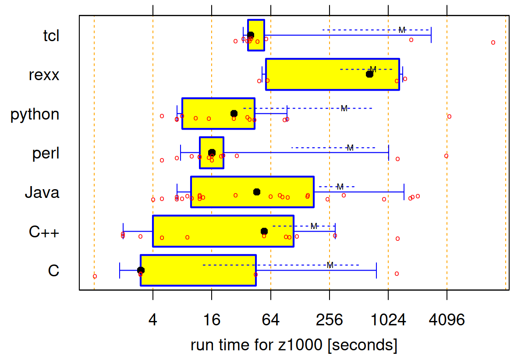

---
tags:
  - speed
  - runtime
  - run-time
  - profile
  - profiling
  - optimization
  - optimisation
  - misconceptions
  - myths
  - illusions
  - delusions
---

# Runtime speed profiles

!!!- info "Learning outcomes"

    - Practice to get a run-time speed profile

???- question "For teachers"

    Prerequisites are:

    - .

    Teaching goals are:

    - .

    Prior:

    - .

## Why use runtime speed profiles?

!!! info "Quote from Herb Sutter"

    It is far, far easier to make a correct program fast,
    than it is to make a fast program correct.

???- question "How does Herb Sutter look like?"

    

    - Source: [Wikimedia](https://commons.wikimedia.org/wiki/Category:Herb_Sutter#/media/File:Professional_Developers_Conference_2009_Technical_Leaders_Panel_7.jpg)

!!! info "Quote from Donald Knuth"

    We should forget about small efficiencies,
    say about 97% of the time: premature optimization is the root of all evil.
    Yet we should not pass up our opportunities in that critical 3%.

???- question "How does Donald Knuth look like?"

    

    - Source: [Wikipedia](https://upload.wikimedia.org/wikipedia/commons/4/4f/KnuthAtOpenContentAlliance.jpg)

Up until now, you've focussed on having code that is correct, instead
of being fast. This is smart: you should not optimize prematurely
`[CppCore Per.2]`, nor should you optimize without reason `[CppCore Per.1]`.

Now your program is getting too slow
so you now have a reason to improve its runtime speed.

However, you should not optimize each function,
as not each function is a speed bottleneck:
only optimize those functions that are speed bottleneck `[CppCore Per.3]`.

You should not guess where such a speed bottleneck is,
because developers -also very experienced developers- are known
to have a bad intuition `[Sutter & Alexandrescu, 2004]`

Instead, you need measurements before
making claims claims about performance
`[CppCore Per.6][Chellappa et al., 2008]`.

Here we use runtime speed profiles to find the bottleneck of your runtime
speed.

Also, there are a lot of misconceptions about runtime speed.
We'll go through some of the most prominent ones.

## Obtaining a minimal runtime speed profile

Here is the minimal Python code to get a speed profile:

```python
import cProfile

def do_it():
    print('Hello world')

cProfile.run('do_it()')
```

The code uses `cProfile` and its documentation
can be found at [the official Python documentation](https://docs.python.org/3/library/profile.html#module-cProfile)

This speed profile is useless, as it cannot detect a speed bottleneck:
it only runs 1 out of all 1 functions.

## Obtaining a minimal and useful runtime speed profile

Below is a useful speed profile, as it detects a speed bottleneck:

```python
def isprime_1(num):
    for n in range(2, int(num**0.5) + 1):
        if num % n == 0:
            return False
    return True

def isprime_2(num):
    if num > 1:
        for n in range(2, num):
            if (num % n) == 0:
                return False
        return True
    else:
        return False

def do_it():
    number = 15485863
    isprime_1(number)
    isprime_2(number)

import cProfile
cProfile.run('do_it()')
```

## Exercises

### Exercise 1

- Put the code of 'Obtaining a minimal runtime speed profile'
  in a Python script and run it in **release mode**. What is the output?

???- question "How to run in release mode?"

    Run `python` with the `-O` (dash capital-oh) to run Python in release mode:

    ```console
    python -O minimal_profile.py
    ```

???- question "Answer"

    ```bash
    richel@richel-N141CU:~$ /bin/python3 -O /home/richel/GitHubs/programming_formalisms/docs/optimisation/minimal_profile.py
    Hello world
             5 function calls in 0.000 seconds

       Ordered by: standard name

       ncalls  tottime  percall  cumtime  percall filename:lineno(function)
            1    0.000    0.000    0.000    0.000 <string>:1(<module>)
            1    0.000    0.000    0.000    0.000 minimal_profile.py:3(do_it)
            1    0.000    0.000    0.000    0.000 {built-in method builtins.exec}
            1    0.000    0.000    0.000    0.000 {built-in method builtins.print}
            1    0.000    0.000    0.000    0.000 {method 'disable' of '_lsprof.Profiler' objects}
    ```

- Where is the documentation about what these columns mean?

???- question "Answer"

    Searching for 'cProfile output' will take you to
    [the Python profiling manual](https://docs.python.org/3/library/profile.html))

- What do the columns mean?

???- question "Answers"

    This is what the columns mean,
    simplified from [the Python profiling manual](https://docs.python.org/3/library/profile.html)):

    Parameter|Description
    ---------|---------------------------
    `ncalls` |The number of times the function is called
    `tottime`|The total time spent in the given function
    `percall`|The time spent in the given function per call
    `cumtime`|The cumulative time spent in this and all subfunctions
    `percall`|The cumulative time spent in this and all subfunctions per call

### Exercise 2: run a run-time speed profile

- Put the code of 'Obtaining a minimal and useful runtime speed profile'
  in a Python script and run it.
  What is the output?

???- question "Answer"

    The output will look similar to this:

    ```bash
    richel@richel-N141CU:~$ /bin/python3 -O /home/richel/GitHubs/programming_formalisms/docs/optimisation/minimal_speed_profile.py
             6 function calls in 1.143 seconds

       Ordered by: standard name

       ncalls  tottime  percall  cumtime  percall filename:lineno(function)
            1    0.000    0.000    1.143    1.143 <string>:1(<module>)
            1    0.001    0.001    0.001    0.001 minimal_speed_profile.py:1(isprime_1)
            1    0.000    0.000    1.142    1.142 minimal_speed_profile.py:16(do_it)
            1    1.142    1.142    1.142    1.142 minimal_speed_profile.py:7(isprime_2)
            1    0.000    0.000    1.143    1.143 {built-in method builtins.exec}
            1    0.000    0.000    0.000    0.000 {method 'disable' of '_lsprof.Profiler' objects}
    ```

- What is the total length of the program? Which **two** lines did you find it?

???- question "Answer"

    1.143 seconds.

    You can find it at

    - the top (`6 function calls in 1.143 seconds`)
    - the first line
      (`1    0.000    0.000    1.143    1.143 <string>:1(<module>)`),
      which spans the whole prgram

- In which function is the speed bottleneck? Why?

???- question "Answer"

    In `isprime_2`, as the program spends 1.142 out of 1.143 seconds
    in this function.

### Exercise 3: read a run-time speed profile

Take a look at this speed profile:

```bash
   ncalls  tottime  percall  cumtime  percall function
        1   97.000   97.000   97.000   97.000 function_a
        1    1.000    1.000    1.000    1.000 function_b
        1    2.000    2.000    2.000    2.000 function_c
```

- Which function will you work on?

???- question "Answer"

    `function_a`: as 97 out of a 100 seconds, Python was running
    it code.

- Imagine you have improved that function. How much faster will your
  program maximally be?

???- question "Answer"

    If `function_a` is made to take 0 seconds, your program
    still takes 3 seconds. You've made the code (100 sec / 3 sec =) 33.3x
    faster.

- Would it be worth your time?

???- question "Answer"

    This was worth your time if you think a 33-fold speed increase
    was worth your time.

### Exercise 4: read a run-time speed profile

Take a look at this speed profile:

```bash
   ncalls  tottime  percall  cumtime  percall function
        1   40.000   40.000   40.000   40.000 function_a
        1   30.000   30.000   30.000   30.000 function_b
        1   20.000   20.000   20.000   20.000 function_c
        1   10.000   10.000   10.000   10.000 function_d
```

- Which function will you work on?

???- question "Answer"

    `function_a`: as 40 out of a 100 seconds, Python was running
    it code.

- Imagine you have improved that function. How much faster will your
  program maximally be?

???- question "Answer"

    If `function_a` is made to take 0 seconds, your program
    still takes 60 seconds. You've made the code (100 sec / 60 sec =) 1.67x
    faster.

- Would it be worth your time?

???- question "Answer"

    This was worth your time if you think a 2-fold speed increase
    was worth your time.

## Exercise 5: should I learn a different language?

C, C++ and Rust allows one to write direct machine code.
You can write the theoretical best machine code in ... well ...
machine code. Hence, these are indeed the theoretically fastest
languages.

Python does not allow one to write machine code.
Hence, it cannot be as fast as the languages that can.

To write fast code, should one learn those languages instead?

Below is a figure from `[Prechelt, 2000]`.
It shows the distribution of runtime speeds of a certain problem
(called `z1000`), for different programming languages.



- Take a close look at the figure.
  The paper has an advice to yes/no learn a 'faster'
  programming language. What do you think the advice is?

???- question "Answer"

    The variance within a programming
    language is bigger than variance between
    languages (adapted fig 2, from `[Prechelt, 2000]`).


    Instead of learning a faster language, learn how to be fast in
    your language.


## Exercise 6: should I parallelize my code?

Take a look at this speed profile:

```bash
   ncalls  tottime  percall  cumtime  percall function
        1   95.000   95.000   95.000   95.000 function_a
        1    2.000    2.000    2.000    2.000 function_b
        1    3.000    3.000    3.000    3.000 function_c
```

- Which function will you improve the speed of?

???- question "Answer"

    `function_a`, as it uses 95% of all runtime.

- What is the maximum speed increase you'll get?

???- question "Answer"

    When `function_a` takes (close to) zero percent.

    You'll go from 100 time units to 5 time units, hence a 20x
    speed increase

- Take a close look at the figure below.
  The figure below shows the theoretical best
  speed up regarding the percentage of code that can be parallelized.
  This is Amdahl's law (and also found in `[Rodgers, 1985]`).
  Which line applies to our speed profile?


???- question "Answer"

    The 95% green dashed line applies to our case

- How much processors do we need to achieve at least a 10x
  speed increase?

???- question "Answer"

    Around 20 CPUs

- One could say it is ironical that one needs 20x more CPUs
  to achieve a 10x improvement in runtime speed.
  Also, Amdahls law ignores the overhead of parallel
  code: there is CPU power needed to let the processes
  communicate with each other.
  What do you think the literature states for/against
  parallelizing code?

???- question "Answer"

    Parallelization/concurrency is a valid technique to make code go faster,
    just don't expect miracles that come without a cost:

    - Concurrency does not always improve
      performance `[Martin, 2009, p. 179]`
    - Concurrency will change your software
      architecture `[Martin, 2009, p. 179]`
    - Concurrency incurs overhead, both in CPU and
      code `[Martin, 2009, p. 179]`
    - Correct concurrency is complex, even for simple
      problems `[Martin, 2009, p. 179]`
    - Concurrency bugs are not usually repeatable `[Martin, 2009, p. 180]`

## Exercise 7: should I unroll my for loops?

A colleague reads your (tested, of course!) code, which is shown below:

```python
my_values = get_values()
assert len(my_values) == 3
sum = 0
for i in range(3):
  sum += my_values[i]
```

He/she argues suggests to make you code faster by 'unrolling
the for-loop', as shown below. The reasoning is that the code can do less,
hence is faster.

```python
my_values = get_values()
assert len(my_values) == 3
sum = my_values[0] + my_values[1] + my_values[2]
```

You've tested this code in isolation: this piece of code
is indeed a bit faster!

- Would you now start unrolling the for-loop? Why?

???- question "Answer"

    You could indeed choose to do so.

    However, the chance that this has any measurable impact on your program
    **as a whole** is close to zero.
    Don't optimize something
    that's not performance critical `[CppCore Per.3]`,
    nor without reason `[CppCore Per.1]`,
    nor prematurely `[CppCore Per.2]`.

## Exercise 8 should I use a XOR swap?

A colleague reads your (tested, of course!) code, which is shown below:

```python
def slow_tmp_swap(x, y):
    tmp = x
    x = y
    y = tmp
    return x, y
```

He/she argues to make you code faster by using a so-called XOR-swap,
as shown below. The reasoning is that you need one less variable,
hence is faster.

```python
def superfast_xor_swap(x, y):
    x ^= y
    y ^= x
    x ^= y
    return x, y
```

- Would you now start using a XOR swap instead?

    One should not assume that complicated code is necessarily faster
    than simple code `[CppCore Per.4]`, not that low-level code is necessarily
    faster than high-level code `[CppCore Per.5]`.

    Add that one should not make claims about performance without
    measurements `[CppCore Per.6]`: measure first.

    If this technique is faster, you could indeed choose to do so.

    However, the chance that this has any measurable impact on your program
    **as a whole** is close to zero.
    Don't optimize something
    that's not performance critical `[CppCore Per.3]`,
    nor without reason `[CppCore Per.1]`,
    nor prematurely `[CppCore Per.2]`.

## Exercise 9: how to make things go faster?

You want to make the code below faster.
You've measured the speed profile, also as shown below.
How to make it go faster?

- Tip: how can you achieve the same with less calculations?

```bash
   ncalls  tottime  percall  cumtime  percall function
     1000   99.000   99.000   99.000   99.000 calc_fitness
     1000    5.000    5.000    5.000    1.000 Individual.get_phenotype
     1000    0.000    0.000    0.000    0.000 Individual.__init__
     1000    0.000    0.000    0.000    0.000 list.append
```


```python
class Individual:
    def __init__(self, phenotype):
        """Genotype, a value from 0 to and including 9"""
        assert isinstance(phenotype, int)
        assert phenotype >= 0
        assert phenotype <= 9
        self._phenotype = phenotype
    def get_phenotype(self):
        """Genotype, a value from 0 to and including 9"""
        return self._phenotype

def calc_fitness(phenotype):
    """Complex calculation."""
    assert isinstance(phenotype, int)
    assert phenotype >= 0
    assert phenotype <= 9
    return (phenotype + 5) % 10 # Imagine something complex here

n_individuals = 1000
population = []
for i in range(n_individuals):
    population.append(Individual(i % 10))
assert len(population) == n_individuals

# Calculate the fitness each time
for i in range(n_individuals):
    phenotype = population[i].get_phenotype()
    fitness = calc_fitness(phenotype) # Complex calculation
    # Do something with the fitness
```

???- question "Answer"

    There are only 10 possible phenotypes,
    hence there are only 10 possible fitness values.
    Instead of doing this calculation each time,
    we could calculate all possible fitness values for
    all possible phenotypes.

    The technical jargon is: we are going to create a look-up table,
    commonly abbreviated to 'LUT'. In Python, the `dict` is the go-to
    datatype for this.

    ```python
    def create_phenotype_fitness_lookup_table():
        lut = dict()
        for phenotype in range(10):
            assert phenotype >= 0
            assert phenotype <= 9
            lut[phenotype] = calc_fitness(phenotype)
        return lut
    ```

    Note that using a `list` would work just as fine too, and that
    might be faster. Feel encouraged to measure this :-)

    Now using that look-up table:

    ```python
    phenotype_fitness_lookup_table = create_phenotype_fitness_lookup_table()
    for i in range(n_individuals):
        phenotype = population[i].get_phenotype()
        fitness = phenotype_fitness_lookup_table[phenotype] # Look up the value
        # Do something with the fitness
    ```


    Do measure the speed before **and after**,
    as you need measurements before
    making claims claims about performance
    `[CppCore Per.6][Chellappa et al., 2008]`:
    the code may actually be slower!

## References

- `[CppCore Per.1]`
   [C++ Core Guidelines: Per.1: Don't optimize without reason](https://isocpp.github.io/CppCoreGuidelines/CppCoreGuidelines#Rper-reason)
- `[CppCore Per.2]`
  [C++ Core Guidelines: Per.2: Don't optimize prematurely](https://isocpp.github.io/CppCoreGuidelines/CppCoreGuidelines#per2-dont-optimize-prematurely)
- `[CppCore Per.3]`
  [C++ Core Guidelines: Per.3: Don't optimize something that's not performance critical](https://isocpp.github.io/CppCoreGuidelines/CppCoreGuidelines#per3-dont-optimize-something-thats-not-performance-critical)
- `[CppCore Per.4]`
  [C++ Core Guidelines: Per.4: Don't assume that complicated code is necessarily faster than simple code](https://isocpp.github.io/CppCoreGuidelines/CppCoreGuidelines#per4-dont-assume-that-complicated-code-is-necessarily-faster-than-simple-code)
- `[CppCore Per.5]`
  [C++ Core Guidelines: Per.5: Don't assume that low-level code is necessarily faster than high-level code](https://isocpp.github.io/CppCoreGuidelines/CppCoreGuidelines#per5-dont-assume-that-low-level-code-is-necessarily-faster-than-high-level-code)
- `[CppCore Per.6]`
  [C++ Core Guidelines: Per.6: Don't make claims about performance without measurements](https://isocpp.github.io/CppCoreGuidelines/CppCoreGuidelines#per6-dont-make-claims-about-performance-without-measurements)
- `[Chellappa et al., 2008]`
  Chellappa, Srinivas, Franz Franchetti, and Markus Püschel.
  "How to write fast numerical code: A small introduction."
  Generative and Transformational Techniques in Software Engineering II:
  International Summer School, GTTSE 2007, Braga, Portugal,
  July 2-7, 2007. Revised Papers (2008): 196-259.
- `[Prechelt, 2000]` Prechelt, Lutz. "An empirical comparison of C, C++, Java, Perl, Python, REXX and TCL." IEEE Computer 33.10 (2000): 23-29.
- `[Martin, 2009]` Martin, Robert C.
  Clean code: a handbook of Agile software craftsmanship.
  Pearson Education, 2009.
- `[Sutter & Alexandrescu, 2004]` Sutter, Herb, and Andrei Alexandrescu. C++ coding standards: 101 rules, guidelines, and best practices. Pearson Education, 2004.

