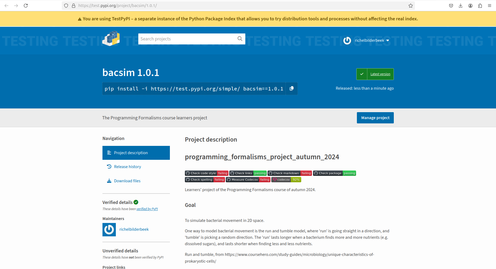

---
tags:
  - package
  - packaging
  - PyPI
---

# Package

!!!- info "Learning outcomes"

    - Understand how to package a Python project
    - Package our Python project locally
    - Run a script with our Python project
    - Upload our package to PyPI

???- question "For teachers"

    Prerequisites are:

    - .

    Teaching goals are:

    - .

    Prior:

    - .

    Lesson plans:

    ```mermaid
    gantt
      title Lesson plan pair programming 1
      dateFormat X
      axisFormat %s
      Introduction : intro, 0, 5s
      Theory 1: theory_1, after intro, 5s
      Exercise 1: crit, exercise_1, after theory_1, 15s
      Feedback 1: feedback_1, after exercise_1, 5s
      Theory 2: theory_2, after feedback_1, 5s
      Exercise 2: crit, exercise_2, after theory_2, 10s
      Exercise 2 after the break: crit, after exercise_2, 5s
    ```

## Why?



> `bacsim` on (the test version of) PyPI

You want to share or re-use your work
in the regular way.

## Exercises

### Exercise 1: install package locally

- Scan the
  ['Python Packaging User Guide' section on 'Packaging Python Projects'](https://packaging.python.org/en/latest/tutorials/packaging-projects/)
  until (and excluding) 'Generating distribution archives'
- Does the learners' project follow all of these guidelines?

???- question "Answer"

    Yes.

    The learners' project already follows all of these guidelines :-)

- Does the learners' project check if our project can be put in a package?

???- question "Answer"

    Yes.

    You can find this in the `.github/workflows/check_package.yaml`
    script

- How does the learners' project put our code into a package?
  You can find it in the CI script.

???- question "Answer"

    The script uses:

    ```bash
    python3 -m pip install .
    ```

- Create a local package from the learners' project's code.
  Use the CI script's code as a hint.

???- question "Answer"

    The script uses:

    ```bash
    python3 -m pip install .
    ```

    However, variations to get this to work on your computer are:

    - use `python` instead of `python3`
    - add `--break-system-packages` at the end,
      i.e. run `python3 -m pip install . --break-system-packages`

- Scan the file `main.py` in the root folder of the learners' project.
  Confirm that it assumes our Python package to be present.
  What is the name of our Python package?

???- question "Answer"

    The script imports a function from `bacsim`:

    ```python
    from bacsim.experiment import (
        run_experiment,
    )
    ```

    Hence, our package is called `bacsim`.

    Another way to find out, is to read `pyproject.toml`, another
    file in the root folder of our project.
    It reads:

    ```toml
    [project]
    name = "bacsim"
    ```

- Run the script `main.py` to verify our package is installed.
  Have you successfully installed our code as a package?

???- question "Answer"

    If you see this error message, the answer is 'no':

    ```bash
    Traceback (most recent call last):
      File "/home/richel/GitHubs/programming_formalisms_project_autumn_2024/main.py", line 10, in <module>
        from bacsimx.experiment import (
    ModuleNotFoundError: No module named 'bacsim'
    ```

    If you get an error such as `Cannot find file 'parameters.csv'`
    it means that our package is installed successfully.
    Sure, it does not do actual work, but it is installed!


### Exercise 2: upload package to PyPI

#### Exercise 2.1: Build the package distribution files

Follow the steps at [here](https://packaging.python.org/en/latest/tutorials/packaging-projects/):

Install `build`:

```bash
python3 -m pip install --upgrade build --break-system-packages
```

Running `build`:

```bash
python3 -m build
```

???- question "How does that look like?"

    ```text
    richel@richel-N141CU:~/GitHubs/programming_formalisms_project_autumn_2024$ python3 -m build
    * Creating isolated environment: venv+pip...
    * Installing packages in isolated environment:
      - hatchling
    * Getting build dependencies for sdist...
    * Building sdist...
    * Building wheel from sdist
    * Creating isolated environment: venv+pip...
    * Installing packages in isolated environment:
      - hatchling
    * Getting build dependencies for wheel...
    * Building wheel...
    Successfully built bacsim-1.0.1.tar.gz and bacsim-1.0.1-py3-none-any.whl
    ```

Now there will be files in the `dist` folder:

???- question "How does that look like?"

    ```bash
    richel@richel-N141CU:~/GitHubs/programming_formalisms_project_autumn_2024$ ls dist/
    bacsim-1.0.1-py3-none-any.whl  bacsim-1.0.1.tar.gz
    ```

Well done, you've just created the package distribution files!

#### Exercise 2.2: Upload our package distribution

Last step is to upload our package distribution files
to [https://test.pypi.org](https://test.pypi.org):

Install `twine`:

```bash
python3 -m pip install --upgrade twine --break-system-packages
```

After registering to [https://test.pypi.org]( https://test.pypi.org), you
have the API token be allowed to upload to testPyPI. Upload:

```bash
python3 -m twine upload --repository testpypi dist/*
```

???- question "How does that look like?"

    ```bash
    richel@richel-N141CU:~/GitHubs/programming_formalisms_project_autumn_2024$ python3 -m twine upload --repository testpypi dist/*
    Uploading distributions to https://test.pypi.org/legacy/
    Enter your API token: 
    Uploading bacsim-1.0.1-py3-none-any.whl
    100% ━━━━━━━━━━━━━━━━━━━━━━━━━━━━━━━━━━━━━━━━ 24.8/24.8 kB • 00:00 • 72.3 MB/s
    Uploading bacsim-1.0.1.tar.gz
    100% ━━━━━━━━━━━━━━━━━━━━━━━━━━━━━━━━━━━━━━━━ 1.6/1.6 MB • 00:00 • 8.5 MB/s

    View at:
    https://test.pypi.org/project/bacsim/1.0.1/
    ```

Indeed, the package can now be found at [https://test.pypi.org/project/bacsim/1.0.1/](https://test.pypi.org/project/bacsim/1.0.1/).

???- question "How does that look like?"

    
