# Pair programming

!!!- info "Learning objectives"

    - Understand why pair programming is important
    - Understand what good pair programming looks like
    - Practice pair programming
    - Practice to convert class diagrams to real code

???- question "For teachers"

    Prerequisites are:

    - Learners can do the git basic workflow on `main`

    Teaching goals are:

    - Learners can tell why pair programming is important
    - Learners can tell how good pair programming looks like
    - Learners have practiced pair programming
    - Learners have converted class diagrams to real code

    Preparation:

    - A shared document where duos can assign themselves to a class,
      needed for exercise 2
    - The learner project must have a folder `/src/[package_name]`
      where learners can put their code,
      needed for exercise 2

    Lesson plan:

    - 5 mins: prior knowledge
      - [questions]
    - 5 mins: presentation
    - 25 mins: challenge
    - 10 mins: feedback

## Introduction

Pair programming is a facet of developing code better.
We use it a lot in this course, because:

- we should
- it works great with recommended teaching practices

## Exercises

See the exercise procedure [here](../misc/exercise_procedure.md).

### Exercise 1: understand pair programming

!!!- info "Learning objectives"

    - Understand what pair programming is
    - First guess at understanding what **good** pair programming is

???- question "For teachers"

    Time schedule:
    - 5 mins: introduce exercise procedure
    - 10 mins: start
    - 5 mins: feedback

```mermaid
gantt
  title Exercise procedure minutes
  dateFormat X
  axisFormat %s
  section Main room
    Move to breakout room : 0, 5
  section Breakout room, together
    Prepare: 5, 6
    Discuss: 16,21
    Back to main room: 21,22
  section Breakout room, individually
  Read   : 6,16
```

- Together, read the questions before reading the material
- Together, divide which team member is going to read which source:
    - [the Wikipedia page on Pair Programming](https://en.wikipedia.org/wiki/Pair_programming).
    - [Martin Fowler's page on Pair Programming](https://martinfowler.com/articles/on-pair-programming.html)
    - (if with three: [Codecademy's page on Pair Programming](https://www.codecademy.com/resources/blog/what-is-pair-programming/))
- Together, set a timer for 10 minutes
- Individually, answer the questions within the time limit
- Together, write down a shared answer on the GitHub project repository
  with path `learners/[a teammember's name]/pair_programming.md`
- Upload the file to the GitHub repo

Questions:

- What is pair programming?
- When to switch roles?
- How does a good pair behave?
- What effects does pair programming have?

???- question "Answers"

    The goals of this exercise are:

    - Understand what pair programming is
    - First guess at understanding what **good** pair programming is

    You just did that. We'll discuss in class :-)

### Exercise 2: practice pair programming

!!!- info "Learning objectives"

    - Practice pair programming
    - Practice to convert class diagrams to real code

Before doing the exercises:

- Reach an agreement on how to do pair programming: among others, 
  decide upon the first driver and when to switch roles.

The exercise, to be done as a pair:

- In the course's shared document, there is a list of classes
  extracted from the design document. Assign yourselves to write a class together
- Find the GitHub repository of a Programming Formalism student project 
  done in an earlier cohort. Find where the Python code for classes ended up.
  Look for the Python code of the most simple class.
- Write the minimal code of your class together. 
  Share code by `push`ing it to the `main` branch.
  'Minimal code' means only the name of the class, without any behavior!

Reflect:

- Were roles swapped often enough?
- Did you solve unexpected problems well?
- Did the driver always share his/her screen?
- Did each team member contribute?
- Did each team member contribute to the code in the Python class? This can be measured :-)

### Exercise 3: practice pair programming again

!!!- info "Learning objectives"

    - Practice pair programming
    - Practice to convert class diagrams to real code

- Do the previous exercise for another class, including the reflection

Reflect additionally:

- As a pair, how did you improve?
- As a pair, how could you have done better?
- As an individual, how could you have done better?

## Links

- [Book 'Pro Git', chapter 'git branching'](https://git-scm.com/book/en/v2/Git-Branching-Branches-in-a-Nutshell)
- [Martin Fowler's website](https://martinfowler.com/articles/on-pair-programming.html)
