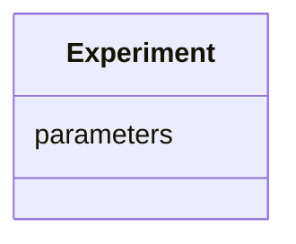

# Dream design

!!! note "Learning objectives"

    - Understand dream design
    - Understand why dream design
    - Understand what a stub is
    - Understand why to use stubs
    - Apply dream design on own class

## Introduction

To design your code, 'dream design' is a way to assure that you work top-down.

!!! note "The term 'dream design' is no formal term."

    'Writing stubs', which is what we are doing,
    is closer to the more formal term,
    but I, Richel, feel 'dream design', 
    albeit no formal term, describes better what is going on.

### Step 0: an empty class

Here, we image a class that performs a computational experiment:


### Step 1: create an experiment

We do not need to use a formal class just yet, and maybe we never will.
At this point in time, an empty `list` could be used too.

Whatever we pick, whether we put our data in a class or in a list,
we can already dream of a function called `create_experiment`:

```python
experiment = create_experiment()
```

=== "Implementation is irrelevant"

    We may even already dream of getting this code to run,
    yet the actual implement is now irrelevant.

=== "Implementation with an empty list"

    ```
    def create_experiment():
        return []

    experiment = create_experiment()
    ```

=== "Implementation with an empty class"

    ```
    class Experiment:
        """An experiment class"""

    def create_experiment():
        return Experiment()

    experiment = create_experiment()
    ```

We can also write a test:

=== "No testing framework"

    ```python
    # Should pass without error
    create_experiment() 
    ```

=== "Using the `unittest` framework"

    ```
    class TestExperiment(unittest.TestCase):

        """Class to test the code in src.bacsim.particle."""

        def test_create_experiment(self):
            # Should pass without error
            create_experiment()
    ```

### Step 2: run the experiment

Now, what do we want to do with it?

Well, we probably want to run it, 
so we can dream of writing a function that runs the experiment:

```python
experiment = create_experiment()
run(experiment)
```

We can imagine that `run` can work on an experiment,
whatever type `experiment` may be.

=== "Implementation is irrelevant"

    The actual implement is now irrelevant.

=== "Implementation"

    ```
    def run(experiment):
        pass
    ```

We can also write a test:

=== "No testing framework"

    ```python
    # Should pass without error
    experiment = create_experiment()
    run(experiment)
    ```

=== "Using the `unittest` framework"

    ```
    class TestExperiment(unittest.TestCase):

        """Class to test the code in src.bacsim.particle."""

        def test_run(self):
            experiment = create_experiment()
            # Should pass without error
            run(experiment)
    ```

### Step 3: run the experiment and get the results

However, running an experiment is not enough:
we need the results of the run.

We dream a bit more precise now:

```python
experiment = create_experiment()
results = run(experiment)
```

We can imagine that `results` holds the results of the experiment,
whatever type it may be.

=== "Implementation is irrelevant"

    The actual implement is now irrelevant.

=== "Implementation"

    ```
    def run(experiment):
        return 42
    ```

'results' sounds like an idea that can be put in a class.
We update our class diagram:


We can also write a test:

=== "No testing framework"

    ```python
    # Should pass without error
    experiment = create_experiment()
    results = run(experiment)
    ```

=== "Using the `unittest` framework"

    ```
    class TestExperiment(unittest.TestCase):

        """Class to test the code in src.bacsim.particle."""

        def test_run_creates_a_result(self):
            experiment = create_experiment()
            # Should pass without error
            results = run(experiment)
    ```


### Step 4: save the results

However, getting the results in the memory of a computer is not enough:
we need to save those results to file.

Hence, we may dream:

```python
experiment = create_experiment()
results = run(experiment)
save(results, "my_results.csv")
```

We can imagine that `save` save the results of the experiment
to a file called `my_results.csv`, whatever type `results` may be.

=== "Implementation is irrelevant"

    The actual implement is now irrelevant.

=== "Implementation"

    ```
    def save(results, filename):
        pass
    ```

We can also write a test:

=== "No testing framework"

    ```python
    experiment = create_experiment()
    results = run(experiment)
    save(results, "my_results.csv")
    ```

=== "Using the `unittest` framework"

    ```
    class TestExperiment(unittest.TestCase):

        """Class to test the code in src.bacsim.particle."""

        def test_save(self):
            experiment = create_experiment()
            results = run(experiment)
            # Should pass without error
            save(results, "my_results.csv")
    ```

### Step 5: a simulation has parameters

Our simulation probably needs parameters.

Hence, we may dream:

```python
parameters = create_parameters()
experiment = create_experiment(parameters)
results = run(experiment)
save(results, "my_results.csv")
```

We can imagine that `create_parameters` creates parameters,
that are used to initialize an experiment.

=== "Implementation is irrelevant"

    The actual implement is now irrelevant.

=== "Implementation"

    ```
    def create_parameters():
        return []

    def create_experiment(parameters = []):
        return parameters
    ```

'An experiment has parameters' makes sense
and we update our class diagram:



We can also write a test:

=== "No testing framework"

    ```python
    parameters = create_parameters()
    experiment = create_experiment(parameters)
    ```

=== "Using the `unittest` framework"

    ```
    class TestExperiment(unittest.TestCase):

        """Class to test the code in src.bacsim.particle."""

        def test_create_an_experiment_with_parameters(self):
            parameters = create_parameters()
            experiment = create_experiment(parameters)
    ```

### Step 6: read parameters from file

Our simulation probably needs to read parameters from a file:

Hence, we may dream:

```python
parameters = read_parameters_from_file("parameters.txt")
experiment = create_experiment(parameters)
results = run(experiment)
save(results, "my_results.csv")
```

We can imagine that `read_parameters_from_file` 
reads parameters from a file.

=== "Implementation is irrelevant"

    The actual implement is now irrelevant.

=== "Implementation"

    ```
    def read_parameters_from_file(filename):
        return []
    ```

We can also write a test:

=== "No testing framework"

    ```python
    # Should pass without errors
    read_parameters_from_file("parameters.txt")
    ```

=== "Using the `unittest` framework"

    ```
    class TestExperiment(unittest.TestCase):

        """Class to test the code in src.bacsim.particle."""

        def test_read_parameters_from_file(self):
            # Should pass without errors
            read_parameters_from_file("parameters.txt")
    ```

### Conclusion

Consider the code we just dreamt:

```python
parameters = read_parameters_from_file("parameters.txt")
experiment = create_experiment(parameters)
results = run(experiment)
save(results, "my_results.csv")
```
This code is very good!

Consider the class diagram we created:


This class diagram is very good!

Consider the tests we dreamt of writing:

```
class TestExperiment(unittest.TestCase):

    """Class to test the code in src.bacsim.particle."""

    def test_create_experiment(self):
        # Should pass without error
        create_experiment()
    def test_run(self):
        experiment = create_experiment()
        # Should pass without error
        run(experiment)
    def test_run_creates_a_result(self):
        experiment = create_experiment()
        # Should pass without error
        results = run(experiment)
    def test_save(self):
        experiment = create_experiment()
        results = run(experiment)
        # Should pass without error
        save(results, "my_results.csv")
    def test_create_an_experiment_with_parameters(self):
        parameters = create_parameters()
        experiment = create_experiment(parameters)
    def test_read_parameters_from_file(self):
        # Should pass without errors
        read_parameters_from_file("parameters.txt")
```

Our tests are good and ensure that our dream remains a reality.

Doing TDD in these steps, may result in the implementation below.
The formal term of each of these functions is called a **stub**.
A 'stub' is 'the first beginning of something'.

```python
def create_parameters():
    return []

def read_parameters_from_file(filename):
    return []

def create_experiment(parameters = []):
    return parameters

def run(experiment):
    return 42

def save(results, filename):
    pass
```

These stubs are already important:
they are the infrastructure of your software.
With the stubs in place, we have **sketched** the functions of our project. 

From here, we can make these stubs actually do something useful, by adding
tests that test actual behavior. For example, `save` should actually create
a file.

## Exercise

### Exercise 1: dream-design

???- note "Learning objectives"

    - Understand dream design
    - Understand why dream design
    - Understand what a stub is
    - Understand why to use stubs

Do:

- Read the text above from start to finish

Answer:

- Is dream design a actual formal term?
- Why use dream design?
- What is a stub?
- Why are stubs important?

???- question "Answers"

    > - Is dream design a actual formal term?

    No. It is an invented term that is felt to better describe what is going on.

    > - Why use dream design?

    To develop readable code in a top-down way,
    as we purposefully ignore details.

    - What is a stub?

    A 'stub' is 'the first beginning of something'.

    - Why are stubs important?

    Stubs are the infrastructure of your software:
    they define inputs and outputs of functions that have understandable names.

Discuss:

- At [conclusion](#conclusion), the dreamt code is given.
  - Do you agree/disagree that the code is good?
  - Can the code be improved? How?
- At [conclusion](#conclusion), the dreamt class diagram is given.
  - Do you agree/disagree that the class diagram is good?
  - Can the class diagram be improved? How?
- At [conclusion](#conclusion), the dreamt tests are given.
  - Do you agree/disagree that the tests are good?
  - Can the tests be improved? How?
  - Should the tests be removed when the stubs have matured
    into useful functions and are tested for real behavior?
- At [conclusion](#conclusion), one example implementation is given.
  - Do you agree/disagree that the example implementation is good?
  - Can it be improved? How?

### Exercise 2: dream-design your class

???- note "Learning objectives"

    - Apply dream design on own class
