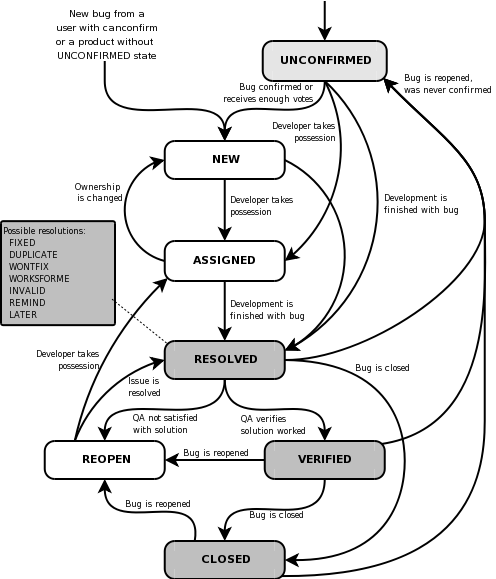

---
tags:
  - Issue
  - Issues
  - Tasks
  - Issue tracker
  - Bug tracker
  - Todo
  - Todo list
---

# Issues

!!!- info "Learning objectives"

    - To be a good team member within a project
    - Use Issues to communicate what needs to be done
    - Assign yourself to Issues to communicate what you are working on

???- question "For teachers"

    Prior:

    - How to keep track of what needs to be done in a project?
    - How to signal to the team what needs to be done?
    - How to prevent team members from working on the same thing?
    - How would you define what an issue is?
    - How do you call the webpage where a list of issues can be seen?


    Lesson plans:

    ```mermaid
    gantt
      title Lesson plan pair programming 1
      dateFormat X
      axisFormat %s
      Introduction : intro, 0, 5s
      Theory 1: theory_1, after intro, 5s
      Exercise 1: crit, exercise_1, after theory_1, 15s
      Feedback 1: feedback_1, after exercise_1, 5s
      Theory 2: theory_2, after feedback_1, 5s
      Exercise 2: crit, exercise_2, after theory_2, 10s
      Exercise 2 after the break: crit, after exercise_2, 5s
    ```

A good team member communicates.
Here we show how to communicate to the rest of the team with minimal overhead.

- What needs to be done?
- Who is doing what now?

## Issues

> A bug-tracking database is not just a memory aid or ascheduling tool.
> It doesn 't make it easier to produce great software,
> it makes it possible to create great software.
>
> Joel Spolsky `[Gunderloy, 2007]`

An issue is a unit of work, or something that needs to be done.
All issues are stored in an issue tracker.
The issue tracker is a fundamental communication tool in
teams `[Bertram, 2009]`

English                 |Issue                          |Describe
------------------------|-------------------------------|----------------------------------------
This needs to be done!  |Create an issue                |Why and what needs to be done
I am on it!             |Assign yourself to an issue    |-
You are best to do this!|Assign someone else to an issue|Why you think the other is best to do it
Done!                   |Closing an issue               |Why it is done
Nah, it is not done yet!|Re-opening an issue            |Why it was not done



> The life cycle of a issue, from `[Bugzilla, 2009]`

## Issues based on requirements

Some issues originate from the requirements documents, as shown below.

!!! note "In academia"

    In academia, instead of using a formal requirements document,
    you can use sentences from the 'Methods' section too.

    Writing the 'Methods' section and issues goes hand-in-hand.

!!! note "R1: Create testing parameter set"

    The requirements documentation states:

    Requirement ID | Requirement Description   | Acceptance Criteria                                  | Test Cases
    ---------------|---------------------------|------------------------------------------------------|----------------------------------------------
    R2             | Create testing parameters | A parameter set can be created to be used in testing |The test parameter set must be a parameter set

    To do so, create a function called `create_test_parameters` in a file called `parameters.py`

    The function needs no input arguments.

    The function creates a parameter set with reasonably normal default settings.

    The data type of the parameter set must be a class called `Parameters`, 
    but use a [list](https://docs.python.org/3/tutorial/datastructures.html)
    of strings if this is not specified yet.

    Note the related requirent R2: 'check that parameters are well-formed'

!!! note "R2: check that parameters are well-formed"

    The requirements documentation states:

    Requirement ID | Requirement Description        | Acceptance Criteria                     | Test Cases
    ---------------|--------------------------------|-----------------------------------------|----------------------------------------------
    R2             | Can recognize valid parameters | A valid parameter set can be recognized |Parameters (such as R1) must be recognized as valid, others as invalid

    To do so, create a function called `are_parameters` in a file called `parameters.py`

    The function needs one argument, which is the value to determine
    if it is a parameter set.

    The function returns `True` if the value is indeed a
    valid/well-formed/correct parameter set and returns `False` otherwise.

    Note the related requirent R1: 'Create testing parameter set'

!!! note "R3: Read parameters from file"

    The requirements documentation states:

    Requirement ID | Requirement Description                  | Acceptance Criteria                                        | Test Cases
    ---------------|------------------------------------------|------------------------------------------------------------|-------------------------------------------------------------------------
    R3             | Read parameters from file                |Parameters can be supplied as a file                        |The simulation uses the same parameters as specified in a parameters file

    To do so, create a function called `read_parameters` in a file called `parameters.py`

    The function needs a filename as input and creates a [dictionary](https://docs.python.org/3/tutorial/datastructures.html#dictionaries)
    of parameter name to parameter values, such as `{'initial_number_of_bacteria': '1000', 'duration': '1000 timesteps'}`.

    Create a test parameters file, e.g. `test_parameters.csv` to test that
    the values read by `read_parameters` match those in the file.

!!! note "R4: Create a test bacterium"

    The requirements documentation states:

    Requirement ID | Requirement Description                  | Acceptance Criteria                                        | Test Cases
    ---------------|------------------------------------------|------------------------------------------------------------|--------------------------------------
    R4             | Create a test bacterium                  | A bacterium can be created to be used in testing           |The test bacterium must be a bacterium

    To do so, create a function called `create_test_bacterium` in a file called `bacterium.py`

    The function needs no input arguments.

    The function creates a bacterium with reasonably normal default settings.

    The data type of the bacterium must be a class called `Bacterium`, 
    but use a [list](https://docs.python.org/3/tutorial/datastructures.html)
    of strings if this is not specified yet.

!!! note "R5: check that a bacteria is well-formed"

    The requirements documentation states:

    Requirement ID | Requirement Description        | Acceptance Criteria                            | Test Cases
    ---------------|--------------------------------|------------------------------------------------|----------------------------------------------
    R5             | Can recognize a bacterium      | A valid (in-memory) bacterium can be recognized|A bacterius (such as R4) must be recognized as valid, others as invalid

    To do so, create a function called `is_bacterium` in a file called `bacterium.py`

    The function needs one argument, which is the value to determine
    if it is a bacterium.

    The function returns `True` if the value is indeed a
    valid/well-formed/correct bacterium and returns `False` otherwise.

    Note the related requirent R4: 'Create a test bacterium'

## Our project

In our project we use the following rules:

- Always work on an issue, create an issue if needed
- Issues are always based on the requirements document
- First part of an issue can be to add it to the
  requirements document.
  Sure, the product owner is usually is charge of this, but in this
  project, everyone is a bit of a product owner :-)

## Exercises

### Exercise 1: a typical issue lifecycle

Do the following in our student project:

- Create a test issue.
  In the text, write why you create that issue and what needs
  to be done
- Assign yourself to the issue
- Close the issue. In the text, write why you close that issue

### Exercise 2: learners' project: create an issue

For the learners' project:

- create at least one issue for things that
  you think need to be done, based on the design document.
  Assign yourself to one issue

!!! note "Duplicates"

    Sometimes, two issues describe the same problem.
    This is called a duplicate.
    Because duplicates are not uncommon,
    there is an issue label called `duplicate`.

!!! note "Managing issues"

    For a fresh project, there are many things to do.
    It is not uncommon to have an 'issue manager'
    that keeps an overview of all issues.

## Discussion

Issues are useful to communicate:

- what needs to be done
- who is planning to do what
- what is already done

However, an issue tracker is not designed to
communicate what is _actively_ being worked on.
For that, a [kanban board](kanban_board.md) is used instead.

## References

- `[Bertram, 2009]` Bertram, Dane. "The social nature of issue tracking in software engineering." University of Calgary (2009).
- `[Gunderloy, 2007]` Gunderloy, Mike, ed. Painless project management with FogBugz. Berkeley, CA: Apress, 2007.

- `[Bugzilla, 2009]` Bugzilla (2009). Life Cycle of a Bug.
  Retrieved October 30, 2009 from <https://www.bugzilla.org/docs/2.18/html/lifecycle.html>
