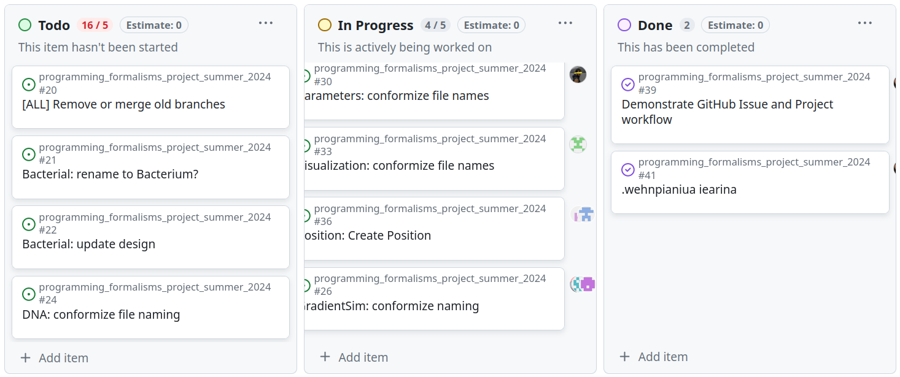

---
tags:
  - Kanban
  - Kanban board
  - Project
  - Project page
  - In progress
  - To do
  - Done
---

# Kanban board

!!!- info "Learning objectives"

    - To be a good team member within a project
    - Use a kanban board to get an overview of what is actively being worked on
    - Use a kanban board to communicate what you are working on now
    - Put your issue(s) in the kanban board, in the right column(s)

???- question "For teachers"

    Prior:

    - How to signal what you are working on now?
    - How would you define what a kanban board is?
    - How does one use a kanban board?

    Lesson plans:

    ```mermaid
    gantt
      title Lesson plan pair programming 1
      dateFormat X
      axisFormat %s
      Introduction : intro, 0, 5s
      Theory 1: theory_1, after intro, 5s
      Exercise 1: crit, exercise_1, after theory_1, 15s
      Feedback 1: feedback_1, after exercise_1, 5s
      Theory 2: theory_2, after feedback_1, 5s
      Exercise 2: crit, exercise_2, after theory_2, 10s
      Exercise 2 after the break: crit, after exercise_2, 5s
    ```



A good team member communicates.
Here we show how to communicate to the rest of the team with minimal overhead.

- What needs to be done?
- Who is doing what now?

## Exercises

### Exercise 1: use the Kanban board

Do the following in our student project:

- Create an issue. In the text, write why you create that issue and what needs
  to be done
- Assign yourself to the issue
- Connect the issue to the project page: it should show up in the
  'To do ' column. There are multiple ways to do so.
- Move the issue to the 'In progress page'. There are multiple ways to do so.
- Close the issue. In the text, write why you close that issue
- If needed, move the issue to the 'Done' column.

### Exercise 2: learners' project

For the learners' project:

- For the issue(s) you are assigned to, add these to the kanban board.
  Put these in the right column. You should (probably)
  maximally put one issue in the 'In progress' column, as one can only
  actively work on one issue at a time

