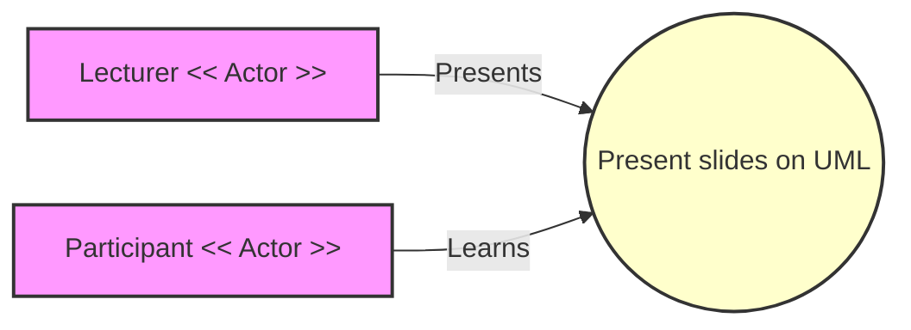

---
tags:
  - project
  - analysis
---

# Planning


## First Phase: Analysis

As you have heard the first phase in any software development is Analysis phase or Requirements phase or Inception phase (Swedish idiom "Kärt barn har många namn"-translation "Dearest child has many names") in this is the phase we are focusing on in this lecture. **The goal of the analysis phase is to figure out what the program should do and  what needs the program must meet**. It like all other phases of modern software development is done in an iterative loop or spiral.
In this early stage a focus is on Requirements sometimes also called needs determination and risk analysis. The First thing to remember and include in your analysis is the scope of your project both in time and scale so that you do not over commit both in choice of level of formalism and amount of features that you which to construct.

### Requirements

!!! info "Why do we need to specify requirements?"

    According to Merlin Dorfman (article reproduced in chapter 1 requirements
    engineering) the results from the software crisis in the 1960s gave rise
    to the following problem *"In nearly every software project which fails
    to meet performance and cost goals,requirements inadequacies play a major and expensive role in project failure"*

Richard Harwell et. al states
*"Each contract specialist, lawyer, engineer,
systems engineer, manager, or anyone else involved in
the transition Division into product, bas his or her own
definition of a requirement, With the rare exception, all
are applicable and meaningful"*

-- "What is a Requirement?"

What guidance can we then gleen in what a Requirement is the above mentioned paper asses that
**"if it mandates that something must be accomplished, transformed, produced, or provided, it is a requirement"**[R. Harwell et al, 1993]

According to ISO/IEC/IEEE 29148:2018 (Systems and software engineering — Life cycle processes — Requirements engineering)
**Defining requirements begins with stakeholder needs (or goals, or objectives) that are refined and
evolve before arriving as valid stakeholder requirements.**

!!!- info "What is a well formed Requirement" (ISO/IEC/IEEE 29148:2018)?"

    A well-formed specified requirement contains one or more of the following:
        — it shall be met or possessed by a system to solve a problem, achieve an objective or address a stakeholder concern;
        — it is qualified by measurable conditions;
        — it is bounded by constraints;
        — it defines the performance of the system when used by a specific stakeholder or the corresponding capability of the system but not a capability of the user, operator or other stakeholder; and
        — it can be verified (e.g., the realization of the requirement in the system can be demonstrated).

The generalize SDLC, from the IEEE Guide—Adoption of ISO/IEC TR 24748-1:2010 starts with needs analysis


Needs Gathering which is the first steps have many different names in the different software development models,
usually named Use Cases or User Stories or something similar



```pseudo-code

graph LR
    classDef actor fill:#f9f,stroke:#333,stroke-width:2px
    classDef usecase fill:#ffc,stroke:#333,stroke-width:2px

    A[Lecturer << Actor >>] -- Presents --> B((Present slides on UML))
    C[Participant << Actor >>] -- Learns --> B

    class A actor;
    class B usecase;
    class C actor;

```

!!! info "Finding the needs!"

    Is a process of finding the subjects and verbs of the project brief and formalize them as testable statements, once that is done we do our first iteration of risk analysis on those sets.


!!! info "Project brief"

    Using the information in Bergström et. al and the Data specified in the project. Do some analysis on data from an Uppsala weather station and present the result to the user in a structured manner.

    `[Bergström & Moberg, 2002]` Bergström, Hans, and Anders Moberg. "Daily air temperature and pressure series for Uppsala (1722–1998)."
    Climatic change 53.1 (2002): 213-252
    [PDF](https://www.smhi.se/download/18.6ae791dc18fc9e7539e1121c/1717658901728/Bergstr%C3%B6m_Moberg_Uppsala.pdf)
    [Data](https://www.smhi.se/download/18.53cdce23194f389da053a4e/1740398333056/uppsala_tm_1722-2022.zip)

!!! exercise  "Generate the Needs for the Project"

    We shall make a short description of a "Use Case" and the needs that that "Use case" generates the Needs will then be clarified as requirements


???- "Where do you start?"

    - project brief, if you are given a project brief or write one your self the project brief should state the problem you would like to solve and any related ideas and constraints you have on the project. This is done in plain english
    - Problem statement, the problem statement is a subset of the project brief as it only describes the problem you wish to solve.

!!! exercise  "Generate Requirements for the Project"
    Using your user stories generate a requirement document in markdown that follows the below specification.

!!! hint "How does a typical requirements document look like?"

    A typical requirements document can be made in a spreadsheet program of your choice or as a table in a markdown document as you will see later.

!!! info "Commonly used categories of requirements"

    - Requirement ID
    - Requirement Description
    - Acceptance Criteria
    - Test Cases
    <br />
    - Risk
    - Risk type
    - Risk probability
    - Risk severity
    - Risk value(Probability x Severity)


???- info "Design process document"
    A Design process document is created when the process software design and or
    analysis needs to be specified to keep the development on track.
    It is created on organizational level to make sure that all project follow a
    similar documentation, and analysis and Design path. (If AI is heavily used in the Analysis and Design phase this document define when and how to use the AI tools and how to document its uses.)

    Here is an example design process document:

    > When gathering requirements for the program
    > the first iteration is based on analyzing
    > the project brief for subjects and actions,
    > i.e nouns and verbs that will describe the possible
    > demands the users have on the system,
    > after the first pass pay attention to adjective and adverbials
    > that may change a need or requirement.
    >
    > After this make a Table of requirements,
    > from this a system use case design can begin.
    > After the use cases have been determined,
    > go through each use case
    > and see how an object or action can solve this use case.
    >
    > Design a object/class diagram to reflect this possibly
    > through a collaborations diagram.


???- info "Example requirements specification"

    Here is an example of the needs part of the requirements specification:

    Requirement ID | Requirement Description | Acceptance Criteria | Test Cases
    ---------------|-------------------------|---------------------|------------
    R1             | Visual Display          | The program must display a field with particles and a visual cue to runtime settings | - Verify that the program opens a graphical window or interface for displaying particles.
    R2             | Particle Initialization | Particles must be initialized with positions and speeds and constants relevant to the simulation such as gravity or energy potentials and parameters must be initialized | - Confirm that each particle has a unique position and speed. and that each parameter is set
    R3             | Particle Interaction    | Particles must interact with each other with at least pair wise interactions | - Implement a chosen interaction (e.g., gravitational attraction, Lennard-Jones potential, or direction alignment). - Verify that particles respond to each other's presence.
    R4             | Boundary Condition      | Choose a boundary condition for the field  this includes how to handle interactions across borders| - Implement chosen boundary conditions (e.g., bounce, wrap, or elimination). - Confirm that particles behave according to the chosen boundary conditions.
    R5             | Simulation Step         | The simulation should progress in discrete steps | - Implement a mechanism to advance the simulation step by step
    R6             | Real-time Visualization | Draw each simulation step with a suitable frame rate update | - Ensure that the simulation displays each step visually as it progresses.
    R7             | Maximum Particle Limit  | The simulation should handle a maximum number of particles set in the runtime settings| - Test the simulation with varying numbers of particles up to the maximum limit and verify that it remains stable.
    R8             | Acceptable Framerate    | The simulation should maintain an acceptable framerate even at maximum number of particles| - Measure and verify that the framerate remains above a defined threshold with the maximum number of particles.
    R9             | Stop Simulation         | Ability to stop the simulation through interruption of the current main loop  | - Implement a user interface or mechanism to stop the simulation.  and check that the simulation ends when such mechanisms are invoked
    R10            | Restart simulation      | A simulation should be able to restart without restarting the interface| Test that the implementation of the restart function can activate after the simulation has ended
    R11            | Test-Driven Development | Develop the project using TDD | - Write test cases before implementing each feature or functionality. - Ensure that the tests pass after implementing the code


## Risk analysis

Risk analysis is central in some systems like RDD(Risk Driven Development),
FDA(FDA-1997-D-0029) splits into two types Business risks and Technical risk.
Where Business risk relates to direct requirements while technical risks
are from derived requirements.
One type of risk assessment is the Failure modes and effects analysis commonly abbreviated FMEA
which calculate the risk in Probability of occurrence x severity of risk **RISK=PxS** a risk matrix is used to define what level of severity and occurrence warrants what action.

!!! hint "How big should the risk analysis matrix be?"

    It is common is to divide it in 5 severity categories and 5 probability
    levels then establishing a table as below to asses which needs are the
    most important to address.
    Risk probability goes from P1 (very unlikely to occur) - P5(Happens in all execution)
    Risk severity goes from S1(minor or no effect),S2(Some Impact or noticeable by user),S3(Major impact on execution of program or result with minor loss of resources at end user),S4(Prevents execution of software or cause major loss of resources to user), S5(major injury or death cause by unhandled risk)

<table>
 <tr>
    <th>Probability/Severity</th>
    <th>S1</th>
    <th>S2</th>
    <th>S3</th>
    <th>S4</th>
    <th>S5</th>
  </tr>
  <tr>
    <td>P5</td>
    <td style="background-color: DARKGOLDENROD">
      <p align=center>5</p>Supplementary issue
    </td>
    <td style="background-color: ORANGE">
      <p align=center>10</p>Issue
    </td>
    <td style="background-color: RED">
      <p align=center>15</p>Unacceptable
    </td>
    <td style="background-color: RED">
      <p align=center>20</p>Unacceptable
    </td>
    <td style="background-color: RED">
      <p align=center>25</p>Unacceptable
    </td>

  </tr>
  <tr>
    <td>P4</td>
    <td style="background-color: GREEN">
     <p align=center>4</p>Acceptable
    </td>
    <td style="background-color: DARKGOLDENROD">
      <p align=center>8</p>Supplementary issue
    </td>
    <td style="background-color: ORANGE">
      <p align=center>12</p>Issue
    </td>
    <td style="background-color: RED">
    <p align=center>16</p>Unacceptable
    </td>
    <td style="background-color: RED">
    <p align=center>20</p>Unacceptable
    </td>

  </tr>
  <tr>
    <td>P3</td>
   <td style="background-color: GREEN">
   <p align=center>3</p>Acceptable
   </td>
    <td style="background-color: DARKGOLDENROD">
    <p align=center>6</p>Supplementary issue
    </td>
    <td style="background-color: DARKGOLDENROD">
      <p align=center>9</p>Supplementary issue
    </td>
    <td style="background-color: ORANGE">
      <p align=center>12</p>Issue
    </td>
    <td style="background-color: RED">
    <p align=center>15</p>Unacceptable
    </td>
  </tr>
  <tr>
    <td>P2</td>
    <td style="background-color: GREEN">
    <p align=center>2</p>Acceptable
    </td>
    <td style="background-color: GREEN">
    <p align=center>4</p>Acceptable
    </td>
    <td style="background-color: DARKGOLDENROD">
    <p align=center>6</p>Supplementary issue
    </td>
    <td style="background-color: DARKGOLDENROD">
    <p align=center>8</p>Supplementary issue
    </td>
    <td style="background-color: ORANGE">
    <p align=center>10</p>issue
    </td>
  </tr>
  <tr>
    <td>P1</td>
    <td style="background-color: GREEN">
    <p align=center>1</p>Acceptable
    </td>
    <td style="background-color: GREEN">
    <p align=center>2</p>Acceptable
    </td>
    <td style="background-color: GREEN">
    <p align=center>3</p>Acceptable
    </td>
    <td style="background-color: GREEN">
    <p align=center>4</p>Acceptable
    </td>
    <td style="background-color: DARKGOLDENROD">
    <p align=center>5</p>Supplementary issue
    </td>
  </tr>
</table>

!!! hint "Where to focus?"

    Focus on the risks  that are issues or unacceptable first.
    Then develop towards risks that are acceptable

???- info "Turning Requirements and Risk matrix into actionable Feature list"

    Using the Requirements and risk matrix we can design a feature list which can be tracked using issues or project tab in Git or in a separate document. The feature list describes how to solve a requirement in plaintext english and with flowcharts This initiates a design phase in the development

[R. Harwell et al] R. Harwell et al. from Proc. 3,dAnn. lnt' I Symp. Nat'I Council Systems Eng.,
1993, pp. 17-24.
