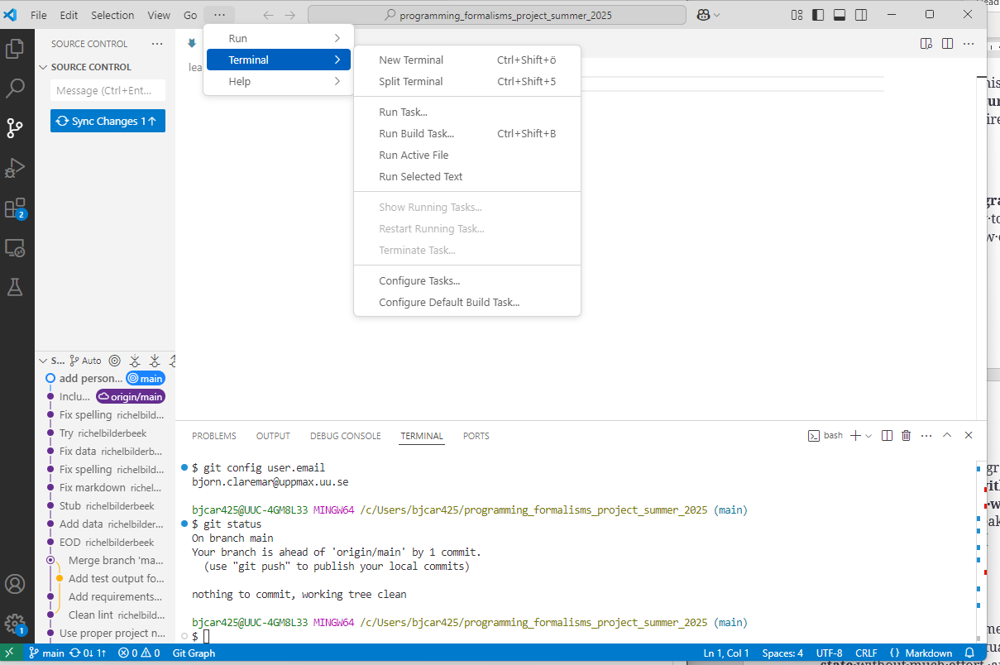

# Get connected to the project repo

!!! info "Learning outcomes of 'Get started with Git/GitHub'"

    Learners

    - are connected to the course repo

!!! note

    - Let's learn details of Git and GitHub later!

## Become member of the course project

- Join [the Autumn 2025 learners' project](https://github.com/programming-formalisms/programming_formalisms_project_autumn_2025)

- Share your GitHub name [at this issue](https://github.com/programming-formalisms/programming_formalisms_project_autumn_2025/issues/1)


## VS Code terminal

- We will work as much as possible (almost) in the VS Code graphical interface for Git
- However, some things are better (or only) handled from a terminal/command line.

- You find the Git Bash terminal From the menu (different on mac and windows)



## Before we continue we need to configure Git

!!! attention

    - Start VS Code

??? warning "This should have been done already"

    - We hope also that you have already done these steps
      [at the 'Prerequisites' page of this course](../misc/faq.md/#prerequisites)
    - **Git and GitHub should be configured prior to the course**
        - Note that Mac users may need to run a command from the terminal to be able to run ``git``: ``sudo xcodebuild -license accept``
        - [Configure Git](https://nbis-reproducible-research.readthedocs.io/en/course_2104/setup/#configure-git)
            - like: ``git config --global user.name "Mona Lisa"``
            - like: ``git config --global user.email "mona_lisa@gmail.com"``

## Get a local clone of the project

???- question "Exercise 2a: clone course project using VS code (4 min)"

    - Start VS code
    - Start new window

    - In GitHub, locate the **Code** button, select **SSH** and click the **copy** symbol to the right

    ???- question "Where is this?"

        ``https://github.com/programming-formalisms/programming_formalisms_project_autumn_2025``

    ???- question "How will the address to clone look like?"

        ``https://github.com/programming-formalisms/programming_formalisms_project_autunr_2025.git``

    - In VS code: Clone Git repository
        - The repo may show up automatically if you are already part of the project. Then click it.
        - Otherwise paste the copied URL
    - Open folder where you want to have your project
        - Create a new one if necessary in the "Open folder File explorer"
    - Select as Repository Destination

???- question "Exercise 2b: (Alternative with command line) clone course project and create folders (4 min)"

    - You may want to create a directory on your computer for this course.
    - You can do it in the normal way or use your terminal, like this, in a good place (like "Courses" if you have that)
    - ``mkdir Programming_formalisms``
    - ``cd Programming_formalisms``
    - In GitHub, locate the **Code** button, select **SSH** and click the **copy** symbol to the right
    - Back in your terminal type ``git clone`` followed by pasting the copied text.
    - The result shall look something like this:

     ```console
     git clone git@github.com:programming-formalisms/programming_formalisms_project_autumn_2025.git
     ```

    **What just happened?**

    - `cd` the new directory that was created
    - list the files with `ls`

!!! summary

    - You should now hopefully be connected to the project and have a local copy of it!
    
