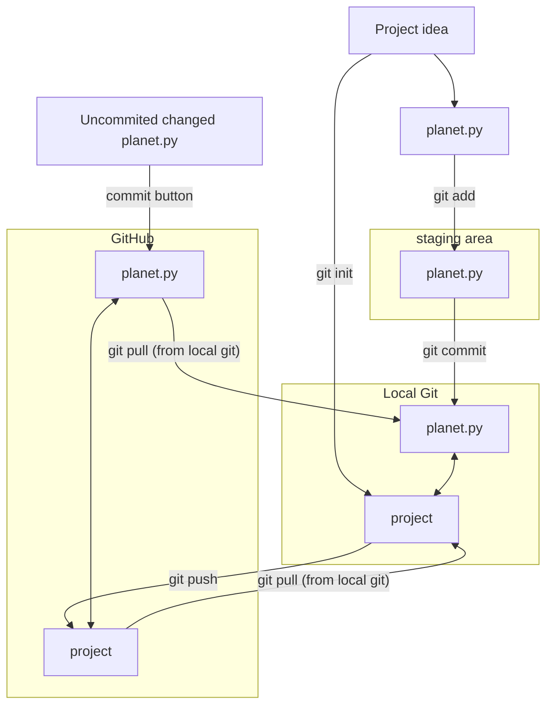

---
tags:
  - project
  - getting started
  - clone
  - start
  - set up
  - setup
---

# Git and get started with a project

!!! info "Learning outcomes of 'Get started with Git/GitHub'"

    Learners

    - are connected to the course repo
    - can commit
    - can write useful commit messages
    - know how a local vs remote repo work
    - can push/pull
    - can manage conflicts
    - are prepared for coming documentation

!!!- note "Instructor notes"

    Prerequisites are:

    - Git acoount
    - GitHub account
    - Git set up on computer

    Not needed

    - Use of git before

???- admonition "Changes"

    - ask about level
    - practical examples than just explain the concept.
    - exercises
        - (advanced exercises)

## What is Git, and what is a Git repository?

- Git is a version control system: can **record/save snapshots** and track the content of a folder as it changes over time.
- Every time we **commit** a snapshot, Git records a snapshot of the **entire project**, saves it, and assigns it a version.
- These snapshots are kept inside a sub-folder called `.git`.
- If we remove `.git`, we remove the repository and history (but keep the working directory!).
- `.git` uses relative paths - you can move the whole thing somewhere else and it will still work
- Git doesn't do anything unless you ask it to (it does not record anything automatically).
- Multiple interfaces to Git exist (command line, graphical interfaces, web interfaces).

## Typical workflow for the course project

- students make development in local git and push to github?
- in principle centralized workflow

**This is used when you are not a collaborator**


**Centralized layout**

- **Red** is the repository on GitHub.
- **Blue** is where all contributors work on their own computers.

- Centralized workflow is often used for **remote collaborative work**.
- `origin` refers to where you cloned from (but you can relocate it).
- `origin/mybranch` is a read-only pointer to branch `mybranch` on `origin`.
- These read-only pointers only move when you `git fetch`/`git pull` or `git push`.

!!! note "Other workflows?"

    - Other workflows in [Merging and contributing with code review](../git/contribute.md)

## Before we continue we need to configure Git

!!! attention

    - Start VS Code

???- note "Did you set up git and GitHub?"

    - **Git and GitHub should be configured prior to the course**
    - We hope also that you have already done these steps HERE **FIX LINK**

## This lesson

- Get overview of the course project
- Get local clone of the course project
- First contribution locally
- Upload changes
- Conflicts and resolutions
- A bit about project organization
- A bit about documentation

## Principles

!!! admonition "Concepts in Git"

    - **repository**: The project, contains all data and history (commits, branches, tags).
        - **Local**: you computer or a server where you have full control
        - **Remote**: server, e.g. GitHub
    - Working locally
        - **add**: Stage you files (collect what to be added to the git record — a kind of middle step)
        - **commit**: Snapshot of the project, gets a unique identifier (e.g. `c7f0e8bfc718be04525847fc7ac237f470add76e`).
    - Working on Github
        - Since you can only add changes in one file at a time, there is no middle step ``git add``
        - ''Commit`` button
    - **cloning**: Copying the whole repository to your laptop - the first time. It is not necessary to download each file one by one.
        - `git clone` copies everything: all commits and all branches.
    - We synchronize commits between local and remote with
    - **git fetch**/**pull** and **git push**.

### Local vs remote

- In this course:
    - Local: Your project in VS code
    - Remote: Repo in GitHub  

### Clone

- Clone to your computer
    - Buttons in VS code or a terminal, using ``git clone``

### Sync from GitHub

- As others are working on the same repo, there may be uploaded changes from *fast* collaborators.
- Do a ``git pull`` to get these changes locally as well.
- Do this before you start with new changes. Good practice!
    - This reduces errors or double work!

### Make changes locally

!!! admonition "Steps add changes to the git history"

    - make changes locally
    - add and commit to the git version control
        - your changes become part of the git history
    - git push
        - your changes are synced to GitHub
    - git pull
        - changes on GitHub are synced to you existinglocal git
        - good procedure to do this step before you start changes


#### Stage files (in git)

!!! info "track the changes"

    - On GitHub:
        - Commit every file individually
    - In local git:
        - Stage one or more (related) files and commit them together

    - All chanegd files

    ```console
    git add .    # < -- "." means all files
    ```
    
    - Chosen files

    ```console
    git add <file1> <file2>    # one or several files
    ```

!!! info "Git Cheat sheet"

    ```console
    git add     # add/stage file(s)
    git commit  # commit staged file(s)
    git status  # see what is going on
    git log     # see history
    git push
    git pull
    ```

#### Commit

- Every time we **commit** a snapshot, Git records a snapshot of the **entire project**, saves it, and assigns it a version.
- BUT only what we have added to the "staging" area!

- ``git commit -m "<commit message>"``

**Alternative commits**

- You can also omit the ``-m`` option and a text editor will open.
- The first line will be your commit message.
- You can add other lines to add some more detailed info about your changes.

!!! tip "Writing useful commit messages"

    [Check this page!](https://uppmax.github.io/programming_formalisms_intro/git_deeper.html#writing-useful-commit-messages)

### Upload to GitHub

```git
git push
```

GitHub is now synced with your changes

- [Workshop on GitHub without command-line](https://coderefinery.github.io/github-without-command-line/)

#### Sync from GitHub (again)

- As others are working on the same repo, there may be uploaded changes from your collaborators
- Do a ``git pull`` to get these changes locally as well.
- Do this before you start with new changes.
    - This reduces errors or double work!

## Exercises

### Overview of the GitHub Project

???- question "Exercise 1: "View the GitHub project at: <https://github.com/programming-formalisms/programming_formalisms_project_summer_2025>"

    - Click on a folder or file in the file explorer.
    - This enables the file "Expand file tree" button to the left of the repo name.
    - Click on that and look at the file tree!
    - View README.md
    - View Code of conduct
    - View License
    - Look at the history ("Commits" button just above the file explorer)

!!! info "Groups of mixed expertise!"

    - 3 to 4 people in each group

### Get a local clone of the project

???- question "Exercise 2a: clone course project using VS code (4 min)"

    - Start VS code
    - Start new window

    - In GitHub, locate the **Code** button, select **HTTPS** and click the **copy** symbol to the right

    ???- question "Where is this?"

        ``https://github.com/programming-formalisms/programming_formalisms_project_summer_2025``
            
    ???- question "How will the address to clone look like?"
        
        ``https://github.com/programming-formalisms/programming_formalisms_project_summer_2025.git``
  
    - In VS code: Clone Git repository
        - The repo may show up automatically if you are already part of the project. Then click it.
        - Otherwise paste the copied URL
    - Open folder where you want to have your project
        - Create a new one if necessary in the "Open folder File explorer"
    - Select as Repository Destination

???- question "Exercise 2b: (Alternative with command line) clone course project and create folders (4 min)"

    - You may want to create a directory on your computer for this course.
    - You can do it in the normal way or use your terminal, like this, in a good place (like "Courses" if you have that)
    - ``mkdir Programming_formalisms``
    - ``cd Programming_formalisms``
    - In GitHub, locate the **Code** button, select **SSH** and click the **copy** symbol to the right
    - Back in your terminal type ``git clone`` followed by pasting the copied text.
    - The result shall look something like this:

     ```console
     git clone git@github.com:programming-formalisms/programming_formalisms_project_summer_2025.git
     ```

    **What just happened?**

    - `cd` the new directory that was created
    - list the files with `ls`

### Exercise 3: Make changes locally (First steps without any conflicts!)

???- question "Exercise 3: Create a folder with your name (locally)"

    - step into (``cd``) the ``learners/`` directory
    - ``mkdir <your-name>``
    - git cannot use emptly directories
    - Therefore **create an empty README file in the created folder**
    - ``cd <your-name>``
    - ``touch README.md``
    - go back to the root of the repo (not necessary)
    - cd ../..

### Exercise 4: Stage files (in git)

???- question "Exercise 4: "Add/stage file"

    - First check the status!

    ```console
    $ git status
    On branch master
    Your branch is up to date with 'origin/master'.

    Untracked files:
      (use "git add <file>..." to include in what will be committed)
            learners/bclaremar/

    nothing added to commit but untracked files present (use "git add" to track)

    ```

    - There are untracked in the repository (directory).
    - You want to **add the files** (focus the camera) to the list of files tracked by Git.
    - Git does not track any files automatically and you need make a conscious decision to add a file.
    - Let's do what Git hints at and add the files:

    ```console
    $ git add .    # < -- "." means all files
    $ git status

    On branch master
    Your branch is up to date with 'origin/master'.

    Changes to be committed:
      (use "git restore --staged <file>..." to unstage)
            new file:   learners/bclaremar/README.md
    ```

    - Now this change is *staged* and ready to be committed.

### Exercise 5: Commit

Let us now commit the change to the repository:

???- question "Exercise 5: Commit"

    ```console
    $ git commit -m "add personal folder"

    [master 5914ad7] add personal folders
     1 file changed, 0 insertions(+), 0 deletions(-)
     create mode 100644 learners/bclaremar/README.md
    ```

    - Right after we query the status to get this useful command into our muscle memory:

    ```console
    $ git status
    On branch master
    Your branch is ahead of 'origin/master' by 1 commit.
      (use "git push" to publish your local commits)

    nothing to commit, working tree clean
    ```

    What does the `-m` flag mean? Let us check the help page for that command:

    ```console
    git help commit
    ```

    - You should see a very long help page as the tool is very versatile (press q to quit).
        - Do not worry about this now but keep in mind that you can always read the help files when in doubt.
        - Searching online can also be useful, but choosing search terms to find relevant information takes some practice and discussions in some online threads may be confusing.
        - Note that help pages also work when you don't have a network connection!

**Alternative commits**

- You can also omit the ``-m`` option and a text editor will open.
- The first line will be your commit message.
- You can add other lines to add some more detailed info about your changes.

!!! tip "Writing useful commit messages"

    [Check this page!](https://uppmax.github.io/programming_formalisms_intro/git_deeper.html#writing-useful-commit-messages)

### Exercise 6: Upload to GitHub

- In previous path we got:

```console
$ git status
On branch master
Your branch is ahead of 'origin/master' by 1 commit.
   (use "git push" to publish your local commits)

nothing to commit, working tree clean
```

???- question "Exercise 6: Let's push back to GitHub"

     ```git
     git push
     ```

### Exercise 7: merge conflicts

- Create a new file with a unique name for your group,
  for example `group_anna_and_sven.txt`
- All members of the team: get it on your local hard drive

???- question "How to get it on my local computer?"

    ```text
    Screenshots of VSCode (if not in course material)
    ```

- One member add the line below at the end of that file
  and does a `git push`:

```text
This is the last line by me, Sven
```

- After this, **without doing a git pull**,
  the other group member(s) add a last line at the end
  (for example, the line shown below) and does a `git push`:

```text
This is the last line by me, Anna
```

- This person will get a merge conflict. How does the file look like?

???- question "Answer"

    The file will look similar to this:

    ```text
    <<<<<< HEAD
    This is the last line by me, Sven
    ======
    This is the last line by me, Anna
    >>>>>> 123456789abcdef
    ```


- How would you resolve this merge conflict?

???- question "Answering"

    Combining these two lines of text is up to taste.
    The text could be replaced by, for example:

    ```text
    This is the last line by us, Anna and Sven
    ```

- Resolve the merge conflict and do a `git push`

## Work directly on GitHub

!!! info "Working on GitHub"

    - You can do basically the **same work at GitHub as in your local git repo**
    - The **graphical view** makes it easier to work with in everyday editing work at least.
        - Depends on your own preferences of course.
    - Here your commit each file at a time with the "commit button".
        - **No staging** that is.
        - Be aware of that feature!
    - **GitHub Actions** are workflows defined by you, like:
        - for automatic testing after each commit (Used in the test lessons)
        - for GitHub Pages, briefly covered in last session today or Extra reading: [Documentation](https://uppmax.github.io/programming_formalisms_intro/documentation_deeper.html).

!!! note "See also"

    - [Workshop on GitHub without command-line](https://coderefinery.github.io/github-without-command-line/)

### What have we done?



## Summary

!!! admonition "Parts to be covered"

    - &#9744; Planning
        - Pseudocode
        - Unified Modelling Language (UML)
    - &#9744; Testing
        - Different levels
    - &#9745; Source/version control
        - Git intro
    - &#9744; Collaboration
        - GitHub
    - &#9744; Reproducibility (for you and others)
        - Deployment
        - Dependencies
        - (Workflows)
    - &#9744; Sharing
        - open science
        - citation
        - licensing
    - &#9745; Documentation
        - Explanation (in code)

!!! keypoints

    - A repository can have one or multiple remotes (we will revisit these later).
    - A remote (GitHub) in this case serves as a full backup of your work.
    - Code development might be easier to develop in the local git repo since you can run and test locally in an easy way.

## Reference Git

- [Main git book](https://git-scm.com/book/en/v2)
- [Pro Git](https://uppmax.github.io/programming_formalisms/reading/chacon_and_straub_2014.pdf)
- Tsitoara, Mariot, and Mariot Tsitoara. "Git best practices." Beginning Git and GitHub: A Comprehensive Guide to Version Control, Project Management, and Teamwork for the New Developer (2020): 79-86.
