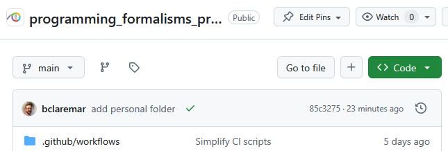

---
tags:
  - project
  - getting started
  - clone
  - start
  - set up
  - setup
---

# Git and get started with a project

!!! info "Learning outcomes of 'Get started with Git/GitHub'"

    Learners

    - are connected to the course repo
    - can commit
    - can write useful commit messages
    - know how a local vs remote repo work
    - can push/pull
    - can manage conflicts
    - are prepared for coming documentation

???- note "Instructor notes"

    - Teacher gives introduction with interaction 20 m
    - Studens work in groups with at least one more used to Git in each

    Prerequisites are:

    - Git account
    - GitHub account
    - Git set up on computer

    Not needed

    - Use of git before

!!! bug "Did you miss to set up everything?"

    - Then try this in the background or ask for help?
    - See the [setup session](configurations.md) this morning?

???- question "Already know git and GitHub?"

    If you have made 25 commits to GitHub,
    we assume you are already know git and GitHub.

    If there is a minority that already knows git and GitHub,
    then those are welcome in the simultaneous session,
    where we'll go a faster and further.

## What is Git, and what is a Git repository?

- Git is a version control system: can **record/save snapshots** and track the content of a folder as it changes over time.
- Every time we **commit** a snapshot, Git records a snapshot of the **entire project**, saves it, and assigns it a version.
- These snapshots are kept inside a sub-folder called `.git`.
- If we remove `.git`, we remove the repository and history (but keep the working directory!).
- `.git` uses relative paths - you can move the whole thing somewhere else and it will still work
- Git doesn't do anything unless you ask it to (it does not record anything automatically).
- Multiple interfaces to Git exist (command line, graphical interfaces, web interfaces).

## Typical workflow for the course project

- students make development in local git and push to github?
- in principle centralized workflow

**This is used when you are a collaborator**


**Centralized layout**

- **Red** is the repository on GitHub.
- **Blue** is where all contributors work on their own computers.

- Centralized workflow is often used for **remote collaborative work**.
- `origin` refers to where you cloned from (but you can relocate it).
- `origin/mybranch` is a read-only pointer to branch `mybranch` on `origin`.
- These read-only pointers only move when you `git fetch`/`git pull` or `git push`.

!!! note "Other workflows?"

    - Other workflows in [Merging and contributing with code review](../git/contribute.md)

## This lesson

- Get overview of the course project
- Get local clone of the course project
- First contribution locally
- Upload changes
- Conflicts and resolutions
- A bit about project organization
- A bit about documentation

## VS Code terminal

- We will work as much as possible (almost) in the VS Code graphical interface for Git
- However, some things are better (or only) handled from a terminal/command line.

- You find the Git Bash terminal From the menu (different on mac and windows)


## Principles with Git

!!! admonition "Concepts in Git"

    - **repository**: The project, contains all data and history (commits, branches, tags).
        - **Local**: you computer or a server where you have full control
        - **Remote**: server, e.g. GitHub
    - Working locally
        - **add**: Stage you files (collect what to be added to the git record — a kind of middle step)
        - **commit**: Snapshot of the project, gets a unique identifier (e.g. `c7f0e8bfc718be04525847fc7ac237f470add76e`).
    - Working on Github
        - Since you can only add changes in one file at a time, there is no middle step ``git add``
        - ''Commit`` button
    - **cloning**: Copying the whole repository to your laptop - the first time. It is not necessary to download each file one by one.
        - `git clone` copies everything: all commits and all branches.
    - We synchronize commits between local and remote with
    - **git fetch**/**pull** and **git push**.

### Clone

- Clone to your computer
    - Buttons in VS code or a terminal, using ``git clone``

### (May be needed if time goes by:) Sync from GitHub

- As others are working on the same repo, there may be uploaded changes from *fast* collaborators.
- Do a ``git pull`` to get these changes locally as well.
- Do this before you start with new changes. Good practice!
    - This reduces errors or double work!

???- question "Difference between ``git pull`` and ``git fetch``?"

    We may cover this later. Not important now!

    - Git **pull** **copies changes** from a remote repository directly **into your** **working directory**, while git **fetch** **does not**.
    - The git **fetch** command only copies changes into your local **Git** repo.
    - The git **pull** command does **both**.
    - You Should Use git **fetch** When…
        - You want to **check** if there are new **updates** on the remote repository but **don't want to apply them immediately**.
        - You are working on new features and you want to **avoid potential merge conflicts**.

### Make changes locally

Tracked files can be in three states.

- Modified: You changed the file.
- Staged: You changed the file and prepared it to be snapshotted.
- Committed: You took a snapshot of the entire project, and the file was part of it.

- On GitHub:
    - Commit every file individually

!!! admonition "Steps add changes to the git history"

    - make changes locally
    - add and commit to the git version control
        - your changes become part of the git history
    - git push
        - your changes are synced to GitHub
    - git pull
        - changes on GitHub are synced to you existinglocal git
        - good procedure to do this step before you start changes

!!! admonition "Update the file(-s)"

    - Save your changes as usual on your computer (e.g. in VS code)

!!! admonition "Stage files (in git)"

    VS CODE

    - Activate the source control environment from left menu!
    - "+" button

    ???- note "From bash terminal"

        - All changed files

        ```console
        git add .    # < -- "." means all files
        ```

        - Chosen files

        ```console
        git add <file1> <file2>    # one or several files
        ```

!!! admonition "Commit"

    - Every time we **commit** a snapshot, Git records a snapshot of the **entire project**, saves it, and assigns it a version (Hash tag).
    - BUT only what we have added to the "staging" area!

    VS CODE

    - Activate the source control environment from left menu!
    - "Commit" button and "Commit message" text

    ???- note "From bash terminal"

        - ``git commit -m "<commit message>"``

        **Alternative commits**

        - You can also omit the ``-m`` option and a text editor will open.
        - The first line will be your commit message.
        - You can add other lines to add some more detailed info about your changes.

!!! tip "Writing useful commit messages"

    - Each commit should stand on its own.
    - Keep your commits small and independent.
    - Write informative commit messages.
    - Each commit message should answer a question.
        - Why was the commit created?
        - What problem does it solve?

    - What Not to Do
        - solve multiple problems in one commit
        - combining commits that have nothing in common.
        - Git as a backup system: commit their changes at the end of each day


    ???+ info "Example"

        Best | Bad | Worst
        -----|-----|------
        [login] Fix typo in DB call | Fixed typo in DB call | Fix typo
        refactor login function for reuse | Changing login function by moving declarations to parameters | Code refactoring
        add new api for user program check| adding a new api for user program check | New user api

        Source: [Git Best Practices (Chap 6 in Beginning Git)](https://learning.oreilly.com/library/view/beginning-git-and/9798868802157/html/484631_2_En_6_Chapter.xhtml)

    [Check this page!](https://uppmax.github.io/programming_formalisms_intro/git_deeper.html#writing-useful-commit-messages)

!!! admonition "Upload to GitHub"

    VS CODE

    - Activate the source control environemnt from left menu!
    - Click the "Sync Changes" button (may be just a symbol)
    - You can add a push message (shown on GitHub then) or leave it empty, then the last commit message will be used.

        ???- note "From bash terminal"

        ```git
        git push
        ```

        GitHub is now synced with your changes

!!! admonition "Sync from GitHub (again)"

    - As others are working on the same repo, there may be uploaded changes from your collaborators
    - Do a ``git pull`` to get these changes locally as well.
    - Do this before you start with new changes.
        - This reduces errors or double work!

???- example "Git/GitHub workflow"

    ```mermaid
    graph TB

      P["Project idea"] -->|git init| Node2
      P["Project idea"] --> planet.py -->|git add| Node4
      Node4 --> |git commit| Node1
      Node2 --> |git push| Node5

      C[Uncommited changed planet.py] -->|commit button| R
      Node5 --> |"git pull (from local git)"| Node2
      R --> |"git pull (from local git)"| Node1
      R <--> Node5

            subgraph "Local Git"
            Node2[project]
            Node1[planet.py]
            Node1 <--> Node2

            end

            subgraph "staging area"
            Node4[planet.py]
            end

            subgraph "GitHub"
            Node5[project]
            R[planet.py]
            end

    ```

## Work directly on GitHub

!!! info "Working on GitHub"

    - You can do basically the **same work at GitHub as in your local git repo**
    - The **graphical view** makes it easier to work with in everyday editing work at least.
        - Depends on your own preferences of course.
    - Here your commit each file at a time with the "commit button".
        - **No staging** that is.
        - Be aware of that feature!
    - **GitHub Actions** are workflows defined by you, like:
        - for automatic testing after each commit (Used in the test lessons)
        - for GitHub Pages, briefly covered in last session today or Extra reading: [Documentation](https://uppmax.github.io/programming_formalisms_intro/documentation_deeper.html).

## Exercises

### Overview of the GitHub Project

!!! info "Groups of mixed expertise!"

    - 3 to 4 people in each group

???- question "Exercise 1: "View the GitHub project at: <https://github.com/programming-formalisms/programming_formalisms_project_summer_2025>"

    - Click on a folder or file in the file explorer.
    - This enables the file "Expand file tree" button to the left of the repo name.
    - Click on that and look at the file tree!
    - View README.md
    - View Code of conduct
    - View License
    - Look at the history ("Commits" button just above the file explorer)

### Exercise 2: Make changes locally (First steps without any conflicts!)

???- question "Exercise 2: Create a folder with your name (locally)"

    - Step into the ``learners/`` directory (VS Code)
    - create a folder there, clicking the "new directory" icon in upper-left part
    - git cannot use emptly directories
    - Therefore **create an empty README.md file INSIDE the created folder**

### Exercise 3: Stage files (in git)

???- question "Exercise 3: "Add/stage file"

    - First check the status!

    


    - There is an **U** (for Untracked) beside the README.md file
    - You want to **add the files** (focus the camera) to the list of files tracked by Git.
    - Git does not track any files automatically and you need make a conscious decision to add a file.
    - Hoover over the Source control icon in the Left menu
        - It should say: "1 pending changes"
    - Let's do what Git hints at and add the files:
    - Click the Icon and then add (stage) the file with the "plus" sign
    - There should now be an **A** (for Added) beside the README.md file

### Exercise 4: Commit

Let us now commit the change to the repository:

???- question "Exercise 4: Commit"

    

    - Write the commit message "add personal folder" and click the button

    - We can check the status by opening the **bash terminal**
    - Choose the Git-bash

    ```console
    $ git status
    On branch master
    Your branch is ahead of 'origin/master' by 1 commit.
      (use "git push" to publish your local commits)

    nothing to commit, working tree clean
    ```

### Exercise 5: Upload to GitHub

- In previous path we got:

```console
$ git status
On branch master
Your branch is ahead of 'origin/master' by 1 commit.
   (use "git push" to publish your local commits)

nothing to commit, working tree clean
```

???- question "Exercise 5: Let's push back to GitHub"

    - Let's "publish" you commits to the common GitHub repo
    - In VS Code: Click the "Sync Changes" button

    

    - You may also give a message,
        - could be the commit message again or something else summarizing several commits or left empty

    

    ???- note "From bash terminal"

        ```git
        git push
        ```

### Exercise 6: Merge conflicts

- Create a new file with a unique name for your group,
  for example `group_anna_and_sven.txt`
- **All members of the team**: get it on your **local computer**
    - That is: you will get several files in total, but each just locally, so far.

???- question "How to do this?"

    - Do the same steps as the exercises above in the folder **Learners/** (not folder with name)


- One member add the line below at the end of that file
  and does a `git push`:

```text
This is the last line by me, Sven
```

- After this, **without doing a git pull**,
  the other group member(s) add a last line at the end
  (for example, the line shown below) and does a `git push`:

```text
This is the last line by me, Anna
```

- This person will get a merge conflict. How does the file look like?

???- question "Answer"

    The file will look similar to this:

    ```text
    <<<<<< HEAD
    This is the last line by me, Sven
    ======
    This is the last line by me, Anna
    >>>>>> 123456789abcdef
    ```

- How would you resolve this merge conflict?

???- question "Answering"

    Combining these two lines of text is up to taste.
    The text could be replaced by, for example:

    ```text
    This is the last line by us, Anna and Sven
    ```

- Resolve the merge conflict and do a `git push`

### (Optional) Exercise 7

- Go back to last session and read more about a topic, like UML and/or Markdown and their syntax!
- Test out the Markdown and/or UML [exercises](./sdlc_tools.md#exercises) directly in GitHub in your personal folder.
- See the rendered pages directly after saving the file(s)!

!!! note "See also"

    - [Workshop on GitHub without command-line](https://coderefinery.github.io/github-without-command-line/)

## Revisit on Directory structure

!!! admonition "Directory structure"

    - **Different projects should have separate folders**

    - README file
    - Data  (version controlled)(.gitignore)
    - Processed data intermediate
    - (Manuscript)
    - Results  data, tables, figures (version controlled, git tags for manuscript version)
    - Src  version controlled code goes here
        - License (here or in the 1st level)
        - Requirements.txt
    - Doc
    - index
    - .gitignore file


## Summary

!!! admonition "Parts to be covered"

    - &#9744; Planning
        - Pseudocode
        - Unified Modelling Language (UML)
    - &#9744; Testing
        - Different levels
    - &#9745; Source/version control
        - Git intro
    - &#9744; Collaboration
        - GitHub
    - &#9744; Reproducibility (for you and others)
        - Deployment
        - Dependencies
        - (Workflows)
    - &#9744; Sharing
        - open science
        - citation
        - licensing
    - &#9745; Documentation
        - Explanation (in code)

!!! keypoints

    - A repository can have one or multiple remotes (we will revisit these later).
    - A remote (GitHub) in this case serves as a full backup of your work.
    - Code development might be easier to develop in the local git repo since you can run and test locally in an easy way.

## Reference Git

- [Main git book](https://git-scm.com/book/en/v2)
- [Pro Git](https://uppmax.github.io/programming_formalisms/reading/chacon_and_straub_2014.pdf)
- Tsitoara, Mariot, and Mariot Tsitoara. "Git best practices." Beginning Git and GitHub: A Comprehensive Guide to Version Control, Project Management, and Teamwork for the New Developer (2020): 79-86.
