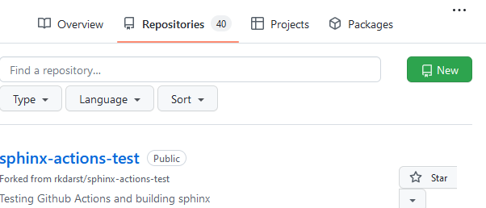
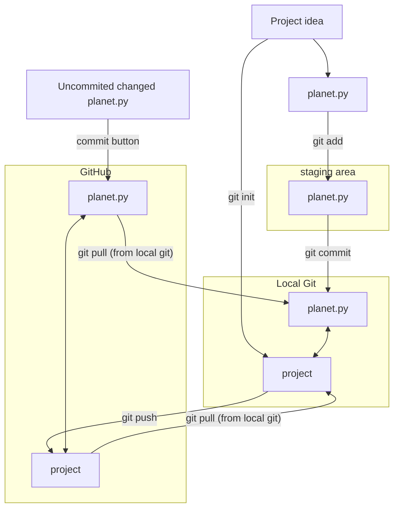

# Get started with a project

!!! questions

    - How to get started?
    - How can I use Git/GitHub?


!!! info "Content"

    - Get started with a git/github project
    - Do the basic `git` workflow
        - create documents
        - initial documentation

!!! info "Learning objectives of 'Get started with Git/GitHub'"

    - Demonstrate the ability to initiate and manage a software development project using Git and GitHub.

!!! note "Instructor notes"

    Prerequisites are:

    - Git acoount
    - GitHub account
    - Git set up on computer

    Teaching goals are:

    - Learners can demonstrate the ability to initiate and manage a software development project using Git and GitHub.

    Lesson Plan: **FIX**
    
    - **Total** 30 min
    - Theory 20
    - Discussions 10 min

!!! note "TOC"

    - A test project: Type-along on starting a project
        - REASON: have tested this step
	- test project (Planet)
	    - code file
            - git init
            - add and commit
	    	- you can also start a directory and do git init 
    - Intro documentation 
        - order your files
	   - README
           - license
	   - git diff
    - Start with the steps related to the project (Type-along)
        - Git locally with config and cloning
	- mkdir user
        - work in user/
        

    

!!! note "Think about:"
    
    - structure of the files and folders for the project
    - documentation already


!!! note
   
   - Many projects/scripts start as something for personal use, but expands to be distributed.
   - Let's start in that end and be prepared.
   - The following steps can be very valuable for you in a couple of months as well as you revisit your code and don't know what it does or why you did this and that.


## Before we continue we need to configure Git

!!! Attention
    - Start your terminal of choice

!!! note "Pre-requirements"

    - **Git and GitHub should be configured prior to the course**
        - Test: ``ssh -T git@github.com``
        - Output should be something like this: ``Hi bclaremar! You've successfully authenticated, but GitHub does not provide shell access.``
    - Being comfortable with the command line. No expertise is required, but the lesson will be mostly taken from the command line.
    - Students should be familiar with using a **text editor** on their system.
    - We hope also that you have already done these steps:
    
    ```console
    $ git config --global user.name "<Your Name>"
    $ git config --global user.email <your GitHub-connected email address>
    $ git config --global init.defaultBranch "main"
    $ git config --global core.editor nano
    ```
    or replace nano with another editor, like in Windows: ``notepad``
    Verify with:
    ```console
    $ git config --list
    ```

## What is Git, and what is a Git repository?

- Git is a version control system: can **record/save snapshots** and track the content of a folder as it changes over time.
- Every time we **commit** a snapshot, Git records a snapshot of the **entire project**, saves it, and assigns it a version.
- These snapshots are kept inside a sub-folder called `.git`.
- If we remove `.git`, we remove the repository and history (but keep the working directory!).
- `.git` uses relative paths - you can move the whole thing somewhere else and it will still work
- Git doesn't do anything unless you ask it to (it does not record anything automatically).
- Multiple interfaces to Git exist (command line, graphical interfaces, web interfaces).

  
!!! admonition "Concepts in Git"

    - **repository**: The project, contains all data and history (commits, branches, tags).
    - **add**: Stage you files (collect what to be added to the git record — a kind of middle step)
    - **commit**: Snapshot of the project, gets a unique identifier (e.g. `c7f0e8bfc718be04525847fc7ac237f470add76e`).
    - **cloning**: Copying the whole repository to your laptop - the first time. It is not necessary to download each file one by one.
        - `git clone` copies everything: all commits and all branches.
    - Branches on the remote appear as (read-only) local branches with a prefix, e.g. `origin/main`.
    - We synchronize commits between local and remote with `git fetch`/`git pull` and `git push`.


## A test project started locally
### Initial code base
- Let's say you have some code you have started to work with

???- question "Exercise: start the test project"

!!! example "Type-along or Demo"

    **You can also listen and try this out yourself when you have time**
    
    - Example code, `planets.py`

    !!!- Code

        ```python
        #planet
        import numpy as np
        import matplotlib.pyplot as plt 

        #constants
        G=6.6743e-11
        AU=149.597871e9 # 1 astronomical unit (AU) is the mean distance between su
        AU1=150.8e9
        mj=5.97219e24
        mJ=1.899e27
        M=1.9891e30
        day=86400;
        year=31556926;
        v0=AU*2*np.pi/year;
        Fg=G*M*mj/AU**2
        ag=Fg/mj
        Fc=mj*v0**2/AU
        ac=Fc/mj

        L=2

        x0=AU1;
        y0=0;
        u0=0;
        x=np.zeros(365*L, dtype=float);
        y=np.zeros(365*L, dtype=float);

        x[0]=x0;
        y[0]=y0;
        u=u0;
        v=v0;

        for i in range(1,365*L):    
            print(i)
            x[i]=x[i-1]+day*u;
            y[i]=y[i-1]+day*v;
            ax=-G*M/(abs(x[i]**2+y[i]**2)**[3/2])*x[i];
            ay=-G*M/(abs(x[i]**2+y[i]**2)**[3/2])*y[i];
            u=u+ax*day;
            v=v+ay*day;

        rj=(x**2+y**2)**.5
        a=max(rj)
        b=min(rj)
        e=1-2/(a/b+1)
        rel=(a/b-1)


        fig=plt.figure(1,figsize=(12,5))
        ax=fig.add_subplot(1,2,1)
        ax.plot(x,y)
        ax.plot (0,0,'o')
        #axis equal

        ax=fig.add_subplot(1,2,2)
        ax.plot(range(0,365*2),rj)

        plt.savefig('../Figures/planet_earth.png', dpi=100, bbox_inches='tight') 

        ```
    - Make a folder with name `planets` 
    	BASH: ´´mkdir planets``
    - Create a folder in the ``planets/`` folder, called ``Figures/``
    - Also create a folder within ``planets/`` folder with the name ``code``
    - In the ``code`` folder, create a file.
    - Copy paste the python code above into it and save as ``planets.py``.

### Initiate a project

!!! example "Type-along or demo"

    - Be in a terminal and go to the ``planets`` folder, which will be the project repository (**repo**)
    - run ``git init``
    - make sure that there is a ``.git`` directory created


    - Now you have a git repo called planets
    - check with the command: ``git status``
    - It is always a safe command to run and in general a good idea to
do when you are trying to figure out what to do next:

    - So far, there is no content. We have to manually add the content to the repo.

    - This is done with the commands ``add`` and ``commit``

### Staging files

???- question "Exercise: git add git commit"

!!! example "no type-along"

    ```console
    $ git status
    
    On branch main

    No commits yet

    Untracked files:
      (use "git add <file>..." to include in what will be committed)
            Figures/
            code/
    nothing added to commit but untracked files present (use "git add" to track)

    ```   
    
- The two files are untracked in the repository (directory).
- You want to **add the files** (focus the camera) to the list of files tracked by Git.
- Git does not track any files automatically and you need make a conscious decision to add a file.
- Let's do what Git hints at and add the files:

!!! example "Type-along or demo"

    ```console
    $ git add .    # < -- "." means all files
    $ git status

    On branch main

    No commits yet

    Changes to be committed:
      (use "git rm --cached <file>..." to unstage)
            new file:   Figures/planet_earth.png
            new file:   code/planet.py    ```

    Now this change is *staged* and ready to be committed.

### Commit
- Every time we **commit** a snapshot, Git records a snapshot of the **entire project**, saves it, and assigns it a version.
- BUT only what we have added to the "staging" area!

Let us now commit the change to the repository:

!!! example "Demo or Type-along"
    ```console
    $ git commit -m "add folders and planet code"

    [main (root-commit) 6a416b5] add folders and planet code
     2 files changed, 58 insertions(+)
     create mode 100644 Figures/planet_earth.png
     create mode 100644 code/planet.py```

    Right after we query the status to get this useful command into our muscle memory:

    ```console
    $ git status

    On branch master
    nothing to commit, working tree clean
    ```
    
What does the `-m` flag mean? Let us check the help page for that command:

```console
$ git help commit
```

- You should see a very long help page as the tool is very versatile (press q to quit).
- Do not worry about this now but keep in mind that you can always read the help files when in doubt.
- Searching online can also be useful, but choosing search terms to find relevant information takes some practice and discussions in some online threads may be confusing.
- Note that help pages also work when you don't have a network connection!   


### Upload to GitHub

???- question "Exercise: github and git push"

!!! example "Demo or Type-along"

    
    - Make sure that you are **logged into GitHub**.

    <figure markdown="span">
    { width="500" }
    </figure>


    - To create a repository we either click the green button "New" (top right corner).

    - Or if you see your profile page, there is a "+" menu (top right corner).


    { width=60% }
    
    ---

    On this page choose a project name, e.g. ``planets-<username>`` 
      - the name there so there are no clashes when/if you collaborate and fork other repositories)
      - Note that the name does not need to be similar to your local git project, but it is good if you can connect them "logically"

    - For the sake of this exercise **do NOT select** "Initialize this repository with a README"
    - but "Choose a license"
    - Let's choose MIT (we may discuss this later on)

    

    - Press "**Create repository**"

         

    - Choose **SSH**
    - Copy-paste the code for "**…or push an existing repository from the command line**"
    - Go to **local git terminal** and go to the **git project you started above**
    - Paste the code

    - Did it work??
    - Reload the GitHub page and see the fiels present locally is also present there.
    
    **Done!**

- **Let's view the license!**
- There is pre-written text for the different types.
- More info at [Licensing](extra_bc/sharing_deeper.mg#licensing)


## Introduction to documentation

### Order your files!

- Think that **everything is worth to be part of documentation** (like GitHub directory tree)
- The parts from the software development cycle
    - The planning parts
        - Requirements: 
        - what should the program deliver
        - dependencies
        - OS platforms
        - Risk analysis
    - Design documentation
        - Analysis: pseudo code and UML
    - Source code
        - with in-code documentation
    - README
    - (Full documentation)
    - (Tutorial)

!!! admonition "Directory structure"

    - **Different projects should have separate folders**

    - ReadMe file
    - Data		(version controlled)(.gitignore)
    - Processed data	intermediate
    - (Manuscript)	
    - Results		data, tables, figures (version controlled, git tags for manuscript version)
    - Src		version controlled code goes here
        - License (here or in the 1st level)
        - Requirements.txt
    - Doc
    - index
    - .gitignore file


!!! note
    - If software is reused in several projects it can make sense to put them in its own repo, not connected to a specific research project

### README files

**Advantages**

- Versioned (goes with the code development)
- It is often good enough to have a `README.md` or `README.rst` along with your code/script
- If you use README files, use either
    - [RST](http://docutils.sourceforge.net/rst.html) or
    - [Markdown](https://commonmark.org/help/)
- A great guide to README files: [MakeaREADME](https://www.makeareadme.com/)

   
!!! info "A README file should include"

    - A descriptive project title
    - Motivation (why the project exists)
    - How to setup
    - Copy-pastable quick start code example
    - Recommended citation

#### Cheat-sheet

```markdown
    **Cheat sheet**
    # This is a section in Markdown   

    ## This is a subsection           

    Nothing special needed for        
    a normal paragraph.               

        This is a code block          


    **Bold** and *emphasized*.       

    A list:                           
    - this is an item                 
    - another item                   
               
```

!!! example "Demo/Type-along"

    - Add a README 


!!! info "See also"

    We will later look at the README file, present in the Course project repository

### In-code documentation

- Comments, function docstrings, ...
- Advantages
  - Good for programmers
  - Version controlled alongside code
  - Can be used to auto-generate documentation for functions/classes
- Disadvantage
  - Probably not enough for users

**Comments examples**

Let's take a look at two example comments (comments in python start with `#`):

**Comment A**
```python
# Now we check if temperature is larger then -50:
if temperature > -50:
    print('do something')
```

**Comment B**
```python
# We regard temperatures below -50 degrees as measurement errors
if temperature > -50:
    print('do something')
```

- Comment A describes **what** happens in this piece of code, whereas comment B describes **why** this piece of code is there, i.e. its **purpose**.
- Comments in the form of B are much more useful, comments of form A are redundant and we should avoid them.

 
**Why and not how**

#### Function docstrings
A docstring is a structured comment associated to a segment of code (i.e. function or class)

Good docstrings describe:

    What the function does
    What goes in (including the type of the input variables)
    What goes out (including the return type)
    Python example: ``help()``
    
**Example**
  
```python

def mean_temperature(data):
    """
    Get the mean temperature

    Args:
        data (pandas.DataFrame): A pandas dataframe with air temperature measurements.

    Returns:
        The mean air temperature (float)
    """
    temperatures = data['Air temperature (degC)']
    return float(sum(temperatures)/len(temperatures))  
  
```

!!! info "Working on GitHub"

    - You can do basically the **same work at GitHub as in your local git repo**
    - The **graphical view** makes it easier to work with in everyday editing work at least.
        - Depends on your own preferences of course.
    - Here your commit each file at a time with the "commit button". 
        - **No staging** that is.
        - Be aware of that feature!
    - **GitHub Actions** are workflows defined by you, like:
        - for automatic testing after each commit (Used in the test lessons)
        - for GitHub Pages, briefly covered in last session today or Extra reading: [Documentation](https://uppmax.github.io/programming_formalisms_intro/documentation_deeper.html).

!!! note "See also"

    - [Workshop on GitHub without command-line](https://coderefinery.github.io/github-without-command-line/)


### Add in-code documentation on Github and pull from local git

!!! example "Type-along: in-code docs"
   
    - Use GitHub
    - Open ``planet.py``
    - Add some documentation (comments in python start with `#`)
    - Example:
    	- Time iteration of the postion of Earth
     	- Make subplots of Earth's revolution and the change of Sun–Earth distance
    - Commit your changes
    	- Note that there is no staging area on GitHub
    - Go to your local git folder in a terminal to get the GitHub changes locally.
    - Do ``git pull`` in the terminal 
    - Also try these commands!
    
    ```console
    $ git log
    $ git log --stat
    $ git log --oneline
    ```

!!! info "Key points"

    - Comments should describe the why for your code not the what.
    - Writing docstrings is an easy way to write documentation while you type code.
    - Copy-pastable quick start code example
    - Recommended citation


### What have we done?



---


## Start with course project

### View the project

- View the GitHub project at: https://github.com/programming-formalisms/programming_formalisms_project_summer_2024

- See the tree!

```bash
├── CODE_OF_CONDUCT.md
├── design
│   └── README.md
├── fairytale.md
├── learners
│   ├── README.md
│   └── richel
│       └── README.md
├── LICENSE
├── programming_formalisms_student_team_summer_2024_logo_50.png
├── README.md
├── run_and_tumble.jpg
└── src
    └── bacsim
        └── README.md
```

- View README.md
- View License
  
!!! admonition "Concepts in Git"
    - **repository**: The project, contains all data and history (commits, branches, tags).
    - **add**: Stage you files (collect what to be added to the git record — a kind of middle step)
    - **commit**: Snapshot of the project, gets a unique identifier (e.g. `c7f0e8bfc718be04525847fc7ac237f470add76e`).
    - **cloning**: Copying the whole repository to your laptop - the first time. It is not necessary to download each file one by one.
        - `git clone` copies everything: all commits and all branches.
    - We synchronize commits between local and remote with 
    	- **git fetch**/**pull** and **git push**.

   
### Clone the course project

???+ question "Exercise: clone course project and create folders"

     **Now you and other people can clone this repository and contribute changes.**

    - You may want to create a directory on your computer for this course. 
    	- You can do it in the normal way or use your terminal, like this, in a good place (like "Courses" if you have that)
    - ``mkdir Programming_formalisms``
    - ``cd Programming_formalisms``
    - In GitHub, locate the **Code** button, select **SSH** and click the *copy* symbol to the right
    - Back in your terminal type ``git clone`` followed by pasting the copied text.
    - The result shall look something like this:

     ```console
     $ git@github.com:programming-formalisms/programming_formalisms_project_summer_2024.git
     ```
    
    !!! tip 
        - Using the SSH makes it very straight-forward to upload your local changes back to GitHub. 
        - Use HTTP if you clone repos that do not belong to you or your group.

    **What just happened?**
    
    - `cd` the new directory that was created
    - list the files with `ls`
    - **Think of cloning as downloading the `.git` part to your computer**. 
    - After downloading the `.git` part the branch pointed to by HEAD is automatically checked out.

    **Create a folder with your name**

    - step into (``cd``) the ``learners/`` directory
    - ``mkdir <your-name>``
    - git add/commit this file

    **Push your changes to the GitHub repo**

    - ``git push``
    
    **When everyone are done pull the latest changes to the local git repo**

    - ``git pull``

## Typical workflow for the course project

- students make development in local git and push to github?
- in principle centralized workflow

{ width=50% }


**Centralized layout**
- **Red** is the repository on GitHub.
- **Blue** is where all contributors work on their own computers.

- Centralized workflow is often used for **remote collaborative work**.
- `origin` refers to where you cloned from (but you can relocate it).
- `origin/mybranch` is a read-only pointer to branch `mybranch` on `origin`.
- These read-only pointers only move when you `git fetch`/`git pull` or `git push`.

## Remarks

!!! Goal

    - [ ] Demonstrate the ability to initiate and manage a software development project using Git and GitHub.

!!! keypoints

    - A repository can have one or multiple remotes (we will revisit these later).
    - A remote (GitHub) in this case serves as a full backup of your work.
    - Code development might be easier to develop in the local git repo since you can run and test locally in an easy way.


!!! admonition "Parts to be covered!"

    - &#9745; Source/version control
        - Git
        - We have a starting point!
        - GitHub as remote backup
    - &#9744; Planning
        - UML
        - Pseudocode
    - &#9744; Testing
        - Different levels
        - We don't do this today!
    - &#9744; Collaboration
        - GitHub
    - &#9745; Sharing
        - &#9745; open science
        - &#9744; citation
        - &#9745; licensing  
    - &#9744; Documentation


