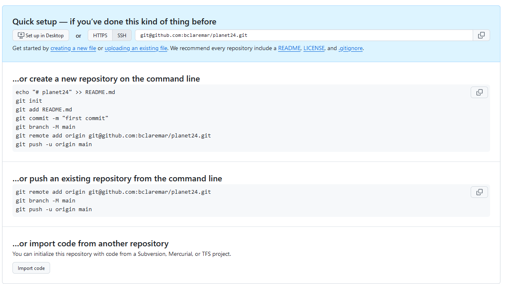

---
tags:
  - project
  - getting started
---

# Get started with a project

!!! questions

    - How to get started?
    - How can I use Git/GitHub?

!!! info "Content"

    - Get started with a git/github project
    - Do the basic `git` workflow
        - create documents
        - initial documentation

!!! info "Learning outcomes of 'Get started with Git/GitHub'"

    Learners
    
    - can demonstrate the ability to initiate and manage a software development project using Git and GitHub.
    - are connected to the course repo
    - know how to do in-code documentation

!!!- note "Instructor notes"

    Prerequisites are:

    - Git acoount
    - GitHub account
    - Git set up on computer

    Teaching goals are:

    - Learners can demonstrate the ability to initiate and manage a software development project using Git and GitHub.

    Lesson Plan: **FIX**

    - **Total** 60 min
    - Theory 20
    - Exercise 300
    - Discussions 10 min

## Before we continue we need to configure Git

!!! attention

    - Start your terminal of choice

???- note "Did you set up git and GitHub?"

    - **Git and GitHub should be configured prior to the course**
    - We hope also that you have already done these steps:

    ```console
    git config --global user.name "<Your Name>"
    git config --global user.email <your GitHub-connected email address>
    git config --global init.defaultBranch "main"
    git config --global core.editor nano
    ```
    
    or replace nano with another editor, like in Windows: ``notepad``
    Verify with:
    
    ```console
    config --list
    ```

!!! note "Add also this!"

    ```console
    git config --global credential.helper cache
    git config --global credential.helper 'cache --timeout=36000'
    ```
    
    - With this we _don't need_ to use ssh and the configuration with ``ssh-keys``, like below:

        - **Git and GitHub should be configured prior to the course**
        - Test: ``ssh -T git@github.com``
        - Output should be something like this: ``Hi bclaremar! You've successfully authenticated, but GitHub does not provide shell access.``

## What is Git, and what is a Git repository?

- Git is a version control system: can **record/save snapshots** and track the content of a folder as it changes over time.
- Every time we **commit** a snapshot, Git records a snapshot of the **entire project**, saves it, and assigns it a version.
- These snapshots are kept inside a sub-folder called `.git`.
- If we remove `.git`, we remove the repository and history (but keep the working directory!).
- `.git` uses relative paths - you can move the whole thing somewhere else and it will still work
- Git doesn't do anything unless you ask it to (it does not record anything automatically).
- Multiple interfaces to Git exist (command line, graphical interfaces, web interfaces).

!!! admonition "Concepts in Git"

    - **repository**: The project, contains all data and history (commits, branches, tags).
    - **add**: Stage you files (collect what to be added to the git record — a kind of middle step)
    - **commit**: Snapshot of the project, gets a unique identifier (e.g. `c7f0e8bfc718be04525847fc7ac237f470add76e`).
    - **cloning**: Copying the whole repository to your laptop - the first time. It is not necessary to download each file one by one.
        - `git clone` copies everything: all commits and all branches.
    - We synchronize commits between local and remote with
    - **git fetch**/**pull** and **git push**.

## Start with course project

- We have already prepared a bit.

### View the project we will work with

???+ Demo "View the GitHub project at: <https://github.com/programming-formalisms/programming_formalisms_project_summer_2025>"

    - Click on a folder or file in the file explorer.
    - This enables the file "Expand file tree" button to the left of the repo name.
    - Click on that and look at the file tree!
    - View README.md
    - View Code of conduct
    - View License
    - Look at the history ("Commits" button just above the file explorer)
    
### Clone the course project

???- question "Exercise: clone course project and create folders (3 min)"

    - You may want to create a directory on your computer for this course.
    - You can do it in the normal way or use your terminal, like this, in a good place (like "Courses" if you have that)
    - ``mkdir Programming_formalisms``
    - ``cd Programming_formalisms``
    - In GitHub, locate the **Code** button, select **SSH** and click the **copy** symbol to the right
    - Back in your terminal type ``git clone`` followed by pasting the copied text.
    - The result shall look something like this:

     ```console
     git clone git@github.com:programming-formalisms/programming_formalisms_project_summer_2025.git
     ```

    **What just happened?**

    - `cd` the new directory that was created
    - list the files with `ls`

### Make changes locally

!!! admonition "Steps add changes to the git history"

    - make changes locally
    - add and commit to the git version control
        - your changes become part of the git history
    - git push
        - your changes are synced to GitHub
    - git pull
        - changes on GitHub are synced to you existinglocal git
        - good procedure to do this step before you start changes

???- question "Exercise: Create a folder with your name (locally)"

    - step into (``cd``) the ``learners/`` directory
    - ``mkdir <your-name>``
    - git cannot use emptly directories
    - Therefore **create an empty README file in the created folder**
    - ``cd <your-name>``
    - ``touch README.md``
    - go back to the root of the repo (not necessary)
    - cd ../..

### Stage files (in git)

!!! info "track the changes"

    - On GitHub:
        - Commit every file individually
    - In local git:
        - Stage one or more (related) files and commit them together
    
!!! info "Git Cheat sheet"

    ```console
    git add     # add/stage file(s)
    git commit  # commit staged file(s)
    git status  # see what is going on
    git log     # see history
    git push
    git pull
    ```

???- question "Exercise: "Add/stage file"

    - First check the status!

    ```console
    $ git status
    On branch master
    Your branch is up to date with 'origin/master'.
    
    Untracked files:
      (use "git add <file>..." to include in what will be committed)
            learners/bclaremar/
    
    nothing added to commit but untracked files present (use "git add" to track)
    
    ```

    - There are untracked in the repository (directory).
    - You want to **add the files** (focus the camera) to the list of files tracked by Git.
    - Git does not track any files automatically and you need make a conscious decision to add a file.
    - Let's do what Git hints at and add the files:

    ```console
    $ git add .    # < -- "." means all files
    $ git status

    On branch master
    Your branch is up to date with 'origin/master'.
    
    Changes to be committed:
      (use "git restore --staged <file>..." to unstage)
            new file:   learners/bclaremar/README.md
    ```

    - Now this change is _staged_ and ready to be committed.

### Commit

- Every time we **commit** a snapshot, Git records a snapshot of the **entire project**, saves it, and assigns it a version.
- BUT only what we have added to the "staging" area!

Let us now commit the change to the repository:

???- question "Exercise: Commit"

    ```console
    $ git commit -m "add personal folder"

    [master 5914ad7] add personal folders
     1 file changed, 0 insertions(+), 0 deletions(-)
     create mode 100644 learners/bclaremar/README.md
    ```

    - Right after we query the status to get this useful command into our muscle memory:

    ```console
    $ git status
    On branch master
    Your branch is ahead of 'origin/master' by 1 commit.
      (use "git push" to publish your local commits)
    
    nothing to commit, working tree clean
    ```

    What does the `-m` flag mean? Let us check the help page for that command:

    ```console
    git help commit
    ```

    - You should see a very long help page as the tool is very versatile (press q to quit).
        - Do not worry about this now but keep in mind that you can always read the help files when in doubt.
        - Searching online can also be useful, but choosing search terms to find relevant information takes some practice and discussions in some online threads may be confusing.
        - Note that help pages also work when you don't have a network connection!

**Alternative commits**

- You can also omit the ``-m`` option and a text editor will open.
- The first line will be your commit message.
- You can add other lines to add some more detailed info about your changes.

!!! tip "Writing useful commit messages"

    [Check this page!](https://uppmax.github.io/programming_formalisms_intro/git_deeper.html#writing-useful-commit-messages)

### Upload to GitHub

- In previous path we got:

```console
$ git status
On branch master
Your branch is ahead of 'origin/master' by 1 commit.
   (use "git push" to publish your local commits)

nothing to commit, working tree clean
```

???- question "Exercise: Let's push back to GitHub"

     ```git
     git push
     ```

!!! info "Working on GitHub"

    - You can do basically the **same work at GitHub as in your local git repo**
    - The **graphical view** makes it easier to work with in everyday editing work at least.
        - Depends on your own preferences of course.
    - Here your commit each file at a time with the "commit button".
        - **No staging** that is.
        - Be aware of that feature!
    - **GitHub Actions** are workflows defined by you, like:
        - for automatic testing after each commit (Used in the test lessons)
        - for GitHub Pages, briefly covered in last session today or Extra reading: [Documentation](https://uppmax.github.io/programming_formalisms_intro/documentation_deeper.html).

!!! note "See also"

    - [Workshop on GitHub without command-line](https://coderefinery.github.io/github-without-command-line/)

### Concluding remarks

- We will work more with the project repo after lunch and the rest of the week
    - Code
    - Documentation

- Get started with documentation
- Before that we will cover starting git project from existing project with no version control.
- Get a personal github project

## Intro to documentation

!!! admonition "Documentation comes in different forms"

    - What _is_ documentation?
        - **Tutorials**: learning-oriented, allows the newcomer to get started
        - **How-to guides**: goal-oriented, shows how to solve a specific problem
        - **Explanation**: understanding-oriented, explains a concept
        - **Reference**: information-oriented, describes the machinery
        - **In-code documentaion — docstrings**
        **Not to forget**
        - Project documentation:
            - requirements: what is the goal of the software, risks, platforms
            - the analysis: pseudocode and UML
            - risk analysis

### In-code documentation

- Comments, function docstrings, ...
- Advantages
    - Good for programmers
    - Version controlled alongside code
    - Can be used to auto-generate documentation for functions/classes
- Disadvantage
    - Probably not enough for users

### Order your files

- Think that **everything is worth to be part of documentation** (like GitHub directory tree)
- The parts from the software development cycle
    - The planning parts
        - Requirements:
        - what should the program deliver
        - dependencies
        - OS platforms
        - Risk analysis
    - Design documentation
        - Analysis: pseudo code and UML
    - Source code
        - with in-code documentation
    - README
    - (Full documentation)
    - (Tutorial)

!!! admonition "Directory structure"

    - **Different projects should have separate folders**

    - README file
    - Data  (version controlled)(.gitignore)
    - Processed data intermediate
    - (Manuscript)
    - Results  data, tables, figures (version controlled, git tags for manuscript version)
    - Src  version controlled code goes here
        - License (here or in the 1st level)
        - Requirements.txt
    - Doc
    - index
    - .gitignore file

## Start a Git/GitHub repo from existing project

!!! note

    - Many projects/scripts start as something for personal use, but expands to be distributed.
    - Let's start in that end and be prepared.
    - The following steps can be very valuable for you in a couple of months as well as you revisit your code and don't know what it does or why you did this and that.

!!! info "Principle"

    - Let's say you have some code you have started to work with
    - Initiate git project
        - Be in a terminal and go to the ``planets`` folder, which will be the project repository (**repo**)
        - run ``git init``
        - make sure that there is a ``.git`` directory created
    - stage and commit
    - upload to github

### Initial code base

- Let's say you have some code you have started to work with

- Choose one of the following

???- question "Exercise A: Start project from one of your existing projects"

    - Just use an existing programming project you have today
    - use it in the follwong steps.
    
???- question "Exercise B: Start the test project"

    - Make a ``test_project`` directory in a good place (like a ``Programming formalisms`` course folder)
    - Create and save a file ``hello.py`` with the following code base and the in-code documentation answering the question "why".

    ```python
    # We just want some output from a simple program
    print('Hello world!')
    ```
    
### Initiate a project

???- question "Exercise: Initiate the project"

    - Be in a terminal and go to the ``project`` folder, which will be the project repository (**repo**)
    - run ``git init``
    - make sure that there is a ``.git`` directory created
        - you have to show hidden files, in bash terminal with ``ls -a``

    - Now you have a git repo called ``test_project``
    - check with the command: ``git status``
    - It is always a safe command to run and in general a good idea to do when you are trying to figure out what to do next:

### Add/Commit

- So far, there is no content. We have to manually add the content to the repo.

???- question "Exercise: Add and commit the content"

    - Add and Commit your changes
    
    ```console
    git add
    git commit -m 'first commit'
    ```
    
    - Look and understand at the output of the following commands

    ```console
    git status
    git log
    git log --stat
    git log --oneline
    ```

### Upload to GitHub

???- question "Exercise: Follow the steps below"

    - Make sure that you are **logged into GitHub**.

    <figure markdown="span">
    { width="500" }
    </figure>


    - To create a repository we either click the green button "New" (top right corner).

    - Or if you see your profile page, there is a "+" menu (top right corner).

    { width=60% }

    ---

    - On this page choose a project name, e.g. ``test_project``

    - **NOTE** It is not necessary to have the same name but it makes things easier to know what is what when syncing between GitHub and git.

    - For the sake of this exercise **do NOT select** "Initialize this repository with a README"
    - and **NO Licence**

    
    > Example project
    
    - Press "**Create repository**"

    

    - Choose **html**
    - Copy-paste the code for "**…or push an existing repository from the command line**"
    - Go to **local git terminal** and go to the **git project you started above**
    - Paste the code

    - Did it work??
    - Reload the GitHub page and see the fiels present locally is also present there.

    **Done!**

### What we did


## Summary

!!! admonition "Parts to be covered"

    - &#9744; Planning
        - Pseudocode
        - Unified Modelling Language (UML)
    - &#9744; Testing
        - Different levels
    - &#9745; Source/version control
        - Git intro
    - &#9744; Collaboration
        - GitHub
    - &#9744; Reproducibility (for you and others)
        - Deployment
        - Dependencies
        - (Workflows)
    - &#9744; Sharing
        - open science
        - citation
        - licensing
    - &#9745; Documentation
        - Explanation (in code)

!!! info "Learning outcomes of 'Get started with Git/GitHub'"

    Learners
    
    - can demonstrate the ability to initiate and manage a software development project using Git and GitHub.
    - are connected to the course repo
    - know how to do in-code documentation

!!! keypoints

    - A repository can have one or multiple remotes (we will revisit these later).
    - A remote (GitHub) in this case serves as a full backup of your work.
    - Code development might be easier to develop in the local git repo since you can run and test locally in an easy way.
