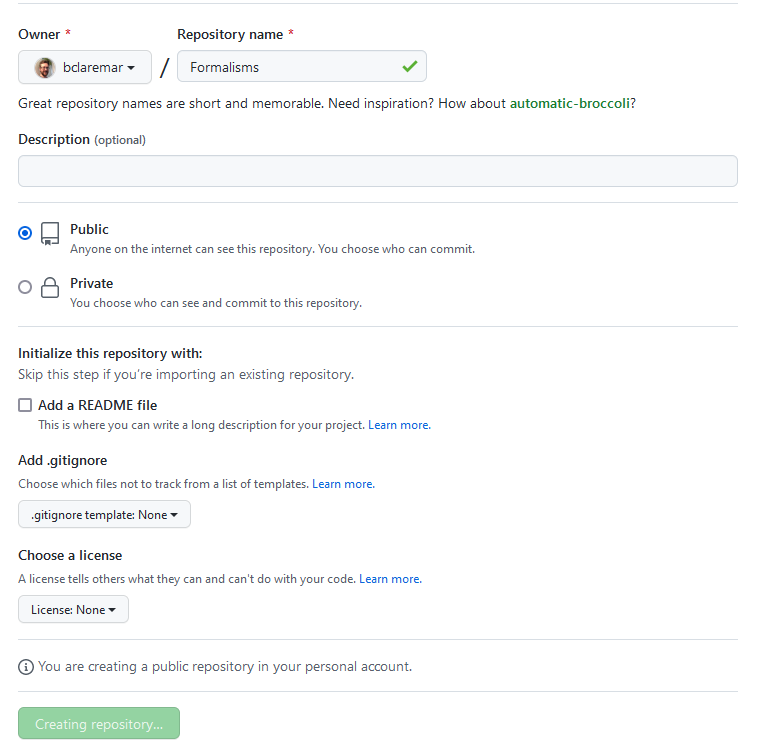

# Get started with a project

!!! questions

    - How to get started?
    - How can I use Git/GitHub?


!!! info "Content"

    - get started with a git/github project
    - do the basic `git` workflow
        - create documents
        - initial documentation

!!! info "Learning objectives of 'Get started with Git/GitHub'"

    - Demonstrate the ability to initiate and manage a software development project using Git and GitHub.

!!! note "Instructor notes"

    Prerequisites are:

    - Git acoount
    - GitHub account
    - Git set up on computer

    Teaching goals are:

    - Learners can demonstrate the ability to initiate and manage a software development project using Git and GitHub.

    Lesson Plan: **FIX**
    
    - **Total** 30 min
    - Theory 20
    - Discussions 10 min

!!! note "TOC"

    - A test project: Type-along on starting a project
        - REASON: have tested this step
	- test project (Planet)
	    - code file
            - git init
            - add and commit
	    	- you can also start a directory and do git init 
    - Intro documentation 
        - order your files
	   - README
           - license
	   - git diff
    - Start with the steps related to the project (Type-along)
        - Git locally with config and cloning
	- mkdir user
        - work in user/
        

    

!!! note "Think about:"
    
    - structure of the files and folders for the project
    - documentation already


!!! note
   
   - Many projects/scripts start as something for personal use, but expands to be distributed.
   - Let's start in that end and be prepared.
   - The following steps can be very valuable for you in a couple of months as well as you revisit your code and don't know what it does or why you did this and that.


## All Exercises

???- question "Exercise: start the test project"

???- question "Exercise: git add git commit"

???- question "Exercise: in-code docs"

???- question "Exercise: github and git push"

???- question "Exercise: clone course project and create folders


## Before we continue we need to configure Git

!!! Attention
    - Start your terminal of choice

!!! note "Pre-requirements"

    - **Git and GitHub should be configured prior to the course**
        - Test: ``ssh -T git@github.com``
        - Output should be something like this: ``Hi bclaremar! You've successfully authenticated, but GitHub does not provide shell access.``
    - Being comfortable with the command line. No expertise is required, but the lesson will be mostly taken from the command line.
    - Students should be familiar with using a **text editor** on their system.
    - We hope also that you have already done these steps:
    
    ```console
    $ git config --global user.name "<Your Name>"
    $ git config --global user.email <your GitHub-connected email address>
    $ git config --global init.defaultBranch "main"
    $ git config --global core.editor nano
    ```
    or replace nano with another editor, like in Windows: ``notepad``
    Verify with:
    ```console
    $ git config --list
    ```


## A test project started locally
### Initial code base
- Let's say you have some code you have started to work with

!!! example "Demo"

    **You can also listen and try this out yourself when you have time**
    
    - Example code, planets.py

    !!!- Code

         python code

    - Make sure the code is in a code folder and in a folder with a good project name
        - Example: planets/code/

### Initiate a project

!!! example "Demo"

    - run ``git init``
    - make sure that there is a ``.git`` directory created


### Upload to GitHub

!!! example "Demo"

    
    - Make sure that you are **logged into GitHub**.

    <figure markdown="span">
    { width="500" }
    </figure>


    - To create a repository we either click the green button "New" (top right corner).

    - Or if you see your profile page, there is a "+" menu (top right corner).


    !New top-right](../img/new-top-right.png){ width=60% }
    
    ---

    On this page choose a project name, e.g. ``planets-<username>`` 
      - the name there so there are no clashes when/if you collaborate and fork other repositories)
      - Note that the name does not need to be similar to your local git project, but it is good if you can connect them "logically"

    - For the sake of this exercise **do NOT select** "Initialize this repository with a README"
    - but "Choose a license"
    - Let's choose MIT (we may discuss this later on)

    

    - Press "**Create repository**"

         

    - Choose **SSH**
    - Copy-paste the code for "**…or push an existing repository from the command line**"
    - Go to **local git terminal** and go to the **git project you started above**
    - Paste the code

    - Did it work??
    - Reload the GitHub page and see the fiels present locally is also present there.
    
    **Done!**

- **Let's view the license!**
- There is pre-written text for the different types.
- More info at [Licensing](extra_bc/sharing_deeper.mg#licensing)


## Introduction to documentation

### Order your files!

- Think that **everything is worth to be part of documentation** (like GitHub directory tree)
- The parts from the software development cycle
  - The planning parts
      - Requirements: 
        - what should the program deliver
        - dependencies
        - OS platforms
      - Risk analysis
  - Design documentation
      - Analysis: pseudo code and UML
  - Source code
    - with in-code documentation
  - README
  - (Full documentation)
  - (Tutorial)

!!! admonition "Directory structure"

    - **Different projects should have separate folders**

    - ReadMe file
    - Data		(version controlled)(.gitignore)
    - Processed data	intermediate
    - (Manuscript)	
    - Results		data, tables, figures (version controlled, git tags for manuscript version)
    - Src		version controlled code goes here
      - License (here or in the 1st level)
      - Requirements.txt
    - Doc
    - index
    - .gitignore file


!!! note
    - If software is reused in several projects it can make sense to put them in its own repo, not connected to a specific research project

### README files

**Advantages**

- Versioned (goes with the code development)
- It is often good enough to have a `README.md` or `README.rst` along with your code/script
- If you use README files, use either
    - [RST](http://docutils.sourceforge.net/rst.html) or
    - [Markdown](https://commonmark.org/help/)
- A great guide to README files: [MakeaREADME](https://www.makeareadme.com/)

   
!!! info "A README file should include"

    - A descriptive project title
    - Motivation (why the project exists)
    - How to setup
    - Copy-pastable quick start code example
    - Recommended citation

### In-code documentation

- Comments, function docstrings, ...
- Advantages
  - Good for programmers
  - Version controlled alongside code
  - Can be used to auto-generate documentation for functions/classes
- Disadvantage
  - Probably not enough for users

````{discussion} In BO:s?
**Comments examples**

Let's take a look at two example comments (comments in python start with `#`):

**Comment A**
```python
# Now we check if temperature is larger then -50:
if temperature > -50:
    print('do something')
```

**Comment B**
```python
# We regard temperatures below -50 degrees as measurement errors
if temperature > -50:
    print('do something')
```
Which of these comments is best? Can you explain why?
````
```{solution} Solution
- Comment A describes **what** happens in this piece of code, whereas comment B describes **why** this piece of code is there, i.e. its **purpose**.
- Comments in the form of B are much more useful, comments of form A are redundant and we should avoid them.
```
 

**Why and not how**

#### Function docstrings
A docstring is a structured comment associated to a segment of code (i.e. function or class)

Good docstrings describe:

    What the function does
    What goes in (including the type of the input variables)
    What goes out (including the return type)
    Python example: help()

!!! info "keypoints"

    - Comments should describe the why for your code not the what.
    - Writing docstrings is an easy way to write documentation while you type code.
    - Copy-pastable quick start code example
    - Recommended citation
    
**Example**
  
```python
def mean_temperature(data):
    """
    Get the mean temperature

    Args:
        data (pandas.DataFrame): A pandas dataframe with air temperature measurements.

    Returns:
        The mean air temperature (float)
    """
    temperatures = data['Air temperature (degC)']
    return float(sum(temperatures)/len(temperatures))  
  
```

**We are ready to**
- Extend the README file
- Make some folders according to the above list
- Put the planning documents in a docs folder

???+ "Example"

   1. Extend the README file a little bit with an **About section** in Markdown format describing the project.
      - Use the **Pencil** button
      - Use the goals stated in last session, [Analysis](https://uppmax.github.io/programming_formalisms_intro/flowcharts.html#analysis)
      - Get inspiration from <https://www.makeareadme.com/> and a favorite Git repo or <https://github.com/yampelo/beagle>. 


    ```markdown
    **Cheat sheet**
    # This is a section in Markdown   

    ## This is a subsection           

    Nothing special needed for        
    a normal paragraph.               

        This is a code block          


    **Bold** and *emphasized*.       

    A list:                           
    - this is an item                 
    - another item                   
               
    ```

???- solution

    
   # Plan

   ## Background

   - Some text
   - Theory: 
   - **Problem**: 
   - **Method**: Use Python
      - Let's go for functional?? programming
   - **Input**: Some initial ...
       - Perhaps also user input of ...
   - **Output**: Graph of ...

   **Development steps** (we extend the program with iterations)
   1. XX system
   1. Add YY
   1. Make modular
   1. Add more ZZ

   ## PlantUML/mermaid

   ```mermaid

   ```

   ## Pseudocode

   ```code
   Define constants
   Define initial values
   (Allocate (book) space for long vectors)
   Iteration
   Plot resulting ...
   Calculate ...
   ```


--------------------------------


## Start with course project

See the tree!

```code
├── CODE_OF_CONDUCT.md
├── design
│   └── README.md
├── fairytale.md
├── learners
│   ├── README.md
│   └── richel
│       └── README.md
├── LICENSE
├── programming_formalisms_student_team_summer_2024_logo_50.png
├── README.md
├── run_and_tumble.jpg
└── src
    └── bacsim
        └── README.md
```

---

  
!!! admonition "Concepts in Git"
- **repository**: The project, contains all data and history (commits, branches, tags).
- **add**: Stage you files (collect what to be added to the git record — a kind of middle step)
- **commit**: Snapshot of the project, gets a unique identifier (e.g. `c7f0e8bfc718be04525847fc7ac237f470add76e`).
- **cloning**: Copying the whole repository to your laptop - the first time. It is not necessary to download each file one by one.
- `git clone` copies everything: all commits and all branches.
- Branches on the remote appear as (read-only) local branches with a prefix, e.g. `origin/main`.
- We synchronize commits between local and remote with `git fetch`/`git pull` and `git push`.
```
   

## Cloning our Plane repository to local

Now you and other people can clone this repository and contribute changes. 


```!!! type-along
- You may want to create a directory for this course. You can do it in the normal way or use your terminal, like this in a good place (like "Courses" if you have that)
  - ``cd Courses``
  - ``mkdir Programming_formalisms``
  - ``cd Programming_formalisms``
- In GitHub, locate the **Code** button, select **SSH** and click the *copy* symbol to the right
- Back in your terminal type ``git clone`` followed by pasting the copied text.
- The result shall look something like this:

```console
$ git clone git@github.com:<user>/planet-<user>.git
```
!!! tip
- Using the SSH makes it very straight-forward to upload your local changes back to GitHub. Use HTTP if you clone repos that do not belong to you or your group.


- This creates a directory called ``planet-<user>`` unless it already exists.

What just happened?
- `cd` the new directory that was created
- list the files with `ls`
- **Think of cloning as downloading the `.git` part to your computer**. 
- After downloading the `.git` part the branch pointed to by HEAD is automatically checked out.
```

## Working on GitHub

- You can do basically the **same work at GitHub as in your local git repo**
- The **graphical view** makes it easier to work with in everyday editing work at least.
  - Depends on your own preferences of course.
- Here your commit each file at a time with the "commit button". 
  - **No staging** that is.
  - Be aware of that feature!
- **GitHub Actions** are workflows defined by you, like:
  - for automatic testing after each commit (Used in the test lessons)
  - for GitHub Pages, briefly covered in last session today or Extra reading: [Documentation](https://uppmax.github.io/programming_formalisms_intro/documentation_deeper.html).

!!! note "See also"

    - [Workshop on GitHub without command-line](https://coderefinery.github.io/github-without-command-line/ )

 
!!! admonition "Parts to be covered!"

    - &#9745; Source/version control
        - Git
        - We have a starting point!
        - GitHub as remote backup
    - &#9744; Planning
        - UML
        - Pseudocode
    - &#9744; Testing
        - Different levels
        - We don't do this today!
    - &#9744; Collaboration
        - GitHub
    - &#9745; Sharing
        - &#9745; open science
        - &#9744; citation
        - &#9745; licensing  
    - &#9744; Documentation

## Typical "Workflow for the course projecct"

- students make development in local git and push to github?
- in principle centralized workflow

```{figure} img/centralized.svg
:alt: Centralized layout
:width: 50%

**Centralized layout**
- **Red** is the repository on GitHub.
- **Blue** is where all contributors work on their own computers.
```

- Centralized workflow is often used for **remote collaborative work**.
- `origin` refers to where you cloned from (but you can relocate it).
- `origin/mybranch` is a read-only pointer to branch `mybranch` on `origin`.
- These read-only pointers only move when you `git fetch`/`git pull` or `git push`.

!!! keypoints

    - A repository can have one or multiple remotes (we will revisit these later).
    - A remote (GitHub) in this case serves as a full backup of your work.
    - Code development might be easier to develop in the local git repo since you can run and test locally in an easy way.

