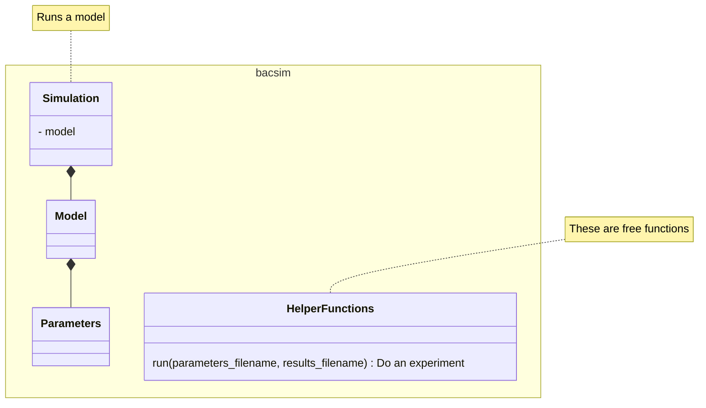

---
tags:
  - reflection
---

# Reflection 2024-04-26 Day 5 by Richel

A reorder: I think UML relations should have been done on Tuesday

Suggest: use standard UML examples. Use simple UML examples. Do not make up
  UML example

Suggest: worked-out examples, these have a high effect size according to
  [Hattie, 2022]

Suggest: remove aggregation, as we don't use it in the project

Suggest: remove describing what one can do in `__init__.py`,
  as we only use it to fix linter errors.

I have no idea when to use `BacteriumInterface` and `Bacterium`, instead
I understand to use `Bacterium` and `BacteriumImpl`.
Where has one read to use the word 'Interface' in the class name?

Saying that something is important never convinces me.
I'd enjoy to hear why something is important.
In figures. With short code examples.

- Describe what containers are, do not compare the types
- Remove build systems, not needed for the project
- No virtual environments, not needed for the project
- No venv comparisons usage for different OSes, not needed for project
- No venv usage, not needed for project
- In-code documentation: either earlier, else not:
  it is not needed for the project now, no formal terminology
- Documenting outside code: not needed for the project, no formal terminology
- Licensing: not needed for the project
- Static HTML website generator: not needed for the project
- I think making a package and using it is a good idea
  and suggest to do it
- No wiki: not needed for the project, no formal terminology
