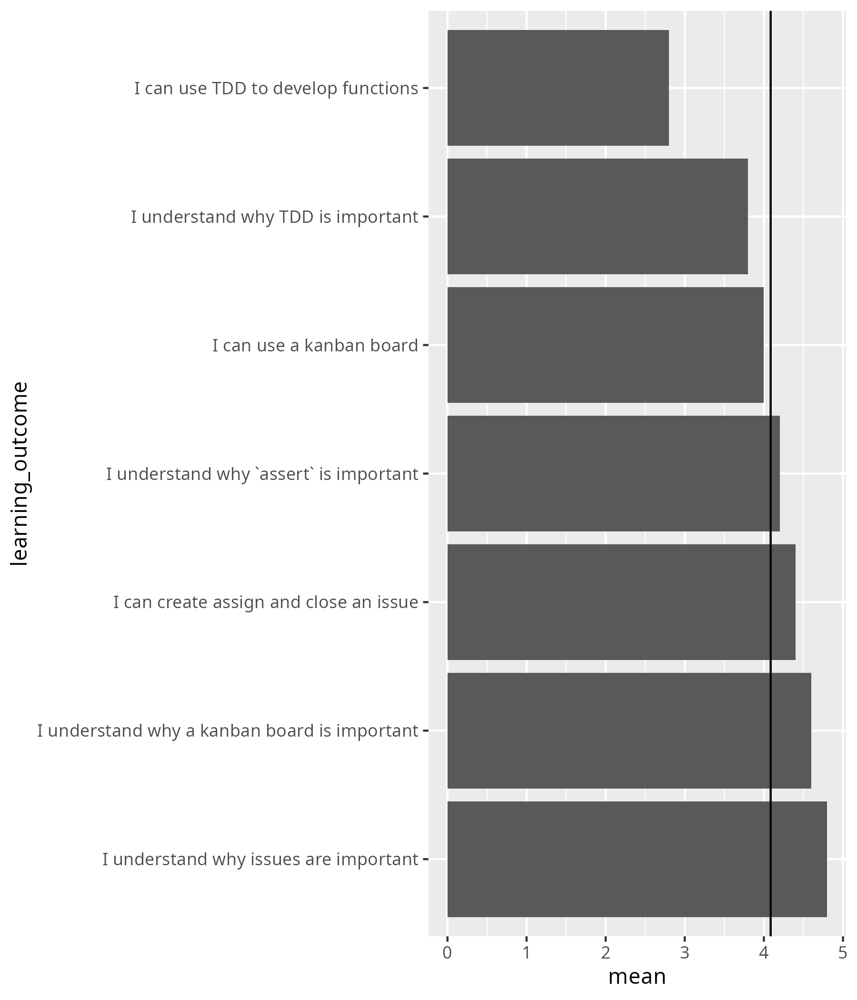

# 2025-10-24

- Day 2
- Author: Richel

I think we do not do object-oriented programming, yet I heard
it both today and yesterday. Checking the meeting notes, I see no decision
on this. On the other hand, I do not have time for doing OOP in my
sessions. I suggest to reduce the mentioning of OOP.

For the rest of the day, in my part, I tried out breakout rooms of
1 person. I felt uncomfortable doing so, as I worried the learners would
feel alone. But after some visits, the learners seemed to be fine with
it. There was plenty of opportunity to have a bit longer talks with learners.

During the day, I never rushed, even though there was more on the schedule,
which felt the right choice.

## Day 2

### Retrospect

#### What helped us learn (let us move forward)

- A: Interaction during explanations
- A: Better instructions for exercises compared to yesterday
- A: The practical exercises were really great !
- A: Richel's enthusiasm :-)
- A: Individual feedback for exercises
- A: nice explanations and instructions for the tutorials, easy to follow, always there for questions
- A: The exercises were helpful! Practising it and getting feedback is good!
- A: The live examples. It was helpful to get an explanation of the structure
  of the lesson before starting.
  Having a chance to ask questions in the individual breaking room.

#### What stopped us from learning (What held us back)

- A: Sometimes the assignements are unclear

I wish I knew which ones. I commonly ask if my exercises are clear
and I always get a 'yes'. Sure, I expect a bias for 'yes', yet
I have nothing to go on to suspect it would be my assignments.

- A: No live examples for TDD, I would have appreciated
  at least one live demonstration of the methods before the exercises,
  and not just discussing it theoretically - it is a bit counterintuitive.

I can imagine. I wondered about that too. I've added it to the course material
to try it out.

- A: Too little knowledge in python to be able to feel confident in writing
  tests correctly - are you sure the initial requirements for the course
  are really enough?

I can imagine one feels like this. I am confident he/she can do
this (sure, that does not take away his/her self-doubt).
I have seen R programmers being able to do this.
I do supply all the needed Python code that needs to be used,
so I feel: yes, this is doable.
I hope I can get a 1-on-1 about this with him/her. Additionally,
we will do
pair programming next day: this may help him/her regain her confidence and/or
motivation. I will couple him/her with someone that is patient and
confident in Python.

- A: rather similar examples, not really sure how this expand (especially TDD)
  to more complex settings, How easy is it to find tests then?

My bad: the goal was to drill TDD, with simple examples (i.e. no focus
on complex code at all). I've added a question box to each exercise,
forcing me to write down why each exercise seems repetitive. Due
to this, I removed one out of 5 exercises. Thanks!

- A: I got issues with git in VS code
  but that probably comes down to my inexperience.

I've seen him/her struggle. We teachers picked VSCode to reduce this struggle,
so it is painful to see how it still fails. I agree with him/her,
that this will fix itself with some more experience,
together with some patient help
from us teachers. I will couple him/her with someone that has shown
his/her confidence with the VSCode IDE :-)

#### What could we do to improve learning (What can we invent)

- A: Better defined assignements ?

Agreed!

- A: Give at least one live example of TDD before letting the students
  tackle the challenge by themselves.
  Or maybe suggest to watch one of the videos first?

Done!

- A: Maybe a bit more hands-on exercise is good. Something a little complex.

Added an extra and more free exercise with this.

- A: Also, how to relate these good practices in our programming for
  our disciplines, for example assert and stuff won't work
  for simulations and other programming.

This is a misconception I should deal with next day: everything I
taught works for all code.

- A: Do the first TDD example as a team and not individually - one good
  example would save from waisting time on pracitising the wrong method

Done!

- A: Showcasing an exemplary more complex example

Added!

- A: A way to communicate with the teacher when inside breakout rooms!

I agree that this sometimes can feel clumsy.

- A: 3 minutes for the retrospective questions is too long,
  we always end up answering the next questions during the first one :).
  maybe 2min? 2:30?

I assume Lars reads this. Taking a peek down: yes he does :-)

- A:A bit more use case discussion on issues - like a how does it look like
  for a sample/real life project

Done!

#### What will we do(Act) [Teachers only]

- Lars clearify excersises

This is on Lars :-)

- Time management, make morning session more hands on less theory

This is on Lars :-)

- Change from twice a year to only spring. to allow for more prep time for teachers.

For me, the frequency is fine.

- Define clear roles before.

Unsure what this applies to ...?

My action points for next lesson:

- [ ] Go through this reflection with the learners
- [x] Make pairs that will help get the less confident learnes thrive

Taking a look at the learning outcomes below,
we see that the harder topics resulted in the lower confidences:

Learning outcome                            |Average confidence
--------------------------------------------|------------------
I can use TDD to develop functions          |2.8
I understand why TDD is important           |3.8
I can use a kanban board                    |4
I understand why `assert` is important      |4.2
I can create assign and close an issue      |4.4
I understand why a kanban board is important|4.6
I understand why issues are important       |4.8

???- question "How does that look as a plot?"

    

On Monday, I will need to show how TDD scales up to a harder setting.
I have done so with 'Dream development'. I see that this session
uses objects, so I will write something from fresh, applied to
the weather project.

