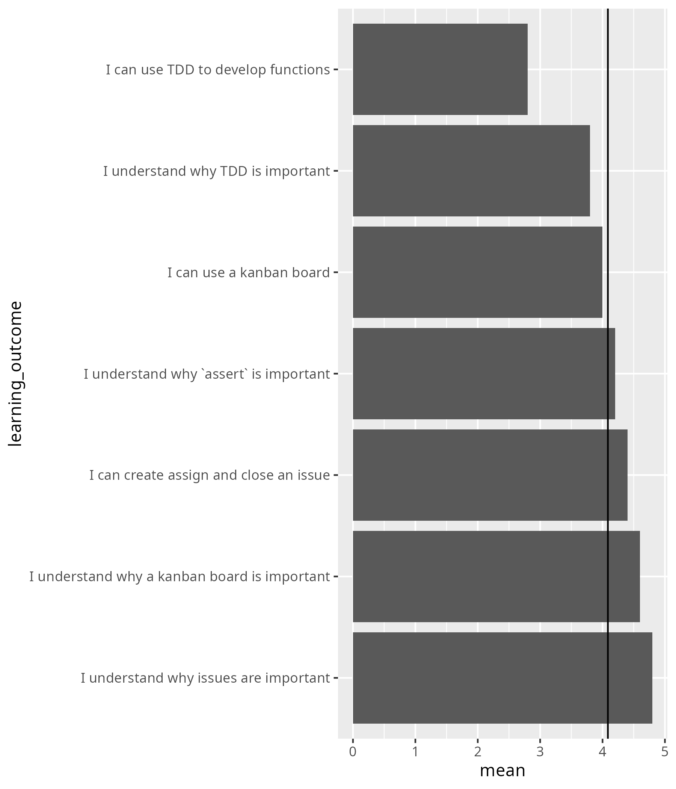

# 2025-10-27

- Day 3
- Author: Richel

I added a session, called 'TDD at a larger scale',
as this was implicitly requested by the learners.
On the one hand, this takes away time from other sessions,
yet on the other hand, it shows that I listen to the learners.
Let's see if there is anything about this in the Retrospect.

I am unsure about the form of the first hour, 'TDD at a larger scale'.
It was more talking than I am used to, although I did
interacted with the learners after each couple of minutes.
Let's see what they say on the Retrospect.

For pair programming, I was happy to use a learner as a volunteer:
it is most fun and insightful.

I enjoyed working with the group. I've paired them up in a way that
would allow everyone to thrive. I have some ideas for tomorrow too:
it would be nice to mix them up :-)

I broke my rule of breaks at the scheduled point in time:
instead, I had
both of my breaks earlier. I feel moving breaks to earlier is fine,
where I feel moving breaks to later is not. 
I think this is fine.

## Retrospect

### What helped us learn (let us move forward)

- A:The live-examples and the exercises were very helpful. 
  I appreciated the example from big to small programming.
  (I also appreciate the breaks!)
- A: I was happy with the pair programming concepts
  and the last group exercises.
- A: Live examples and pair programming very funny !
- A: pair exercises and live examples
- A:Exercises in pairs
- A:Thorough explanation of TDD method to create the weather code
- A:Good way to learn TDD through Pair programming!
- A:Today's session had more pratical exercises which helped us learn hands-on!
  Good job to the instructors!

### What stopped us from learning (What held us back)

- A: Nothing to declare.
- A: I can't think of anything 
- A: Still some issues with VSCode, but it worked in the end.
  Time for group exercises and off topic questions were a bit short.

I agree here.
 
- A: Technical issue in the morning with Git website rendering -
  don't know how that could be avoided though

This is because I was right: it really takes several minutes to update.
There was a misconception here: the deployment step indeed takes seconds.
However, deploying the website takes two steps, the first one is about creating
the HTML version, which takes minutes.

- A: Using GitHub web interface and git commands and VS code,
  I think we should agree on one single method, or at least mostly use one

I agree. Not my session.

- A: Maybe some more time with the group exercises would be appreciated!

Let's do it.

### What could we do to improve learning (What can we invent)

- A: Maybe bit more on how to integrate these in our discipline specific
  programming would be appreciated, like some of us work on data
  analysis/exploration where the data might not be a specific value but a
  dataframe or numpy array, how do we integrate the assert to such cases?
  Also, most of us work involves data cleaning and others,
  but how do we check if the data is cleaned or not?

Let's discuss this!

- A: Maybe some more clarity in stating the purpose/methods to be used
  in the morning exercises - but it might as well just be me not
  functioning on Monday morning 

I agree. Not my session.

- A: Can't think of anything
- A: Was a good session!
- A: Good session overall!

### What will we do(Act) [Teachers only]

- [ ] Add an extra session with group exercises
- [ ] Clarify how to work with messy data

## Confidences

