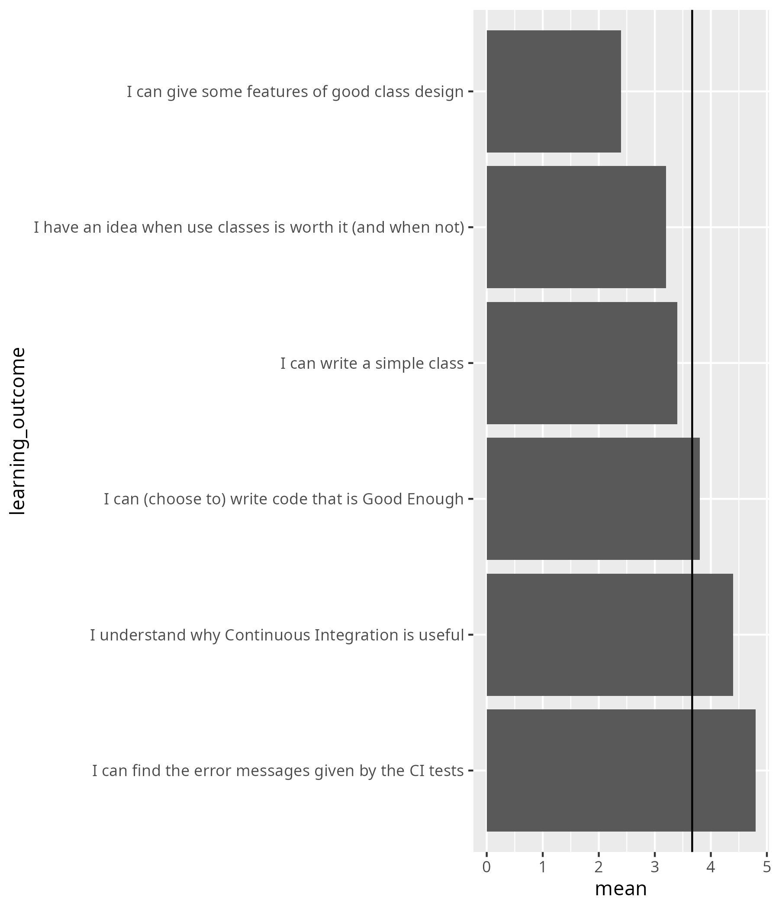

# 2025-10-28

- Day 4
- Author: Richel

I decided to change the lesson plan and at the start
send this in the Zoom chat:

- [ ] Go over the reflection at <https://uppmax.github.io/programming_formalisms/reflections/2025_autumn/20251027/>
- [ ] Add an extra session with group exercises
  Do so by starting with continuous integration.
  Here they can learn how to write clean enough code
- [ ] After CI, do testing framework
- [ ] After that, continue with regular schedule
- [ ] Clarify how to work with messy data

The first two hours were spend on CI.
I think that was a good idea as I feel that the learners now
know how to write code that is Good Enough.
I had prepared 3 groups of 2 for the CI exercises, however,
one learner was absent, which resulted in 1 group of 3.
I was unhappy about this imbalance. However, the group seemed
to work quite well and when I offered to do 1-on-1 with a volunteer learner,
this offer was rejected.

In the third hour, Lars taught about object-oriented design. It was
unfortunate in some ways, as Lars assumed I would have taught class
design already. Also, his session started 15 minutes later, as I was
unaware of this irregularity in the schedule.

After his teaching, me and Lars discussed this. I said sorry to Lars for
taking 15 minutes too mucg :-) .
We decided to switch things
around, with me teaching 'Class design' for one hour, after which he
has the remaining time. I am happy how we dealt with this.

The fourth hour (i.e. the first after lunch) I had my last session and
here we were with 6 learners. I made the dream groups I had prepared.
And it seemed to work out perfectly! At around 13:40, 2 out of 3 groups
had written a class, where the remaining group had a wonderful dynamics
that I did not want to disturb. I collected the 2 groups that were done
in 1 room, where I discussed code coverage. It was a bit rushed, but I
felt it was worth it.

It has its pros and cons to actually listen to the learners. On the other
hands, I do feel I picked the right things: that what I chose to skip
is -I feel- less important.

## Observation Lars

I decided to make an activity diagram:

Time |Activity                  |Duration
-----|--------------------------|--------
14:15|Monologue                 |2
14:17|Discussion                |3
14:20|Introduce exercise        |5
14:25|Exercise ongoing, room M  |2
14:27|Exercise ongoing, room 1  |<15
14:??|Exercise ongoing, room 2  |?
14:42|Exercise ongoing, room M/3|19
15:01|Monologue                 |14
15:15|Exercise ongoing, room M  |2
15:17|Exercise ongoing, room 1  |1
15:18|Exercise ongoing, room 2  |0
15:18|Exercise ongoing, room 3  |9
15:27|Exercise ongoing, room M  |2
15:29|Exercise ongoing, room 1  |1
15:30|Exercise ongoing, room 2  |2
15:32|Exercise ongoing, room 1  |1
15:33|Exercise ongoing, room 3  |8
15:41|Exercise ongoing, room M  |1
15:42|Monologue                 |9
15:51|Retrospect                |.

## Retrospect

### What helped us learn (let us move forward) 2 min

- A: As usual, group exercises
- A: The possibility to ask questions and get extensive answers. Thank you for your patience!
- A: Group work, practical exercises
- A: Continous Integration and group work
- A: Nice group work.
- A: The team exercises, in particular for writing clases. The session on automated testing workflows within GitHub (and locally) were very interesting.
- A: the testing exercise was good! Finding out the options to automate the testing was nice.
- A: Ruff - was a good extension

### What stopped us from learning (What held us back) 2 min

- A: Maybe the schedule was a bit messy today, I would gladly have had class design before OOD

Agreed, we found out too late

- A: I found some text, in particular the Object-oriented programming section,
  hard to read because of typos.
  I wish it wasn't so much like bullet points.
  It often asks us about a concept and only give bullet points
  but we have to go to some alternative reading material to find the answer.
  Many concepts were remain a bit abstract even after the explanations...
  I also got lost with many exercises because they were a bit vague
  or use terms before getting explanations about it (e.g., refactoring)

I assume this will be picked up :-)

- A: Maybe some more clarifications about object oriented programming
  would have been helpful. Less theory and more examples.

I assume this will be picked up :-)

- A: assignments were not always clear,
  confused about what we should actually do...

I am unsure if this applies to my session.

- A: a bit confused about the reverseb classroom situtation,
  since we didn't have time to read up upon it before
  (and text didn't alwyas provide the answers that were asked there)

I assume this will be picked up :-)

- A: Most concepts introduced today was a hard to intrepret
  in our discipline specific examples

I wish I understood what this is about :-/

- A: The concepts of object and class were a little hard.

I am unsure if this applies to my session.

- A: Time, short answers, no too deep explainations and typos in documentation.

I am unsure if this applies to my session.

- A: Unit test lessons were unclear

Yes, this was the rushed session.

- A: Little time to complete all the exercises,
  would have appreciated less to do but with more time to focus

I am unsure if this applies to my session.

### What could we do to improve learning (What can we invent) 2 min

- A: I think in general it would be beneficial to focus on easier tasks
  and not too much on the weather exercise, with more discussion.
  Baby steps and more time to digest.

Yes, I can imagine that some people would prefer this.
Me too, I am sometimes in doubt about this too.
And it would be simpler to **not** have a bigger project

- [ ] Discuss with teachers to remove working on a bigger project

- A: Better material with less bullet points
  and more structure and explanations would help

I am unsure if this applies to my session: I feel not ..?

- A: As much as I appreciate working with teams,
  sometimes I wish I could read on my own without other people around.
  I find it distracting because I feel pressure to finish faster.
  I prefer when we get examples explained by the teacher
  before diving into the exercises.

I understand this point of view. I do think the team is now ready
to work in groups of 1 again. So let's go back to that again,
where I leave it an option for me to ask learners to help out.

- [ ] Remember to do 1 person per breakout room again

- A: more explanation of terms and basic "vocabulary",
  more straigth forward assignments, clearer instructions

I am unsure if this applies to my session: I feel not ..?

- A: More examples before working on our own,
  sometimes it is hard to figure out everything on your own

I am unsure if this applies to my session: I feel not ..?

- A: Also, sometimes the concepts are too simple and feels difficult
  to relate to our discipline,
  maybe more examples to show how it looks would be appreciated

I can imagine this being the case for the 'Class design' examples.

- [ ] Add a more complex example in 'Class design'

On the other hand, I am unimpressed with the usefulness of 'Class design'.

- A: Maybe a solid example/exercises on object & class diagrams would be good

Not my session.

- A: More self-contained examples with answers that we can revisit later on.
  Add more links to external videos on hands-on
  coding for every or most concepts.

I agree: it would help us focus.

## What will we do(Act) [Teachers only]

- [ ] Discuss with teachers to remove working on a bigger project
- [ ] Discuss with teachers to remove object oriented programming
- [ ] Add a more complex example in 'Class design'
- [ ] Remember to do 1 person per breakout room again

## Confidences

