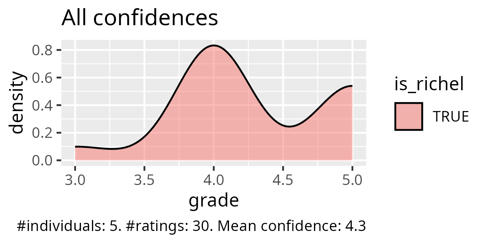
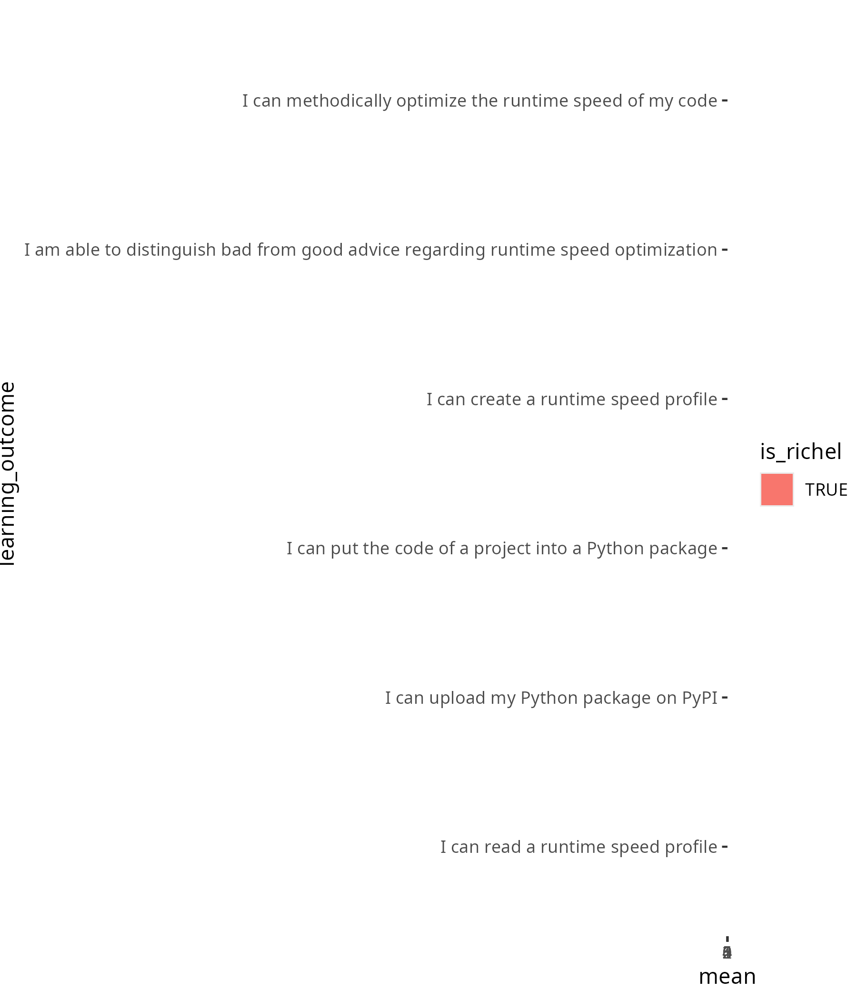
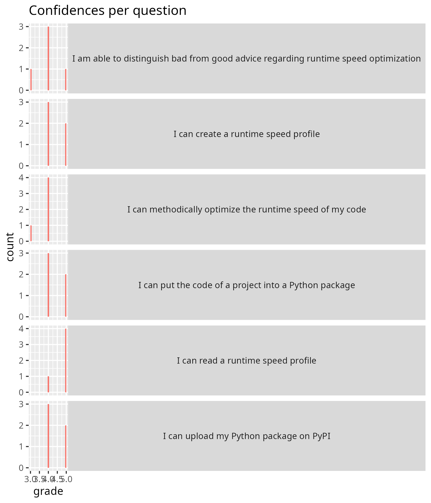

# 2025-10-29

- Day 5
- Author: Richel

I am happy with how the morning went.
I let the learners work individually and I think that went fine:
it gave me the time to have multiple more in-depth 1-on-1 discussions.

In the first session, there was an unexpected problem
with uploading the package
to PyPI, I will need to check for the next time.

- [ ] Update the session on creating a package

In the first session, I could have gone a bit more in-depth,
although I do feel it was the most efficient use of time:
I feel the duration of the session was good

The second session went fine I think,
although I could have easily spent more time on its discussion.
Although, also here, I do feel it was the most efficient use of time:
I feel the duration of the session was good

At the end of my last session, I thanked the learners.
This felt good to do.

As I did so yesterday with Lars,
I decided to make an activity diagram too:

Time |Activity                  |Duration
-----|--------------------------|--------
9:02 |Monologue                 |5
9:07 |Exercise start            |0
9:07 |Round in BO rooms         |3
9:10 |Wait                      |.
9:12 |Round in BO rooms         |5
9:17 |Wait                      |.
9:20 |Round in BO rooms         |5
9:25 |Wait                      |.
9:27 |Round in BO rooms         |1
9:28 |Wait                      |.
9:30 |Round in BO rooms         |7
9:37 |Discussion                |8
9:45 |Break                     |.
10:00|Monologue                 |11
10:11|Exercise start            |0
10:11|Round in BO rooms         |1
10:12|Wait                      |.
10:16|Round in BO rooms         |4
10:20|Wait                      |.
10:23|Round in BO rooms         |1
10:24|Wait                      |.
10:28|Round in BO rooms         |6
10:34|Wait                      |.
10:36|Round in BO rooms         |7
10:43|Wait                      |.
10:45|Discussion                |15
11:00|End                       |.

## Retrospect

## Evaluation results

- [Evaluation results](../../evaluations/2025_autumn/README.md)
- [Success score by Richel](../../evaluations/2025_autumn/20251029_success_score_richel.txt): 86%

## Day 5 Retrospect

## What helped us learn (let us move forward) 2 min

-A: Exercises, specially the testing time with cprofile.
  I liked hearing about creating packages,
  and also about ReadTheDocs and similar options.

Great!

-A: create and upload a package to pypi

Great!

-A: As always, the exercises: they help staying active

Great!

-A: Testing the performance of the code with the cprofile was useful!
  Along with their rules - super useful in improving our programming!

Great!

-A: The group exercise were helpful! Documentation tasks,
  Licensing, README documentations were super helpful.

Glory to BC!

## What stopped us from learning (What held us back) 2 min

-A: In general, I think it would be better if some more actual explanation
  was introduced, together with practical examples,
  instead of reading and highlighting the online material.
  Sometimes attention is hard to keep for prolonged time,
  if the teacher is reading.

I am unsure if this applies to my session.

-A: Hard to grasp some concepts on build.

I agree: especially the TOML file could have been better explained.

- [ ] Explain better the TOML file
- [ ] Explain better what a 'build' is

-A: I had the feelings sometimes the teacher were distracted
  or not sure "what was next" (but honestly, aren't we all tired?)

I am unsure if this applies to my session. I assume so, as the plural
is used. However, I do feel I was undistracted ...?

-A: Some teachers seem to be in a rush all the time.
  They explain at a superficial level.

I am unsure if this applies to my session. I assume so, as the plural
is used. However, I do feel that in the majority of the sessions,
I was happy with the time. Also, I have the impression that I did
ask some deeper questions. But, too bad, I can only guess :-/

-A: very time-constrained course; it feels like virtual environments
  are introduced very late in the course,
  even though they would be already useful in the beginning
  (before installing anything in base, helps also in cleaning
  up after the course is done); it often felt like the teachers are just
  reading the page and then run out of time for questions/exercises

I agree that time is tight in this course. However, I do have the
impression that my sessions were completed in full (i.e. I do not
skip sections), in time (i.e. I sometimes started the break earlier)
and properly (i.e. there was a discussion at the end).

Interesting that this learner thinks virtual environments are useful.
I think they are not worth it and I think this is not part of the goal
of this course. I predict if we add it, that this will be a chaotic
session. But let's see what the team decides :-)

I feel reading the page does not apply to me, or at least, applies least:
I absolutely read the section why things are important. I do that on
purpose: it should be super clear why things are important.
I hope that this is not too much reading of the page and I wish
that could be confirmed :-/

-A: Short time for some tasks/topics

I am unsure if this applies to my session: my sessions did have most
time for exercises.

## What could we do to improve learning (What can we invent) 2 min

-A: Perhaps because I've wrote READMEs for my GitHub repositories before,
  I wish less time had been spent on that,
  and instead I wish we could hear more about
  creating Wikis and ReadTheDocs-like documentation.
  I was also often confused with the exercises instructions.

I am unsure if this applies to my session: my exercise
instructions seemed to be clear.

It seems that MkDocs is popular:

- [ ] Suggest to add MkDocs website at deployment

-A: Be prepared to teach, no just read.
  In every section, I got something like
  "we do not have time to cover the topic A, so we move on"

I agree! I hope the sections that are skipped will be deleted.

-A: better time management, I think it would actually be more helpful
  to spend time more time on basics with going through examples
  and thorough explanations and time for questions than rushing
  through that we can cover all the topics that are planned
  (because the content is anyway on the page and
  you can just refer to it and if people are interested
  can have a look on their own and ask about it
  because there is the additional time to do so)

I agree! And I have been guilty on this on Thursday. And I
predicted/hoped/assumed that people would give this back to us, that that
session was rushed.

-A: Quite time-constrained, maybe having a the course for
  2 days in week for 3/4 weeks would be great!

I agree. I think this can be solved by teaching less. Like I did :-)

-A: I would have liked to see less reading and more interaction,
  more space for questions and active discussion on exercises.
  Sometimes how exercises were introduced was still unclear
  (but better than previous sessions).

I agree. I feel that my sessions were the most interactive
and that my sessions had the clearest exercises, but I will never be sure :-/

-A: Some discipline specific examples would be appreciated,
  for example with simulation data or codes

I think this would be fun to do: to pick examples from more disciplines.
On day 1, the learners wrote down some things:
analysis of data, workflows, tools for processing data, workflows and modelling,
statistics, simulations, applied nuclear physics,
language modeling and statistical analysis. Let me branch out here

- [ ] Distribute the different fields over the examples examples,
  especially add a simulation

-A: More interactive sessions or handsn exercises rather
  than reading (which can be pre-read before the lectures)

I agree. I feel that my sessions were the most interactive
and that my sessions had the clearest exercises, but I will never be sure :-/

-A: Really liked the group exercises, which we can increase in the future!

It is an open question for us how to deal with people that prefer to work
alone versus people that prefer to work in groups.

- [ ] Read up on the literature

## Extended questions (10 min)
  
- Imagine you are boss. How would you improve the Programming Formalisms course? Do consider that if you want more of something, what would you want less of?
  
-A: More:: Add some text about good practices about writing classes.
  Explain more with some examples about composition, inherence, etc.

- Provide more links to video tutorials.
- Creating video contents that students can watch to complement the training.
  Less:: Teachers reading what everyone at this level can read.
  Use the text as a guide.
-A: **First of all I wanted to thank you all for this great course!
  All the following critics are just small to make the course even better.**
  There was a lot of group work where it was actually not needed,
  I don't need to be in a breakout room with someone just to ask questions,
  seems a bit unnecessary.
  Also an time expectation of the real group work and a better outline
  of what we should actually do would be great
  (for some of the tasks that is actually already very well implemented).
  Some of the topics are actually falling short,
  e.g. about classes/object oriented programming and modules
  I didn't really catch the grip and feel similarly unsure about it
  than before the course (also the course page is rather short and doesn't
  really provide further information).
  Time could definitely be saved when not only the pages get read to us
  and the teachers stumble upon mistakes
  but just by either reciting it shortly or letting us read ourselves.
  Also a proper flipped classroom could work,
  just tell us to read up on a topic the day before
  and then discuss it or do exercises
  (I mean we are all voluntarily taking this course
  and want to learn something,
  so I think it wouldn't be an issue to put the extra time in.)
-A: I really enjoyed the course! Thank you all for that!
  But I learned more through the hands-on exercises than reading,
  so maybe I would arrange more group sessions where the teams worked together,
  so that they can fail and learn!
  Pushing them into the project first
  (maybe give them some resources to read on first)
  and then letting them review their project work would be my approach.
  Maybe also, ask the students to bring their own data
  (discipline specific data) and work on them and review them in group,
  so that students can understand how to use these tools/tips
  in their discipline data.
-A: Thank you for the course.
  I think I would in general increase the prerequisites
  for taking the course to a higher level.
  I started the course with the exact python/git requirements
  as stated in the UPPMAX web page,
  but I still found some sessions quite hard - or maybe too advanced for
  my level, or that they served a purpose that is too advanced
  for what I am working on at the moment.
  I took the course early in my phd thanks to the suggestion
  of my supervisor and of a fellow phd student,
  but maybe it would have been more useful to take it
  with more pior experience in programming in general.
  That said, it was very useful to see how software development works
  in a formal way.
  It's super useful to see that there are guidelines/good practises
  to be followed, which could be good to learn very early in my career.
  Also, I am very happy that I can go back to the course materiak
  and revise topics.
  What I personally found the most useful as a beginner was
  collaborating on git, understanding how to use tests and asserts
  to make code stronger from the beginning, continuous integration and classes.
  I wished we had seen more function design as well.
  Regarding teaching style, I really appreciated exercises,
  as they really help tpo stay focus.
  Sometimes I wished we had clearer instructions before each exercise,
  but I think this got better during the course.
  I also liked the video tutorials when available,
  as they helped a lot when a full example was needed
  before practising hands-on.
  What I think could be improved were some explanations and timing.
  Topics were often skipped, not covered or covered too fast.
  It may be good to reduce the course content a bit
  and focus on the most appreciated/needed sessions.
  Something I didn't understand fully was the purpose of having
  the 'weather project'.
  I guess it is to provide a full-cycle software development example,
  but since we ended up not really working on that,
  I would have rather had more small exercises,
  which help strenghtening the broad understanding.
  Last, I suggest adding a video tutorial on the use of VS code with git,
  and then always stick to that method.
  Or always work from terminal.
  It can become confusiong if people use different methods.
