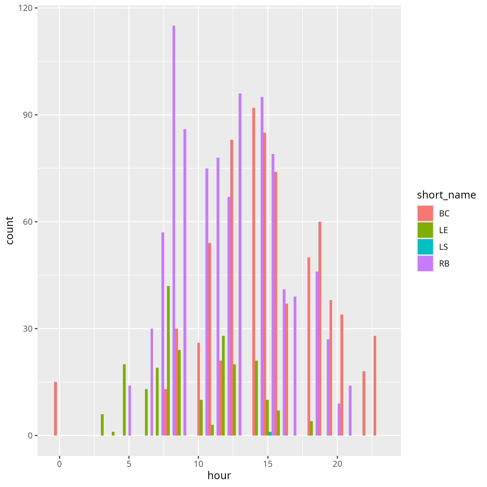

# 2025-10-30

- Total course
- Author: Richel

If a coordinator does not have the proper time to do his/her job,
consider reducing the amount of teaching hours for that
teacher, so he/she has the time to do so.

If a teacher does not have the proper time to prepare,
consider reducing the amount of teaching hours for that
teacher, so he/she has the time to focus on those fewer hours.

If a teacher does not read the evaluation results,
lets not bother the learners by asking those questions.

As we do not actually work on a project,
I suggest to remove pretending to do so.
I do think we should keep working on a shared repository.

As we do not use issues in practice,
I suggest to remove the session on issues.

As we do not use the kanban board in practice,
I suggest to remove the session on kanban board.

As we do not use the risk assessment in practice,
I suggest to remove that section.

As we do not use the requirements document in practice,
I suggest to remove that section.

As our learners are academics,
I suggest to replace a requirements document
by a draft paper.

As we do not apply the content of 'Modularity' in practice,
I suggest to remove this session.

As I think there is too big of a gap between the content of 'Object oriented
development' and all other lectures, I suggest to rewrite or remove it.

As I think there should be enough time for function design,
I suggest to remove all sessions on OOP, unless functions can be
discussed properly.
