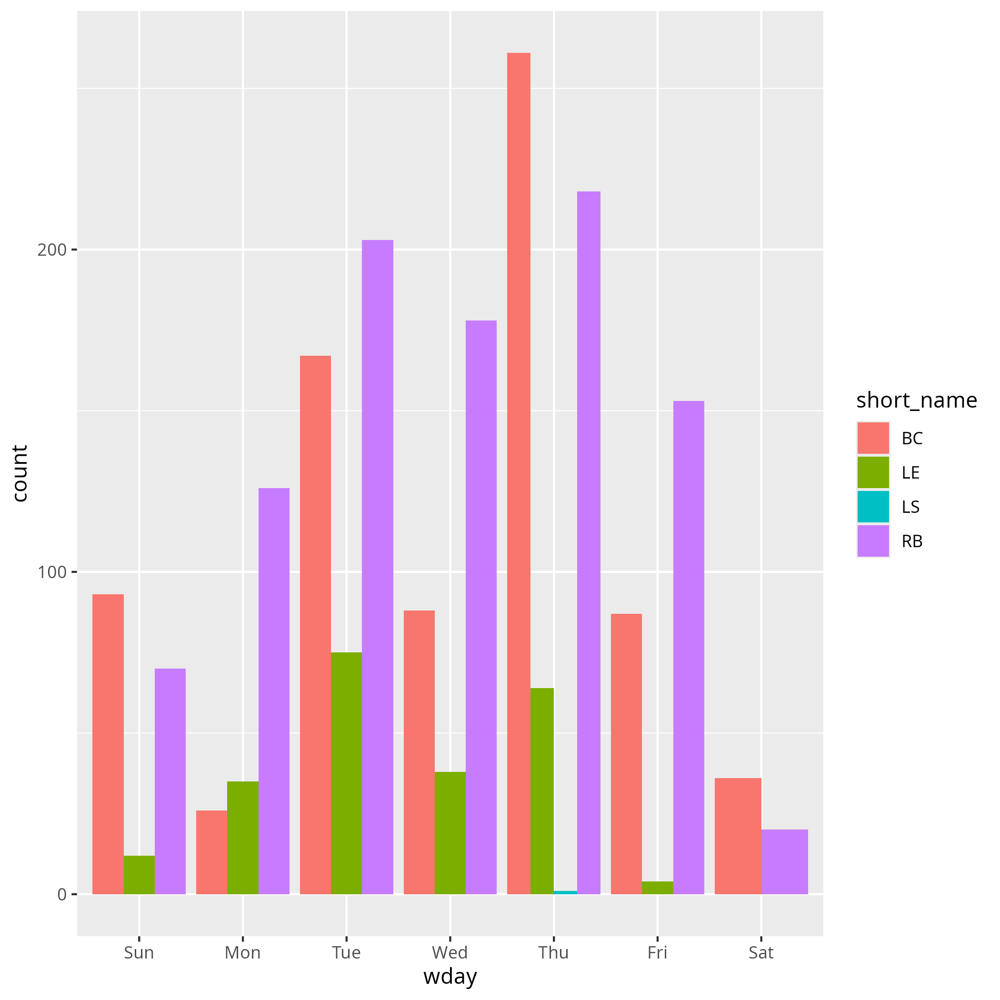
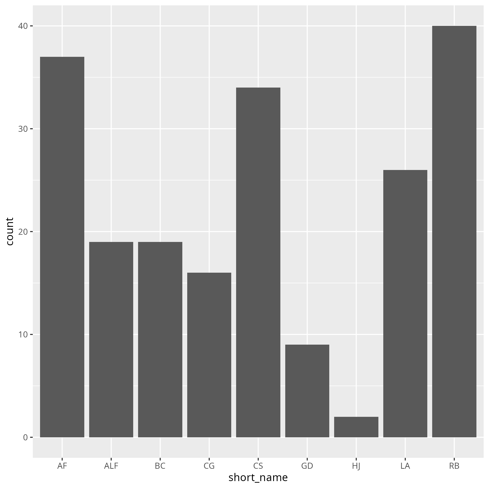
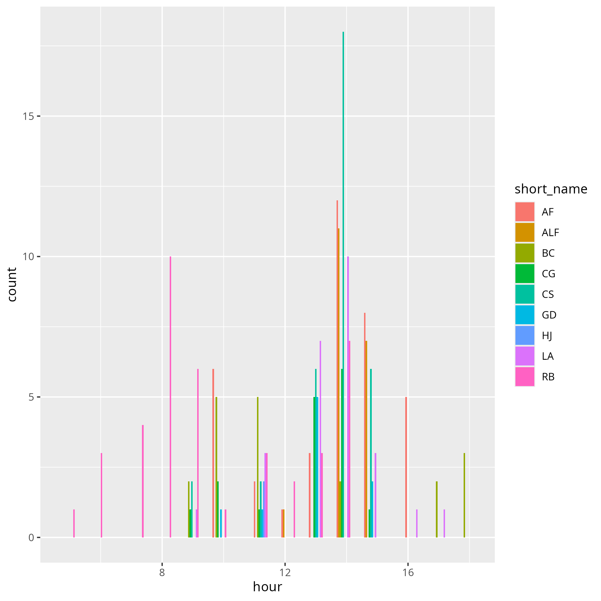

# 2025-10-30

- Total course
- Author: Richel

## Course as a whole

Here I mark changes we made to this course:

<!-- markdownlint-disable MD013 --><!-- Tables cannot be split up over lines, hence will break 80 characters per line -->
<!-- markdownlint-disable MD055 --><!-- We use three pipes to indicate an empty row -->

Day      |Time       |Teacher|Subject
---------|-----------|-------|-----------------------------------------------------------
Friday  |09:00-10:00|Lars   |Software development life cycle
Friday  |10:15-11:00|Richel |Issues and kanban board
Friday  |11:15-12:00|Richel |assert
Friday  |13:00-14:00|Richel |TDD 1
Friday  |14:15-15:00|Richel |TDD 2
Friday  |15:00-15:40|Richel |Formal testing framework **-> TDD at a bigger scale**
Friday  |15:40-16:00|Lars   |Confidence and retrospect
|||||
Monday|09:00-10:00|Björn  |Formal git workflow, branches
Monday|10:15-11:00|Björn  |Formal git workflow, merge
Monday|11:15-12:00|Björn  |Formal git workflow, contribute & Social coding and sharing
Monday|13:00-14:00|Richel |Pair programming
Monday|14:15-15:00|Richel |Pair programming
Monday|15:15-15:40|Richel |Formal testing framework **-> Pair programming**
Monday|15:40-16:00|Lars   |Confidence and retrospect
|||||
Tuesday |09:00-09:45|Richel |Function design **-> Continuous integration**
Tuesday |10:00-10:45 -> **10:00-11:00**|Richel |Expressive data type **-> Continuous integration**
Tuesday |11:00-12:00 -> **11:15-12:00**|Lars   |Object-oriented design
Tuesday |13:00-14:00|Richel |Has-a relation and class design **-> class design**
Tuesday |14:15-15:00|Lars   |Modular programming 
Tuesday |15:15-15:40|Richel **-> Lars** |Continuous integration **-> Modular programming**
Tuesday |15:40-16:00|Lars   |Confidence and retrospect
|||||
Wednesday|09:00-09:45|Richel |Implement the project as a package
Wednesday|10:00-11:00|Richel |Runtime speed profiles, Improve run-time speed **-> Runtime speed profiles**
Wednesday|11:15-12:00|Björn  |Deployment
Wednesday|13:00-13:30|Björn  |Deployment
Wednesday|13:30-13:50|Björn  |Documentation
Wednesday|14:05-15:00|Björn  |Documentation
Wednesday|15:15-15:40|Lars   |Wrap-up
Wednesday|15:40-16:00|Lars   |Confidence and retrospect

<!-- markdownlint-enable MD013 -->
<!-- markdownlint-enable MD055 -->

- [x] Consider menioning [pyOpenSci](https://github.com/pyopensci/software-submission):
  it results in a paper!

## Commits of teachers

- [Analysis script](commit_analysis.R)

I was interested in the commits: who of us committed when?

I see that some of us work outside of working hours
and in the weekends. Maybe this puts too much stress on us?

On the other hand: I am super happy with working at my weirder hours :-)

## Commits of learners

- [Analysis script](learners_commit_analysis.R)

I was interested in the commits: who of us committed when?

I am happy to see no learners worked in the weekend
and most commit under course hours :-)

## To discuss at a meeting

If a coordinator does not have the proper time to do his/her job,
consider reducing the amount of teaching hours for that
teacher, so he/she has the time to do so.

If a teacher does not have the proper time to prepare,
consider reducing the amount of teaching hours for that
teacher, so he/she has the time to focus on those fewer hours.

I think all of us should follow the NBIS 'Train the Trainer' course,
as I think some more knowledge on teaching would help us prepare our lessons
better.

If a teacher does not read the evaluation results,
lets not bother the learners by asking those questions.

As we do not actually work on a project,
I suggest to remove pretending to do so
or add more time for this.
In any case, I do think we should keep working on a shared repository.

As we do not use issues in practice,
I suggest to remove the session on issues.

As we do not use the kanban board in practice,
I suggest to remove the session on kanban board.

As we do not use the risk assessment in practice,
I suggest to remove that section.

As we do not use the requirements document in practice,
I suggest to remove that section.

As our learners are academics,
I suggest to replace a requirements document
by a draft paper.

As we do not apply the content of 'Modularity' in practice,
I suggest to remove this session.

As I think there is too big of a gap between the content of 'Object oriented
development' and all other lectures, I suggest to rewrite or remove it.

As I think there should be enough time for function design,
I suggest to remove all sessions on OOP, unless functions can be
discussed properly.
