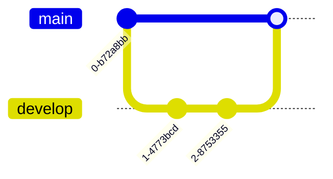
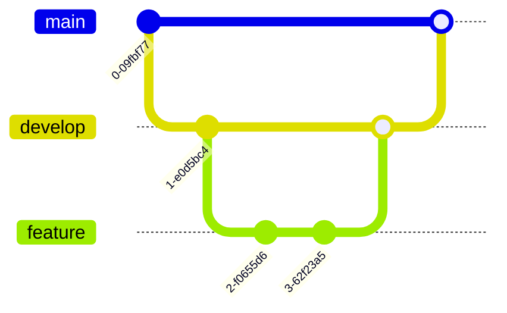

# Branches

!!! info "Learning outcomes"

    Learners ...

    - understand what branches are
    - understand why to use branches

??? question "For teachers"

    Prior:

    - You have code that works. Others are using it.
      However, you want to add improvements.
      You want to do so without harming others.
      How would you do this?
    - You work in a team. You want to try out some new things in the code,
      due to which it will break the build sometimes.
      You want to do so without harming others.
      How would you do this?
    - What is version control again?
    - Why use version control again?
    - What are branches?
    - Why use branches?
    - What is a merge?

## What are branches?

Branches are a term in version control,
and are in meaning similar to 'version with a specific name'

Branch name       |Description
------------------|---------------------------------------------------------
`main` or `master`|The version that always works
`develop`         |The version that is being developed
Other, e.g. `sven`|A topic/feature branch named after a developer or topic

## Why use branches?

To be able to work independently on code, i.e. without harming others.

## A workflow for a single developer

Here we see the workflow of a single developer:

In words:

- The developer started with version `0` from the `main` branch
- On the `develop` branch, he/she created two new versions
- The second new version `2` was then merged to the `main` branch

## A workflow for multiple developers

Here we see the workflow for multiple developers:

In words:

- This developer started with version `1` from the `develop` branch
- On his/her feature branch, he/she created two new versions
- The second new version `3` passed all tests on the feature,
  after which it was merged to the `develop` branch
- The second new version `3` passed all tests on the `develop` branch
  after which it was merged to the `main` branch

## Exercises

## Exercise 1: create a feature branch for yourself using the web interface

Using the GitHub web interface, create a feature branch for yourself.

Click on the 'Branch' button (which displays the `main` branch).
 

Select the `develop` branch.

Type the name of your feature branch (e.g. `sven`)
and click 'Create [your branch name] from `develop`'

![Click 'Create [your branch name] from develop](create_sven_from_develop.png)

Your feature branch is now created!

## Exercise 2: work on your feature branch

In VS Code, fetch the repository

Checkout your feature branch

Modify something on your feature branch

Merge your feature branch to develop

## (Optional) Exercise 3: merge develop to main

The main branch should always work.

Only if the develop branch builds cleanly, merge it to main.
Else, first fix all the tests that break the build.

???- question "Someone else has merged tests that break the build!"

    This is a social problem, with solutions that differ per team.

    Typically, one asks the person responsible, or creates an issue for this.

