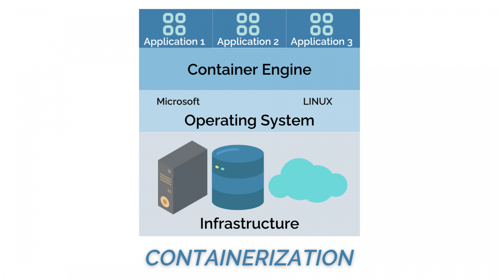

---
tags:
  - deployment
  - deploy
  - code
---

# Deploy your code

!!! questions

    - How to make your program work for others?
    
!!! info "Learning outcomes of 'Deployment'"

    - I can mentalize the installation needs from the users' perspective
    - I can initialize a new project

!!! info "Content"

    - We will prepare for user installation of our code
    - But also...
        - some theory of packages
        - some theory of containers

???- note "Instructor notes"

    Prerequisites are:

    - Package

    Lesson Plan:

    - **Total** 40 min
    - Theory 15
        - Start by not showing screen
        - ask questions
    - Exercises 25 min

## Introduction

!!! note

    - Many projects/scripts start as something for personal use, but expands to be distributed.
    - Let's start in that end and be prepared.

!!! tip

    - Make your program or workflow work for others and yourself in the future.

??? question "Discussion: What is deployment?"

    > Software deployment is all of the activities that make a software system available for use.
    *Wikipedia*

    - Producer side: Prepare so user can install and use
    - User side: Install after instructions

??? question "Discussion: What to think about as developer?"

    - package dependencies (Python, R etcetera)
    - libraries (compiled languages like C C++ Fortran)
    - OS Platforms
    - system libraries
    - shared service

??? question "Discussion: Reproducibility?"

     We can control our code but how can we control dependencies?

??? question "Discussion: 10-year challenge?"

     Try to build/run your own code that you have created 10 (or less) years ago. Will your code from today work in 5 years if you don’t change it?

??? question "Discussion: Dependency hell"

    Different codes in the same environment can have conflicting dependencies.

## To make sure about needed dependencies

- 2 levels of dependencies

    - packages
    - system libraries

??? note "System libraries"

    - Nowadays platforms are less important, still "system files" may differ among OS platforms and Linux distributions
        - will your program require specific "system files"
        - are these typically not installed already?
        - in the **best world test on Windows/Mac and Linux platforms**

??? note "Shared services like HPC clusters"

    - What about Shared services like a cluster where users and most staff do not have writing privileges ('sudo' rights) for system installations?

??? question "Discussion: Where do you run your program?"

    - From a terminal?
        - Linux, Mac, Windows?
    - From IDE?
        - VSCode, RStudio, MATLAB, Jupyter, Spyder, Idle
    - On different computers
        - Using several platforms
    - On a cluster?
        - NAISS resources, other?

!!! info "We need to"

    - Inform what is needed to run the software in the README file (Next session)
    - Or provide them with everything needed (file)
        - hopefully not interfering with other software they are using

## Distribution

!!! info "Ways to distribute"

    - Python packages:
        - pip (PyPI)
        - conda packages and environments
        - also: ``uv``, ``pixi``, ``poetry``
    - R:
        - R repos like CRAN and GitHub (devtools)
        - conda
    - Compiled languages:
        - built binaries (platform specific)
        - install from source
            - manual
            - make
            - CMake
    - General tools
        - Containers

## Isolated environments

??? question "Discussion: What is an isolated environment?"

    These solve both the identification of needed dependencies and help in installations.

!!! tip "Principles to define dependencies needed"

    - Work in an isolated environment
    - Start with empty environment
    - See what is needed for the program to work?
    - Add the missing packages or libraries until the errors go away
    - save the environment variables in a file.
    
    Best is to do this already in the beginning!
    
??? question "When is this over-kill?"

    - If the needed dependencies are few and well-defined
    - Some programming languages?

??? info "Python: Conda & virtual environments"

    **These *Python-related* tools try to solve the following problems:**

    - **Defining a specific set of dependencies**, possibly with well-defined versions
    - Definition file: ``requirements.txt``, ``environment.yml``
    - **Installing those dependencies** mostly automatically
    - **Recording the versions** for all dependencies
    - **Isolated environments**
        - On your computer for projects so they can use different software.
        - Isolate environments on computers with many users (and allow self-installations)
        - Using **different Python/R versions** per project??
        - Provide tools and services to **share packages**

### Principle using python pip in a virtual environment (``venv``)

- Let's focus here on PyPI!
    - Remember we made a package this morning!
- We'll briefly cover the other tools after the exercise.

- We can make other users aware of the dependencies for our Python project.
- One can state those specifically as a list in a README
- Or, we can make a ready file (in python)

**Save your requirements as a file**

- You may have developed your Python program with your existing python modules environment. You may have installed some new packages during the development but did not track it in a good way.
- We need to identify what python packages a user (or you on another computer) will need, to make the program work!
    - There are many packages distributed in the "base" installation of Python so **it is not just to look at the import lines in the code**.
    - You may also be hard to get an overview because you have **too many import lines**, also distributed among files if you worked in a modular way

!!! example

    - [requirements.txt](https://github.com/bclaremar/planets-bjorn/blob/main/code/requirements.txt)

???- tip "Demo with planet"

    ```bash

        git switch -c venv
        python -m venv venv
        source venv/Scripts/activate # Mac/Linux has venv/bin/activate
        pip freeze  #should be empty
        ls
        cd code
        ls
        python planet_main.py
            import numpy as np
            ModuleNotFoundError: No module named 'numpy'

        pip install numpy
        python planet_main.py
            ModuleNotFoundError: No module named 'matplotlib'
        pip install matplotlib
        pip freeze
        pip freeze > requirements.txt
        deactivate # deactivate the virtual environment

        git add requirements.txt
        git commit -m "add requirements.txt"
        git push
        git switch main
        git merge venv
        git push
    ```

### Ignoring files and paths with ``.gitignore``

Compiled and generated files are not committed to version control.

??? info "Here are some reasons"

    - Your code could be run on different platforms.
    - These files are automatically generated and thus do not contribute in any meaningful way.
    - The number of changes to track per source code change can increase quickly.
    - When tracking generated files you could see differences in the code although you haven't touched the code.

For this we use a `.gitignore` file (put in root folder)

- [Read more](https://uppmax.github.io/programming_formalisms_intro/git_deeper.html)

- [Our course repo](https://github.com/programming-formalisms/programming_formalisms_project_summer_2026/blob/main/.gitignore)

## (optional) Exercise 1: Identify lacking packages (15-20 min)

? tip (If running this in class)

    - Work individually locally (in VS Code)
    - Help each-other if getting stuck
    - 2-3 per group

???- question "Step 1: Start an EMPTY python virtual environment"

    - **Git pull!**
    - Go to the dir ``learners/<your-name>`` **locally**
    - Check that you can run python from the commandline!

    ```console
    which python     # must point to the python belonging to the virtual environment
    ```

    ??? question "Don't find it?"
    
        - If not found, and you have installed Conda/miniconda, "source activate Conda"

        Examples, please try to find your solution from these or combination of these.
    
        === "Mac/Linux and miniconda"
    
            ```console
            source /Users/[username]/miniconda3/bin/activate base
            ```
        
        === "Windows and Anaconda"
    
            ```console
            source C:/Users/[username]/AppData/Local/anaconda3/Scripts/activate base
            ```

            Note that in Windows the activate source file is in the directory ``Scripts`` not the usual ``bin`` directory.

        - Test ``which python`` again!

    - Create a virtual environment, called ``usertest``

    ```console
    python -m venv usertest
    ```

    - This creates an empty virtual environment located in `usertest` directory
    - Activate

    === "Mac/Linux"

        ```console
        source usertest/bin/activate
        ```

    === "Windows"

        ```console
        source usertest/Scripts/activate
        ```

    - Note the ``(usertest)`` in the beginning of the prompt! Could be together with the conda ``(base)`` environment as well.
    - Check versions
    
    ```console
    which python     # must point to the python belonging to the virtual environment
    python -V        # note this version (same as you started the virtual environment from)
    which pip        # must point to the pip belonging to the virtual environment
    ```

    - Check it is empty with the command ``pip list``
    - It should just show

    ```bash
    Package    Version
    ---------- -------
    pip        23.2.1
    setuptools 65.5.0
    ```

    - and some notes.


???- question "Step 2: Run the ``analysis.py`` script in ``/example`` and look for missing packages"

    - Go to the ``/example`` directory where ``analysis.py`` is
    - Run the program

    ```bash
    python main.py
    ```

    - It may give you errors of missing packages
    - Install it with

    ```bash
    python3 -m pip install [package name]  # 
    ```

    ???- question "How do I install packages in virtual environments"

        - Do NOT use ``--user``, since it should be installed in the virtual environment only.


    ??? example "how to install ``uppsalaweather``"

        ```bash
        pip install -i https://test.pypi.org/simple/ uppsalaweather==0.9
        ```
    
        (note the blank space before the package name!
    
    - Test run the program again

    - If more packages are needed, errors will still show up
    - Do pip installations until your program works!

    - **Otherwise continue to next step**

???- question "Step 3: Save your requirements as a file that user can run to get the needed dependencies"

    - Check what is installed by:

    ```console
    pip freeze
    ```

    - You will probably recognise some of them, but some may be more obscure and were installed automatically as dependencies.
    - Save your requirements as a file in your learners folder.

    ```console
    pip freeze > /learners/[name]/requirements.txt
    ```

    - **Other users** can then install the same packages with:

        ```console
        pip install --user -r requirements.txt
        ```

    - End the isolated environment

    ```console
    deactivate
    ```

    - Push the changes

???- question "(Optional) Step 4: Test the requirements file in a new environment"

    - Double-check it works by:

    - Create another virtual environment

    ```console
    python -m venv usertest2
    ```

    - Activate

    === "Mac/Linux"

        ```console
        source usertest2/bin/activate
        ```

    === "Windows"

        ```console
        source usertest2/Scripts/activate
        ```

    - Note the ``(usertest2)`` in the beginning of the prompt!

    ```console
    pip install --user -r requirements.txt
    ```

    - Run the program!

    No errors should show up!

???- question "(Optional) Step 5: Add the folder to ``.gitignore``"

    - Add test directory to ``.gitignore`` file (root folder in repository)

???- question "Push changes"

    - **Git push!**
    - You should all have a requirements file in your folder

### Follow up

???- tip "Requirements file enabling test packages to be found"

    ```text
    --index-url https://test.pypi.org/simple/
    --extra-index-url https://pypi.org/simple
    --pre
    uppsalaweather==0.9
    ```

    - possibly not all of the 3 upper lines are needed

???- question "(One person): Move a working requirements file to the ``learners`` folder"

    - Move the requirements file to the ``learners/source`` folder
    - This will be the "official" requirements file
    - That person git commit and pushes to GitHub!

## Going further with deployment

???- admonition "Python for scientific computing"

    **Course advertisement**

    - [Python for scientific computing](https://aaltoscicomp.github.io/python-for-scicomp/)
    - [Python packaging session](https://aaltoscicomp.github.io/python-for-scicomp/packaging/).

???- admonition "Possibilities for other languages can be"

    - C/C+
        - CMake
        - Conda
    - Fortran
        - Fortran package manager
    - Julia
        - Pkg.jl

    - [More info](https://uppmax.github.io/programming_formalisms_intro/reproducible_deeper.html#recording-dependencies)
    - [The tools](https://uppmax.github.io/programming_formalisms_intro/reproducible_deeper.html#the-tools)


???- admonition "Compiled language, course"

    - [Build Systems Course](https://github.com/PDC-support/build-systems-course)

???- admonition "Containers"

    - Containers let you install programs without needing to think about the computer environment, like

        - operative system
        - dependencies (libraries and other programs) with correct versions

    

    > From Nextlabs:
    
    !!! info

        - 2(3) types

            1. Singularity/Apptainer perfect for HPC systems
            2. Docker that does not work on HPC-systems

                - But docker images can be used by Singularity and Apptainer

        - Everything is included
        - Workflow:

            - Download on Rackham or local computer
            - Transfer to Bianca
            - Move to from wharf to any place in your working folders on Bianca

        - Draw-backs

            - you install also things that may be already installed
            - therefore, probably more disk space is needed

    !!! info "More info"

        - [Singularity course](https://pmitev.github.io/UPPMAX-Singularity-workshop/)
        - [Environments by CodeRefinery](https://coderefinery.github.io/reproducible-research/environments)
        - [Containers in the extra material](https://uppmax.github.io/programming_formalisms_intro/reproducible_deeper.html#containers)

???- admonition "Workflows"

    **Learn more**

    - [Workflow management by CodeRefinery](https://coderefinery.github.io/reproducible-research/workflow-management/)
    - [Snakemake by CodeRefinery](https://nbis-reproducible-research.readthedocs.io/en/course_2104/snakemake/)

## Quality of life

- Run a python script without the ``python`` before in a linux environment!

- This line helps in the top of the main script:

```bash
#!/bin/env python
```

- Then the python active in "PATH" will automatically be used
    - especially important on a shared system where python is not in the typical ``/usr/bin/python`` path.

- Run from command line as:

```bash
./pythonscript
```

!!! info "See also"

    - [Collection of (Academic) software repo links](https://www.softwareheritage.org/)
    - [Awesome list of Research Software Registries](https://github.com/NLeSC/awesome-research-software-registries)

## Summary

!!! info "Key points"

    **Make sure it works for others or yourself in the future!**

!!! admonition "Parts to be covered!"

    - &#9745; Source/version control
        - Git
        - GitHub as remote backup
        - **inititalize from existing project**
        - branches
    - &#9745; Planning
        - &#9745; Analysis
        - &#9745; Design
    - &#9745; Testing
        - Different levels
    - &#9745; Collaboration
        - GitHub
        - pull requests
    - &#9744; Sharing
        - &#9745; open science
        - &#9744; citation
        - &#9744; licensing
        - &#9745; deploying
    - &#9744; Documentation
        - &#9745; in-code documentation
        - &#9744; finish documentation

