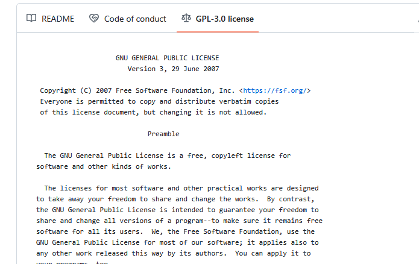

---
tags:
  - documentation
  - doc
  - end
  - ending
---

# Documentation

!!! questions

    - How can the user understand how to install and run your program and what it does?

???+ info "Learning outcomes of 'Documentation'"

    learners

    - know the most important sections for a full public README
    - can make a installation instruction
    - can make citation info
    - know how to find instruction of going to more sophisticated documentation

???+ info "Content"

    - Repo structure
    - content of README

    - View other possibilities
        - Wiki
        - GitHub pages/ReadTheDocs
        - MkDocs/sphinx

## Why documentation?

??? question "Why?"

??? question "What different kinds?"

    - **Tutorials**: learning-oriented, allows the newcomer to get started
    - **How-to guides**: goal-oriented, shows how to solve a specific problem
    - **Explanation**: understanding-oriented, explains a concept
    - **Reference**: information-oriented, describes the machinery
    - **In-code documentaion — docstrings**

    **Not to forget**

    - Project documentation:
        - requirements: what is the goal of the software, risks, platforms
        - the analysis: pseudocode and UML
        - risk analysis

    **There is no one size fits all**: often for small projects a `README.md` can be enough (more about md format later).

??? question "In-code documentation?"

    - Comments, function docstrings, ...
    - Answers "Why?" not "What?"
    - Advantages
        - Good for programmers
        - Version controlled alongside code
        - Can be used to auto-generate documentation for functions/classes
    - Disadvantage
        - Probably not enough for users

??? admonition "Directory structure"

    - **Different projects should have separate folders**

    - README file
    - Data  (version controlled)(.gitignore)
    - Processed data intermediate
    - (Manuscript)
    - Results  data, tables, figures (version controlled, git tags for manuscript version)
    - Src version controlled code goes here
        - License (here or in the 1st level)
        - Requirements.txt
    - Doc
    - index
    - .gitignore file

??? discussion "Did we follow this?"

    Well, this is a course and we needed to do a bit differently

### Where are we?

??? info "Done"

    - &#9745; In-code documentation
    - &#9745; Project documentation:
        - requirements: what is the goal of the software, risks, platforms
        - the analysis: pseudocode and UML
        - risk analysis

??? info "Finalize today"

    - &#9744; README
        - &#9744; Installation instruction
        - &#9744; Tutorial: get started
        - &#9744; Citation
    - Other levels like Wiki
    
??? question "What about the other documentation forms?"

    **Further documentation for future projects**
    
    You can dig into this at a later state!

    - &#9744; **License**
    - &#9744; **Tutorials**: learning-oriented, allows the newcomer to get started
    - &#9744; **How-to guides**: goal-oriented, shows how to solve a specific problem
    - &#9744; **Explanation**: understanding-oriented, explains a concept
    - &#9744; **Reference**: information-oriented, describes the machinery

## Markdown

- One of the most popular lightweight markup languages.
- File extension ``.md`` makes it _render_ directly in GitHub!

??? question "How does it look like?"

    ```markdown
    # This is a section heading in Markdown

    ## This is a subsection header

    Nothing special needed for a normal paragraph.

        This is a code block

    **Bold** and *emphasized*.

    A list:

    - this is an item
    - another item

    A numbered list:

    1. this is an item
    1. items are numbered automatically

    There is more:
    ,
    [links](URL),
    A|B|C
    -|-|-
    1|x|y
    2|m|n

    ```

    # This is a section heading in Markdown

    ## This is a subsection header

    Nothing special needed for a normal paragraph.

        This is a code block

    **Bold** and *emphasized*.

    A list:

    - this is an item
    - another item

    A numbered list:

    1. this is an item
    1. items are numbered automatically

    There is more:
    ,
    [links](documentation.md#markdown)
    
    A|B|C
    -|-|-
    1|x|y
    2|m|n

??? info "Read more"

    [reStructuredText and Markdown](../extra_bc/documentation_deeper.md/#restructuredtext-and-markdown)

## The README

### Example content

- About
- Installation (with dependencies and testing)
- Get started
- Use cases
- Citation

### About

- About the software
- What does it do?
- One (Punch-)line describing what it does.
    - Also in GitHub in upper right corner!
- More information below below the first description

### Installation section

**Let's take a look at different READMEs**

- Also interesting: Is there any test that makes sure it is correctly installed?

!!! example

    - R: <https://github.com/KamilSJaron/smudgeplot/tree/v0.3.0?tab=readme-ov-file#install-the-whole-thing>
    - Conda: <https://github.com/biobakery/MetaPhlAn>
    - pip: <https://github.com/deeptools/HiCExplorer>
    - pip: <https://github.com/caleblareau/mgatk?tab=readme-ov-file>
    - binaries/executable: <https://github.com/dougspeed/LDAK?tab=readme-ov-file#how-to-obtain-ldak>

### Get started

- This session can be "running some test data" to get an overview of what the program can perform.
- It may describe how to get test data
- Example: <https://github.com/KamilSJaron/smudgeplot/tree/v0.3.0?tab=readme-ov-file#runing-this-version-on-sacharomyces-data>

### Use cases

- This may sometimes be merged with the previous section

- **How-to guide**: goal-oriented, shows how to solve a specific problem
- May be a sub-set of the most important commands, depending on how wide the program is.
- Example: <https://github.com/KamilSJaron/smudgeplot/tree/v0.3.0?tab=readme-ov-file#runing-this-version-on-sacharomyces-data>

???- discussion "would it be needed for your project?"

### Contributions

- How to contribute?
- Example: <https://github.com/KamilSJaron/smudgeplot/tree/v0.3.0?tab=readme-ov-file#runing-this-version-on-sacharomyces-data>

### Acknowledgements

- Add references that _inspired or added algorithms_ to your code
- Example: <https://github.com/KamilSJaron/smudgeplot/tree/v0.3.0?tab=readme-ov-file#acknowledgements>

### References/Citation

- Think the same as for a scientific paper

??? example "Example with NextFlow"

    ``` console
    nextflow -version

      N E X T F L O W
      version 24.10.2 build 5932
      created 27-11-2024 21:23 UTC (22:23 CEST)
      cite doi:10.1038/nbt.3820
      http://nextflow.io
    ```  

???- info "Practical recommendations"

    - Get a [DOI](https://en.wikipedia.org/wiki/Digital_object_identifier) using [Zenodo](https://zenodo.org) or similar services.
    - Open source license can't demand citation, but it is required by science ethics anyway.
    - Make it as easy as possible! Clearly say what you want cited.
    - Make it easy for scripts and tools, use the [Citation File Format](https://citation-file-format.github.io).
    - [GitHub now supports CITATION.cff files](https://docs.github.com/en/repositories/managing-your-repositorys-settings-and-features/customizing-your-repository/about-citation-files)

???+ "Recommended format for software citation"

    - Creator
    - Title
    - Publication venue
    - Date
    - Identifier
    - Version
    - Type

    [Katz, Chue Hong, Clark, 2021](https://f1000research.com/articles/9-1257/v2):

???- example "This is an example of a simple `CITATION.cff` file"

    ```yaml
    cff-version: 1.2.0
    message: "If you use this software, please cite it as below."
    authors:
      - family-names: Druskat
        given-names: Stephan
        orcid: https://orcid.org/0000-0003-4925-7248
    title: "My Research Software"
    version: 2.0.4
    doi: 10.5281/zenodo.1234
    date-released: 2021-08-11
    ```

!!! info "DOI and Zenodo"

    - Digital object identifiers (DOI) are the backbone of the academic reference and metrics system.
    - CodeRefinery has an exercise to see how to make a GitHub repository
      citable by archiving it on the Zenodo archiving service.
      If you are interested,
      have a look
      [at this Coderefinery webpage](https://coderefinery.github.io/github-without-command-line/doi/#making-your-project-citable)

### Full examples

!!! example "Examples of README files"

    - R: <https://github.com/KamilSJaron/smudgeplot/tree/v0.3.0?tab=readme-ov-file#install-the-whole-thing>
    - Conda: <https://github.com/biobakery/MetaPhlAn>
    - pip: <https://github.com/deeptools/HiCExplorer>
    - pip: <https://github.com/caleblareau/mgatk?tab=readme-ov-file>
    - binaries/executable: <https://github.com/dougspeed/LDAK?tab=readme-ov-file#how-to-obtain-ldak>

### Licensing

We covered this in [Social coding](../social_coding/README.md)

- We can click on the license and a image will also show up!

    - [LICENSE](https://github.com/programming-formalisms/programming_formalisms_project_summer_2026/blob/main/LICENSE)

    ???- question "How does that look like?"

        


### Wikis

- Take the documentation for the user to the **next level**.
- If README feels too short.. try **Wiki**

- Popular solutions (but many others exist):
    - [MediaWiki](https://www.mediawiki.org)
    - [Dokuwiki](https://www.dokuwiki.org)
    - These typically needs to be hosted and maintained
- Also on GitHub!
    - [About wikis](https://docs.github.com/en/communities/documenting-your-project-with-wikis/about-wikis)
    - [Adding or editing wiki pages](https://docs.github.com/en/communities/documenting-your-project-with-wikis/adding-or-editing-wiki-pages)
    - Example with [WRF weather model](https://github.com/wrf-model/WRF/wiki)
    - [Example here](https://github.com/UPPMAX/programming_formalisms/wiki)

## Exercises

### Exercises 30 min

- We already have a file called ``README.md`` in ``/learners`` folder, that is used for information for the course participants.
- Let's work with a README file for potential users. We can call it ``README-EXT.md``
- External users should be able to install and use the the complete tool, including dependencies
- Also explore Wiki pages

!!! info "Intro"

    - Repo work
        - Work on GitHub!
        - When modifying repo, use a group specific branch
        - When done, merge/pull request
    - In the end we do code review together of the merging conflicts

???- tip "Markdown Cheat-Sheet"

    ```markdown
    # This is a section heading in Markdown

    ## This is a subsection header

    Nothing special needed for a normal paragraph.

        This is a code block

    **Bold** and *emphasized*.

    A list:
    - this is an item
    - another item

    There is more:
    ,
    [links](documentatation.md#first-steps-for-all),

    A|B|C
    -|-|-
    1|x|y
    2|m|n

    ```

### First steps for ALL

- Work together in group of 2-3
- 1 person types directly in GitHub
- Do ``git push`` first from local command-line, everyone!

### Group 1: Make 'installation instruction' in groups

???- info "Hints **FIX**"

    - The main program ``main.py`` is in the repo.
    - ``weather`` is a python package needed by ``main.py``
    - available here: <https://test.pypi.org/project/weather/1.0.1/>

??? question "Make 'installation instruction'"

    - Create branch ``installation``
    - Open the file ``learners/README-EXT.md``
    - Be inspired by the examples above
    - Include the sections "**Dependencies**" and "**Installing**"
    - When done, make pull request to main

### Group 2: Formulate an 'About' section

??? question "Make 'About'"

    - Create branch ``about``
    - Open the file ``learners/README-EXT.md``

    - Be inspired by the examples above
    - Include the section "**About**" which should give some background of what the program does.

    - When done, make pull request to main
    - Also add a Description/Punchline in the upper right corner at [Project repo first page](https://github.com/programming-formalisms/programming_formalisms_project_summer_2026/tree/main) in the About section (The "setting wheel")

### Group 3: Formulate a "Getting started" section

??? question "Make 'Getting started'"

    - Create branch ``getting_started``
    - Open the file ``learners/README-EXT.md``

    - Be inspired by the examples above
    - Include the section '**Getting started**'

    - When done, make pull request to main
formalisms/programming_formalisms_project_summer_2026/tree/main) in the About section (The "setting wheel")

### Group 4: Formulate "Sharing sections"

??? question "Make sections about 'Citation', 'License' and 'Authors' and 'Acknowledgements"

    - Create branch ``sharing``
    - Work with a CITATION(.cff) file as well

    ???- question "How?"

        **Easier**

        Create a learners/**CITATION** file (no file extension) with most of the following lines

        - Creator
        - Title
        - Publication venue
        - Date
        - Identifier
        - Version
        - Type

        **Harder**

        - open the file ``learners/CITATION.cff`` file
        - Fill it in

        ???- question "How can it look like?"

            ```yaml
            cff-version: 1.2.0
            message: "If you use this software, please cite it as below."
            authors:
              - family-names: Druskat
                given-names: Stephan
                orcid: https://orcid.org/0000-0003-4925-7248
            title: "My Research Software"
            version: 2.0.4
            doi: 10.5281/zenodo.1234
            date-released: 2021-08-11

    - Open the file ``learners/README-EXT.md``
    - Be inspired by the examples above
    - Include the sections
        - 'Citation', link to the CITATION(.cff) file
        - 'License' link to the license
            - try relative or absolute path!
        - 'Authors', List of the involved learners
        - 'Acknowledgements'
            - Add references that inspired or added algorithms to your code
            - [Example](https://github.com/KamilSJaron/smudgeplot/tree/v0.3.0?tab=readme-ov-file#acknowledgements)

    - When done, make pull request to main

### Group 5: Make the Wiki `Home` page  

??? question "Make the Wiki `Home.md´ page"

    - Work in GitHub! <https://github.com/programming-formalisms/programming_formalisms_project_summer_2026/wiki>
    - [Start example](https://github.com/UPPMAX/programming_formalisms/wiki)
    - Start with **New page** and call it `Home.md`
    - Choose `md` language
    - Write some interestng heading (be inspired by: )
    - Commit! 
    - For instance, write section names and put links to 
        - planning documents page 

    - End with adding a a link to the sub page `known_problems.md` that should have been crated already

### Group 6: Make a Wiki sub page  

??? question "Make the Wiki `known_problems.md´ page"

    - Work in GitHub! <https://github.com/programming-formalisms/programming_formalisms_project_summer_2026/wiki>
    - [Start example](https://github.com/UPPMAX/programming_formalisms/wiki)
    - Start with **New page** and call it `known_problems.md`
    - Choose `md` language
    - Write some interestng headings
    - Commit! 
    - (Group 5 will link to this page at some stage)
    - Try to remember what is still missing in the package!
    - Write it down.

???- solution "Example solution from earlier course"

     [programming_formalisms_project_autumn_2024](https://github.com/programming-formalisms/programming_formalisms_project_autumn_2024/blob/master/README-EXT.md)

### Discussion of the exercises

???- question "Discussion: Describe what you've done and why?"

    - We go through the README!
    - Teacher makes Code review if needed
    - We go through the Wiki

## Going further with documentation

### HTML static site generators

There are many tools that can turn RST or Markdown into beautiful HTML pages:

- [Jekyll](https://jekyllrb.com)
    - Generates HTML from Markdown.
    - GitHub supports this without adding extra build steps.
- [Sphinx](http://sphinx-doc.org)
    - Generate HTML/PDF/LaTeX from RST and Markdown.
    - [Read the docs style](https://sphinx-rtd-theme.readthedocs.io/en/stable/)
    - [HICexplorer documentation](https://hicexplorer.readthedocs.io/en/latest/)
- [MkDocs](https://www.mkdocs.org/) **← this is how this lesson material is built**
    - Generates HTML from Markdown.
    - Example: [Programming formalisms course](https://uppmax.github.io/programming_formalisms)

There are many more ...

??? question "Do you like one style more?"

    - [Read the docs style 1](https://sphinx-rtd-theme.readthedocs.io/en/stable/)
    - [Read the docs style 2](https://hicexplorer.readthedocs.io/en/latest/)
    - [MkDocs materials style](https://uppmax.github.io/programming_formalisms)

### Deployment on servers

GitHub, GitLab, and Bitbucket make it possible to serve HTML pages:

- [GitHub Pages](https://pages.github.com) (GH-pages) **← this is what we and many others use for course and tutorial material**
    - Easy to set up. Part of GitHub Actions and CI
- [Bitbucket Pages](https://www.w3schools.com/git/git_remote_pages.asp?remote=bitbucket)
- [GitLab Pages](https://pages.gitlab.io)
- [Read the docs](http://readthedocs.org) ← this is what NBIS uses for some course material
    - hosts public Sphinx documentation for free!
    - Somewhat more possibilities, like having **several versions of documentation** to switch between. Good for different version releases of a software
    - Example: [NBIS Introduction to Git](https://nbis-reproducible-research.readthedocs.io/en/course_1803/git/)

## Summary

!!! info "Key points"

    **Make sure it works for others or yourself in the future!**

### We are done

!!! admonition "Parts to be covered!"

    - &#9745; Source/version control
        - Git
        - We have a starting point!
        - GitHub as remote backup
        - Branches
    - &#9745; Planning
        - &#9745; Analysis
        - &#9745; Design
    - &#9745; Testing
        - Different levels
    - &#9745; Collaboration
        - GitHub
        - pull requests
    - &#9745; Sharing
        - &#9745; open science
        - &#9745; citation
        - &#9745; licensing
        - &#9745; deploying
    - &#9745; Documentation
        - &#9745; in-code documentation
        - &#9745; finish documentation

!!! info "See also"

    [Documentation by CodeRefinery](https://coderefinery.github.io/documentation/)
