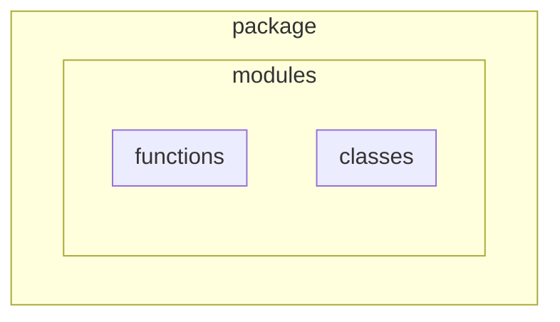
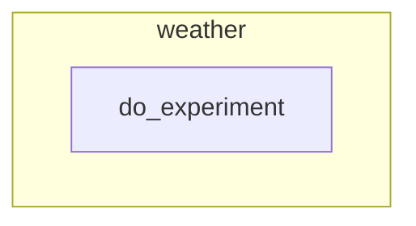
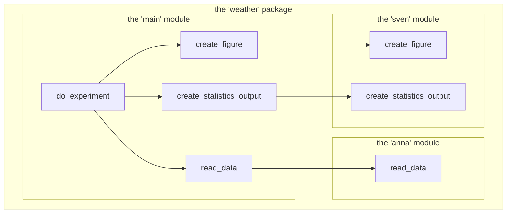

---
tags:
  - design
  - phase
  - introduction
---

# Design introduction

!!! info "Learning outcomes"

    Learners ...

    - have an overview of how the course teaches the 'Design' phase

??? question "For teachers"

    Prior:

    - What is a software development lifecycle?
    - Which type of software development lifecycle do we use?
    - What are the software development lifecycle phases used in this course?
    - Where are we in the software development lifecycle?
    - With the planning done, what would be a good next step?
    - From a design perspective, what does a package consist of?

## What have we done so far?

In [the software development lifecycle](../lifecycle/README.md)
we have now rounded of the planning phase:

- We have created the design documents for the project
- We have learned how to work with an online repository

## What is next?

In [the software development lifecycle](../lifecycle/README.md)
we will now enter the 'Design' phase:

- We have conceptualized our project
- We have planned our project

After this, we move to the 'Develop' phase.

First, we will work at designing functions, then modules and (if we
are fast enough) objects.

## Levels of design

Here are the levels of design:

## What the literature states

- Design and write error-safe code `[Sutter and Alexandrescu, 2004]`
- Good Design Is Easier to Change Than Bad Design `[Thomas and Hunt, 2019]`
- Design with Contracts `[Thomas and Hunt, 2019]`
- Design to Test `[Thomas and Hunt, 2019]`
- Code Is Design `[Henney, 2010]`
- Make Quality a Requirements Issue `[Thomas and Hunt, 2019]`
- Requirements Are Learned in a Feedback Loop`[Thomas and Hunt, 2019]`

## Exercises

## Exercise 1: levels of design

The [Levels of design](#levels-of-design) sessions shows
four levels of design and how they relate.

Do you agree with this diagram? If not, where do you disagree?

## Exercise 2: our first setup

Here is a first setup for the design of our research:

> Yellow boxes indicate packages,
> where blue boxes indicate functions

It put all our code in one package,
with one function doing everything.

Sure, there will be more functions later,
but, as a start, could you agree with this setup?

What would be the best next step according to you?

## Exercise 3: a glimpse into the future

The schematic below may be how the design ends up:

How would you interpret this figure? What has happened? Is the team done?
