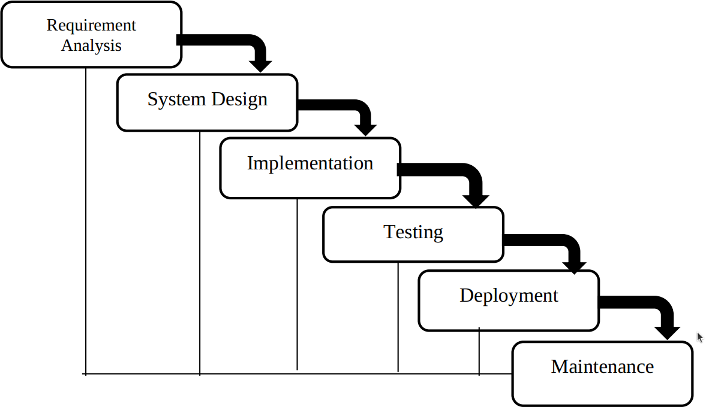

---
tags:
  - SDLC
  - software development
  - lifecycle
  - life cycle
---

# Software development lifecycle

!!! info "Learning outcomes"

    Learners ...

    - understand what a software development phase is
    - understand what a software development lifecycle is
    - can name the two main categories of software development lifecycle models
    - understand which software development phases the course uses
    - understand which software development lifecycle models the course uses

??? question "For teachers"

    Prior:

    - What is meant by 'Software development phase?'
    - Could you name some phases in software development?
    - What is meant by 'Software development lifecycle?'
    - Could you name some models of software development lifecycles?
    
## What is a software development lifecycle?

A way to develop software.

## Why is it important?

Using the wrong software development lifecycle will
cost you more time and money `[Aniley et al., 2024]`.

## Software development phases

Software develops in phases.
As there are multiple lists of these phases,
here is a list from
[Wikipedia](https://en.wikipedia.org/wiki/Systems_development_life_cycle#Phases),
with my description of each phase:

Phase                |Description
---------------------|-----------------------------------------------
Conceptualization    |Getting an idea
Requirements analysis|Develop an understanding of what is needed
Design               |Create the architecture on how to realize this
Construction         |Write the code
Acceptance           |Make sure it is good enough
Deployment           |Release the finished software
Maintenance          |Keep the software running
Decommission         |Archive or delete the software

## Software development lifecycles

The software development lifecycle is the way how you
transitions between phases,
with the most important distinction being
a traditional versus an Agile model `[Yas et al., 2023]`:

Model    |Description                                             |Example            |Overview
---------|--------------------------------------------------------|-------------------|-------------------
Tradition|Go through each phase once, do not go back              |Waterfall          |
Agile    |Cycle through each of the phases often, in small changes|eXtreme Programming|

Note that a software develmentment lifecycle does not need to be a cycle :-)

`[Leau et al., 2012]` (Table 1) gives a comparison of traditional
versus agile software development:

<!-- markdownlint-disable MD013 --><!-- Tables cannot be split up over lines, hence will break 80 characters per line -->

Parameter                            |Agile                                          |Traditional
-------------------------------------|-----------------------------------------------|-----------------------------------------------------------------------
User requirement                     |Iterative acquisition                          |Detailed user requirements are well-defined before coding/implementation
Rework cost                          |Low                                            |High
Development direction                |Readily changeable                             |Fixed
Testing                              |On every iteration                             |After coding phase completed
Customer involvement                 |High                                           |Low
Extra quality required for developers|Interpersonal skills & basic business knowledge|Nothing in particular
Suitable Project scale               |Low to medium-scaled                           |Large-scaled

<!-- markdownlint-enable MD013 -->

## Why we follow the Agile software development model

The literature states:

- In follow-the-sun development, of all the best practices,
  Agile is the one most often recommended `[Kroll et al., 2013]`
- Use Agile `[Aniley et al., 2024]` (although the paper does not describe
  where this recommendation is based on)
- You should implement continuous delivery `[Forsgren et al., 2018]`
- You should use Agile, as software development cycles are 25% shorter
  and project success rates increase by 18%  `[Pastrana et al., 2025]`
- Use Continuous Integration `[Serban et al., 2020]`
- Use Continuous Integration `[Visser et al., 2016]`
- In scientific computing, make incremental changes `[Wilson et al., 2014]`
- In scientific computing, keep changes small `[Wilson et al., 2017]`
- Use Agile for small-medium project development,
  use traditional models for large-scale project

In this course, we mostly follow the Agile model.

## Exercises

## Exercise 1

The course website clearly shows how we preferred to group
the different software development phases. What are these?

???- question "Answer"

    You can see these at the top menu:

    

    The phases are:

    - Planning
    - Design
    - Development
    - Testing
    - Deployment

## Exercise 2

In the text it is mentioned:

> A software develmentment lifecycle does not need to be a cycle :-)

What is meant by this?

???- question "Answer"

    It highlights that the traditional model is not a cycle at all.

## Exercise 3

The course logo gives a hint at our software development life cycle.

What is it?

???- question "Answer"

    The course logo contains a circle, hinting at a cycle.
    Having (many) cycles is typical of an Agile software
    development lifecycle.

## References

- `[Aniley et al., 2024]` Aniley, D. Bitew, E. Alemneh Jalew,
  and G. Abeba Agegnehu. "Selection of software development life cycle
  models using machine learning approach." Int J Comput Appl 186 (2024): 36-43.

- `[Forsgren et al., 2018]` Forsgren, Nicole, Jez Humble, and Gene Kim.
  Accelerate: The science of lean software and devops:
  Building and scaling high performing technology organizations.
  IT Revolution, 2018.

- `[Kroll et al., 2013]` Kroll, Josiane, et al.
  "A systematic literature review of best practices and challenges in
  follow-the-sun software development."
  2013 IEEE 8th International Conference on Global Software Engineering
  Workshops. IEEE, 2013.
  [Paper homepage](https://doi-org.ezproxy.its.uu.se/10.1109/ICGSEW.2013.10)

- `[Leau et al., 2012]` Leau, Yu Beng, et al.
  "Software development life cycle AGILE vs traditional approaches."
  International Conference on Information and Network Technology.
  Vol. 37. No. 1. 2012.

- `[Pastrana et al., 2025]` Pastrana, Manuel, et al.
  "Best Practices Evidenced for Software Development Based on DevOps
  and Scrum: A Literature Review."
  Applied Sciences 15.10 (2025): 5421.
  [Paper homepage](https://doi.org/10.3390/app15105421)

- `[Serban et al., 2020]` Serban, Alex, et al.
  "Adoption and effects of software engineering best practices
  in machine learning." Proceedings of the 14th ACM/IEEE
  International Symposium on Empirical Software Engineering and
  Measurement (ESEM). 2020.
  [Paper homepage](https://doi.org/10.1145/3382494.3410681)

- `[Visser et al., 2016]` Visser, Joost, et al.
  Building software teams: Ten best practices for
  effective software development. " O'Reilly Media, Inc.", 2016.

- `[Yas et al., 2023]` Yas, Qahtan M., Abdulbasit Alazzawi, and
  Bahbibi Rahmatullah. "A comprehensive review of software development
  life cycle methodologies: Pros, cons, and future directions."
  Iraqi Journal for Computer Science and Mathematics 4.4 (2023): 14.

- `[Wilson et al., 2014]` Wilson, Greg, et al.
  "Best practices for scientific computing."
  PLoS biology 12.1 (2014): e1001745.
  [Paper homepage](https://doi.org/10.1371/journal.pbio.1001745)

- `[Wilson et al., 2017]` Wilson, Greg, et al.
  "Good enough practices in scientific computing."
  PLoS computational biology 13.6 (2017): e1005510.
  [Paper homepage](https://doi.org/10.1371/journal.pcbi.1005510)
