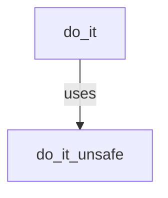
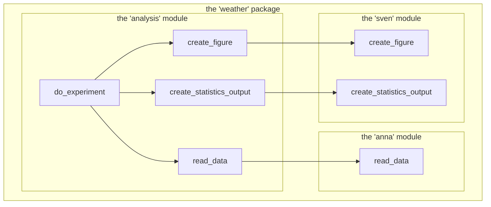
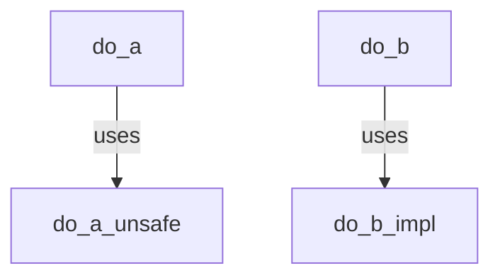

---
tags:
  - module
  - modularity
---

# Modularity

!!! info "Learning outcomes"

    Learners ...

    - can work with code from another module

??? question "For teachers"

    Prior:

    - What is a module?

## What is a module?

In the context of a Python package,
a module is file containing Python code.

We are already using modules, such as in this line:

```python
import os.path
```

Here we import the `path` function from the `os` module.
The `os` module is a Python module for functions related to work
with the operating system.

## Why use modules?

- To group related code
- To hide implementation details

## Examples of using modules

## Grouping related code

Modules are used to group related code, such as one module
reading input data, where another module is tasked with doing statistics
on data.

A commonly found module is a folder called `utils` or a file called
`utils.py`.
This is typical for functions that are needed, but not
the core of the package: they are so-called 'utility functions'
that are there 'to help'.

Examples:

- [`utils.py` in `seaborn`](https://github.com/mwaskom/seaborn/blob/master/seaborn/utils.py)
- [`_utils.py` in `pytorch`](https://github.com/pytorch/pytorch/blob/main/torch/_utils.py)
- [the `utils` folder in Keras](https://github.com/keras-team/keras/tree/master/keras/src/utils)
- [the `util` folder in Pandas](https://github.com/pandas-dev/pandas/tree/main/pandas/util)

A Python filename starting with an underscore, e.g. `_utils.py`,
is a hint (by social convention) that this module is not meant
to be used by a regular user.

## Function wrappers

Modules can be used as a unit to create wrapper functions.

A wrapper function is a function that consists of calling another
function, without adding functionality.

Users of a module will import functions of a module by name (i.e.
they do not import all function).
The word `impl`, short for 'implementation' is -by social convention-
avoided to be imported.

Here is schematic of two functions in a module:

```
graph TB
  do_it
  do_it_impl
  do_it --> |uses| do_it_impl
```

Based on this, `do_it` is the function that the user should `import`.

???- question "Could you show some code as an example?"

    A *logistic function* is a perfect example of a wrapper function.
    A logistic function is function that exists to make it easier/shorter
    to write code. One application is to provide two function
    names to do the same:
    

    ```python
    def create_png_figure(filename):
      # Code to create a PNG

    def create_figure_png(filename):
      create_png_figure(filename)
    ```

    Another example is found in code that we encountered before:

    ```python
    fun is_prime(x):
        """Determine if a number is prime."""
        return is_prime_impl(x, 2)

    def is_prime_impl(no, i):
        """Determine if a number is prime.

        Usage: 'is_prime_impl(x, 2)', where 'x' is the number you want to test.
        """
        if no == i:
            return True
        elif no % i == 0:
            return False
        return is_prime_impl(no, i + 1)
    ```

    In this code, the bad interface of `is_prime_impl` is *wrapped*
    into the better interface of `is_prime`.

    ???- question "Why does `is_prime_impl` have a bad interface?"

        Because nothing stops you from writing this:

        ```python
        is_prime_impl(x, 3) # Ha! I can use 3!
        ```

## Allowing unsafe functions

Modules can be used as a unit to create unsafe functions.

Unsafe functions, in this context, are functions that do **not**
check their input. Sometimes, checking the input of a function takes
too long. Unsafe/unchecked functions typically -by social convention-
have `unsafe` or `unchecked` in their function name:



???- question "Could you show some code as an example?"

    In this example, assume that checking the data type of the input
    is costly (it is not), then this is a familiar example:

    ```python
    def is_zero(x):
        """Determines if the input is one integer that is zero"""
        if not isinstance(x, int):
            raise TypeError("'x' must be of type int")
        return is_zero_unchecked(x)

    def is_zero_unchecked(x):
        """Determines if the input is one integer that is zero"""
        assert isinstance(x, int)
        if x == 0:
            return True
        return False

    ```

    Now we see that `is_zero` is a function that is intended to be used
    and produce proper error messages.

    Its unchecked version does the actual work. It *does* have an `assert`
    statement, which means that, when running the code in debug mode,
    the input is still checked.

    ???- question "What about adding a third function without the `assert`?"

        Sure, you can add a third function:

        ```python
        def is_zero(x):
            """Determines if the input is one integer that is zero"""
            if not isinstance(x, int):
                raise TypeError("'x' must be of type int")
            return is_zero_unchecked(x)

        def is_zero_unchecked(x):
            """Determines if the input is one integer that is zero"""
            assert isinstance(x, int)
            return is_zero_impl(x)

        def is_zero_impl(x):
            """Determines if the input is one integer that is zero"""
            if x == 0:
                return True
            return False
        ```

        If you have measured you need this (which is not in this case),
        sure, you go!

## Keeping different versions of the same functionality

Modules can be used as a unit to create different versions
of the same functionality.

Here we have a schematic overview of all functions in a module:

```
graph TB
  is_prime
  is_prime_impl_a
  is_prime_impl_b
  is_prime --> |uses| is_prime_impl_b
  is_prime_impl_a <--> |tested to have the same output| is_prime_impl_b
```

This module has two implementations of determining whether a number is prime.
And there *are* many methods to do so.

It can be that the first implementation is readable-yet-slow,
i.e. good enough for a first implementation!

However, it may have been the case that **it was measured** that this
implementation slowed down the rest of the package's calculations.
Hence, a second, faster implementation was developed.

This second implementation was easy to test: it should have the same output
as the first, so you can opt to write a test as such:

```python
for x in range(100):
  assert is_prime_impl_a(x) == is_prime_impl_b(x)
```

## A new team working together

In a newly formed team, modules can be used to ease into using the same code.

Here is a schematic diagram of all functions in a package:




We see that the main module, `analysis` uses Anna's code for reading the
data, and uses Sven's code for doing the statistics and creating the figures.
In that way, both Anna and Sven could develop their functions independently
and gain confidence in their work.

Note that this is not recommended.

???- question "How does that look like in code?"

    Here is how to forward a function call to a function
    of the same name in other module:

    ```python analysis.py
    from weather.anna import read_data as annas_read_data

    def read_data():
        """Read the weather data from file."""
        return annas_read_data()
    ```

## Exercises

## Exercise 1: what level of modularity?

One can go crazy with modularity and putting each function in its own
module.

How many modules, and with which names, do you think the research project needs?

???- question "Answer"

    As far as I know, there are no recommendations from the literature here.

    These are answers that I think are reasonable:

    - 'one, called `analysis`': this is absolutely the best starting point,
      as it is the most simple
    - 'two, called `input`/`read_data`/`process_input` (for reading data)
      and `output`/`create_output`/`analysis` (for working on
      the data)': sure, this seems like a reasonable distinction.
    - 'three, called `process_input` (for reading data)
      and `figures` (for creating the figures) and `statistics` (for 
      creating the statistics output)':
      sure, this seems like a reasonable distinction.

    Adding a module for utility functions is reasonable too.
    
What do you think is a good rule for the amount of modularity?

???- question "Answer"

    As far as I know, there are no recommendations from the literature here.

    My rule would be:

    > Split up code in different files/modules when you feel you are losing
    > the overview.
    > When in doubt, also split up code in different files/modules.

## Exercise 2: function wrappers

The course material
mentions [function wrappers](#function-wrappers)
and [allowing unsafe functions](#allowing-unsafe-functions).
Combining their diagrams in the one below,
they look identical:



What is the relationship between these two reasons to use modules?

???- question "Answer"

    As far as I know, there are no recommendations from the literature here.

    Informally, you can say 'we wrap the unsafe function in a safer one'
    and you can get away with this.

    However, one could be more strict and state that a wrapper function
    does not add functionality. From that statement, adding checks
    on the input disqualifies a function from being a wrapper function.

## Exercise 3: multiple implementations

In the section
['Keeping different versions of the same functionality'](#keeping-different-versions-of-the-same-functionality)
the word 'measurement' is put in bold.

How do you imagine this measurement was done?

???- question "Answer"

    A good first guess would be 'by running the code as a whole'.

    However, from that alone, we cannot conclude that it was the `is_prime`
    function that slowed down the code as a whole.

    One needs to create a run-time speed profile (as
    discussed in
    [the 'Runtime speed profiles' session of this course](../optimisation/runtime_speed_profiles.md),
    to be sure to speed-optimize the right function.

You are using TDD to develop code. In pseudocode,
which test would you write to add `is_prime_impl_b` to your code?

???- question "Answer"

    ```python
    # Measure the runtime of calling is_prime_impl_a on many numbers
    # Measure the runtime of calling is_prime_impl_b on many numbers
    # Assert the runtime of is_prime_impl_b is less then is_prime_impl_a
    ```

Assume you've put a lot of time in writing `is_prime_impl_b`,
but it does not pass that test.

Will you keep `is_prime_impl_b`?

???- question "Answer"

    You are free to delete it: it adds nothing useful to your code
    and you do have version control to retrieve it if needed
    (which is close to never!).

    You can keep it as a reminder of a failed attempt.
    This will either slow down your tests (as you will need to test it)
    or lower your code coverage (if you chose not to test it anymore).

## Exercise 4: A new team working together

In the session [A new team working together](#a-new-team-working-together)
it is recommended **not** to use modules to indicate who wrote them,
but it argues it is a possible feature of a new team.

What would be the next step?

???- question "Answer"

    The people should move their code to the main module.

    For example, instead of this:

    ```python analysis.py
    from weather.anna import read_data as annas_read_data

    def read_data():
        """Read the weather data from file."""
        return annas_read_data()
    ```

    Use

    ```python analysis.py

    def read_data():
        """Read the weather data from file."""
        # Anna's implementation of 'read_data' here
    ```

Why should a mature team allow/disallow such personal modules?

???- question "Answer"

    A mature team should disallow such personal modules,
    as all team members are responsible for the code as a whole.

    All team members, however, should never break the main branch!
